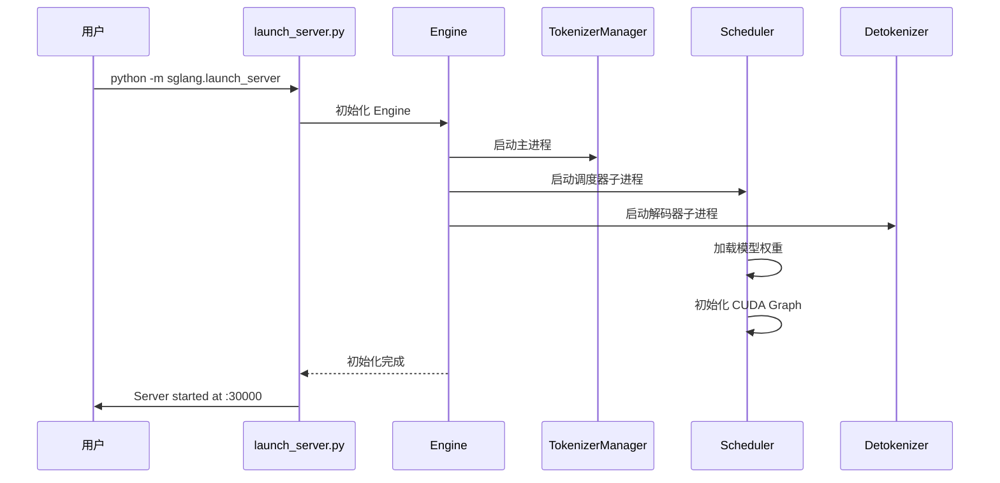
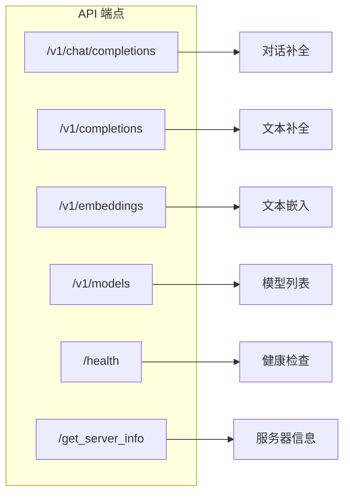
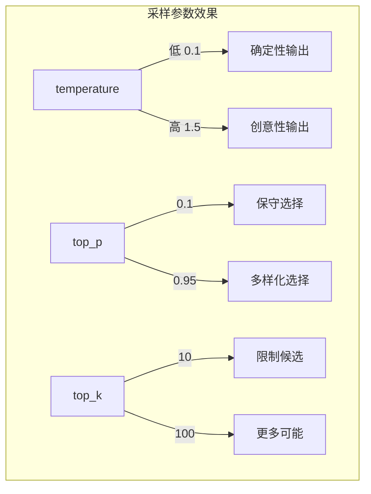

# SGLang 快速开始

## 概述

### 本章学习目标
- 完成 SGLang 的安装
- 启动第一个 LLM 推理服务
- 使用 OpenAI 兼容 API 发送请求
- 了解常用配置选项

### 前置知识要求
- Python 3.10+ 环境
- NVIDIA GPU (推荐 A100/H100) 或 AMD GPU
- 基本的命令行操作能力

---

## 安装 SGLang

### 方式一：pip 安装（推荐）

```bash
# 创建虚拟环境（推荐）
conda create -n sglang python=3.11 -y
conda activate sglang

# 安装 SGLang
pip install sglang[all]

# 或者只安装运行时（不含前端 DSL 的可选依赖）
pip install sglang
```

### 方式二：从源码安装（开发者）

```bash
git clone https://github.com/sgl-project/sglang.git
cd sglang

# 安装开发依赖
cd python
pip install -e ".[dev]"
```

### 方式三：Docker 安装

```bash
# 拉取官方镜像
docker pull lmsysorg/sglang:latest

# 运行容器
docker run --gpus all -p 30000:30000 \
    -v ~/.cache/huggingface:/root/.cache/huggingface \
    lmsysorg/sglang:latest \
    python -m sglang.launch_server \
    --model-path meta-llama/Llama-3.1-8B-Instruct \
    --port 30000
```

### 验证安装

```bash
# 检查版本
python -c "import sglang; print(sglang.__version__)"

# 检查 CUDA 可用性
python -c "import torch; print(f'CUDA available: {torch.cuda.is_available()}')"
```

---

## 启动推理服务

### 基本启动命令

```bash
# 启动 Llama 3.1 8B 服务
python -m sglang.launch_server \
    --model-path meta-llama/Llama-3.1-8B-Instruct \
    --port 30000
```

启动过程会显示类似以下日志：

```
[2024-01-15 10:00:00] server_args.py:xxx - ServerArgs(model_path='meta-llama/Llama-3.1-8B-Instruct', ...)
[2024-01-15 10:00:05] model_runner.py:xxx - Loading model weights...
[2024-01-15 10:00:30] model_runner.py:xxx - Model loaded successfully
[2024-01-15 10:00:35] http_server.py:xxx - Server started at http://0.0.0.0:30000
```

### 服务启动流程



### 常用启动参数

| 参数 | 说明 | 示例 |
|------|------|------|
| `--model-path` | 模型路径或 HuggingFace ID | `meta-llama/Llama-3.1-8B-Instruct` |
| `--port` | HTTP 服务端口 | `30000` |
| `--host` | 绑定地址 | `0.0.0.0` |
| `--tp-size` | Tensor Parallelism 数量 | `2` (使用 2 个 GPU) |
| `--dtype` | 数据类型 | `float16`, `bfloat16`, `float32` |
| `--quantization` | 量化方式 | `fp8`, `awq`, `gptq` |
| `--mem-fraction-static` | GPU 内存占用比例 | `0.9` |
| `--max-total-tokens` | 最大 token 数 | `32768` |
| `--context-length` | 上下文长度 | `8192` |

### 启动示例：不同场景

**场景 1：单 GPU 基础部署**
```bash
python -m sglang.launch_server \
    --model-path Qwen/Qwen2-7B-Instruct \
    --port 30000
```

**场景 2：多 GPU Tensor Parallel**
```bash
python -m sglang.launch_server \
    --model-path meta-llama/Llama-3.1-70B-Instruct \
    --tp-size 4 \
    --port 30000
```

**场景 3：FP8 量化部署**
```bash
python -m sglang.launch_server \
    --model-path meta-llama/Llama-3.1-8B-Instruct \
    --quantization fp8 \
    --port 30000
```

**场景 4：启用 Chunked Prefill**
```bash
python -m sglang.launch_server \
    --model-path meta-llama/Llama-3.1-8B-Instruct \
    --chunked-prefill-size 4096 \
    --port 30000
```

---

## 发送 API 请求

SGLang 提供与 OpenAI 完全兼容的 API，可以使用任何 OpenAI SDK 或 HTTP 客户端。

### 方式一：使用 curl

**Chat Completions API**
```bash
curl http://localhost:30000/v1/chat/completions \
    -H "Content-Type: application/json" \
    -d '{
        "model": "meta-llama/Llama-3.1-8B-Instruct",
        "messages": [
            {"role": "system", "content": "You are a helpful assistant."},
            {"role": "user", "content": "What is Python?"}
        ],
        "temperature": 0.7,
        "max_tokens": 256
    }'
```

**Completions API（文本补全）**
```bash
curl http://localhost:30000/v1/completions \
    -H "Content-Type: application/json" \
    -d '{
        "model": "meta-llama/Llama-3.1-8B-Instruct",
        "prompt": "The capital of France is",
        "max_tokens": 32
    }'
```

### 方式二：使用 OpenAI Python SDK

```python
from openai import OpenAI

# 创建客户端，指向 SGLang 服务
client = OpenAI(
    base_url="http://localhost:30000/v1",
    api_key="not-needed"  # SGLang 不需要 API key
)

# 发送请求
response = client.chat.completions.create(
    model="meta-llama/Llama-3.1-8B-Instruct",
    messages=[
        {"role": "system", "content": "You are a helpful assistant."},
        {"role": "user", "content": "Explain what is machine learning in simple terms."}
    ],
    temperature=0.7,
    max_tokens=512
)

print(response.choices[0].message.content)
```

### 方式三：流式输出

```python
from openai import OpenAI

client = OpenAI(
    base_url="http://localhost:30000/v1",
    api_key="not-needed"
)

# 流式请求
stream = client.chat.completions.create(
    model="meta-llama/Llama-3.1-8B-Instruct",
    messages=[
        {"role": "user", "content": "Write a short poem about coding."}
    ],
    stream=True  # 启用流式输出
)

# 逐 token 打印
for chunk in stream:
    if chunk.choices[0].delta.content:
        print(chunk.choices[0].delta.content, end="", flush=True)
print()
```

### 方式四：使用 SGLang 原生客户端

```python
import sglang as sgl

# 设置后端
sgl.set_default_backend(sgl.RuntimeEndpoint("http://localhost:30000"))

# 定义生成函数
@sgl.function
def simple_qa(s, question):
    s += sgl.system("You are a helpful assistant.")
    s += sgl.user(question)
    s += sgl.assistant(sgl.gen("answer", max_tokens=256))

# 执行
state = simple_qa.run(question="What is the meaning of life?")
print(state["answer"])
```

---

## API 端点说明

SGLang 支持以下 OpenAI 兼容端点：



### 端点详情

| 端点 | 方法 | 说明 |
|------|------|------|
| `/v1/chat/completions` | POST | 对话补全，支持多轮对话 |
| `/v1/completions` | POST | 文本补全 |
| `/v1/embeddings` | POST | 文本嵌入（需要嵌入模型） |
| `/v1/models` | GET | 获取可用模型列表 |
| `/health` | GET | 健康检查 |
| `/health_generate` | GET | 生成功能健康检查 |
| `/get_server_info` | GET | 获取服务器详细信息 |
| `/flush_cache` | POST | 清空 KV Cache |

### 健康检查示例

```bash
# 基本健康检查
curl http://localhost:30000/health
# 返回: {"status": "healthy"}

# 获取服务器信息
curl http://localhost:30000/get_server_info
# 返回详细的服务器状态信息
```

---

## 请求参数详解

### Chat Completions 参数

```python
{
    "model": "meta-llama/Llama-3.1-8B-Instruct",  # 模型名称
    "messages": [                                   # 消息列表
        {"role": "system", "content": "..."},
        {"role": "user", "content": "..."},
        {"role": "assistant", "content": "..."}
    ],

    # 生成参数
    "temperature": 0.7,        # 温度，0-2，越高越随机
    "top_p": 0.9,              # nucleus sampling
    "top_k": 50,               # top-k sampling
    "max_tokens": 256,         # 最大生成 token 数
    "stop": ["\\n", "END"],    # 停止词
    "presence_penalty": 0.0,   # 存在惩罚
    "frequency_penalty": 0.0,  # 频率惩罚

    # 输出控制
    "stream": false,           # 是否流式输出
    "n": 1,                    # 生成数量
    "logprobs": false,         # 是否返回 logprobs
    "top_logprobs": 5,         # 返回 top-k logprobs

    # SGLang 特有参数
    "regex": "[0-9]+",         # 正则约束
    "json_schema": {...}       # JSON Schema 约束
}
```

### 参数效果说明



---

## 常见问题排查

### 问题 1：CUDA Out of Memory

```
torch.cuda.OutOfMemoryError: CUDA out of memory
```

**解决方案**：
```bash
# 降低内存占用比例
python -m sglang.launch_server \
    --model-path meta-llama/Llama-3.1-8B-Instruct \
    --mem-fraction-static 0.8 \
    --port 30000

# 或使用量化
python -m sglang.launch_server \
    --model-path meta-llama/Llama-3.1-8B-Instruct \
    --quantization fp8 \
    --port 30000
```

### 问题 2：模型下载失败

```
OSError: We couldn't connect to 'https://huggingface.co'
```

**解决方案**：
```bash
# 使用镜像
export HF_ENDPOINT=https://hf-mirror.com

# 或使用本地模型
python -m sglang.launch_server \
    --model-path /path/to/local/model \
    --port 30000
```

### 问题 3：端口被占用

```
OSError: [Errno 98] Address already in use
```

**解决方案**：
```bash
# 更换端口
python -m sglang.launch_server \
    --model-path meta-llama/Llama-3.1-8B-Instruct \
    --port 30001

# 或释放端口
lsof -i :30000
kill -9 <PID>
```

### 问题 4：请求超时

**解决方案**：
```python
# 增加超时时间
import httpx
client = OpenAI(
    base_url="http://localhost:30000/v1",
    api_key="not-needed",
    timeout=httpx.Timeout(300.0)  # 5 分钟超时
)
```

---

## 小结

### 要点回顾

1. **安装方式**：pip 安装最简单，源码安装适合开发者，Docker 适合生产部署
2. **启动服务**：`python -m sglang.launch_server` + 常用参数
3. **发送请求**：完全兼容 OpenAI API，可用 curl、SDK 或原生客户端
4. **常用端点**：`/v1/chat/completions`、`/v1/completions`、`/health`

### 快速命令参考

```bash
# 安装
pip install sglang[all]

# 启动服务
python -m sglang.launch_server --model-path <model> --port 30000

# 健康检查
curl http://localhost:30000/health

# 发送请求
curl http://localhost:30000/v1/chat/completions \
    -H "Content-Type: application/json" \
    -d '{"model": "<model>", "messages": [{"role": "user", "content": "Hello!"}]}'
```

### 下一章预告

在下一章《架构总览》中，我们将深入了解：
- SGLang 的三进程架构设计
- 各组件的职责与交互
- 数据在系统中的流转路径
