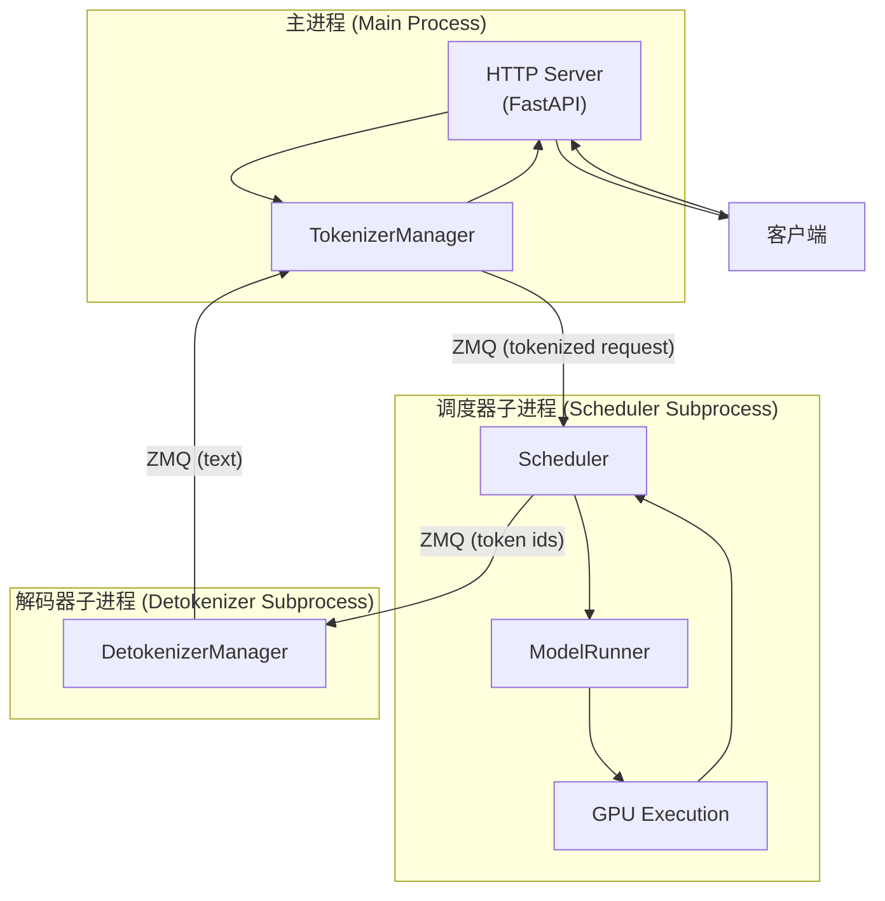
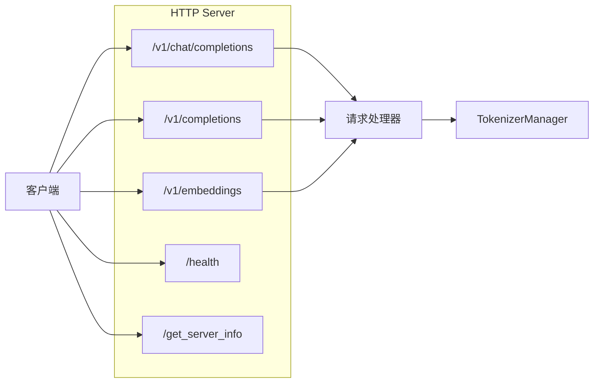
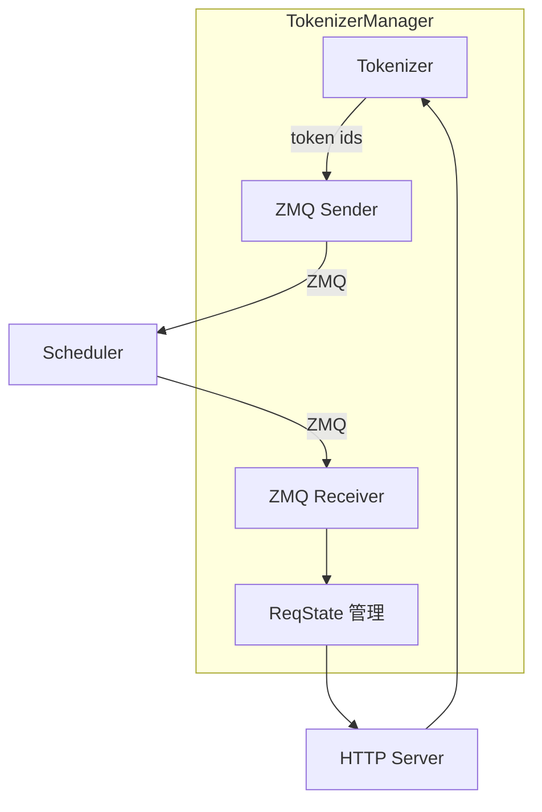
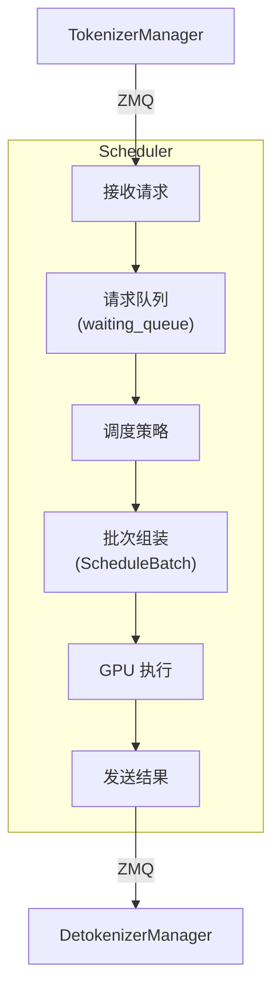
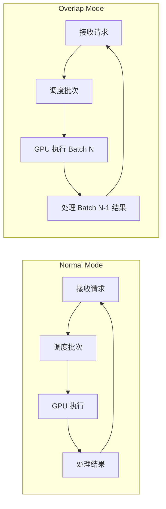
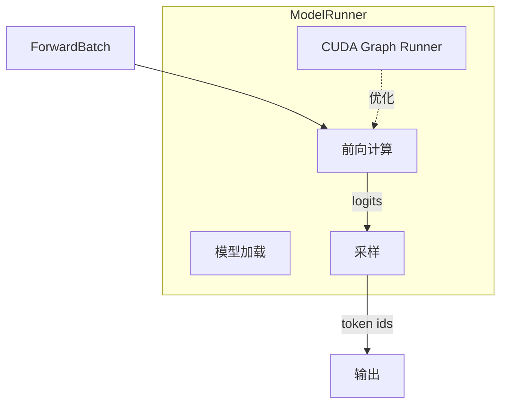
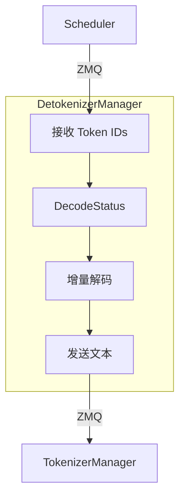
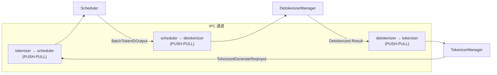
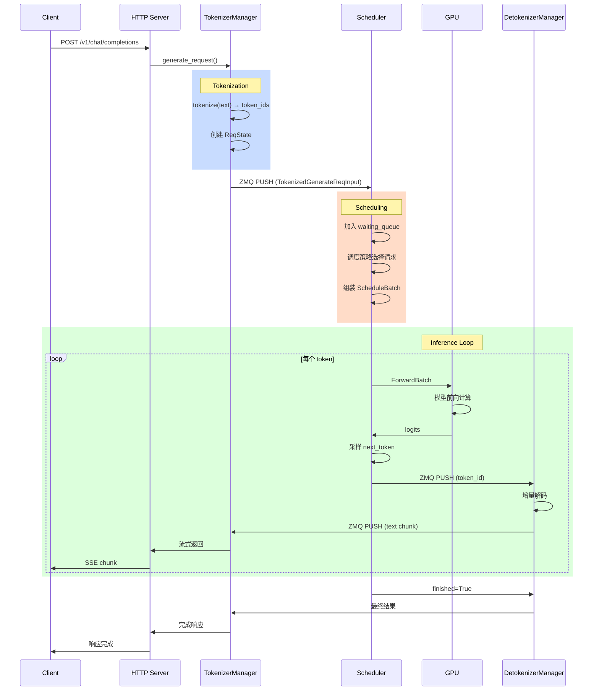
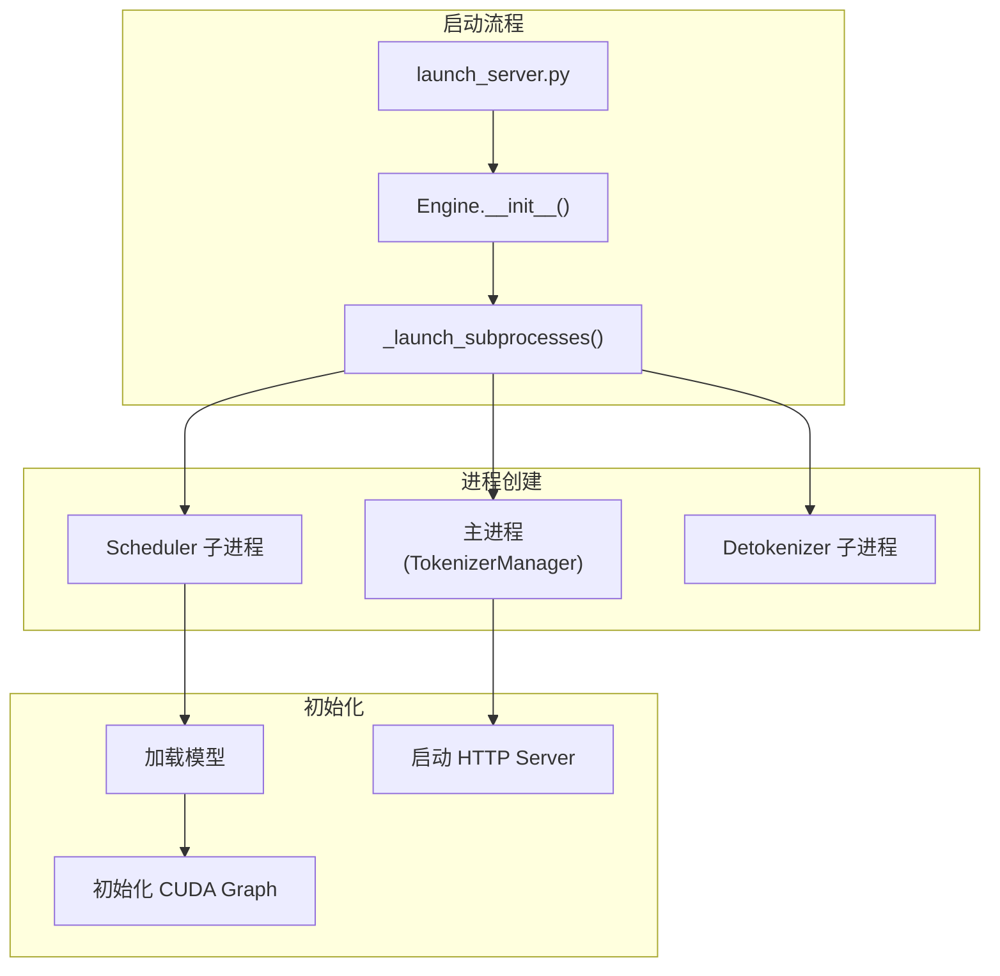

# SGLang 架构总览

## 概述

### 本章学习目标
- 理解 SGLang 的三进程架构设计
- 掌握各组件的职责与交互方式
- 了解 ZMQ 进程间通信机制
- 追踪请求在系统中的完整数据流

### 前置知识要求
- 了解进程间通信 (IPC) 的基本概念
- 熟悉 Python 多进程编程
- 了解 HTTP 服务的基本原理

---

## 三进程架构

SGLang Runtime (SRT) 采用三进程架构设计，将不同职责分离到独立进程中：



### 为什么采用多进程架构？

| 设计考量 | 说明 |
|----------|------|
| **CPU-GPU 分离** | Tokenization/Detokenization 是 CPU 密集型，与 GPU 推理分离避免互相阻塞 |
| **并行流水线** | 解码上一批结果时，可同时处理下一批请求 |
| **独立扩展** | 可根据需要独立调整各进程的资源 |
| **故障隔离** | 某进程出错不会直接影响其他进程 |

---

## 组件详解

### 1. HTTP Server (主进程)

**文件位置**: `python/sglang/srt/entrypoints/http_server.py`

HTTP Server 是系统的入口，基于 FastAPI 构建：



**核心职责**：
- 接收 HTTP/HTTPS 请求
- 路由到对应的处理函数
- 支持流式响应 (Server-Sent Events)
- 提供 OpenAI 兼容 API

**关键代码路径**：
```python
# http_server.py 中的核心路由
@app.post("/v1/chat/completions")
async def v1_chat_completions(request: ChatCompletionRequest):
    # 将请求转发给 TokenizerManager
    return await tokenizer_manager.generate_request(request)
```

### 2. TokenizerManager (主进程)

**文件位置**: `python/sglang/srt/managers/tokenizer_manager.py`

TokenizerManager 负责请求的前处理和后处理：



**核心职责**：
- 将文本 tokenize 为 token IDs
- 管理请求状态 (ReqState)
- 通过 ZMQ 与 Scheduler 通信
- 接收解码结果返回给客户端

**请求状态管理**：
```python
@dataclass
class ReqState:
    """单个请求的状态"""
    out_list: List[Dict]      # 输出块列表（用于流式）
    finished: bool            # 是否完成
    event: asyncio.Event      # 同步/异步协调
    obj: GenerateReqInput     # 原始请求对象

    # 性能指标
    created_time: float       # 创建时间
    first_token_time: float   # 首 token 时间
    finished_time: float      # 完成时间
```

### 3. Scheduler (子进程)

**文件位置**: `python/sglang/srt/managers/scheduler.py`

Scheduler 是系统的核心，负责批处理调度和 GPU 执行：



**核心职责**：
- 接收 tokenized 请求
- 根据调度策略选择请求
- 组装批次 (ScheduleBatch)
- 调用 ModelRunner 执行推理
- 管理 KV Cache (RadixCache)

**事件循环模式**：

SGLang 提供两种事件循环模式：



**Overlap Mode** 可以重叠 CPU 处理和 GPU 执行，提高吞吐量。

### 4. ModelRunner (Scheduler 子进程内)

**文件位置**: `python/sglang/srt/model_executor/model_runner.py`

ModelRunner 负责实际的模型前向计算：



**核心职责**：
- 加载模型权重
- 管理 CUDA Graph
- 执行模型前向计算
- 采样生成下一个 token

**关键数据结构 - ForwardBatch**：
```python
@dataclass
class ForwardBatch:
    """GPU 执行所需的所有信息"""
    forward_mode: ForwardMode      # EXTEND, DECODE, MIXED 等
    batch_size: int                # 批次大小
    input_ids: torch.Tensor        # 输入 token IDs
    positions: torch.Tensor        # 位置信息
    seq_lens: torch.Tensor         # 序列长度
    out_cache_loc: torch.Tensor    # KV Cache 写入位置
    req_pool_indices: torch.Tensor # 请求池索引
    # ... 更多字段
```

### 5. DetokenizerManager (子进程)

**文件位置**: `python/sglang/srt/managers/detokenizer_manager.py`

DetokenizerManager 负责将 token IDs 转换回文本：



**核心职责**：
- 接收 Scheduler 输出的 token IDs
- 维护解码状态 (增量解码)
- 将 tokens 转换为文本
- 支持流式输出

**增量解码机制**：
```python
@dataclass
class DecodeStatus:
    """解码状态"""
    vid: int                    # 请求版本 ID
    decoded_text: str           # 已解码文本
    decode_ids: List[int]       # 已解码 token IDs
    surr_offset: int            # 环绕偏移
    read_offset: int            # 读取偏移
```

增量解码避免了每次都从头解码整个序列，大幅提升效率。

---

## ZMQ 通信机制

SGLang 使用 ZeroMQ (ZMQ) 进行进程间通信：



### 为什么选择 ZMQ？

| 特性 | 说明 |
|------|------|
| **低延迟** | 直接进程间通信，无网络开销 |
| **异步非阻塞** | 支持高效的事件驱动模式 |
| **多种模式** | PUSH-PULL, PUB-SUB 等灵活选择 |
| **可靠性** | 消息队列缓冲，避免丢失 |

### 通信数据结构

**TokenizedGenerateReqInput** (Tokenizer → Scheduler):
```python
@dataclass
class TokenizedGenerateReqInput:
    rid: str                          # 请求 ID
    input_ids: List[int]              # Token IDs
    sampling_params: SamplingParams   # 采样参数
    # ... 其他字段
```

**BatchTokenIDOutput** (Scheduler → Detokenizer):
```python
@dataclass
class BatchTokenIDOutput:
    rids: List[str]                   # 请求 ID 列表
    output_ids: List[List[int]]       # 输出 token IDs
    finished: List[bool]              # 是否完成
    # ... 其他字段
```

---

## 请求生命周期

让我们追踪一个请求从进入到返回的完整过程：



### 详细步骤说明

**Step 1: HTTP 接收请求**
```python
# http_server.py
@app.post("/v1/chat/completions")
async def v1_chat_completions(request):
    return await tokenizer_manager.generate_request(request)
```

**Step 2: Tokenization**
```python
# tokenizer_manager.py
async def generate_request(self, request):
    # 1. Tokenize 输入
    input_ids = self.tokenizer.encode(request.messages)

    # 2. 创建请求状态
    req_state = ReqState(...)

    # 3. 发送到 Scheduler
    self.send_to_scheduler(TokenizedGenerateReqInput(...))

    # 4. 等待结果
    await req_state.event.wait()
    return req_state.out_list
```

**Step 3: Scheduling**
```python
# scheduler.py
def event_loop_normal(self):
    while True:
        # 1. 接收新请求
        new_reqs = self.recv_requests()

        # 2. 处理请求
        self.process_input_requests(new_reqs)

        # 3. 获取下一批次
        batch = self.get_next_batch_to_run()

        if batch:
            # 4. 执行 GPU 推理
            result = self.run_batch(batch)

            # 5. 处理结果
            self.process_batch_result(result)
```

**Step 4: GPU Execution**
```python
# model_runner.py
def forward(self, forward_batch):
    # 尝试使用 CUDA Graph
    if self.can_run_cuda_graph(forward_batch):
        return self.graph_runner.replay(forward_batch)

    # 直接执行
    return self.model.forward(
        forward_batch.input_ids,
        forward_batch.positions,
        forward_batch
    )
```

**Step 5: Detokenization**
```python
# detokenizer_manager.py
def event_loop(self):
    while True:
        # 1. 接收 token IDs
        batch_output = self.recv_from_scheduler()

        # 2. 增量解码
        for rid, output_ids in zip(batch_output.rids, batch_output.output_ids):
            text = self.incremental_decode(rid, output_ids)

            # 3. 发送结果
            self.send_to_tokenizer(rid, text)
```

---

## 进程启动流程

当执行 `python -m sglang.launch_server` 时：



**关键代码** (`engine.py`):
```python
class Engine:
    def __init__(self, server_args):
        # 1. 初始化 TokenizerManager
        self.tokenizer_manager = init_tokenizer_manager(server_args)

        # 2. 启动子进程
        self._launch_subprocesses()

    def _launch_subprocesses(self):
        # 启动 Scheduler 进程
        self.scheduler_proc = mp.Process(
            target=run_scheduler_process,
            args=(self.server_args, ...)
        )
        self.scheduler_proc.start()

        # 启动 Detokenizer 进程
        self.detokenizer_proc = mp.Process(
            target=run_detokenizer_process,
            args=(self.server_args, ...)
        )
        self.detokenizer_proc.start()
```

---

## 小结

### 架构要点

1. **三进程设计**
   - 主进程：HTTP Server + TokenizerManager
   - Scheduler 子进程：调度 + GPU 执行
   - Detokenizer 子进程：解码输出

2. **ZMQ 通信**
   - PUSH-PULL 模式
   - 低延迟、高吞吐
   - 异步非阻塞

3. **职责分离**
   - CPU 密集型操作与 GPU 操作分离
   - 流水线并行提高效率

### 关键文件索引

| 组件 | 文件 |
|------|------|
| HTTP Server | `srt/entrypoints/http_server.py` |
| Engine | `srt/entrypoints/engine.py` |
| TokenizerManager | `srt/managers/tokenizer_manager.py` |
| Scheduler | `srt/managers/scheduler.py` |
| ModelRunner | `srt/model_executor/model_runner.py` |
| DetokenizerManager | `srt/managers/detokenizer_manager.py` |

### 下一章预告

在下一章《请求生命周期》中，我们将：
- 深入追踪请求的每个处理阶段
- 分析关键数据结构的流转
- 理解状态管理机制
