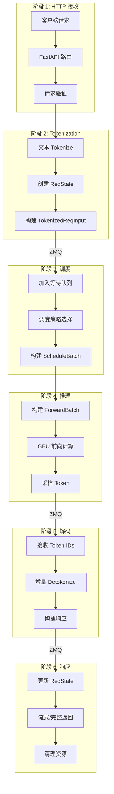
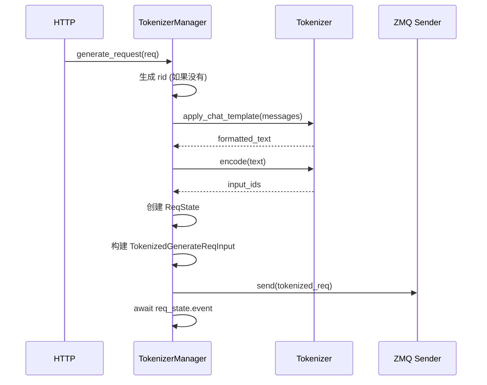
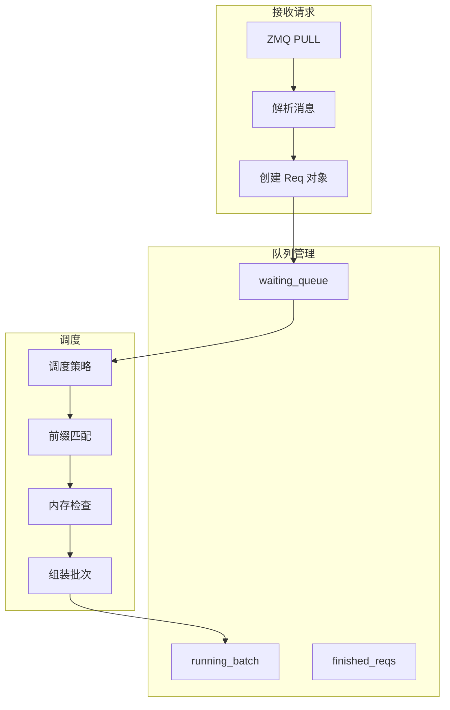
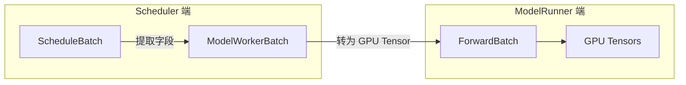
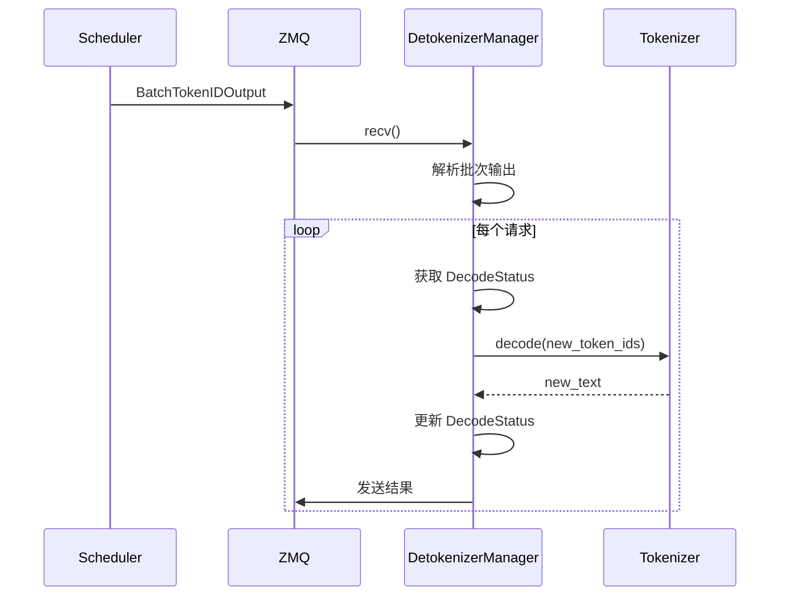

# 请求生命周期详解

## 概述

### 本章学习目标
- 深入理解请求在 SGLang 中的完整处理流程
- 掌握关键数据结构在各阶段的转换
- 理解 ZMQ 消息的格式和传递
- 学会追踪请求的调试方法

### 前置知识要求
- 已阅读《架构总览》章节
- 了解异步编程基础
- 熟悉 Python dataclass

---

## 请求处理全景图



---

## 阶段 1: HTTP 接收

### 1.1 请求入口

当客户端发送请求时，FastAPI 首先接收并路由：

```python
# python/sglang/srt/entrypoints/http_server.py

@app.post("/v1/chat/completions")
async def v1_chat_completions(
    request: ChatCompletionRequest,
    raw_request: Request
):
    """处理 Chat Completion 请求"""
    # 1. 验证请求
    if not request.messages:
        raise HTTPException(400, "Messages cannot be empty")

    # 2. 转换为内部格式
    generate_request = GenerateReqInput(
        text=None,  # Chat 模式使用 messages
        input_ids=None,
        messages=request.messages,
        sampling_params=SamplingParams(
            temperature=request.temperature,
            top_p=request.top_p,
            max_new_tokens=request.max_tokens,
            # ...
        ),
        stream=request.stream,
        rid=str(uuid.uuid4()),  # 生成请求 ID
    )

    # 3. 转发给 TokenizerManager
    return await tokenizer_manager.generate_request(
        generate_request,
        raw_request
    )
```

### 1.2 请求数据结构

```python
@dataclass
class GenerateReqInput:
    """用户请求的内部表示"""
    # 输入内容（二选一）
    text: Optional[str] = None           # 原始文本
    messages: Optional[List[Dict]] = None # Chat 消息

    # 可选的预处理输入
    input_ids: Optional[List[int]] = None

    # 采样参数
    sampling_params: SamplingParams = None

    # 请求控制
    rid: str = None                      # 请求 ID
    stream: bool = False                 # 是否流式
    return_logprob: bool = False         # 是否返回 logprob

    # 约束生成
    regex: Optional[str] = None          # 正则约束
    json_schema: Optional[Dict] = None   # JSON Schema 约束
```

---

## 阶段 2: Tokenization

### 2.1 TokenizerManager 处理流程



### 2.2 核心代码解析

```python
# python/sglang/srt/managers/tokenizer_manager.py

class TokenizerManager:
    async def generate_request(
        self,
        obj: GenerateReqInput,
        request: Optional[Request] = None
    ):
        """处理生成请求"""
        # 1. 确保有请求 ID
        if obj.rid is None:
            obj.rid = str(uuid.uuid4())

        # 2. 应用 Chat Template（如果是 chat 请求）
        if obj.messages is not None:
            obj.text = self.tokenizer.apply_chat_template(
                obj.messages,
                tokenize=False,
                add_generation_prompt=True
            )

        # 3. Tokenize
        if obj.input_ids is None:
            obj.input_ids = self.tokenizer.encode(obj.text)

        # 4. 创建请求状态
        req_state = ReqState(
            out_list=[],
            finished=False,
            event=asyncio.Event(),
            obj=obj,
            created_time=time.time()
        )
        self.rid_to_state[obj.rid] = req_state

        # 5. 构建 Tokenized 请求
        tokenized_req = TokenizedGenerateReqInput(
            rid=obj.rid,
            input_ids=obj.input_ids,
            sampling_params=obj.sampling_params,
            stream=obj.stream,
            # ...
        )

        # 6. 发送到 Scheduler
        self.send_to_scheduler(tokenized_req)

        # 7. 等待完成或流式返回
        if obj.stream:
            return self._stream_generator(req_state, request)
        else:
            await req_state.event.wait()
            return self._build_response(req_state)
```

### 2.3 Tokenized 请求结构

```python
@dataclass
class TokenizedGenerateReqInput:
    """发送给 Scheduler 的 Tokenized 请求"""
    rid: str                              # 请求 ID
    input_ids: List[int]                  # Token IDs
    pixel_values: Optional[torch.Tensor]  # 图像数据（多模态）
    sampling_params: SamplingParams       # 采样参数
    return_logprob: bool                  # 返回 logprob
    stream: bool                          # 流式输出

    # 约束生成
    regex: Optional[str] = None
    json_schema: Optional[Dict] = None

    # 前缀缓存
    prefix_indices: Optional[List[int]] = None
```

---

## 阶段 3: 调度

### 3.1 Scheduler 接收请求



### 3.2 请求队列管理

```python
# python/sglang/srt/managers/scheduler.py

class Scheduler:
    def __init__(self, ...):
        # 请求队列
        self.waiting_queue: List[Req] = []      # 等待调度的请求
        self.running_batch: ScheduleBatch = None # 正在执行的批次
        self.finished_reqs: List[Req] = []      # 已完成的请求

        # 缓存管理
        self.tree_cache: RadixCache = None      # 前缀缓存

    def recv_requests(self) -> List:
        """从 ZMQ 接收请求"""
        recv_reqs = []
        while True:
            try:
                msg = self.zmq_socket.recv(zmq.NOBLOCK)
                req = pickle.loads(msg)
                recv_reqs.append(req)
            except zmq.Again:
                break
        return recv_reqs

    def process_input_requests(self, recv_reqs: List):
        """处理接收到的请求"""
        for req in recv_reqs:
            if isinstance(req, TokenizedGenerateReqInput):
                # 创建内部请求对象
                new_req = Req(
                    rid=req.rid,
                    input_ids=req.input_ids,
                    sampling_params=req.sampling_params,
                    # ...
                )
                # 尝试前缀匹配
                self._match_prefix(new_req)
                # 加入等待队列
                self.waiting_queue.append(new_req)
```

### 3.3 Req 对象详解

```python
@dataclass
class Req:
    """Scheduler 内部的请求表示"""
    rid: str                              # 请求 ID
    input_ids: List[int]                  # 原始输入 token IDs

    # 序列状态
    origin_input_ids: List[int]           # 原始输入（不变）
    output_ids: List[int]                 # 已生成的输出
    prefix_indices: List[int]             # 前缀缓存索引

    # 位置信息
    seq_len: int                          # 当前序列长度
    extend_input_len: int                 # 需要 extend 的长度

    # KV Cache
    req_pool_idx: int                     # 请求池索引
    last_node: TreeNode                   # RadixCache 节点

    # 采样
    sampling_params: SamplingParams
    output_token: int                     # 最新生成的 token

    # 状态
    finished: bool = False
    finish_reason: str = None
```

### 3.4 调度策略

```python
# python/sglang/srt/managers/schedule_policy.py

class SchedulePolicy:
    """调度策略基类"""

    def calc_priority(self, req: Req) -> float:
        """计算请求优先级"""
        raise NotImplementedError

    def sort_requests(self, reqs: List[Req]) -> List[Req]:
        """按优先级排序请求"""
        return sorted(reqs, key=self.calc_priority, reverse=True)


class LPMSchedulePolicy(SchedulePolicy):
    """Longest Prefix Match - 最长前缀匹配策略"""

    def calc_priority(self, req: Req) -> float:
        # 优先选择有更多缓存命中的请求
        return len(req.prefix_indices)


class FCFSSchedulePolicy(SchedulePolicy):
    """First Come First Serve - 先来先服务策略"""

    def calc_priority(self, req: Req) -> float:
        return -req.arrival_time
```

### 3.5 批次组装

```python
def get_next_batch_to_run(self) -> Optional[ScheduleBatch]:
    """获取下一个要执行的批次"""
    # 1. 尝试获取 Prefill 批次
    new_batch = self.get_new_batch_prefill()
    if new_batch:
        return new_batch

    # 2. 继续 Decode 批次
    if self.running_batch:
        return self.running_batch

    return None

def get_new_batch_prefill(self) -> Optional[ScheduleBatch]:
    """组装 Prefill 批次"""
    if not self.waiting_queue:
        return None

    # 1. 应用调度策略排序
    sorted_reqs = self.policy.sort_requests(self.waiting_queue)

    # 2. 选择请求直到达到限制
    selected = []
    total_tokens = 0

    for req in sorted_reqs:
        # 检查内存是否足够
        if not self.can_allocate(req):
            continue

        # 检查批次大小限制
        if total_tokens + req.extend_input_len > self.max_prefill_tokens:
            break

        selected.append(req)
        total_tokens += req.extend_input_len

    if not selected:
        return None

    # 3. 从等待队列移除
    for req in selected:
        self.waiting_queue.remove(req)

    # 4. 分配 KV Cache
    self.allocate_kv_cache(selected)

    # 5. 构建批次
    return ScheduleBatch(
        reqs=selected,
        forward_mode=ForwardMode.EXTEND,
        # ...
    )
```

---

## 阶段 4: 推理

### 4.1 ScheduleBatch 到 ForwardBatch



### 4.2 ForwardBatch 构建

```python
# python/sglang/srt/model_executor/forward_batch_info.py

@dataclass
class ForwardBatch:
    """GPU 执行所需的所有信息"""
    # 执行模式
    forward_mode: ForwardMode

    # 批次信息
    batch_size: int
    input_ids: torch.Tensor        # [total_tokens]
    req_pool_indices: torch.Tensor # [batch_size]
    seq_lens: torch.Tensor         # [batch_size]

    # 位置信息
    positions: torch.Tensor        # [total_tokens]

    # KV Cache 信息
    out_cache_loc: torch.Tensor    # [total_tokens]

    # Extend 模式专用
    extend_seq_lens: torch.Tensor  # [batch_size]
    extend_prefix_lens: torch.Tensor
    extend_start_loc: torch.Tensor

    @classmethod
    def init_new(
        cls,
        model_worker_batch: ModelWorkerBatch,
        model_runner: ModelRunner
    ) -> "ForwardBatch":
        """从 ModelWorkerBatch 创建 ForwardBatch"""
        device = model_runner.device

        # 转移到 GPU
        input_ids = torch.tensor(
            model_worker_batch.input_ids,
            dtype=torch.int32,
            device=device
        )

        # 计算位置
        positions = compute_positions(
            model_worker_batch.seq_lens,
            model_worker_batch.extend_prefix_lens
        )

        return cls(
            forward_mode=model_worker_batch.forward_mode,
            batch_size=len(model_worker_batch.reqs),
            input_ids=input_ids,
            positions=positions,
            # ...
        )
```

### 4.3 模型前向计算

```python
# python/sglang/srt/model_executor/model_runner.py

class ModelRunner:
    def forward(self, forward_batch: ForwardBatch):
        """执行前向计算"""
        # 1. 尝试使用 CUDA Graph
        if self.can_run_cuda_graph(forward_batch):
            return self.graph_runner.replay(forward_batch)

        # 2. 初始化 Attention 元数据
        self.attn_backend.init_forward_metadata(forward_batch)

        # 3. 根据模式执行
        if forward_batch.forward_mode.is_decode():
            return self.forward_decode(forward_batch)
        elif forward_batch.forward_mode.is_extend():
            return self.forward_extend(forward_batch)
        else:
            return self.forward_idle(forward_batch)

    def forward_extend(self, forward_batch: ForwardBatch):
        """Prefill/Extend 前向"""
        return self.model.forward(
            input_ids=forward_batch.input_ids,
            positions=forward_batch.positions,
            forward_batch=forward_batch
        )

    def forward_decode(self, forward_batch: ForwardBatch):
        """Decode 前向"""
        return self.model.forward(
            input_ids=forward_batch.input_ids,
            positions=forward_batch.positions,
            forward_batch=forward_batch
        )
```

### 4.4 采样过程

```python
def run_batch(self, batch: ScheduleBatch):
    """执行一个批次"""
    # 1. 构建 ForwardBatch
    forward_batch = ForwardBatch.init_new(batch, self.model_runner)

    # 2. 前向计算
    logits_output = self.model_runner.forward(forward_batch)

    # 3. 采样
    next_token_ids = self.model_runner.sample(
        logits_output,
        forward_batch
    )

    # 4. 更新请求状态
    for req, next_token in zip(batch.reqs, next_token_ids):
        req.output_ids.append(next_token)
        req.seq_len += 1

        # 检查是否完成
        if self.is_finished(req, next_token):
            req.finished = True
            self.finished_reqs.append(req)

    # 5. 发送到 Detokenizer
    self.send_to_detokenizer(batch)
```

---

## 阶段 5: 解码

### 5.1 Detokenizer 处理流程



### 5.2 增量解码

```python
# python/sglang/srt/managers/detokenizer_manager.py

class DetokenizerManager:
    def __init__(self):
        # 解码状态缓存
        self.decode_status: Dict[str, DecodeStatus] = {}

    def event_loop(self):
        """主事件循环"""
        while True:
            # 接收批次输出
            batch_output = self.recv_from_scheduler()

            for rid, output_ids, finished in zip(
                batch_output.rids,
                batch_output.output_ids,
                batch_output.finished
            ):
                # 获取或创建解码状态
                status = self.get_decode_status(rid)

                # 增量解码
                new_text = self.incremental_decode(status, output_ids)

                # 发送结果
                self.send_to_tokenizer(
                    rid=rid,
                    text=new_text,
                    finished=finished
                )

                # 清理完成的请求
                if finished:
                    del self.decode_status[rid]

    def incremental_decode(
        self,
        status: DecodeStatus,
        new_ids: List[int]
    ) -> str:
        """增量解码 - 只解码新增的 tokens"""
        # 添加新 tokens
        status.decode_ids.extend(new_ids)

        # 解码全部（tokenizer 内部有缓存优化）
        full_text = self.tokenizer.decode(
            status.decode_ids,
            skip_special_tokens=True
        )

        # 计算新增文本
        new_text = full_text[status.read_offset:]
        status.read_offset = len(full_text)

        return new_text
```

### 5.3 DecodeStatus 详解

```python
@dataclass
class DecodeStatus:
    """单个请求的解码状态"""
    vid: int                    # 版本 ID（处理重试）
    decoded_text: str           # 已解码的完整文本
    decode_ids: List[int]       # 所有 token IDs
    surr_offset: int            # 环绕字符偏移
    read_offset: int            # 已读取偏移

    # 环绕字符处理说明：
    # 某些 tokenizer 在边界处理时需要额外的上下文
    # surr_offset 用于处理这种情况
```

---

## 阶段 6: 响应

### 6.1 更新 ReqState

```python
# python/sglang/srt/managers/tokenizer_manager.py

class TokenizerManager:
    def recv_from_detokenizer(self):
        """接收解码结果"""
        while True:
            try:
                result = self.zmq_socket.recv(zmq.NOBLOCK)
                self.process_detokenizer_result(result)
            except zmq.Again:
                break

    def process_detokenizer_result(self, result):
        """处理解码结果"""
        rid = result.rid
        req_state = self.rid_to_state.get(rid)

        if req_state is None:
            return

        # 添加到输出列表
        req_state.out_list.append({
            "text": result.text,
            "token_ids": result.token_ids,
            "logprobs": result.logprobs,
        })

        # 更新时间戳
        if req_state.first_token_time is None:
            req_state.first_token_time = time.time()

        # 如果完成
        if result.finished:
            req_state.finished = True
            req_state.finished_time = time.time()
            req_state.event.set()  # 唤醒等待的协程
```

### 6.2 流式响应

```python
async def _stream_generator(
    self,
    req_state: ReqState,
    request: Request
) -> AsyncGenerator:
    """生成流式响应"""
    index = 0

    while True:
        # 检查客户端是否断开
        if await request.is_disconnected():
            break

        # 等待新的输出
        while index >= len(req_state.out_list) and not req_state.finished:
            await asyncio.sleep(0.01)
            self.recv_from_detokenizer()

        # 发送新的 chunks
        while index < len(req_state.out_list):
            chunk = req_state.out_list[index]
            yield self._format_sse_chunk(chunk)
            index += 1

        # 完成
        if req_state.finished:
            yield self._format_sse_done()
            break
```

### 6.3 完整响应格式

```python
def _build_response(self, req_state: ReqState) -> Dict:
    """构建完整响应"""
    # 合并所有输出
    full_text = "".join(
        chunk["text"] for chunk in req_state.out_list
    )

    return {
        "id": f"chatcmpl-{req_state.obj.rid}",
        "object": "chat.completion",
        "created": int(req_state.created_time),
        "model": self.model_name,
        "choices": [{
            "index": 0,
            "message": {
                "role": "assistant",
                "content": full_text
            },
            "finish_reason": "stop"
        }],
        "usage": {
            "prompt_tokens": len(req_state.obj.input_ids),
            "completion_tokens": sum(
                len(chunk.get("token_ids", []))
                for chunk in req_state.out_list
            ),
            "total_tokens": ...
        }
    }
```

---

## 调试技巧

### 追踪请求 ID

每个请求都有唯一的 `rid`，可以用来追踪：

```python
# 添加日志
import logging
logger = logging.getLogger("sglang")

# 在关键位置记录
logger.info(f"[{req.rid}] Received request")
logger.info(f"[{req.rid}] Tokenized: {len(input_ids)} tokens")
logger.info(f"[{req.rid}] Scheduled in batch")
logger.info(f"[{req.rid}] Generated token: {next_token}")
logger.info(f"[{req.rid}] Finished: {finish_reason}")
```

### 关键断点位置

| 阶段 | 文件 | 函数 |
|------|------|------|
| HTTP 接收 | `http_server.py` | `v1_chat_completions` |
| Tokenization | `tokenizer_manager.py` | `generate_request` |
| 调度 | `scheduler.py` | `get_next_batch_to_run` |
| 前向计算 | `model_runner.py` | `forward` |
| 采样 | `model_runner.py` | `sample` |
| 解码 | `detokenizer_manager.py` | `incremental_decode` |

---

## 小结

### 数据结构转换链

```
GenerateReqInput (HTTP)
    ↓
TokenizedGenerateReqInput (Tokenizer → Scheduler)
    ↓
Req (Scheduler 内部)
    ↓
ScheduleBatch (批次)
    ↓
ForwardBatch (GPU 执行)
    ↓
BatchTokenIDOutput (Scheduler → Detokenizer)
    ↓
ReqState.out_list (响应)
```

### 要点回顾

1. **六个阶段**：HTTP → Tokenization → 调度 → 推理 → 解码 → 响应
2. **关键数据结构**：GenerateReqInput, TokenizedReqInput, Req, ForwardBatch
3. **ZMQ 通信**：进程间高效传递数据
4. **增量解码**：避免重复解码，提高效率

### 下一章预告

在下一章《TokenizerManager 详解》中，我们将：
- 深入 Tokenizer 的工作原理
- 理解 Chat Template 处理
- 掌握请求状态管理机制
