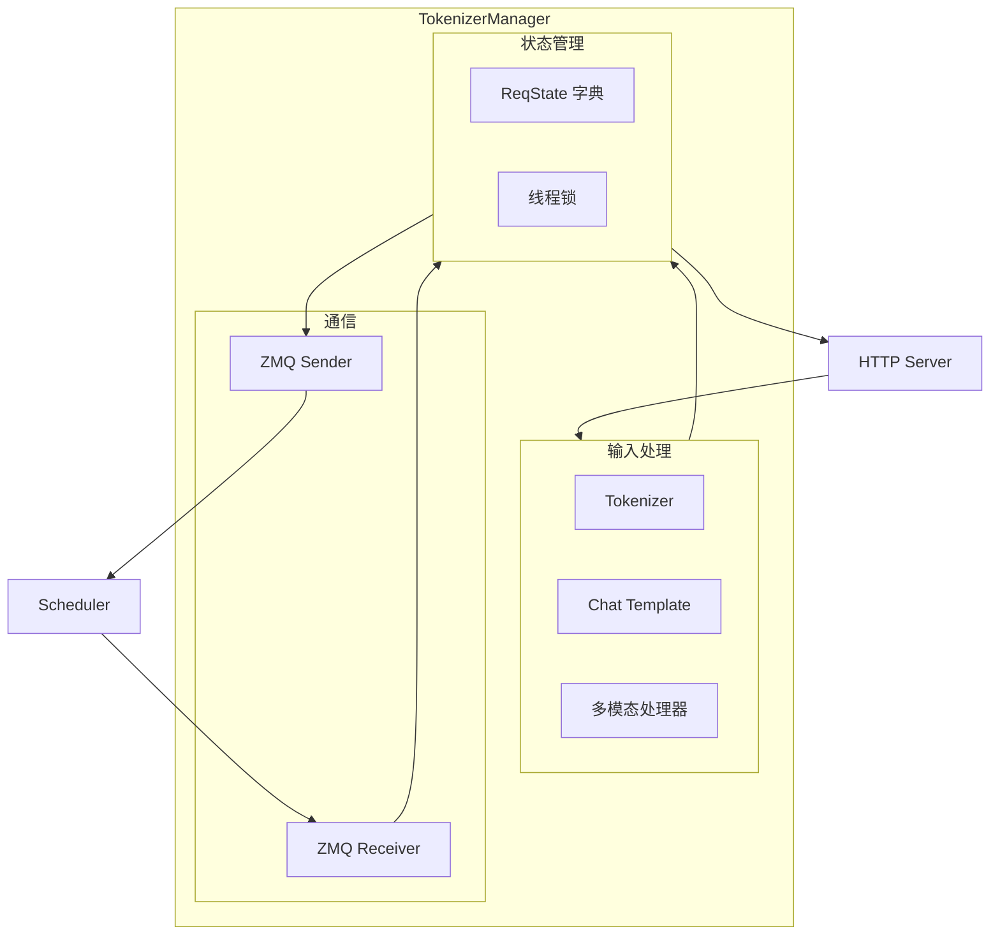
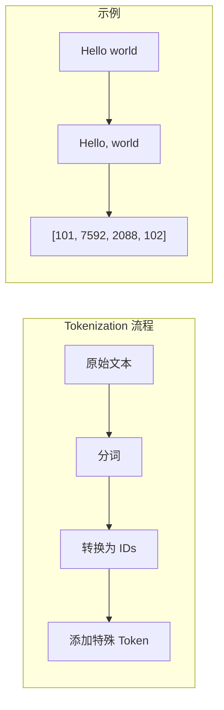
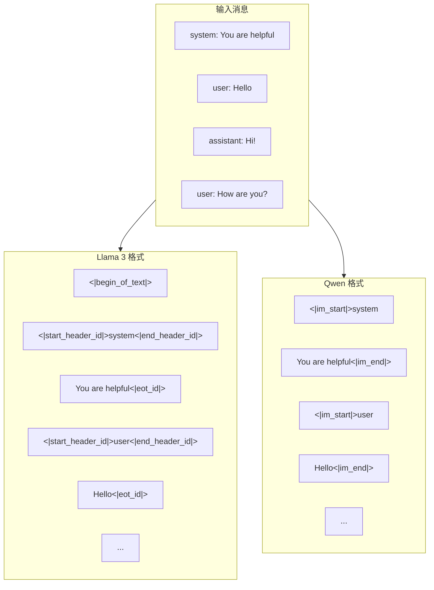
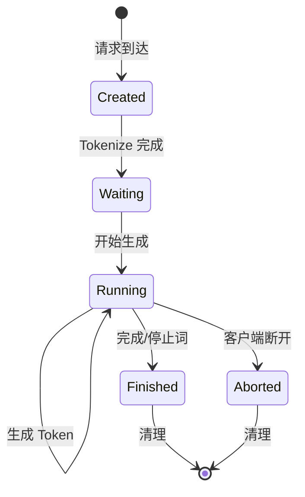
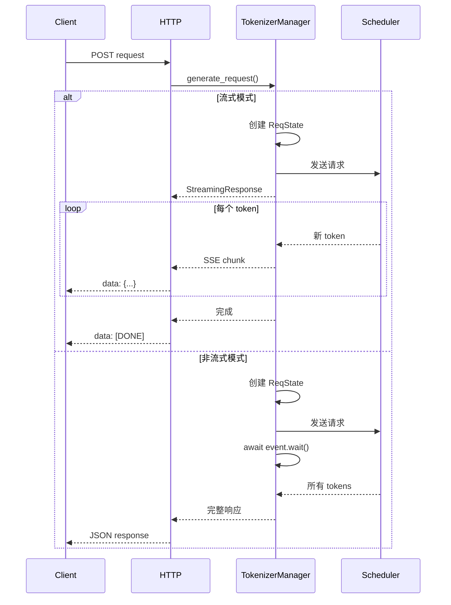
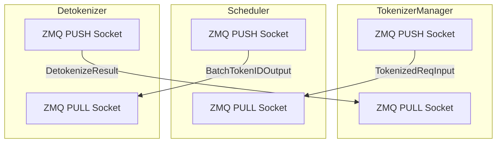
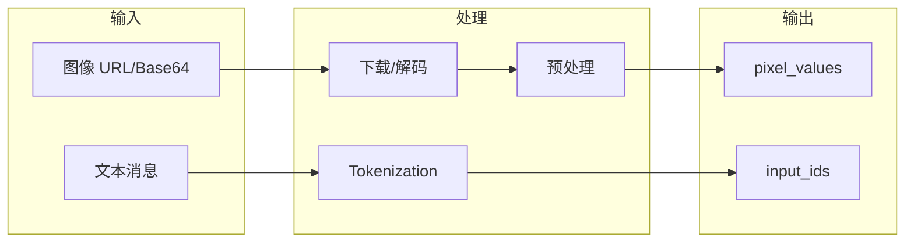

# TokenizerManager 详解

## 概述

### 本章学习目标
- 深入理解 TokenizerManager 的设计和实现
- 掌握 Chat Template 的应用机制
- 理解请求状态 (ReqState) 的生命周期管理
- 学习异步请求处理模式

### 前置知识要求
- 了解 Tokenizer 的基本概念
- 熟悉 Python asyncio 异步编程
- 已阅读《请求生命周期》章节

---

## TokenizerManager 架构



### 核心职责

| 职责 | 说明 |
|------|------|
| **Tokenization** | 将文本转换为 token IDs |
| **Chat Template** | 应用模型特定的对话模板 |
| **状态管理** | 维护每个请求的状态 |
| **ZMQ 通信** | 与 Scheduler/Detokenizer 通信 |
| **流式处理** | 支持 Server-Sent Events |

---

## Tokenizer 基础

### Tokenizer 加载

```python
# python/sglang/srt/managers/tokenizer_manager.py

class TokenizerManager:
    def __init__(self, server_args, port_args):
        # 加载 Tokenizer
        self.tokenizer = get_tokenizer(
            server_args.model_path,
            tokenizer_mode=server_args.tokenizer_mode,
            trust_remote_code=server_args.trust_remote_code
        )

        # 获取特殊 token
        self.eos_token_id = self.tokenizer.eos_token_id
        self.pad_token_id = self.tokenizer.pad_token_id

        # Chat Template
        self.chat_template = self.tokenizer.chat_template
```

### Tokenization 过程



```python
def tokenize(self, text: str) -> List[int]:
    """将文本转换为 token IDs"""
    # 基本 tokenization
    input_ids = self.tokenizer.encode(
        text,
        add_special_tokens=True,  # 添加 BOS/EOS
        truncation=False          # 不截断
    )
    return input_ids

def detokenize(self, token_ids: List[int]) -> str:
    """将 token IDs 转换回文本"""
    text = self.tokenizer.decode(
        token_ids,
        skip_special_tokens=True,  # 跳过特殊 token
        clean_up_tokenization_spaces=True
    )
    return text
```

---

## Chat Template 处理

### 什么是 Chat Template

Chat Template 定义了如何将多轮对话格式化为模型输入。不同模型有不同的模板格式：



### Chat Template 应用

```python
def apply_chat_template(
    self,
    messages: List[Dict],
    add_generation_prompt: bool = True
) -> str:
    """应用 Chat Template"""
    # 使用 Tokenizer 的内置模板
    formatted = self.tokenizer.apply_chat_template(
        messages,
        tokenize=False,           # 只返回文本，不 tokenize
        add_generation_prompt=add_generation_prompt  # 添加助手回复开头
    )
    return formatted
```

### 常见 Chat Template 格式

**Llama 3 格式**:
```
<|begin_of_text|><|start_header_id|>system<|end_header_id|>

{system_message}<|eot_id|><|start_header_id|>user<|end_header_id|>

{user_message}<|eot_id|><|start_header_id|>assistant<|end_header_id|>
```

**Qwen 格式**:
```
<|im_start|>system
{system_message}<|im_end|>
<|im_start|>user
{user_message}<|im_end|>
<|im_start|>assistant
```

**ChatML 格式**:
```
<|im_start|>system
{system_message}<|im_end|>
<|im_start|>user
{user_message}<|im_end|>
<|im_start|>assistant
```

### 自定义 Chat Template

```python
# 如果模型没有内置模板，可以手动设置
custom_template = """

System: {{ message['content'] }}

User: {{ message['content'] }}

Assistant: {{ message['content'] }}


Assistant:"""

tokenizer.chat_template = custom_template
```

---

## 请求状态管理

### ReqState 数据结构

```python
@dataclass
class ReqState:
    """单个请求的完整状态"""
    # 输出
    out_list: List[Dict]          # 输出块列表

    # 状态标志
    finished: bool                # 是否完成
    aborted: bool                 # 是否中止
    event: asyncio.Event          # 完成事件

    # 原始请求
    obj: Union[GenerateReqInput, EmbeddingReqInput]

    # 时间戳（性能分析）
    created_time: float           # 创建时间
    first_token_time: float       # 首 token 时间
    finished_time: float          # 完成时间

    # 计数器
    prompt_tokens: int            # 输入 token 数
    completion_tokens: int        # 输出 token 数
```

### 状态生命周期



### 状态管理代码

```python
class TokenizerManager:
    def __init__(self):
        # 请求状态字典
        self.rid_to_state: Dict[str, ReqState] = {}

        # 线程安全锁
        self.state_lock = threading.Lock()

    def create_req_state(self, obj: GenerateReqInput) -> ReqState:
        """创建请求状态"""
        state = ReqState(
            out_list=[],
            finished=False,
            aborted=False,
            event=asyncio.Event(),
            obj=obj,
            created_time=time.time(),
            first_token_time=None,
            finished_time=None,
            prompt_tokens=len(obj.input_ids),
            completion_tokens=0
        )

        with self.state_lock:
            self.rid_to_state[obj.rid] = state

        return state

    def update_req_state(self, rid: str, result: Dict):
        """更新请求状态"""
        with self.state_lock:
            state = self.rid_to_state.get(rid)
            if state is None:
                return

            # 添加输出
            state.out_list.append(result)
            state.completion_tokens += len(result.get("token_ids", []))

            # 更新首 token 时间
            if state.first_token_time is None:
                state.first_token_time = time.time()

            # 检查完成
            if result.get("finished", False):
                state.finished = True
                state.finished_time = time.time()
                state.event.set()

    def cleanup_req_state(self, rid: str):
        """清理请求状态"""
        with self.state_lock:
            if rid in self.rid_to_state:
                del self.rid_to_state[rid]
```

---

## 异步请求处理

### 处理流程



### 非流式请求处理

```python
async def generate_request(
    self,
    obj: GenerateReqInput,
    request: Optional[Request] = None
) -> Dict:
    """处理非流式请求"""
    # 1. 预处理
    obj = await self.preprocess_request(obj)

    # 2. 创建状态
    state = self.create_req_state(obj)

    # 3. 发送到 Scheduler
    self.send_to_scheduler(obj)

    # 4. 等待完成
    await state.event.wait()

    # 5. 构建响应
    response = self.build_response(state)

    # 6. 清理
    self.cleanup_req_state(obj.rid)

    return response
```

### 流式请求处理

```python
async def generate_request_stream(
    self,
    obj: GenerateReqInput,
    request: Request
) -> AsyncGenerator:
    """处理流式请求"""
    # 1. 预处理
    obj = await self.preprocess_request(obj)

    # 2. 创建状态
    state = self.create_req_state(obj)

    # 3. 发送到 Scheduler
    self.send_to_scheduler(obj)

    # 4. 流式返回
    try:
        async for chunk in self._stream_iterator(state, request):
            yield chunk
    finally:
        # 5. 清理（无论成功还是中止）
        self.cleanup_req_state(obj.rid)

async def _stream_iterator(
    self,
    state: ReqState,
    request: Request
) -> AsyncGenerator:
    """流式迭代器"""
    index = 0

    while True:
        # 检查客户端断开
        if await request.is_disconnected():
            state.aborted = True
            # 通知 Scheduler 中止请求
            self.abort_request(state.obj.rid)
            break

        # 接收新数据
        self.recv_from_detokenizer()

        # 发送新 chunks
        while index < len(state.out_list):
            chunk = state.out_list[index]
            yield self.format_sse_chunk(chunk, index)
            index += 1

        # 检查完成
        if state.finished:
            yield self.format_sse_done()
            break

        # 短暂等待
        await asyncio.sleep(0.005)
```

### Server-Sent Events 格式

```python
def format_sse_chunk(self, chunk: Dict, index: int) -> str:
    """格式化 SSE 数据块"""
    data = {
        "id": f"chatcmpl-{self.rid}",
        "object": "chat.completion.chunk",
        "created": int(time.time()),
        "model": self.model_name,
        "choices": [{
            "index": 0,
            "delta": {
                "content": chunk["text"]
            },
            "finish_reason": None
        }]
    }
    return f"data: {json.dumps(data)}\n\n"

def format_sse_done(self) -> str:
    """格式化 SSE 结束标记"""
    return "data: [DONE]\n\n"
```

---

## ZMQ 通信详解

### 通信架构



### 发送到 Scheduler

```python
def send_to_scheduler(self, req: TokenizedGenerateReqInput):
    """发送请求到 Scheduler"""
    # 序列化
    data = pickle.dumps(req)

    # 发送
    self.to_scheduler_socket.send(data, zmq.NOBLOCK)

def abort_request(self, rid: str):
    """中止请求"""
    abort_msg = AbortReq(rid=rid)
    data = pickle.dumps(abort_msg)
    self.to_scheduler_socket.send(data, zmq.NOBLOCK)
```

### 接收解码结果

```python
def recv_from_detokenizer(self):
    """接收解码结果（非阻塞）"""
    while True:
        try:
            data = self.from_detokenizer_socket.recv(zmq.NOBLOCK)
            result = pickle.loads(data)
            self.process_detokenizer_result(result)
        except zmq.Again:
            # 没有更多消息
            break

def process_detokenizer_result(self, result):
    """处理解码结果"""
    rid = result.rid

    # 更新状态
    self.update_req_state(rid, {
        "text": result.text,
        "token_ids": result.token_ids,
        "logprobs": result.logprobs,
        "finished": result.finished,
        "finish_reason": result.finish_reason
    })
```

---

## 多模态处理

### 图像处理流程



### 多模态请求处理

```python
async def preprocess_request(
    self,
    obj: GenerateReqInput
) -> GenerateReqInput:
    """预处理请求（包括多模态）"""
    # 1. 应用 Chat Template
    if obj.messages is not None:
        obj.text = self.apply_chat_template(obj.messages)

    # 2. 处理图像
    if self.is_multimodal and obj.messages:
        pixel_values, image_hashes = await self.process_images(
            obj.messages
        )
        obj.pixel_values = pixel_values
        obj.image_hashes = image_hashes

    # 3. Tokenize
    if obj.input_ids is None:
        obj.input_ids = self.tokenize(obj.text)

    return obj

async def process_images(
    self,
    messages: List[Dict]
) -> Tuple[torch.Tensor, List[str]]:
    """处理消息中的图像"""
    images = []
    hashes = []

    for msg in messages:
        if isinstance(msg.get("content"), list):
            for item in msg["content"]:
                if item.get("type") == "image_url":
                    url = item["image_url"]["url"]
                    image = await self.load_image(url)
                    images.append(image)
                    hashes.append(hash_image(image))

    if not images:
        return None, None

    # 批量预处理
    pixel_values = self.image_processor(images, return_tensors="pt")

    return pixel_values, hashes
```

---

## 性能优化

### 批量 Tokenization

```python
def batch_tokenize(self, texts: List[str]) -> List[List[int]]:
    """批量 tokenization（更高效）"""
    return self.tokenizer(
        texts,
        padding=False,
        truncation=False,
        return_attention_mask=False
    )["input_ids"]
```

### 缓存 Chat Template 结果

```python
class TokenizerManager:
    def __init__(self):
        # 模板缓存
        self.template_cache: Dict[str, str] = {}
        self.cache_max_size = 1000

    def apply_chat_template_cached(
        self,
        messages: List[Dict]
    ) -> str:
        """带缓存的 Chat Template 应用"""
        # 生成缓存键
        cache_key = self._make_cache_key(messages)

        # 检查缓存
        if cache_key in self.template_cache:
            return self.template_cache[cache_key]

        # 应用模板
        result = self.apply_chat_template(messages)

        # 存入缓存
        if len(self.template_cache) < self.cache_max_size:
            self.template_cache[cache_key] = result

        return result
```

### 异步图像加载

```python
async def load_image(self, url: str) -> Image:
    """异步加载图像"""
    if url.startswith("data:"):
        # Base64 编码
        return self._decode_base64_image(url)
    else:
        # HTTP URL
        async with aiohttp.ClientSession() as session:
            async with session.get(url) as response:
                data = await response.read()
                return Image.open(io.BytesIO(data))
```

---

## 错误处理

### 常见错误类型

```python
class TokenizerError(Exception):
    """Tokenizer 错误基类"""
    pass

class TokenizationError(TokenizerError):
    """Tokenization 失败"""
    pass

class ChatTemplateError(TokenizerError):
    """Chat Template 应用失败"""
    pass

class RequestAbortedError(TokenizerError):
    """请求被中止"""
    pass
```

### 错误处理代码

```python
async def generate_request(self, obj: GenerateReqInput, request: Request):
    """带错误处理的请求生成"""
    try:
        # 预处理
        obj = await self.preprocess_request(obj)

        # 创建状态并发送
        state = self.create_req_state(obj)
        self.send_to_scheduler(obj)

        # 等待或流式返回
        if obj.stream:
            return StreamingResponse(
                self._stream_iterator(state, request),
                media_type="text/event-stream"
            )
        else:
            await state.event.wait()
            return self.build_response(state)

    except TokenizationError as e:
        raise HTTPException(400, f"Tokenization failed: {e}")

    except ChatTemplateError as e:
        raise HTTPException(400, f"Chat template error: {e}")

    except asyncio.CancelledError:
        # 请求被取消
        self.abort_request(obj.rid)
        raise

    except Exception as e:
        logger.error(f"Request failed: {e}")
        raise HTTPException(500, f"Internal error: {e}")
```

---

## 小结

### 核心要点

1. **Tokenizer 职责**
   - 文本到 token IDs 的转换
   - Chat Template 的应用
   - 多模态数据预处理

2. **ReqState 管理**
   - 每个请求独立状态
   - 线程安全的更新
   - 完整的生命周期管理

3. **异步处理**
   - 支持流式和非流式
   - SSE 格式输出
   - 客户端断开检测

4. **ZMQ 通信**
   - 非阻塞发送和接收
   - 请求中止支持

### 关键代码文件

| 文件 | 说明 |
|------|------|
| `tokenizer_manager.py` | 主要逻辑 |
| `io_struct.py` | 数据结构定义 |
| `chat_template.py` | Chat Template 处理 |

### 下一章预告

在下一章《Scheduler 深入解析》中，我们将：
- 理解调度器的核心事件循环
- 学习批处理组装逻辑
- 掌握 KV Cache 分配机制
