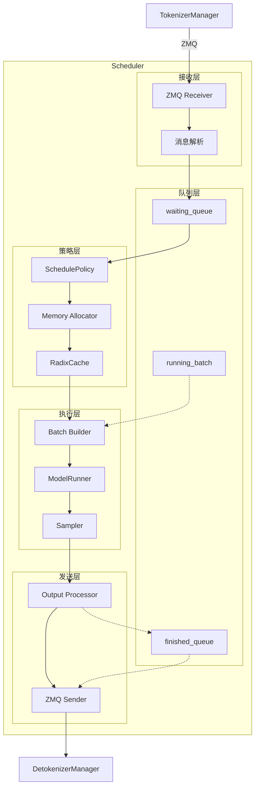
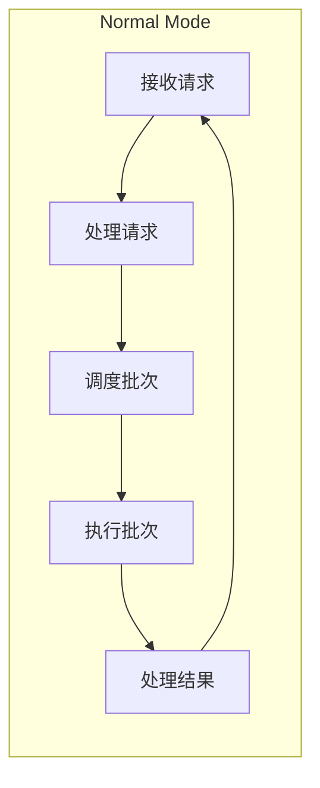
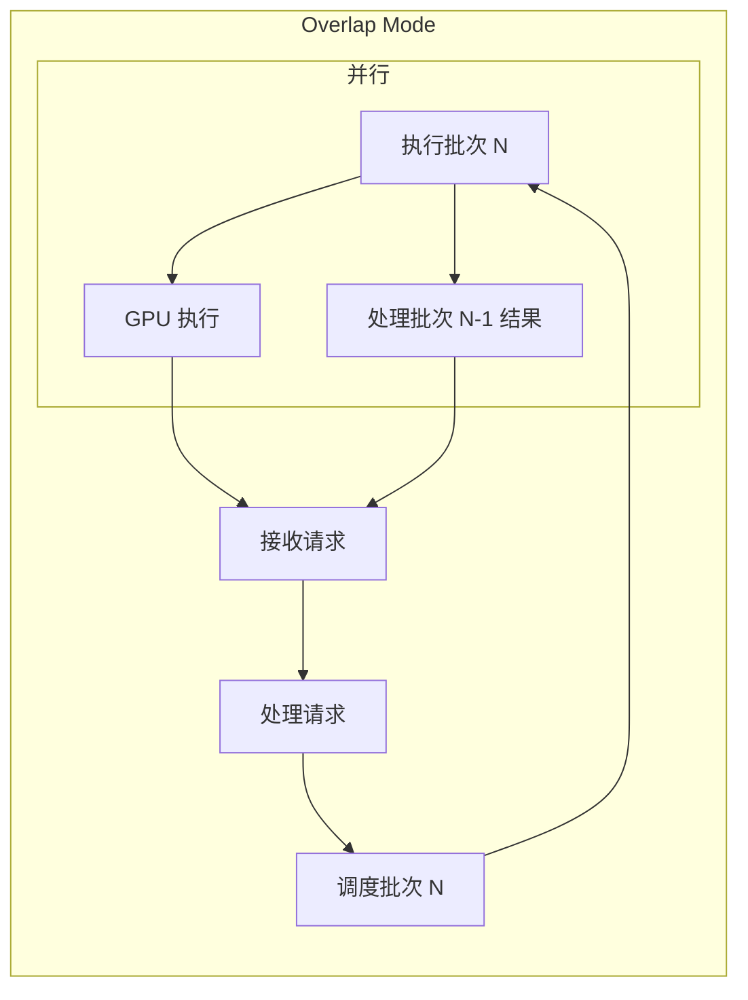
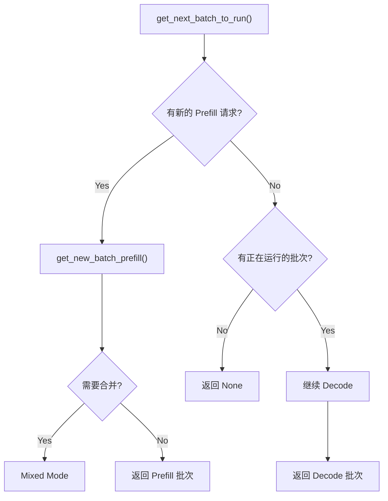
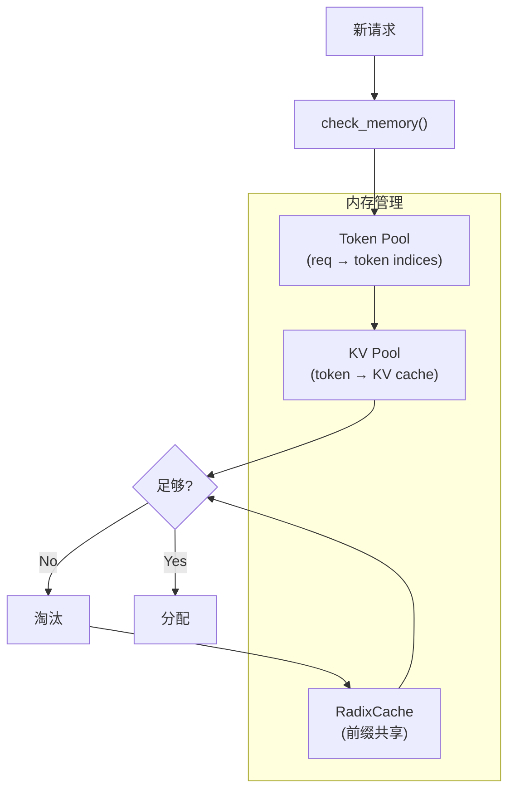
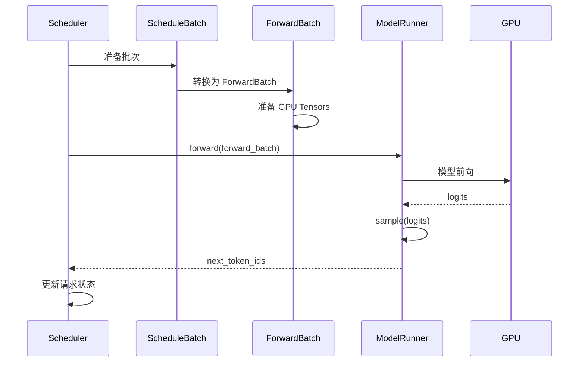
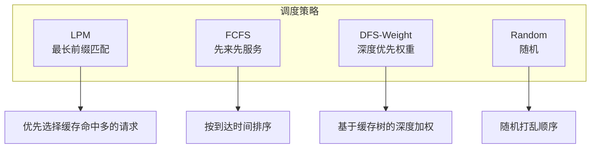

# Scheduler 深入解析

## 概述

### 本章学习目标
- 深入理解 Scheduler 的核心事件循环
- 掌握批处理组装和调度策略
- 理解 KV Cache 分配与管理
- 学习 Prefill/Decode 模式切换

### 前置知识要求
- 已阅读《架构总览》和《请求生命周期》
- 了解 GPU 批处理的基本概念
- 理解 KV Cache 的作用

---

## Scheduler 架构总览



---

## 事件循环详解

### 两种事件循环模式

SGLang 支持两种事件循环模式：





### Normal Mode 实现

```python
# python/sglang/srt/managers/scheduler.py

class Scheduler:
    def event_loop_normal(self):
        """普通事件循环"""
        while True:
            # 1. 接收新请求
            recv_reqs = self.recv_requests()

            # 2. 处理输入请求
            self.process_input_requests(recv_reqs)

            # 3. 获取下一个批次
            batch = self.get_next_batch_to_run()

            if batch is not None:
                # 4. 执行批次
                result = self.run_batch(batch)

                # 5. 处理批次结果
                self.process_batch_result(batch, result)
```

### Overlap Mode 实现

```python
def event_loop_overlap(self):
    """重叠事件循环（CPU-GPU 流水线）"""
    result = None
    prev_batch = None

    while True:
        # 1. 接收新请求
        recv_reqs = self.recv_requests()

        # 2. 处理上一批次的结果（CPU 工作）
        if result is not None:
            self.process_batch_result(prev_batch, result)

        # 3. 处理输入请求
        self.process_input_requests(recv_reqs)

        # 4. 获取下一个批次
        batch = self.get_next_batch_to_run()

        if batch is not None:
            # 5. 执行批次（GPU 工作）
            # 此时 CPU 可以处理下一轮的请求接收
            result = self.run_batch(batch)
            prev_batch = batch
        else:
            result = None
            prev_batch = None
```

**Overlap Mode 的优势**：
- CPU 处理结果和 GPU 执行并行
- 减少 GPU 空闲时间
- 提高吞吐量（尤其是小批次场景）

---

## 请求处理流程

### 接收请求

```python
def recv_requests(self) -> List:
    """从 ZMQ 接收请求"""
    recv_reqs = []

    while True:
        try:
            # 非阻塞接收
            msg = self.recv_socket.recv(zmq.NOBLOCK)
            req = pickle.loads(msg)
            recv_reqs.append(req)
        except zmq.Again:
            # 没有更多消息
            break

    return recv_reqs
```

### 处理输入请求

```python
def process_input_requests(self, recv_reqs: List):
    """处理接收到的请求"""
    for req in recv_reqs:
        if isinstance(req, TokenizedGenerateReqInput):
            self._handle_generate_request(req)
        elif isinstance(req, AbortReq):
            self._handle_abort_request(req)
        elif isinstance(req, FlushCacheReq):
            self._handle_flush_cache()
        # ... 其他请求类型

def _handle_generate_request(self, tokenized_req: TokenizedGenerateReqInput):
    """处理生成请求"""
    # 1. 创建内部请求对象
    req = Req(
        rid=tokenized_req.rid,
        input_ids=list(tokenized_req.input_ids),
        sampling_params=tokenized_req.sampling_params,
        arrival_time=time.time(),
        # ...
    )

    # 2. 前缀匹配（RadixCache）
    prefix_indices, last_node = self.tree_cache.match_prefix(
        req.input_ids
    )
    req.prefix_indices = prefix_indices
    req.last_node = last_node
    req.extend_input_len = len(req.input_ids) - len(prefix_indices)

    # 3. 加入等待队列
    self.waiting_queue.append(req)
```

---

## 批次调度

### get_next_batch_to_run



```python
def get_next_batch_to_run(self) -> Optional[ScheduleBatch]:
    """获取下一个要执行的批次"""
    # 1. 处理已完成的请求
    self._filter_finished_requests()

    # 2. 尝试获取 Prefill 批次
    new_batch = self.get_new_batch_prefill()

    if new_batch is not None:
        # 有新的 Prefill 请求
        if self.running_batch is not None:
            # 合并到 Mixed 模式
            return self._merge_batches(new_batch, self.running_batch)
        return new_batch

    # 3. 继续 Decode
    if self.running_batch is not None:
        return self.running_batch

    return None
```

### Prefill 批次组装

```python
def get_new_batch_prefill(self) -> Optional[ScheduleBatch]:
    """组装新的 Prefill 批次"""
    if not self.waiting_queue:
        return None

    # 1. 应用调度策略排序
    sorted_reqs = self.schedule_policy.sort_requests(
        self.waiting_queue
    )

    # 2. 选择请求
    selected_reqs = []
    total_tokens = 0

    for req in sorted_reqs:
        # 检查内存
        can_alloc, _ = self.check_memory(req)
        if not can_alloc:
            continue

        # 检查批次大小限制
        if total_tokens + req.extend_input_len > self.max_prefill_tokens:
            break

        # 检查批次请求数限制
        if len(selected_reqs) >= self.max_running_requests:
            break

        selected_reqs.append(req)
        total_tokens += req.extend_input_len

    if not selected_reqs:
        return None

    # 3. 从等待队列移除
    for req in selected_reqs:
        self.waiting_queue.remove(req)

    # 4. 分配 KV Cache
    self._allocate_kv_cache(selected_reqs)

    # 5. 构建批次
    return ScheduleBatch(
        reqs=selected_reqs,
        forward_mode=ForwardMode.EXTEND,
        batch_size=len(selected_reqs),
        # ...
    )
```

### Decode 批次处理

```python
def prepare_decode_batch(self) -> ScheduleBatch:
    """准备 Decode 批次"""
    # running_batch 中的请求继续 decode
    batch = self.running_batch

    # 更新为 Decode 模式
    batch.forward_mode = ForwardMode.DECODE

    # 为每个请求分配一个 token 的 KV Cache
    for req in batch.reqs:
        self._allocate_decode_token(req)

    return batch
```

---

## 内存管理

### 内存检查



```python
def check_memory(self, req: Req) -> Tuple[bool, int]:
    """检查是否有足够内存"""
    # 需要的 token 数
    num_tokens = req.extend_input_len

    # 可用的 token 数
    available = self.token_to_kv_pool.available_size()

    if available >= num_tokens:
        return True, num_tokens

    # 尝试淘汰缓存
    if self.tree_cache is not None:
        evictable = self.tree_cache.evictable_size()
        if available + evictable >= num_tokens:
            return True, num_tokens

    return False, 0
```

### KV Cache 分配

```python
def _allocate_kv_cache(self, reqs: List[Req]):
    """为请求分配 KV Cache"""
    for req in reqs:
        # 1. 分配请求池索引
        req.req_pool_idx = self.req_to_token_pool.alloc(1)[0]

        # 2. 计算需要的 token 数
        num_new_tokens = req.extend_input_len

        # 3. 尝试分配
        if not self._try_alloc_tokens(req, num_new_tokens):
            # 需要淘汰
            self._evict_tokens(num_new_tokens)
            self._try_alloc_tokens(req, num_new_tokens)

        # 4. 更新 RadixCache
        if self.tree_cache is not None:
            self.tree_cache.cache_unfinished_req(req)

def _try_alloc_tokens(self, req: Req, num_tokens: int) -> bool:
    """尝试分配 tokens"""
    indices = self.token_to_kv_pool.alloc(num_tokens)
    if indices is None:
        return False

    # 记录分配的索引
    req.out_cache_loc = indices
    return True
```

### 缓存淘汰

```python
def _evict_tokens(self, num_needed: int):
    """淘汰缓存直到有足够空间"""
    if self.tree_cache is None:
        return

    # 获取可淘汰的叶节点
    leaves = self.tree_cache.get_evictable_leaves()

    # 按策略排序
    sorted_leaves = self.eviction_policy.sort(leaves)

    freed = 0
    for leaf in sorted_leaves:
        if freed >= num_needed:
            break

        # 释放节点
        indices = self.tree_cache.evict(leaf)
        self.token_to_kv_pool.free(indices)
        freed += len(indices)
```

---

## 批次执行

### run_batch 流程



```python
def run_batch(self, batch: ScheduleBatch) -> BatchResult:
    """执行一个批次"""
    # 1. 构建 ForwardBatch
    forward_batch = ForwardBatch.init_new(
        batch.to_model_worker_batch(),
        self.model_runner
    )

    # 2. 模型前向
    logits_output = self.model_runner.forward(forward_batch)

    # 3. 采样
    next_token_ids = self.model_runner.sample(
        logits_output,
        forward_batch
    )

    # 4. 更新请求
    finished_reqs = []
    for i, req in enumerate(batch.reqs):
        next_token = next_token_ids[i].item()
        req.output_ids.append(next_token)
        req.seq_len += 1

        # 检查是否完成
        if self._check_finished(req, next_token):
            req.finished = True
            finished_reqs.append(req)

    return BatchResult(
        next_token_ids=next_token_ids,
        finished_reqs=finished_reqs,
        logits_output=logits_output
    )
```

### 完成检查

```python
def _check_finished(self, req: Req, next_token: int) -> bool:
    """检查请求是否完成"""
    # 1. EOS token
    if next_token == self.eos_token_id:
        req.finish_reason = "stop"
        return True

    # 2. 达到最大长度
    if len(req.output_ids) >= req.sampling_params.max_new_tokens:
        req.finish_reason = "length"
        return True

    # 3. 停止词（如果有）
    if req.sampling_params.stop:
        output_text = self.tokenizer.decode(req.output_ids[-10:])
        for stop_str in req.sampling_params.stop:
            if stop_str in output_text:
                req.finish_reason = "stop"
                return True

    return False
```

---

## 结果处理

### process_batch_result

```python
def process_batch_result(self, batch: ScheduleBatch, result: BatchResult):
    """处理批次结果"""
    # 1. 处理完成的请求
    for req in result.finished_reqs:
        self._finish_request(req)

    # 2. 更新 running_batch
    remaining_reqs = [
        req for req in batch.reqs
        if not req.finished
    ]

    if remaining_reqs:
        self.running_batch = ScheduleBatch(
            reqs=remaining_reqs,
            forward_mode=ForwardMode.DECODE,
            # ...
        )
    else:
        self.running_batch = None

    # 3. 发送输出到 Detokenizer
    self._send_to_detokenizer(batch, result)

def _finish_request(self, req: Req):
    """完成请求的处理"""
    # 1. 缓存完成的请求
    if self.tree_cache is not None:
        self.tree_cache.cache_finished_req(req)

    # 2. 释放 KV Cache（除了被缓存的部分）
    self._release_kv_cache(req)

    # 3. 释放请求池槽位
    self.req_to_token_pool.free([req.req_pool_idx])

def _send_to_detokenizer(self, batch: ScheduleBatch, result: BatchResult):
    """发送结果到 Detokenizer"""
    output = BatchTokenIDOutput(
        rids=[req.rid for req in batch.reqs],
        output_ids=[
            req.output_ids[-1:] for req in batch.reqs
        ],
        finished=[req.finished for req in batch.reqs],
        finish_reasons=[
            req.finish_reason if req.finished else None
            for req in batch.reqs
        ],
        # logprobs 等其他字段
    )

    data = pickle.dumps(output)
    self.send_socket.send(data, zmq.NOBLOCK)
```

---

## 调度策略详解

### 策略类型



### LPM 策略实现

```python
class LPMSchedulePolicy(SchedulePolicy):
    """Longest Prefix Match - 优先选择缓存命中多的请求"""

    def calc_priority(self, req: Req) -> float:
        # 优先级 = 前缀长度 / 总长度
        if len(req.input_ids) == 0:
            return 0
        return len(req.prefix_indices) / len(req.input_ids)

    def sort_requests(self, reqs: List[Req]) -> List[Req]:
        return sorted(reqs, key=self.calc_priority, reverse=True)
```

### FCFS 策略实现

```python
class FCFSSchedulePolicy(SchedulePolicy):
    """First Come First Serve - 先来先服务"""

    def calc_priority(self, req: Req) -> float:
        # 优先级 = -到达时间（越早到达越优先）
        return -req.arrival_time

    def sort_requests(self, reqs: List[Req]) -> List[Req]:
        return sorted(reqs, key=lambda r: r.arrival_time)
```

### 带优先级的调度

```python
class PrioritySchedulePolicy(SchedulePolicy):
    """支持请求优先级的调度策略"""

    def sort_requests(self, reqs: List[Req]) -> List[Req]:
        # 先按优先级分组
        high_priority = [r for r in reqs if r.priority == "high"]
        normal_priority = [r for r in reqs if r.priority == "normal"]
        low_priority = [r for r in reqs if r.priority == "low"]

        # 各组内按 FCFS 排序
        for group in [high_priority, normal_priority, low_priority]:
            group.sort(key=lambda r: r.arrival_time)

        # 合并
        return high_priority + normal_priority + low_priority
```

---

## 性能监控

### 调度器指标

```python
class SchedulerMetrics:
    """调度器性能指标"""

    def __init__(self):
        # 队列指标
        self.waiting_queue_size = 0
        self.running_batch_size = 0

        # 吞吐量指标
        self.tokens_per_second = 0
        self.requests_per_second = 0

        # 延迟指标
        self.avg_waiting_time = 0
        self.avg_time_to_first_token = 0

        # 内存指标
        self.kv_cache_usage = 0
        self.cache_hit_rate = 0

    def update(self, scheduler: Scheduler):
        """更新指标"""
        self.waiting_queue_size = len(scheduler.waiting_queue)
        self.running_batch_size = (
            len(scheduler.running_batch.reqs)
            if scheduler.running_batch else 0
        )
        # ... 其他指标计算
```

### 日志记录

```python
def event_loop_normal(self):
    """带日志的事件循环"""
    step = 0
    while True:
        recv_reqs = self.recv_requests()
        self.process_input_requests(recv_reqs)
        batch = self.get_next_batch_to_run()

        if batch is not None:
            result = self.run_batch(batch)
            self.process_batch_result(batch, result)

            # 定期记录日志
            if step % 100 == 0:
                logger.info(
                    f"Step {step}: "
                    f"waiting={len(self.waiting_queue)}, "
                    f"running={len(batch.reqs)}, "
                    f"mode={batch.forward_mode}"
                )

        step += 1
```

---

## 小结

### Scheduler 核心职责

1. **请求接收**：通过 ZMQ 接收 tokenized 请求
2. **队列管理**：维护 waiting_queue 和 running_batch
3. **调度决策**：选择请求、组装批次
4. **内存管理**：分配和释放 KV Cache
5. **执行协调**：调用 ModelRunner 执行推理
6. **结果分发**：将输出发送到 Detokenizer

### 关键数据流

```
TokenizedReqInput
    ↓ (接收)
Req (内部表示)
    ↓ (调度)
ScheduleBatch
    ↓ (转换)
ForwardBatch
    ↓ (执行)
BatchResult
    ↓ (处理)
BatchTokenIDOutput
    ↓ (发送)
Detokenizer
```

### 下一章预告

在下一章《Detokenizer 详解》中，我们将：
- 理解增量解码的实现原理
- 学习流式输出的处理机制
- 掌握特殊 token 的处理方式
