> **Flash Attention** 是当前大规模 Transformer 模型训练与推理中最核心的底层加速组件之一。本文从诞生背景、版本演进、核心思想、行业影响和学术论文五个维度，对 Flash Attention 进行全面的技术概览。

---

## 1. 诞生背景 - 为什么需要 Flash Attention

### 1.1 标准 Attention 的 O(N^2) 内存瓶颈

标准的 Scaled Dot-Product Attention 计算公式为：

$$
\text{Attention}(Q, K, V) = \text{softmax}\left(\frac{QK^T}{\sqrt{d_k}}\right) V
$$

在这一计算流程中，需要显式地 **物化 (materialize)** 完整的注意力矩阵 $S = QK^T \in \mathbb{R}^{N \times N}$，其中 $N$ 为序列长度。这意味着：

| 指标 | 复杂度 | 说明 |
|------|--------|------|
| 计算量 (FLOPs) | $O(N^2 d)$ | $d$ 为 head dimension |
| 内存占用 | $O(N^2)$ | 存储完整的注意力矩阵 |
| 内存带宽消耗 | $O(N^2)$ | 多次读写 HBM |

当序列长度 $N$ 从 512 增长到 4096、8192 甚至 128K 时，$O(N^2)$ 的内存占用将急剧膨胀。例如，在 FP16 精度下，序列长度为 8192 时仅注意力矩阵就需要约 128MB (每个 head)，这使得长序列训练在标准实现下几乎不可行。

### 1.2 GPU 内存层次带来的 IO 瓶颈

现代 GPU 的内存体系呈金字塔结构，不同层次之间的带宽差距极大：

| 存储层级 | 容量 (A100) | 带宽 | 说明 |
|----------|-------------|------|------|
| SRAM (片上共享内存) | 20MB (每 SM ~192KB) | ~19 TB/s | 速度最快，容量极小 |
| HBM (高带宽显存) | 40-80GB | ~2 TB/s | 主显存，带宽约 SRAM 的 1/10 |
| DRAM (主机内存) | 数百 GB-TB | ~50 GB/s | CPU 侧内存 |

标准 Attention 实现的关键性能瓶颈在于：注意力矩阵 $S$ 和 softmax 后的矩阵 $P$ 被写入 HBM 后又被读回进行后续计算，造成了大量的 **冗余 HBM 访问**。对于大多数 Attention 操作而言，计算本身并不是瓶颈，**IO (内存读写) 才是真正的瓶颈** -- 这就是所谓的 **memory-bound** 特性。

Flash Attention 的核心洞察正是：通过将计算分块 (tiling) 并在 SRAM 中完成尽可能多的融合计算，避免将中间结果写回 HBM，从而将 Attention 从 memory-bound 操作变为 compute-bound 操作。

### 1.3 Transformer 模型规模持续增长的需求

近年来，大型语言模型 (LLM) 的参数规模和上下文窗口呈指数级增长：

- GPT-3 (175B 参数, 2K 上下文) -> GPT-4 (万亿级参数, 128K 上下文)
- LLaMA 系列不断提升上下文长度至 128K+
- Claude、Gemini 等模型已支持百万级 token 上下文

这一趋势对 Attention 层提出了极为严苛的效率要求。没有 Flash Attention 这样的底层优化，支撑长上下文推理和训练在硬件层面将难以实现。

---

## 2. 版本演进

Flash Attention 自 2022 年首次发布以来，经历了多个重要版本的演进，每个版本都在算法和工程层面带来了显著提升。

```mermaid
flowchart LR
    subgraph v1["Flash Attention v1 (2022)"]
        A1["IO-Aware 算法设计"]
        A2["Tiling 分块计算"]
        A3["Online Softmax"]
        A4["Kernel 融合"]
    end

    subgraph v2["Flash Attention v2 (2023)"]
        B1["改进并行策略"]
        B2["优化工作分配"]
        B3["减少非矩阵乘 FLOPs"]
        B4["序列并行 - 前向"]
    end

    subgraph v3["Flash Attention v3 (2024, beta)"]
        C1["Hopper GPU 异步"]
        C2["TMA / GMMA 指令"]
        C3["FP8 前向支持"]
        C4["Warp 特化流水线"]
    end

    subgraph cute["Cute DSL (最新)"]
        D1["CUTLASS Cute DSL"]
        D2["Blackwell sm100 支持"]
        D3["灵活 Flex Attention"]
        D4["Paged KV Cache"]
    end

    v1 -->|"2x 加速"| v2
    v2 -->|"Hopper 优化"| v3
    v3 -->|"架构扩展"| cute
```



### 2.1 Flash Attention v1 (2022)

**核心贡献：IO-Aware Exact Attention**

Flash Attention v1 首次提出了 **IO-aware** 的注意力计算范式，其核心技术包括：

- **Tiling (分块计算)**：将 $Q$、$K$、$V$ 矩阵分成小块 (tiles)，逐块从 HBM 加载到 SRAM 中完成计算，避免物化完整的 $N \times N$ 注意力矩阵。
- **Online Softmax**：采用 Milakov & Gimelshein (2018) 提出的在线 softmax 算法，使得 softmax 可以在分块迭代中增量计算，无需先完整计算 $QK^T$ 再做全局 softmax。
- **Kernel 融合**：将 matmul、softmax、dropout、matmul 等操作融合为单个 CUDA kernel，大幅减少 HBM 读写次数。
- **反向传播优化**：通过存储 softmax 的归一化因子 (logsumexp) 而非完整注意力矩阵，在反向传播时重新计算注意力矩阵，以计算换存储。

**性能表现**：在 A100 GPU 上，相比 PyTorch 标准实现加速 2-4x，内存占用从 $O(N^2)$ 降至 $O(N)$。

### 2.2 Flash Attention v2 (2023)

**核心贡献：更好的并行化与工作分配**

Flash Attention v2 在算法不变的基础上，对 GPU 执行效率进行了深度优化：

- **减少非矩阵乘 FLOPs**：重构了 online softmax 的 rescaling 策略，将非 matmul 的浮点运算量减少约 50%，使得 Tensor Core 利用率更高。
- **改进并行策略**：v1 在 batch 和 head 维度并行；v2 额外在序列长度维度 (前向传播) 并行，更好地利用 GPU 上的多个 SM。
- **优化工作分配**：在反向传播中调整了 warp 之间的工作分配，减少了 warp 间的通信和共享内存读写。
- **Occupancy 提升**：通过优化寄存器使用和共享内存分配，提高了 kernel 的 occupancy。

**性能表现**：在 A100 上前向传播达到理论最大 FLOPs 的约 73%，整体比 v1 再快约 2x，端到端训练速度提升显著。

### 2.3 Flash Attention v3 (2024, beta)

**核心贡献：面向 Hopper 架构的异步优化**

Flash Attention v3 专门针对 NVIDIA Hopper GPU (H100/H800) 的新硬件特性进行了深度优化：

- **异步执行 (Asynchrony)**：利用 Hopper 的 TMA (Tensor Memory Accelerator) 实现数据加载与计算的重叠，GMMA (Generalized Matrix Multiply-Accumulate) warpgroup 级矩阵运算与 softmax 运算重叠。
- **Warp 特化 (Warp Specialization)**：将 producer warp (负责数据搬运) 和 consumer warp (负责计算) 分开，形成软件流水线。
- **低精度支持**：引入 FP8 前向传播支持，通过 block quantization 和 incoherent processing 技术减轻量化误差。
- **硬件级指令**：充分利用 Hopper 的 TMA、GMMA 等新指令，以及硬件 barrier 机制。

**性能表现**：在 H100 上 FP16 前向传播达到约 740 TFLOPS，FP8 接近 1.2 PFLOPS，相比 v2 在 H100 上提升约 1.5-2.0x。

### 2.4 当前版本状态 (v2.8.3)

当前仓库的 Flash Attention 包版本为 **2.8.3**，主要包含：

- **Flash Attention v2 (稳定版)**：完整的 FP16/BF16 前向和反向传播，支持 Ampere (sm80)、Ada (sm89)、Hopper (sm90) GPU 架构。
- **Flash Attention v3 (beta)**：位于 `hopper/` 目录，支持 FP16/BF16/FP8 前向和反向传播，需要 H100/H800 GPU 和 CUDA >= 12.3。
- **Cute DSL 实现**：位于 `flash_attn/cute/` 目录，使用 CUTLASS Cute DSL 构建，支持 Hopper (sm90) 和 Blackwell (sm100) 架构，提供了更灵活的 Flex Attention、Paged KV Cache 等能力。

**支持特性一览**：

| 特性 | v2 (稳定) | v3 (beta) | Cute DSL |
|------|:---------:|:---------:|:--------:|
| FP16/BF16 前向 | 支持 | 支持 | 支持 |
| FP16/BF16 反向 | 支持 | 支持 | 支持 |
| FP8 前向 | - | 支持 | 支持 |
| Causal Mask | 支持 | 支持 | 支持 |
| Sliding Window | 支持 | 支持 | 支持 |
| ALiBi | 支持 | - | - |
| Paged KV Cache | 支持 | 支持 | 支持 |
| MQA / GQA | 支持 | 支持 | 支持 |
| Softcapping | 支持 | 支持 | 支持 |
| Flex Attention | - | - | 支持 |
| Head dim | 最高 256 | 最高 256 | 最高 256 |
| Ampere (sm80) | 支持 | - | - |
| Hopper (sm90) | 支持 | 支持 | 支持 |
| Blackwell (sm100) | - | - | 支持 |

---

## 3. 行业影响与应用生态

Flash Attention 的发布极大地推动了整个 AI 基础设施生态的发展。从深度学习框架、训练系统到具体的模型应用，Flash Attention 已经成为事实上的标准 Attention 实现。

```mermaid
flowchart TB
    subgraph core["Flash Attention 核心"]
        FA["Flash Attention"]
    end

    subgraph frameworks["深度学习框架集成"]
        PT["PyTorch SDPA"]
        HF["HuggingFace Transformers"]
        PP["PaddlePaddle"]
    end

    subgraph training["分布式训练系统"]
        DS["Microsoft DeepSpeed"]
        MG["NVIDIA Megatron-LM"]
        MC["MosaicML Composer"]
        EN["EleutherAI GPT-NeoX"]
    end

    subgraph inference["推理引擎"]
        FT["NVIDIA FasterTransformer"]
        AT["Meta AITemplate"]
        KL["Kernl"]
        XF["xformers"]
    end

    subgraph models["代表性模型"]
        LL["Meta LLaMA 系列"]
        SD["Stable Diffusion"]
        PM["PubMedGPT"]
        MI["Mistral 7B"]
    end

    subgraph benchmark["性能基准"]
        ML["MLPerf 2.0 / 2.1"]
    end

    subgraph science["科学计算"]
        UF["Uni-Fold"]
        OF["OpenFold"]
    end

    FA -->|"底层算子"| PT
    FA -->|"可选加速"| HF
    FA -->|"集成"| PP
    FA -->|"推理加速"| DS
    FA -->|"训练加速"| MG
    FA -->|"组件"| MC
    FA -->|"集成"| EN
    FA -->|"组件"| FT
    FA -->|"组件"| AT
    FA -->|"组件"| KL
    FA -->|"后端调度"| XF
    FA -->|"Attention 层"| LL
    FA -->|"跨注意力"| SD
    FA -->|"训练加速"| PM
    FA -->|"滑动窗口"| MI
    FA -->|"最快 BERT"| ML
    FA -->|"蛋白质结构"| UF
    FA -->|"蛋白质折叠"| OF
```



### 3.1 深度学习框架集成

#### PyTorch 原生集成

Flash Attention 已被集成为 PyTorch `torch.nn.functional.scaled_dot_product_attention` (SDPA) 的底层实现之一。当调用 SDPA 时，PyTorch 会根据输入规模和硬件条件自动选择最优的后端实现，Flash Attention 是其中最重要的后端。

```python
import torch.nn.functional as F

# PyTorch SDPA - 底层自动调用 Flash Attention
output = F.scaled_dot_product_attention(query, key, value, is_causal=True)
```

#### HuggingFace Transformers

HuggingFace Transformers 库为几乎所有主流模型提供了 Flash Attention 2 的支持，用户只需在加载模型时指定 `attn_implementation="flash_attention_2"` 即可启用：

```python
from transformers import AutoModelForCausalLM

model = AutoModelForCausalLM.from_pretrained(
    "meta-llama/Llama-2-7b",
    attn_implementation="flash_attention_2",
    torch_dtype=torch.float16,
)
```

### 3.2 分布式训练系统

- **Microsoft DeepSpeed**：将 Flash Attention 集成到其推理引擎中，作为 Transformer 推理优化的核心组件。
- **NVIDIA Megatron-LM**：大规模 Transformer 训练框架，集成 Flash Attention 以加速大型语言模型的训练。
- **MosaicML Composer**：高效神经网络训练库，Flash Attention 是其实现高效训练的关键组件之一。
- **EleutherAI GPT-NeoX**：基于 Megatron-LM 和 DeepSpeed 的大规模语言模型训练库，集成了 Flash Attention。

### 3.3 性能基准 - MLPerf

Flash Attention 在 MLPerf Training 基准测试中产生了显著影响：

- **MLPerf 2.0 (2022.06)**：使用 Flash Attention 在云实例上取得了最快的 BERT 训练成绩，被 IEEE Spectrum 专题报道。
- **MLPerf 2.1 (2022.11)**：Azure 与 Hazy Research 合作，首次在 16 个节点上将 MLPerf BERT 训练时间压缩到 2 分钟以内。NVIDIA 也采用 Flash Attention 的技术思路进一步优化了其 BERT 实现。

### 3.4 代表性模型应用

| 应用领域 | 代表性模型/系统 | Flash Attention 的作用 |
|----------|----------------|----------------------|
| 大语言模型 | LLaMA, Mistral 7B, GPT-NeoX | Attention 层核心实现，支持长上下文 |
| 扩散模型 | Stable Diffusion, HuggingFace Diffusers | 跨注意力层加速，推理速度提升 2-6.5x |
| 生物医学 | PubMedGPT (Stanford CRFM) | 训练时间减半 |
| 蛋白质结构预测 | Uni-Fold, OpenFold | 比 AlphaFold 加速 2.6-3x，支持更长序列 |

### 3.5 多平台实现生态

Flash Attention 的算法思想已被移植到多种编程框架和硬件平台：

- **Triton**：Phil Tillet (OpenAI) 基于 Triton 语言的实现，代码更简洁易读
- **xformers**：Meta (Facebook Research) 的高效 Transformer 库，提供类似的 memory-efficient attention 实现
- **JAX**：由社区 (lucidrains) 贡献的 JAX 实现
- **Metal**：Philip Turner 贡献的 Apple Silicon 移植版本
- **AMD ROCm**：本仓库同时支持 AMD GPU (MI200/MI300 系列)，提供 Composable Kernel 和 Triton 两种后端

---

## 4. 论文信息

Flash Attention 系列共有三篇核心论文，分别对应三个主要版本：

### 4.1 FlashAttention v1

> **FlashAttention: Fast and Memory-Efficient Exact Attention with IO-Awareness**
>
> Tri Dao, Daniel Y. Fu, Stefano Ermon, Atri Rudra, Christopher Re
>
> *Advances in Neural Information Processing Systems (NeurIPS), 2022*
>
> Paper: [https://arxiv.org/abs/2205.14135](https://arxiv.org/abs/2205.14135)

**核心贡献**：首次从 IO 复杂度的角度分析 Attention 计算，提出了基于 tiling 和 recomputation 的精确 Attention 算法，实现了亚二次方的 HBM 访问量。

```bibtex
@inproceedings{dao2022flashattention,
  title={Flash{A}ttention: Fast and Memory-Efficient Exact Attention with {IO}-Awareness},
  author={Dao, Tri and Fu, Daniel Y. and Ermon, Stefano and Rudra, Atri and R{\'e}, Christopher},
  booktitle={Advances in Neural Information Processing Systems (NeurIPS)},
  year={2022}
}
```

### 4.2 FlashAttention v2

> **FlashAttention-2: Faster Attention with Better Parallelism and Work Partitioning**
>
> Tri Dao
>
> *International Conference on Learning Representations (ICLR), 2024*
>
> Paper: [https://tridao.me/publications/flash2/flash2.pdf](https://tridao.me/publications/flash2/flash2.pdf)

**核心贡献**：通过减少非矩阵乘运算、改进序列维度并行策略和优化 warp 间工作分配，在 A100 上达到理论峰值 FLOPs 的 50-73%。

```bibtex
@inproceedings{dao2023flashattention2,
  title={Flash{A}ttention-2: Faster Attention with Better Parallelism and Work Partitioning},
  author={Dao, Tri},
  booktitle={International Conference on Learning Representations (ICLR)},
  year={2024}
}
```

### 4.3 FlashAttention v3

> **FlashAttention-3: Fast and Accurate Attention with Asynchrony and Low-precision**
>
> Tri Dao, Jay Shah
>
> *2024*
>
> Paper: [https://tridao.me/publications/flash3/flash3.pdf](https://tridao.me/publications/flash3/flash3.pdf)
>
> Blogpost: [https://tridao.me/blog/2024/flash3/](https://tridao.me/blog/2024/flash3/)

**核心贡献**：利用 Hopper 架构的异步执行特性 (TMA + GMMA warp specialization)、低精度计算 (FP8) 以及 incoherent processing 技术，在 H100 上实现了接近硬件理论峰值的性能。

---

## 5. 项目结构概览

```
flash-attention/
├── flash_attn/                  # Python 包 - Flash Attention v2 接口
│   ├── __init__.py              # 版本号与公共 API 导出
│   ├── flash_attn_interface.py  # v2 核心 Python 接口
│   ├── cute/                    # Cute DSL 实现 (sm90/sm100)
│   │   ├── flash_fwd.py         # 前向 kernel
│   │   ├── flash_bwd.py         # 反向 kernel
│   │   ├── flash_fwd_sm100.py   # Blackwell 前向
│   │   └── interface.py         # Cute DSL 接口
│   └── modules/                 # 高层模块封装 (MHA 等)
├── csrc/                        # C++/CUDA 源代码
│   ├── flash_attn/              # v2 CUDA kernel
│   │   └── src/                 # kernel 源文件 (.cu/.h)
│   ├── flash_attn_ck/           # AMD ROCm CK 后端
│   └── cutlass/                 # CUTLASS 子模块
├── hopper/                      # Flash Attention v3 (beta)
│   ├── flash_attn_interface.py  # v3 Python 接口
│   ├── setup.py                 # v3 独立构建脚本
│   └── test_flash_attn.py       # v3 测试
├── tests/                       # 测试套件
├── benchmarks/                  # 性能基准测试
└── setup.py                     # 主构建脚本
```

---

## 6. 快速上手

### 安装

```bash
# 推荐方式 - 从 PyPI 安装预编译包
pip install flash-attn --no-build-isolation

# 或从源码编译
git clone https://github.com/Dao-AILab/flash-attention.git
cd flash-attention
python setup.py install
```

### 基本使用

```python
import torch
from flash_attn import flash_attn_func

# 准备输入 (batch_size, seqlen, nheads, headdim)
batch_size, seqlen, nheads, headdim = 2, 2048, 32, 128
q = torch.randn(batch_size, seqlen, nheads, headdim, dtype=torch.float16, device="cuda")
k = torch.randn(batch_size, seqlen, nheads, headdim, dtype=torch.float16, device="cuda")
v = torch.randn(batch_size, seqlen, nheads, headdim, dtype=torch.float16, device="cuda")

# 调用 Flash Attention
output = flash_attn_func(q, k, v, causal=True)
# output shape: (batch_size, seqlen, nheads, headdim)
```

---

## 7. 总结

Flash Attention 通过深入理解 GPU 内存层次结构，将 Attention 计算从 **memory-bound** 转化为 **compute-bound**，在不牺牲任何计算精度的前提下实现了显著的速度提升和内存节省。其三代版本的演进分别解决了不同层面的问题：

| 版本 | 核心问题 | 关键技术 | 目标硬件 |
|------|---------|---------|---------|
| v1 | HBM 带宽瓶颈 | IO-aware tiling + online softmax | Ampere (A100) |
| v2 | GPU 利用率不足 | 并行化 + 工作分配优化 | Ampere (A100) |
| v3 | Hopper 新特性利用 | 异步流水线 + FP8 低精度 | Hopper (H100) |

作为当前 Transformer 生态中最重要的底层优化之一，Flash Attention 已被 PyTorch、HuggingFace、DeepSpeed、Megatron-LM 等几乎所有主流框架和系统深度集成，成为支撑大模型时代的关键基础设施。

---

## 导航

- 下一篇：[架构总览](02-architecture-overview.md)
- [返回目录](../README.md)
