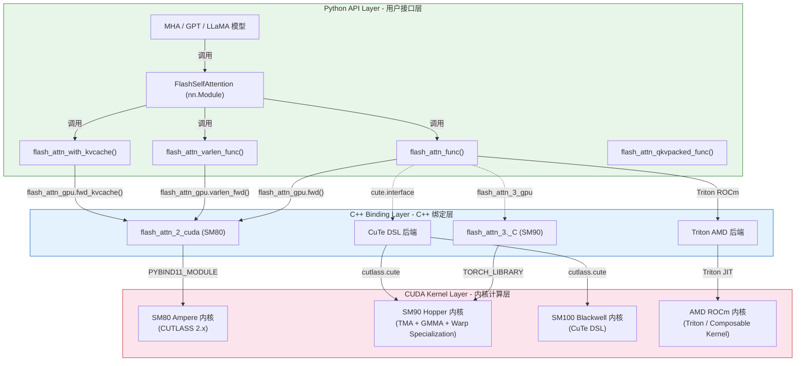
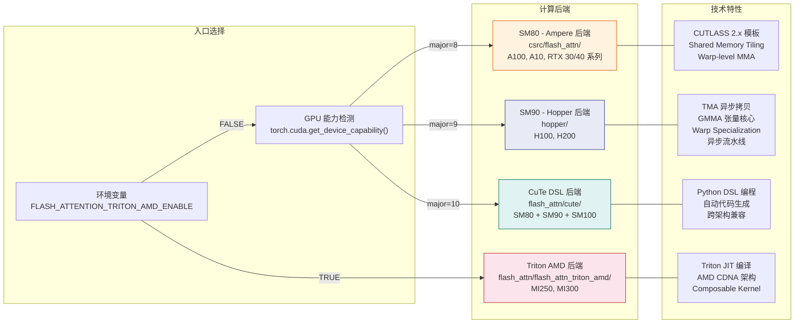

本文档对 Flash Attention 代码仓库的整体架构进行系统性剖析，涵盖目录结构、分层设计、多后端支持体系以及关键文件索引。目标读者为 ML 工程师和 CUDA 开发者，帮助其快速建立对代码库全局的认知地图。

---

## 1. 代码仓库目录结构详解

Flash Attention 代码仓库采用**分层 + 多后端**的组织方式，将 Python 用户接口、C++ 绑定层、CUDA 内核实现三者清晰分离，同时针对不同 GPU 架构提供专门的内核实现。

### 1.1 顶层目录总览

```
flash-attention/
├── flash_attn/               # Python API 包 - 用户直接交互的入口
│   ├── __init__.py           # 导出 7 个核心公开函数
│   ├── flash_attn_interface.py  # SM80 核心接口 (1616 行)
│   ├── bert_padding.py       # BERT 变长序列 padding/unpadding 工具
│   ├── flash_attn_triton.py  # Triton 原始后端实现
│   ├── flash_attn_triton_amd/ # AMD ROCm Triton 后端 (v2 + v3 接口)
│   ├── cute/                 # CuTe DSL 实现 (33 个 Python 文件)
│   ├── layers/               # 高级组件层 (rotary, patch_embed)
│   ├── modules/              # nn.Module 封装 (MHA, MLP, Block 等)
│   ├── models/               # 完整模型实现 (GPT, BERT, LLaMA, ViT 等)
│   ├── ops/                  # 融合算子 (fused_dense, layer_norm, rms_norm)
│   ├── losses/               # 损失函数 (cross_entropy)
│   └── utils/                # 工具函数 (benchmark, generation, distributed)
│
├── csrc/                     # C++/CUDA 源码 - SM80 (Ampere) 后端
│   ├── flash_attn/
│   │   ├── flash_api.cpp     # pybind11 C++ API 绑定 (1485 行)
│   │   └── src/              # 89 个 CUDA 文件 (72 .cu + 17 .h)
│   ├── flash_attn_ck/        # AMD Composable Kernel 后端
│   ├── cutlass/              # NVIDIA CUTLASS 子模块
│   ├── composable_kernel/    # AMD CK 子模块
│   ├── fused_dense_lib/      # 融合全连接层 CUDA 实现
│   └── layer_norm/           # 融合 LayerNorm CUDA 实现
│
├── hopper/                   # FlashAttention-3 - SM90 (Hopper) 后端
│   ├── flash_attn_interface.py  # Hopper Python 接口 (1143 行)
│   ├── flash_api.cpp         # Hopper C++ API (1769 行)
│   ├── mainloop_fwd_sm90_tma_gmma_ws.hpp  # 前向主循环 (~1717 行)
│   ├── mainloop_bwd_sm90_tma_gmma_ws.hpp  # 反向主循环 (~1046 行)
│   ├── flash_fwd_kernel_sm90.h  # SM90 前向内核定义
│   ├── flash_bwd_kernel_sm90.h  # SM90 反向内核定义
│   ├── softmax.h, mask.h, tile_scheduler.hpp  # 核心组件
│   ├── generate_kernels.py   # 内核实例化代码生成器
│   └── instantiations/       # 451 个自动生成的内核实例化文件
│
├── tests/                    # 测试套件
├── benchmarks/               # 性能基准测试
├── training/                 # GPT 训练脚本与配置
├── examples/                 # 使用示例
└── setup.py                  # 构建系统入口 (支持 CUDA/ROCm 双路径)
```

### 1.2 核心子目录详解

#### flash_attn/ - Python API 包

这是用户直接使用的 Python 包，`__init__.py` 导出了 7 个核心公开函数：

```python
from flash_attn.flash_attn_interface import (
    flash_attn_func,                    # 标准 attention
    flash_attn_kvpacked_func,           # KV 打包格式
    flash_attn_qkvpacked_func,          # QKV 打包格式
    flash_attn_varlen_func,             # 变长序列
    flash_attn_varlen_kvpacked_func,    # 变长 + KV 打包
    flash_attn_varlen_qkvpacked_func,   # 变长 + QKV 打包
    flash_attn_with_kvcache,            # KV Cache 推理
)
```

#### flash_attn/cute/ - CuTe DSL 后端

基于 NVIDIA CUTLASS 的 CuTe DSL (Domain Specific Language) 实现，用纯 Python 编写 CUDA 内核。这是 Flash Attention 的前沿实验方向，支持 SM90 (Hopper)、SM100 (Blackwell) 和 SM80 (Ampere) 多代架构：

| 文件 | 功能 |
|------|------|
| `interface.py` | CuTe DSL 对外接口 |
| `flash_fwd.py` | SM90 前向 Attention 内核 |
| `flash_fwd_sm100.py` | SM100 (Blackwell) 前向内核 |
| `flash_bwd.py` | SM80 反向 Attention 内核 |
| `flash_bwd_sm90.py` | SM90 反向内核 |
| `flash_bwd_sm100.py` | SM100 反向内核 |
| `softmax.py` | Softmax 计算 |
| `mask.py` | Attention Mask 处理 |
| `tile_scheduler.py` | Tile 调度器 |
| `pipeline.py` | 流水线调度 |
| `pack_gqa.py` | GQA 头分组打包 |
| `paged_kv.py` | PagedAttention KV 缓存 |

#### flash_attn/modules/ - 高级 nn.Module 封装

| 模块文件 | 功能描述 |
|----------|----------|
| `mha.py` | `FlashSelfAttention`、`FlashCrossAttention`、`MHA` 等核心模块 |
| `block.py` | Transformer Block (Pre-LN / Post-LN) |
| `mlp.py` | 融合 MLP 层 (含 GeLU/SiLU 融合) |
| `embedding.py` | GPT-2 风格嵌入层 |

#### flash_attn/models/ - 完整模型实现

提供了直接可训练的模型，全部基于 Flash Attention 优化：

| 模型文件 | 对应模型 |
|----------|----------|
| `gpt.py` | GPT-2/GPT-3 风格模型 |
| `llama.py` | LLaMA 系列 |
| `bert.py` | BERT |
| `vit.py` | Vision Transformer |
| `falcon.py` | Falcon |
| `gpt_neox.py` | GPT-NeoX |
| `opt.py` | OPT |
| `bigcode.py` | StarCoder |
| `baichuan.py` | 百川 |
| `gptj.py` | GPT-J |
| `btlm.py` | BTLM |

---

## 2. 分层架构设计

Flash Attention 采用经典的三层架构设计，从上到下依次为 Python API 层、C++ 绑定层和 CUDA 内核层。每一层职责清晰，通过精心设计的接口进行解耦。



### 2.1 Python API 层

Python API 层是用户的直接交互入口，分为三个层级：

**底层函数接口** (`flash_attn_interface.py`)：
- 直接封装 C++ 扩展调用，处理参数验证、contiguous 检查、自动梯度注册
- 使用 `torch.library.custom_op` 装饰器支持 `torch.compile()` 编译
- 自动检测 GPU 能力 (SM80/SM86/SM89/SM90) 并选择最优 block size

**中间模块层** (`modules/`)：
- 提供 `FlashSelfAttention`、`FlashCrossAttention`、`MHA` 等 `nn.Module` 封装
- 整合 Rotary Embedding、ALiBi、GQA/MQA 等注意力变体
- 支持 Tensor Parallelism (列并行/行并行)

**顶层模型层** (`models/`)：
- 完整的 Transformer 模型实现 (GPT, BERT, LLaMA 等)
- 整合 Flash Attention + 融合 LayerNorm + 融合 Dense
- 可直接用于训练和推理

### 2.2 C++ 绑定层

C++ 绑定层是连接 Python 世界和 CUDA 世界的桥梁：

**SM80 后端** (`csrc/flash_attn/flash_api.cpp` - 1485 行)：
- 使用 `PYBIND11_MODULE` 注册为 `flash_attn_2_cuda` 扩展
- 核心函数：`mha_fwd`、`mha_bwd`、`mha_fwd_kvcache`、`mha_varlen_fwd` 等
- 负责参数填充 (`set_params_fprop`)、张量内存分配、CUDA 流管理

**SM90 后端** (`hopper/flash_api.cpp` - 1769 行)：
- 使用 `TORCH_LIBRARY` + PyTorch custom op 注册为 `flash_attn_3`
- 增加了 FP8、PackGQA、PagedKV 等 Hopper 专属功能的参数处理
- 使用 `static_switch.h` 在编译期根据模板参数分发到不同内核实例

### 2.3 CUDA 内核层

CUDA 内核层是计算密集的核心，包含数千行高度优化的 GPU 代码：

**SM80 内核** (`csrc/flash_attn/src/`)：
- 基于 CUTLASS 2.x 模板编程
- 72 个 `.cu` 实例化文件，覆盖 fwd/bwd/split 三类、6 种 head_dim (32/64/96/128/192/256)、2 种数据类型 (fp16/bf16)、causal/非 causal
- 使用 `flash_fwd_launch_template.h` / `flash_bwd_launch_template.h` 模板统一 launch 逻辑

**SM90 内核** (`hopper/`)：
- 利用 Hopper 架构三大硬件特性：TMA (Tensor Memory Accelerator)、GMMA (Group Matrix Multiply Accumulate)、Warp Specialization
- `mainloop_fwd_sm90_tma_gmma_ws.hpp` (1717 行) 实现前向传播流水线
- `mainloop_bwd_sm90_tma_gmma_ws.hpp` (1046 行) 实现反向传播流水线
- 451 个自动生成的实例化文件，覆盖 fwd/bwd + paged/split/packgqa + softcap + fp16/bf16/e4m3 组合

---

## 3. 多后端支持体系

Flash Attention 通过运行时检测和环境变量配置，支持四大计算后端，覆盖 NVIDIA 三代 GPU 架构和 AMD GPU：



### 3.1 CUDA SM80 - Ampere 后端

**对应目录**：`csrc/flash_attn/src/`

面向 NVIDIA Ampere 架构 (A100, A10, RTX 30/40 系列) 的经典实现。这是 Flash Attention v2 的核心：

- **编程模型**：基于 CUTLASS 2.x 的 C++ 模板元编程
- **内存层级**：HBM → Shared Memory → Register 的手动 tiling
- **计算单元**：Warp-level MMA (Matrix Multiply Accumulate)
- **实例化策略**：按 (head_dim, dtype, causal, fwd/bwd/split) 组合预编译为 72 个独立 `.cu` 文件
- **核心头文件**：`flash_fwd_kernel.h`、`flash_bwd_kernel.h`、`flash.h`、`softmax.h`

### 3.2 CUDA SM90 - Hopper 后端

**对应目录**：`hopper/`

面向 NVIDIA Hopper 架构 (H100, H200) 的 FlashAttention-3 实现，充分利用了 Hopper 的三大硬件创新：

- **TMA (Tensor Memory Accelerator)**：硬件异步全局内存到共享内存的拷贝，无需 warp 参与
- **GMMA (Grouped Matrix Multiply Accumulate)**：warpgroup 级别的矩阵乘法，更高吞吐
- **Warp Specialization**：将 warp 分为 Producer (负责数据搬运) 和 Consumer (负责计算)，实现计算与访存的流水线重叠
- **FP8 支持**：e4m3 格式的 FP8 attention 计算
- **实例化**：通过 `generate_kernels.py` 自动生成 451 个实例化文件

### 3.3 Triton AMD ROCm 后端

**对应目录**：`flash_attn/flash_attn_triton_amd/`

面向 AMD GPU (MI250, MI300 系列) 的实现，通过 OpenAI Triton 编译器进行 JIT 编译：

- **接口文件**：`interface_v2.py` (v2 兼容接口) 和 `interface_v3.py` (v3 接口)
- **内核文件**：`fwd_prefill.py`、`fwd_decode.py`、`bwd.py`
- **激活方式**：设置环境变量 `FLASH_ATTENTION_TRITON_AMD_ENABLE=TRUE`
- **CK 后端**：同时支持 Composable Kernel C++ 后端 (`csrc/flash_attn_ck/`)

### 3.4 CuTe DSL Python 后端

**对应目录**：`flash_attn/cute/`

这是 Flash Attention 最前沿的实验方向，使用 NVIDIA CUTLASS 的 CuTe DSL 用纯 Python 编写高性能 CUDA 内核：

- **跨架构**：同一套 Python 代码同时支持 SM80、SM90、SM100 三代架构
- **自动生成**：Python 代码经过 CuTe DSL 编译器自动转换为高效 CUDA 内核
- **依赖**：需要安装 `nvidia-cutlass-dsl>=4.2.0` 和 `cuda.bindings`
- **当前支持**：BF16/FP16、causal/非 causal、MHA/GQA/MQA、hdim 64/96/128、varlen、sliding window
- **开发中**：FlashDecoding (split)、FP8、paged KV、调优 block sizes

---

## 4. 调用链路追踪

以用户调用 `flash_attn_func()` 前向计算为例，完整追踪从 Python 到 CUDA 内核的调用链路：

```mermaid
flowchart LR
    subgraph python_api["Python API"]
        U["用户代码\nflash_attn_func(q, k, v)"]
        IF["flash_attn_interface.py\n_flash_attn_forward()"]
        PRE["参数预处理\n- maybe_contiguous()\n- softmax_scale 计算\n- window_size 设置"]
    end

    subgraph cpp_binding["C++ 绑定"]
        GPU["flash_attn_gpu.fwd()\n(flash_attn_2_cuda)"]
        PARAMS["set_params_fprop()\n填充 Flash_fwd_params"]
        SWITCH["static_switch.h\n编译期模板分发"]
    end

    subgraph cuda_kernel["CUDA 内核"]
        TEMPLATE["flash_fwd_launch_template.h\nrun_mha_fwd()"]
        KERNEL["flash_fwd_kernel.h\ncompute_attn_1rowblock()"]
        COMPUTE["分块矩阵乘法\nQ_i * K_j^T -> S_ij\n在线 Softmax\nS_ij * V_j -> O_i"]
    end

    U -->|"torch.autograd.Function"| IF
    IF -->|"参数验证"| PRE
    PRE -->|"C++ 扩展调用"| GPU
    GPU -->|"参数打包"| PARAMS
    PARAMS -->|"HEADDIM_SWITCH / BOOL_SWITCH"| SWITCH
    SWITCH -->|"模板实例化"| TEMPLATE
    TEMPLATE -->|"cudaLaunchKernel"| KERNEL
    KERNEL -->|"Tiled GEMM + Online Softmax"| COMPUTE

    style python_api fill:#e8f5e9,stroke:#2e7d32
    style cpp_binding fill:#e3f2fd,stroke:#1565c0
    style cuda_kernel fill:#fce4ec,stroke:#c62828
```



### 4.1 调用链路详细步骤

| 步骤 | 位置 | 关键操作 |
|------|------|----------|
| 1 | `flash_attn_func()` | 用户入口，接收 Q/K/V 张量和配置参数 |
| 2 | `FlashAttnFunc.forward()` | `torch.autograd.Function`，注册反向传播 |
| 3 | `_flash_attn_forward()` | `@torch.library.custom_op` 装饰，支持 `torch.compile` |
| 4 | `maybe_contiguous()` | 确保张量最后一维连续 |
| 5 | `flash_attn_gpu.fwd()` | 跨越 Python/C++ 边界，进入 C++ 扩展 |
| 6 | `set_params_fprop()` | 将 Python 参数填充到 `Flash_fwd_params` C 结构体 |
| 7 | `HEADDIM_SWITCH` | 根据 head_dim 在编译期选择对应模板实例 |
| 8 | `run_mha_fwd<T, hdim>()` | Launch CUDA kernel，设置 grid/block 维度 |
| 9 | `flash_fwd_kernel` | GPU 上执行分块注意力计算 |
| 10 | Online Softmax + Tiled GEMM | 核心算法：分块矩阵乘 + 在线 softmax 归一化 |

### 4.2 反向传播链路

反向传播遵循类似路径，但增加了额外步骤：

1. `FlashAttnFunc.backward()` 被 PyTorch autograd 触发
2. 调用 `_flash_attn_backward()` 进入 C++ 层
3. C++ 层先执行 `run_mha_bwd`，计算 dQ、dK、dV
4. 反向内核使用前向保存的 `softmax_lse` (logsumexp) 避免重新计算完整 softmax
5. 使用 recomputation 策略：仅存储 O 和 lse，反向时重算 S 矩阵

---

## 5. 关键文件索引地图

### 5.1 核心接口文件

| 功能分类 | 文件路径 | 行数 | 描述 |
|----------|----------|------|------|
| SM80 Python 接口 | `flash_attn/flash_attn_interface.py` | 1616 | FlashAttention-2 的所有公开函数 |
| SM90 Python 接口 | `hopper/flash_attn_interface.py` | 1143 | FlashAttention-3 Hopper 专用接口 |
| CuTe DSL 接口 | `flash_attn/cute/interface.py` | ~500 | CuTe DSL Python 内核接口 |
| AMD Triton v2 接口 | `flash_attn/flash_attn_triton_amd/interface_v2.py` | -- | AMD ROCm v2 兼容接口 |
| AMD Triton v3 接口 | `flash_attn/flash_attn_triton_amd/interface_v3.py` | -- | AMD ROCm v3 接口 |

### 5.2 C++ 绑定文件

| 功能分类 | 文件路径 | 行数 | 描述 |
|----------|----------|------|------|
| SM80 C++ API | `csrc/flash_attn/flash_api.cpp` | 1485 | pybind11 绑定，注册 `flash_attn_2_cuda` |
| SM90 C++ API | `hopper/flash_api.cpp` | 1769 | TORCH_LIBRARY 绑定，注册 `flash_attn_3` |
| AMD CK API | `csrc/flash_attn_ck/flash_api.cpp` | -- | Composable Kernel C++ 绑定 |

### 5.3 CUDA 内核 - SM80 核心文件

| 功能分类 | 文件路径 | 描述 |
|----------|----------|------|
| 数据结构 | `csrc/flash_attn/src/flash.h` | `Flash_fwd_params` / `Flash_bwd_params` 参数结构体 |
| 前向内核 | `csrc/flash_attn/src/flash_fwd_kernel.h` | 前向 attention 核心计算逻辑 |
| 反向内核 | `csrc/flash_attn/src/flash_bwd_kernel.h` | 反向 attention 核心计算逻辑 |
| 前向 Launch | `csrc/flash_attn/src/flash_fwd_launch_template.h` | 前向内核启动模板 |
| 反向 Launch | `csrc/flash_attn/src/flash_bwd_launch_template.h` | 反向内核启动模板 |
| Softmax | `csrc/flash_attn/src/softmax.h` | 在线 softmax 实现 |
| Mask | `csrc/flash_attn/src/mask.h` | Causal / sliding window mask |
| Rotary | `csrc/flash_attn/src/rotary.h` | Rotary Position Embedding 内核 |
| 内核特性 | `csrc/flash_attn/src/kernel_traits.h` | CUTLASS 内核配置 traits |
| 静态分发 | `csrc/flash_attn/src/static_switch.h` | 编译期模板参数分发宏 |
| Dropout | `csrc/flash_attn/src/dropout.h` | Dropout 随机数生成 |

### 5.4 CUDA 内核 - SM90 核心文件

| 功能分类 | 文件路径 | 描述 |
|----------|----------|------|
| 数据结构 | `hopper/flash.h` | SM90 参数结构体 (扩展 FP8、PagedKV 等) |
| 前向主循环 | `hopper/mainloop_fwd_sm90_tma_gmma_ws.hpp` | TMA + GMMA + Warp Spec 前向流水线 (1717 行) |
| 反向主循环 | `hopper/mainloop_bwd_sm90_tma_gmma_ws.hpp` | TMA + GMMA + Warp Spec 反向流水线 (1046 行) |
| SM80 前向主循环 | `hopper/mainloop_fwd_sm80.hpp` | Hopper 包中的 SM80 前向回退实现 |
| SM80 反向主循环 | `hopper/mainloop_bwd_sm80.hpp` | Hopper 包中的 SM80 反向回退实现 |
| 前向内核 | `hopper/flash_fwd_kernel_sm90.h` | SM90 前向内核定义 |
| 反向内核 | `hopper/flash_bwd_kernel_sm90.h` | SM90 反向内核定义 |
| Tile 调度 | `hopper/tile_scheduler.hpp` | 工作分块调度器 |
| Softmax | `hopper/softmax.h` | 在线 softmax (SM90 优化) |
| Mask | `hopper/mask.h` | 注意力掩码 |
| Epilogue 前向 | `hopper/epilogue_fwd.hpp` | 前向计算后处理 |
| Epilogue 反向 | `hopper/epilogue_bwd.hpp` | 反向计算后处理 |
| Combine | `hopper/flash_fwd_combine_kernel.h` | Split Attention 结果合并 |
| 启发式 | `hopper/heuristics.h` | 自动选择 tile size 和 split 数量 |
| Paged KV | `hopper/paged_kv.h` | PagedAttention KV 缓存管理 |

### 5.5 CuTe DSL 核心文件

| 功能分类 | 文件路径 | 描述 |
|----------|----------|------|
| 前向 SM90 | `flash_attn/cute/flash_fwd.py` | Hopper 前向 attention 内核 (Python) |
| 前向 SM100 | `flash_attn/cute/flash_fwd_sm100.py` | Blackwell 前向 attention 内核 |
| 反向 SM80 | `flash_attn/cute/flash_bwd.py` | Ampere 反向 attention 内核 |
| 反向 SM90 | `flash_attn/cute/flash_bwd_sm90.py` | Hopper 反向 attention 内核 |
| 反向 SM100 | `flash_attn/cute/flash_bwd_sm100.py` | Blackwell 反向 attention 内核 |
| 反向预处理 | `flash_attn/cute/flash_bwd_preprocess.py` | 反向预处理 (dO * O 求和) |
| 反向后处理 | `flash_attn/cute/flash_bwd_postprocess.py` | 反向后处理 (dQ rescale) |
| 合并 | `flash_attn/cute/flash_fwd_combine.py` | Split Attention 合并 |
| 软件流水线 | `flash_attn/cute/pipeline.py` | TMA 异步流水线管理 |
| DSL 工具 | `flash_attn/cute/cute_dsl_utils.py` | CuTe 张量转换工具 |
| 基准测试 | `flash_attn/cute/benchmark.py` | 性能测试工具 |

### 5.6 高层模块与算子

| 功能分类 | 文件路径 | 描述 |
|----------|----------|------|
| Multi-Head Attention | `flash_attn/modules/mha.py` | FlashSelfAttention, MHA 封装 |
| Transformer Block | `flash_attn/modules/block.py` | Pre/Post LayerNorm Block |
| MLP | `flash_attn/modules/mlp.py` | 融合 GeLU/SiLU 的 MLP |
| Rotary Embedding | `flash_attn/layers/rotary.py` | RoPE 位置编码 |
| Patch Embedding | `flash_attn/layers/patch_embed.py` | ViT Patch 嵌入 |
| Fused Dense | `flash_attn/ops/fused_dense.py` | 融合全连接 (含 Tensor Parallel) |
| Layer Norm | `flash_attn/ops/layer_norm.py` | 融合 LayerNorm |
| RMS Norm | `flash_attn/ops/rms_norm.py` | 融合 RMSNorm |
| Cross Entropy | `flash_attn/losses/cross_entropy.py` | 融合交叉熵损失 |
| BERT Padding | `flash_attn/bert_padding.py` | 变长序列 pad/unpad 工具 |

### 5.7 构建与测试

| 功能分类 | 文件路径 | 描述 |
|----------|----------|------|
| 主构建脚本 | `setup.py` | CUDA/ROCm 双路径构建，预编译轮下载 |
| Hopper 构建 | `hopper/setup.py` | FlashAttention-3 单独构建 |
| 内核代码生成 | `hopper/generate_kernels.py` | 自动生成 451 个实例化文件 |
| SM80 代码生成 | `csrc/flash_attn/src/generate_kernels.py` | SM80 内核实例化生成 |
| 核心测试 | `hopper/test_flash_attn.py` | FlashAttention-3 综合测试 |
| KV Cache 测试 | `hopper/test_kvcache.py` | KV Cache 推理测试 |

---

## 6. 架构设计要点总结

### 6.1 设计原则

1. **模板元编程驱动**：通过 C++ 模板和编译期分发 (`static_switch.h`)，将运行时判断消除为编译期选择，避免了分支开销
2. **内核实例化策略**：按 (head_dim, dtype, causal, fwd/bwd) 维度的笛卡尔积预编译所有内核变体，以代码体积换运行时性能
3. **渐进式抽象**：从底层 CUDA 到高层 Models，每层只暴露必要接口，用户可以在任意层级接入
4. **多后端统一接口**：通过 `flash_attn_gpu` 变量名统一不同后端 (CUDA/Triton/CK)，Python 层代码无需感知底层实现
5. **前向兼容设计**：CuTe DSL 后端使用 Python 编写 CUDA 内核，一套代码即可覆盖 SM80/SM90/SM100 三代架构

### 6.2 内核实例化维度

SM80 后端的 72 个 `.cu` 文件由以下维度组合生成：

| 维度 | 取值 | 数量 |
|------|------|------|
| 方向 | fwd, bwd, fwd_split | 3 |
| head_dim | 32, 64, 96, 128, 192, 256 | 6 |
| 数据类型 | fp16, bf16 | 2 |
| Causal | causal, 非 causal | 2 |

总计：3 x 6 x 2 x 2 = 72 个实例化文件

SM90 (Hopper) 后端的 451 个实例化文件维度更多，额外包含：
- FP8 (e4m3) 数据类型
- PagedKV 变体
- PackGQA 变体
- Softcap 变体
- SM80 回退变体

### 6.3 构建系统

Flash Attention 的构建系统 (`setup.py`) 具有以下特点：

- **预编译轮优先**：首先尝试从 GitHub Releases 下载预编译的 `.whl` 文件，下载失败时才从源码编译
- **自动内存管理**：根据可用 CPU 核心数和空闲内存自动设置 `MAX_JOBS` 和 `NVCC_THREADS`
- **双路径编译**：CUDA 路径使用 CUTLASS，ROCm 路径使用 Composable Kernel
- **GPU 架构自适应**：通过 `FLASH_ATTN_CUDA_ARCHS` 环境变量控制编译目标架构，默认为 `80;90;100;110;120`
- **CUDA 版本适配**：自动处理 CUDA 11.x / 12.x / 13.x 的 gencode flag 差异

---

## 导航

- 上一篇：[项目介绍](01-project-introduction.md)
- 下一篇：[快速上手](03-quick-start.md)
- [返回目录](../README.md)
