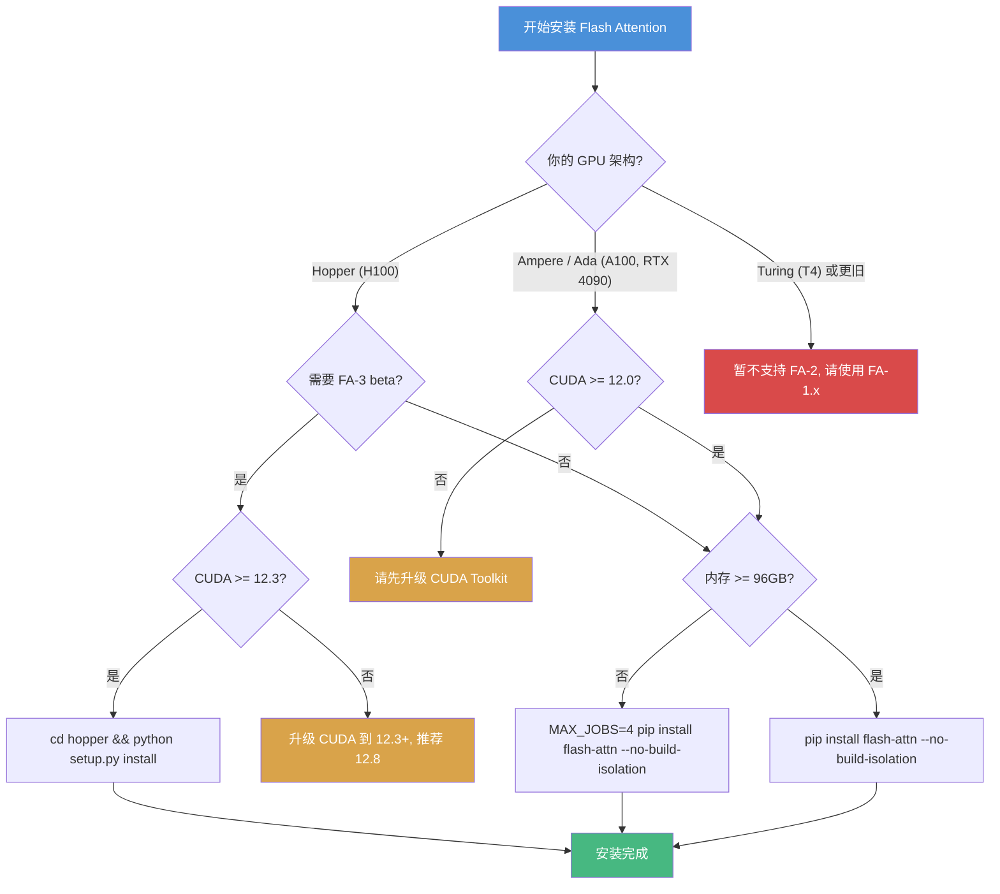

本文档旨在帮助开发者在 **5 分钟内** 完成 Flash Attention 的安装与基本使用。Flash Attention 是一种 IO 感知的精确注意力计算算法，能够显著加速 Transformer 模型的训练和推理，同时大幅降低显存占用。

> 当前版本: **v2.8.3** (FlashAttention-2)
> FlashAttention-3 (beta): 针对 Hopper 架构 (H100) 深度优化

---

## 1. 环境要求

### 1.1 基础依赖

| 依赖项 | 最低版本 | 推荐版本 | 说明 |
|--------|---------|---------|------|
| CUDA Toolkit | 12.0 | 12.3+ | NVIDIA GPU 编译工具链 |
| PyTorch | 2.2 | 2.4+ | `torch.compile()` 支持需要 >= 2.4 |
| Python | 3.9 | 3.10+ | 需要 64 位 Python |
| `packaging` | - | 最新 | `pip install packaging` |
| `psutil` | - | 最新 | `pip install psutil` |
| `ninja` | - | 最新 | `pip install ninja`，加速编译必备 |
| `einops` | - | 最新 | 张量操作工具库 |

### 1.2 操作系统支持

| 操作系统 | 支持状态 |
|---------|---------|
| Linux (x86_64) | 完全支持 |
| Windows | 从 v2.3.2 起部分支持，仍需更多测试 |
| macOS | 不支持 (无 NVIDIA GPU) |

### 1.3 GPU 架构支持

| GPU 架构 | 计算能力 | 代表型号 | 支持数据类型 |
|---------|---------|---------|------------|
| Ampere | sm80 | A100, A800 | FP16, BF16 |
| Ada Lovelace | sm89 | RTX 4090, L40 | FP16, BF16 |
| Hopper | sm90 | H100, H800 | FP16, BF16 |

> **注意**: Turing 架构 (T4, RTX 2080, sm75) 目前不受 FlashAttention-2 支持，请使用 FlashAttention 1.x。BF16 数据类型要求 Ampere 及以上架构。

### 1.4 FlashAttention-3 额外要求

FlashAttention-3 是专门为 Hopper 架构优化的 beta 版本，提供进一步的性能提升:

| 依赖项 | 要求 |
|--------|-----|
| GPU | H100 / H800 |
| CUDA Toolkit | >= 12.3 (强烈推荐 12.8 以获得最佳性能) |
| 支持数据类型 | FP16, BF16 前向 + 反向; FP8 前向 |

---

## 2. 安装方式

### 2.1 安装决策流程

根据你的硬件和环境，参考以下流程图选择合适的安装方式:



### 2.2 pip 安装 (推荐)

这是最简单的安装方式。pip 会自动尝试下载预编译的 wheel 包，如果找不到匹配的预编译包，则会自动从源码编译:

```bash
pip install flash-attn --no-build-isolation
```

> **`--no-build-isolation` 标志是必须的**，因为 Flash Attention 在编译时需要访问已安装的 PyTorch 来定位 CUDA 扩展工具链。

### 2.3 源码编译安装

```bash
git clone https://github.com/Dao-AILab/flash-attention.git
cd flash-attention
git submodule update --init
python setup.py install
```

### 2.4 限制并行编译 (内存不足时)

如果你的机器内存低于 96GB 且 CPU 核心数较多，`ninja` 可能会启动过多的并行编译任务，导致内存耗尽。可以通过 `MAX_JOBS` 环境变量限制并行编译数:

```bash
# 限制为 4 个并行编译任务
MAX_JOBS=4 pip install flash-attn --no-build-isolation
```

### 2.5 FlashAttention-3 安装 (beta)

FlashAttention-3 作为独立包安装在 `hopper/` 目录下:

```bash
git clone https://github.com/Dao-AILab/flash-attention.git
cd flash-attention/hopper
python setup.py install
```

安装完成后，通过以下方式导入:

```python
import flash_attn_interface
flash_attn_interface.flash_attn_func(...)
```

### 2.6 验证安装

```bash
python -c "import flash_attn; print(f'Flash Attention version: {flash_attn.__version__}')"
```

预期输出:

```
Flash Attention version: 2.8.3
```

---

## 3. 五分钟上手示例

### 3.1 核心 API 概览

Flash Attention 提供以下核心函数，全部位于 `flash_attn` 包中:

```python
from flash_attn import (
    flash_attn_func,              # 标准 Q, K, V 分离输入
    flash_attn_qkvpacked_func,    # QKV 打包输入 (更快)
    flash_attn_varlen_func,       # 变长序列支持
    flash_attn_with_kvcache,      # KV Cache 推理加速
)
```

### 3.2 基础用法 - flash_attn_func

这是最常用的接口。输入 Q, K, V 作为独立张量，计算 `softmax(Q @ K^T * scale) @ V`:

```python
import torch
from flash_attn import flash_attn_func

# 参数设定
batch_size = 2
seqlen = 1024
nheads = 32         # Query 的注意力头数
nheads_k = 8        # Key/Value 的注意力头数 (GQA: nheads 必须能被 nheads_k 整除)
headdim = 128       # 每个注意力头的维度 (支持最大 256)

# 创建输入张量
# 注意: 张量 layout 为 (batch_size, seqlen, nheads, headdim)
q = torch.randn(batch_size, seqlen, nheads, headdim, device='cuda', dtype=torch.float16)
k = torch.randn(batch_size, seqlen, nheads_k, headdim, device='cuda', dtype=torch.float16)
v = torch.randn(batch_size, seqlen, nheads_k, headdim, device='cuda', dtype=torch.float16)

# 基础调用 (非因果注意力)
output = flash_attn_func(q, k, v)
# output shape: (batch_size, seqlen, nheads, headdim)

# 因果注意力 (自回归模型使用)
output_causal = flash_attn_func(q, k, v, causal=True)

# 带滑动窗口的局部注意力 (如 Mistral 7B)
output_local = flash_attn_func(q, k, v, causal=True, window_size=(512, 0))

print(f"输出形状: {output.shape}")  # torch.Size([2, 1024, 32, 128])
```

### 3.3 Packed QKV - flash_attn_qkvpacked_func

当 Q, K, V 已经拼接在一起时（如自注意力场景），使用此函数可以避免反向传播中显式拼接梯度，因此**更快**:

```python
import torch
from flash_attn import flash_attn_qkvpacked_func

batch_size = 2
seqlen = 1024
nheads = 32
headdim = 128

# QKV 打包为一个张量, shape: (batch_size, seqlen, 3, nheads, headdim)
qkv = torch.randn(batch_size, seqlen, 3, nheads, headdim, device='cuda', dtype=torch.float16)

# 因果注意力
output = flash_attn_qkvpacked_func(qkv, causal=True)
print(f"输出形状: {output.shape}")  # torch.Size([2, 1024, 32, 128])
```

### 3.4 变长序列 - flash_attn_varlen_func

处理一个 batch 中不同长度的序列时使用，通过 cumulative sequence lengths 来索引:

```python
import torch
from flash_attn import flash_attn_varlen_func

# 假设 batch 中有 3 个序列，长度分别为 100, 200, 150
seqlens = [100, 200, 150]
total_tokens = sum(seqlens)  # 450
nheads = 32
nheads_k = 8
headdim = 128

# 所有序列拼接成一个张量, shape: (total_tokens, nheads, headdim)
q = torch.randn(total_tokens, nheads, headdim, device='cuda', dtype=torch.float16)
k = torch.randn(total_tokens, nheads_k, headdim, device='cuda', dtype=torch.float16)
v = torch.randn(total_tokens, nheads_k, headdim, device='cuda', dtype=torch.float16)

# 累积序列长度 (batch_size + 1,), dtype 必须是 int32
cu_seqlens_q = torch.tensor([0, 100, 300, 450], device='cuda', dtype=torch.int32)
cu_seqlens_k = torch.tensor([0, 100, 300, 450], device='cuda', dtype=torch.int32)

max_seqlen_q = max(seqlens)
max_seqlen_k = max(seqlens)

output = flash_attn_varlen_func(
    q, k, v,
    cu_seqlens_q=cu_seqlens_q,
    cu_seqlens_k=cu_seqlens_k,
    max_seqlen_q=max_seqlen_q,
    max_seqlen_k=max_seqlen_k,
    causal=True,
)
print(f"输出形状: {output.shape}")  # torch.Size([450, 32, 128])
```

### 3.5 KV Cache 推理 - flash_attn_with_kvcache

在推理阶段（逐步生成 token）使用。它会**原地更新** KV Cache 并执行注意力计算，一切在一个 kernel 中完成:

```python
import torch
from flash_attn import flash_attn_with_kvcache

batch_size = 4
max_seqlen = 2048     # 预分配的最大序列长度
nheads = 32
nheads_k = 8
headdim = 128

# 预分配 KV Cache
k_cache = torch.zeros(batch_size, max_seqlen, nheads_k, headdim, device='cuda', dtype=torch.float16)
v_cache = torch.zeros(batch_size, max_seqlen, nheads_k, headdim, device='cuda', dtype=torch.float16)

# 模拟已填充了 100 个 token 后, 新增 1 个 token
cache_seqlens = torch.full((batch_size,), 100, device='cuda', dtype=torch.int32)

# 新增的 query, key, value (seqlen=1 对应一个新 token)
q_new = torch.randn(batch_size, 1, nheads, headdim, device='cuda', dtype=torch.float16)
k_new = torch.randn(batch_size, 1, nheads_k, headdim, device='cuda', dtype=torch.float16)
v_new = torch.randn(batch_size, 1, nheads_k, headdim, device='cuda', dtype=torch.float16)

# 执行注意力计算，同时更新 KV Cache
output = flash_attn_with_kvcache(
    q_new,
    k_cache,
    v_cache,
    k=k_new,
    v=v_new,
    cache_seqlens=cache_seqlens,
    causal=True,
)
print(f"输出形状: {output.shape}")  # torch.Size([4, 1, 32, 128])
# k_cache 和 v_cache 已在位置 100 处被原地更新
```

---

## 4. 常见安装问题排查

### 4.1 ninja 相关问题

**问题**: 编译速度极慢 (超过 2 小时)

```bash
# 检查 ninja 是否正常工作
ninja --version
echo $?  # 应返回 0
```

**解决方案**:

```bash
# 重新安装 ninja
pip uninstall -y ninja && pip install ninja
```

> 没有 `ninja` 时，编译不会使用多核并行，在 64 核机器上可能需要 2 小时以上。安装 `ninja` 后，编译通常只需 3-5 分钟。

### 4.2 CUDA 版本不兼容

**问题**: `RuntimeError: FlashAttention is only supported on CUDA 11.7 and above`

```bash
# 检查 CUDA 版本
nvcc -V

# 检查 PyTorch 使用的 CUDA 版本
python -c "import torch; print(torch.version.cuda)"
```

**解决方案**: 确保系统 CUDA Toolkit 版本 >= 12.0，且与 PyTorch 编译时使用的 CUDA 版本一致。推荐使用 NVIDIA 的 [PyTorch Docker 容器](https://catalog.ngc.nvidia.com/orgs/nvidia/containers/pytorch)。

### 4.3 内存不足导致编译失败

**问题**: 编译时出现 OOM (Out of Memory) 错误或系统变得无响应

**解决方案**:

```bash
# 限制并行编译任务数
MAX_JOBS=2 pip install flash-attn --no-build-isolation

# 或同时限制 NVCC 线程数
NVCC_THREADS=2 MAX_JOBS=2 pip install flash-attn --no-build-isolation
```

### 4.4 Windows 编译问题

**问题**: Windows 上编译失败

**前提条件**:
- 安装 Visual Studio Build Tools (需要 MSVC 编译器)
- 设置 `DISTUTILS_USE_SDK=1` 环境变量

```cmd
:: Windows 上安装
set DISTUTILS_USE_SDK=1
pip install flash-attn --no-build-isolation
```

> Windows 支持从 v2.3.2 开始，但仍在持续改进中。如果遇到问题，建议通过 [GitHub Issue](https://github.com/Dao-AILab/flash-attention/issues) 反馈。

### 4.5 常见问题速查表

| 问题 | 可能原因 | 解决方案 |
|-----|---------|---------|
| `ModuleNotFoundError: No module named 'flash_attn_2_cuda'` | 编译未成功或 CUDA 不可用 | 确认 GPU 驱动和 CUDA 版本，重新安装 |
| 编译超过 30 分钟 | ninja 未正确安装 | `pip uninstall -y ninja && pip install ninja` |
| `CUDA out of memory` (编译时) | 并行任务过多 | 设置 `MAX_JOBS=2` |
| `nvcc fatal: Unsupported gpu architecture` | CUDA 版本不支持目标 GPU | 升级 CUDA Toolkit |
| `No matching distribution found` | pip 找不到预编译 wheel | 使用 `--no-build-isolation` 从源码编译 |

---

## 5. 与 PyTorch SDPA 的对比

PyTorch 2.0+ 提供了 `torch.nn.functional.scaled_dot_product_attention` (SDPA) 作为内置的高效注意力实现。以下对比两者的差异:

### 5.1 API 对比

```python
import torch
import torch.nn.functional as F
from flash_attn import flash_attn_func

batch_size, seqlen, nheads, headdim = 2, 1024, 32, 128

# ========== PyTorch SDPA ==========
# 注意: SDPA 的张量 layout 为 (batch, nheads, seqlen, headdim)
q_sdpa = torch.randn(batch_size, nheads, seqlen, headdim, device='cuda', dtype=torch.float16)
k_sdpa = torch.randn(batch_size, nheads, seqlen, headdim, device='cuda', dtype=torch.float16)
v_sdpa = torch.randn(batch_size, nheads, seqlen, headdim, device='cuda', dtype=torch.float16)

output_sdpa = F.scaled_dot_product_attention(
    q_sdpa, k_sdpa, v_sdpa,
    is_causal=True,
)
# output shape: (batch_size, nheads, seqlen, headdim)

# ========== Flash Attention ==========
# 注意: Flash Attention 的张量 layout 为 (batch, seqlen, nheads, headdim)
q_fa = torch.randn(batch_size, seqlen, nheads, headdim, device='cuda', dtype=torch.float16)
k_fa = torch.randn(batch_size, seqlen, nheads, headdim, device='cuda', dtype=torch.float16)
v_fa = torch.randn(batch_size, seqlen, nheads, headdim, device='cuda', dtype=torch.float16)

output_fa = flash_attn_func(
    q_fa, k_fa, v_fa,
    causal=True,
)
# output shape: (batch_size, seqlen, nheads, headdim)
```

### 5.2 功能与性能对比

| 特性 | Flash Attention (`flash_attn`) | PyTorch SDPA (`F.scaled_dot_product_attention`) |
|------|-------------------------------|-----------------------------------------------|
| **张量 Layout** | `(B, S, H, D)` | `(B, H, S, D)` |
| **GQA/MQA 支持** | 原生支持，直接传入不同 head 数 | 需要手动 `expand` KV heads |
| **变长序列** | `flash_attn_varlen_func` 原生支持 | 需要使用 `NestedTensor` |
| **KV Cache 推理** | `flash_attn_with_kvcache` 专用函数 | 无专用接口 |
| **滑动窗口注意力** | `window_size` 参数直接支持 | PyTorch 2.3+ 部分支持 |
| **ALiBi** | `alibi_slopes` 参数原生支持 | 需要手动构造 attn_bias |
| **Softcapping** | `softcap` 参数支持 (如 Gemma-2) | 不支持 |
| **Paged KV Cache** | `block_table` 参数支持 | 不支持 |
| **确定性反向传播** | `deterministic=True` | 取决于后端 |
| **torch.compile** | v2.7+ 兼容 (需要 PyTorch >= 2.4) | 原生支持 |
| **性能** | 通常更快 (尤其长序列) | SDPA 后端可能自动选用 Flash Attention |

> **提示**: PyTorch SDPA 在底层可能已经在使用 Flash Attention 作为后端之一。但直接使用 `flash_attn` 包可以获得更多高级功能 (GQA、变长序列、KV Cache、滑动窗口等) 和更精细的控制。

### 5.3 何时选择哪个?

- **选择 `flash_attn`**: 需要 GQA/MQA、变长序列、KV Cache 推理、滑动窗口、ALiBi、Paged KV Cache 等高级特性时
- **选择 PyTorch SDPA**: 追求代码简洁、不需要高级特性、希望减少外部依赖时

---

## 6. 进阶参考

### 6.1 关键参数说明

| 参数 | 类型 | 默认值 | 说明 |
|------|------|--------|------|
| `dropout_p` | float | 0.0 | Dropout 概率，**推理时必须设为 0.0** |
| `softmax_scale` | float | `1/sqrt(headdim)` | QK^T 的缩放因子 |
| `causal` | bool | False | 因果注意力掩码 (自回归模型) |
| `window_size` | (int, int) | (-1, -1) | 滑动窗口大小，(-1, -1) 表示无限上下文 |
| `alibi_slopes` | Tensor | None | ALiBi 位置编码的斜率 |
| `softcap` | float | 0.0 | Softcapping 阈值，0.0 表示禁用 |
| `deterministic` | bool | False | 确定性反向传播 (略慢，更多显存) |

### 6.2 支持的 Head Dimension

Flash Attention 支持最大 256 的 head dimension。所有 head dimension 至 256 均可使用。Head dimension 256 的反向传播自 v2.5.5 起在消费级 GPU 上也可工作 (无 dropout 时)。

### 6.3 相关资源

- **GitHub 仓库**: [Dao-AILab/flash-attention](https://github.com/Dao-AILab/flash-attention)
- **FlashAttention 论文**: [arXiv:2205.14135](https://arxiv.org/abs/2205.14135)
- **FlashAttention-2 论文**: [FlashAttention-2](https://tridao.me/publications/flash2/flash2.pdf)
- **FlashAttention-3 博客**: [Flash3 Blog](https://tridao.me/blog/2024/flash3/)
- **MHA 模块实现**: [`flash_attn/modules/mha.py`](https://github.com/Dao-AILab/flash-attention/blob/main/flash_attn/modules/mha.py) - 完整的多头注意力层实现，包含 QKV 投影和输出投影

---

## 导航

- 上一篇：[架构总览](02-architecture-overview.md)
- 下一篇：[Standard Attention 数学推导](../01-theory/01-standard-attention.md)
- [返回目录](../README.md)
