本文档系列基于 Flash Attention v2.8.3 源码进行深度技术解析，涵盖理论基础、核心算法、CUDA 内核实现、Python API、高级特性与使用教程。共 **9 个模块、32 篇文章**，从理论到实践全面解析 Flash Attention 的设计与实现。

## 文档总览

```mermaid
graph TD
    subgraph overview["模块一 - 项目总览"]
        O1["项目介绍"]
        O2["架构总览"]
        O3["快速上手"]
    end

    subgraph theory["模块二 - 理论基础"]
        T1["Standard Attention"]
        T2["IO-Awareness"]
        T3["Flash Attention 理论"]
    end

    subgraph core["模块三 - 核心算法"]
        C1["Online Softmax"]
        C2["分块策略"]
        C3["前向传递"]
        C4["反向传递"]
    end

    subgraph cuda["模块四 - CUDA 内核"]
        K1["GPU 编程基础"]
        K2["SM90 内核架构"]
        K3["前向内核实现"]
        K4["反向内核实现"]
        K5["SM80 对比"]
    end

    subgraph api["模块五 - Python API"]
        A1["API 参考"]
        A2["Autograd 集成"]
        A3["模块与层"]
    end

    subgraph walk["模块六 - 代码追踪"]
        W1["前向调用链"]
        W2["反向调用链"]
        W3["调试指南"]
    end

    subgraph adv["模块七 - 高级特性"]
        V1["因果遮蔽"]
        V2["KV Cache 推理"]
        V3["GQA/MQA"]
        V4["FP8 支持"]
    end

    subgraph usage["模块八 - 使用教程"]
        U1["基础用法"]
        U2["训练集成"]
        U3["推理优化"]
        U4["性能测试"]
    end

    subgraph appendix["模块九 - 附录"]
        X1["术语表"]
        X2["论文阅读指南"]
        X3["FAQ"]
    end

    overview --> theory --> core --> cuda
    cuda --> api --> walk --> adv
    adv --> usage --> appendix
```

---

## 目录

### 模块一：项目总览

| # | 文章 | 内容简介 |
|---|------|---------|
| 1 | [项目介绍](../01-project-introduction/) | Flash Attention 的背景、动机、核心创新 |
| 2 | [架构总览](../02-architecture-overview/) | 代码仓库结构、模块关系、编译系统 |
| 3 | [快速上手](../03-quick-start/) | 安装、基础用法、5 分钟入门 |

### 模块二：理论基础

| # | 文章 | 内容简介 |
|---|------|---------|
| 4 | [Standard Attention 数学推导](../../01-theory/01-standard-attention/) | Scaled Dot-Product Attention 的数学原理 |
| 5 | [IO-Awareness 分析](../../01-theory/02-io-awareness/) | GPU 内存层次、IO 瓶颈、算术强度分析 |
| 6 | [Flash Attention 理论推导](../../01-theory/03-flash-attention-theory/) | Tiling + Online Softmax 的数学证明 |

### 模块三：核心算法

| # | 文章 | 内容简介 |
|---|------|---------|
| 7 | [Online Softmax 深度解析](../../02-core-algorithm/01-online-softmax/) | 三遍→两遍→一遍 Softmax 演进、`softmax.h` 解析 |
| 8 | [分块策略与调度](../../02-core-algorithm/02-tiling-strategy/) | Tile 大小选择、5 种调度器、L2 Swizzling |
| 9 | [前向传递算法](../../02-core-algorithm/03-forward-pass/) | Producer-Consumer 架构、主循环流程 |
| 10 | [反向传递算法](../../02-core-algorithm/04-backward-pass/) | 重计算策略、5 个梯度计算、原子 dQ 累加 |

### 模块四：CUDA 内核解析

| # | 文章 | 内容简介 |
|---|------|---------|
| 11 | [GPU 编程基础](../../03-cuda-kernel/01-gpu-programming-basics/) | SM/Warp/Thread 架构、CUTLASS/CuTe、Hopper 特性 |
| 12 | [SM90 内核架构](../../03-cuda-kernel/02-kernel-architecture-sm90/) | 模板驱动设计、SharedStorage、Pipeline |
| 13 | [前向内核实现](../../03-cuda-kernel/03-forward-kernel-impl/) | `operator()` 逐行解析、GMMA、TMA Pipeline |
| 14 | [反向内核实现](../../03-cuda-kernel/04-backward-kernel-impl/) | 3 个 Warp Group、N-outer Q-inner 循环 |
| 15 | [SM80 内核对比](../../03-cuda-kernel/05-kernel-sm80/) | Ampere vs Hopper 实现差异 |

### 模块五：Python API

| # | 文章 | 内容简介 |
|---|------|---------|
| 16 | [API 参考](../../04-python-api/01-api-reference/) | 7 个公开 API 完整参数说明 |
| 17 | [Autograd 集成](../../04-python-api/02-autograd-integration/) | 6 个 Autograd Function、torch.compile 支持 |
| 18 | [模块与层](../../04-python-api/03-modules-and-layers/) | MHA、RotaryEmbedding、Block 模块 |

### 模块六：代码链路追踪

| # | 文章 | 内容简介 |
|---|------|---------|
| 19 | [前向调用链](../../05-code-walkthrough/01-forward-call-trace/) | Python → C++ → CUDA 完整调用追踪 |
| 20 | [反向调用链](../../05-code-walkthrough/02-backward-call-trace/) | 反向传播的端到端调用链 |
| 21 | [调试指南](../../05-code-walkthrough/03-debug-guide/) | 常见错误、数值验证、性能调试 |

### 模块七：高级特性

| # | 文章 | 内容简介 |
|---|------|---------|
| 22 | [因果遮蔽与 Masking](../../06-advanced-features/01-causal-and-masking/) | 块级跳过、元素级遮蔽、滑动窗口、Softcap |
| 23 | [KV Cache 与推理优化](../../06-advanced-features/02-kv-cache-inference/) | Paged KV Cache、Flash Decoding、Combine Kernel |
| 24 | [GQA 与 MQA 实现](../../06-advanced-features/03-gqa-mqa/) | PackGQA 优化、指针共享、启用策略 |
| 25 | [FP8 支持](../../06-advanced-features/04-fp8-support/) | E4M3 数据流、Max_offset 技巧、V 转置 |

### 模块八：使用教程

| # | 文章 | 内容简介 |
|---|------|---------|
| 26 | [基础用法](../../07-usage-tutorial/01-basic-usage/) | 安装、API 选择、因果/窗口/GQA 用法 |
| 27 | [训练集成](../../07-usage-tutorial/02-training-integration/) | MHA 模块、Transformer Block、混合精度 |
| 28 | [推理优化](../../07-usage-tutorial/03-inference-optimization/) | KV Cache、自回归生成、Flash Decoding |
| 29 | [性能测试](../../07-usage-tutorial/04-benchmarking/) | FLOPS 计算、Benchmark 工具、调优指南 |

### 模块九：附录

| # | 文章 | 内容简介 |
|---|------|---------|
| 30 | [术语表](../../08-appendix/01-glossary/) | 50+ 技术术语定义 |
| 31 | [论文阅读指南](../../08-appendix/02-paper-reading-guide/) | 核心论文、前置知识、阅读路线 |
| 32 | [常见问题](../../08-appendix/03-faq/) | 24 个高频 FAQ |

---

## 阅读建议

### 初学者路线
1. [项目介绍](../01-project-introduction/) → [快速上手](../03-quick-start/)
2. [Standard Attention](../../01-theory/01-standard-attention/) → [Flash Attention 理论](../../01-theory/03-flash-attention-theory/)
3. [基础用法](../../07-usage-tutorial/01-basic-usage/) → [FAQ](../../08-appendix/03-faq/)

### 算法研究者路线
1. 理论基础（模块二全部）
2. 核心算法（模块三全部）
3. [论文阅读指南](../../08-appendix/02-paper-reading-guide/)

### CUDA 开发者路线
1. [GPU 编程基础](../../03-cuda-kernel/01-gpu-programming-basics/)
2. CUDA 内核（模块四全部）
3. 代码链路追踪（模块六全部）

### 应用工程师路线
1. [基础用法](../../07-usage-tutorial/01-basic-usage/)
2. [训练集成](../../07-usage-tutorial/02-training-integration/) 或 [推理优化](../../07-usage-tutorial/03-inference-optimization/)
3. [性能测试](../../07-usage-tutorial/04-benchmarking/)
4. 高级特性（按需阅读）

---

## 技术信息

- **目标版本**：Flash Attention v2.8.3
- **GPU 架构**：NVIDIA Hopper (SM90) 为主，兼顾 Ampere (SM80)
- **文档语言**：中文（技术术语保留英文原文）
- **总字数**：约 200,000 字
- **Mermaid 图**：70+ 张
