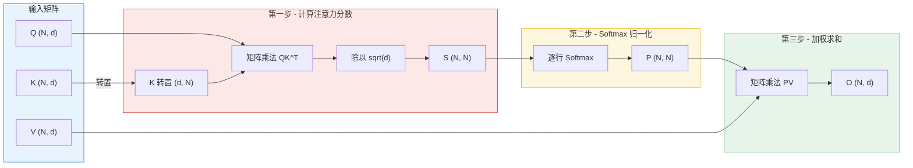
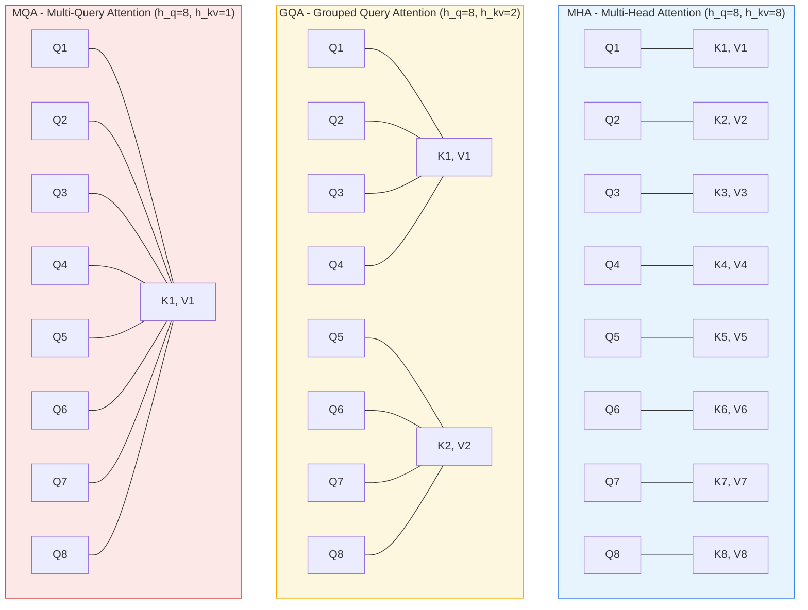
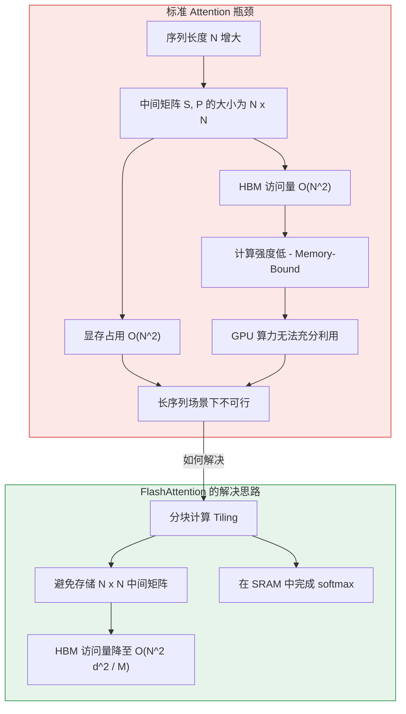

> 本文从数学原理出发，系统推导自注意力（Self-Attention）机制的完整计算过程，分析多头注意力的三种主流变体（MHA / GQA / MQA），并对标准实现的计算复杂度与内存访问瓶颈进行深入剖析。

---

## 目录

- [1. Self-Attention 数学公式推导](#1-self-attention-数学公式推导)
- [2. 多头注意力变体](#2-多头注意力变体)
- [3. 标准实现的复杂度分析](#3-标准实现的复杂度分析)
- [4. 标准实现的 PyTorch 代码](#4-标准实现的-pytorch-代码)
- [5. 瓶颈分析](#5-瓶颈分析)

---

## 1. Self-Attention 数学公式推导

### 1.1 输入定义

给定一个长度为 $N$ 的序列，经过线性投影后得到三个矩阵：

| 矩阵 | 含义 | 形状 |
|:---:|:---:|:---:|
| $Q$ | Query（查询） | $(N, d)$ |
| $K$ | Key（键） | $(N, d)$ |
| $V$ | Value（值） | $(N, d)$ |

其中 $N$ 为序列长度，$d$ 为每个头的维度（head dimension）。

### 1.2 逐步推导

**第一步 - 计算注意力分数（Score）**

Query 与 Key 的转置做矩阵乘法，再除以缩放因子 $\sqrt{d}$：

$$
S = \frac{QK^T}{\sqrt{d}}
$$

- $Q \in \mathbb{R}^{N \times d}$，$K^T \in \mathbb{R}^{d \times N}$
- 结果 $S \in \mathbb{R}^{N \times N}$

$S_{ij}$ 的物理含义是：第 $i$ 个 token 的 Query 向量与第 $j$ 个 token 的 Key 向量之间的相似度。除以 $\sqrt{d}$ 是为了防止当 $d$ 较大时点积值过大，导致 softmax 进入梯度饱和区。

> **缩放因子的直觉解释**：假设 $Q$ 和 $K$ 的每个元素独立服从 $\mathcal{N}(0, 1)$，则 $Q_i \cdot K_j = \sum_{k=1}^{d} Q_{ik} K_{jk}$ 的方差为 $d$。除以 $\sqrt{d}$ 后方差归一化为 1，使得 softmax 的输入分布更加稳定。

**第二步 - Softmax 归一化**

对分数矩阵的每一行做 softmax，得到注意力权重矩阵：

$$
P_{ij} = \text{softmax}(S_i)_j = \frac{e^{S_{ij}}}{\sum_{k=1}^{N} e^{S_{ik}}}
$$

- $P \in \mathbb{R}^{N \times N}$
- 每一行 $P_i$ 构成一个概率分布：$\sum_{j=1}^{N} P_{ij} = 1$，$P_{ij} \geq 0$

**第三步 - 加权求和**

用注意力权重对 Value 矩阵进行加权求和：

$$
O = PV
$$

- $P \in \mathbb{R}^{N \times N}$，$V \in \mathbb{R}^{N \times d}$
- 结果 $O \in \mathbb{R}^{N \times d}$

$O_i = \sum_{j=1}^{N} P_{ij} V_j$ 表示第 $i$ 个 token 的输出是所有 Value 向量的加权组合，权重由注意力分数决定。

### 1.3 完整公式

将上述三步合并，得到 Scaled Dot-Product Attention 的完整表达式：

$$
\boxed{\text{Attention}(Q, K, V) = \text{softmax}\left(\frac{QK^T}{\sqrt{d}}\right) \cdot V}
$$

### 1.4 计算流程图



---

## 2. 多头注意力变体

在实际 Transformer 架构中，注意力机制会被扩展为**多头注意力（Multi-Head Attention）**。不同变体的核心区别在于 Query、Key、Value 各自的头数分配。

### 2.1 MHA - Multi-Head Attention

MHA 是原始 Transformer 论文（Vaswani et al., 2017）提出的标准方案：

- **头数配置**：$h_q = h_k = h_v = h$
- **每个头的维度**：$d_h = d_{\text{model}} / h$
- **参数量**：Q、K、V 各需要 $d_{\text{model}} \times d_{\text{model}}$ 的投影矩阵

每个头独立计算注意力，然后拼接输出：

$$
\text{MultiHead}(Q, K, V) = \text{Concat}(\text{head}_1, \dots, \text{head}_h) W^O
$$

其中每个头：

$$
\text{head}_i = \text{Attention}(QW_i^Q, KW_i^K, VW_i^V)
$$

### 2.2 MQA - Multi-Query Attention

MQA（Shazeer, 2019）通过让所有 Query 头**共享**同一组 Key 和 Value，大幅减少 KV Cache 的内存占用：

- **头数配置**：$h_q = h$，$h_k = h_v = 1$
- **KV Cache 缩减**：相比 MHA 减少为 $1/h$
- **效果**：推理速度显著提升，精度略有下降

### 2.3 GQA - Grouped Query Attention

GQA（Ainslie et al., 2023）是 MHA 与 MQA 之间的折中方案：

- **头数配置**：$h_q = h$，$h_k = h_v = g$（其中 $g$ 为组数，$1 \leq g \leq h$）
- **分组方式**：每 $h/g$ 个 Query 头共享一组 Key 和 Value
- **KV Cache 缩减**：相比 MHA 减少为 $g/h$

### 2.4 三种变体的关系

三者构成一个连续谱系：

| 变体 | Query 头数 | KV 头数 | KV Cache 大小（相对 MHA） | 代表模型 |
|:---:|:---:|:---:|:---:|:---:|
| MHA | $h$ | $h$ | $1\times$ | GPT-2, BERT |
| GQA | $h$ | $g$ | $g/h$ | LLaMA-2 70B, Mixtral |
| MQA | $h$ | $1$ | $1/h$ | PaLM, Falcon |

**等价关系**：
- 当 $g = h$ 时，GQA 退化为 MHA
- 当 $g = 1$ 时，GQA 退化为 MQA

### 2.5 MHA / GQA / MQA 对比图

以 $h = 8$ 个 Query 头为例：



**核心思路**：从 MHA 到 MQA，KV 头数逐步减少，KV Cache 内存占用随之降低，推理效率提升。GQA 在精度与效率之间取得了良好平衡，已成为当前大模型的主流选择。

---

## 3. 标准实现的复杂度分析

### 3.1 计算复杂度（FLOPs）

| 运算 | 操作 | FLOPs |
|:---:|:---:|:---:|
| $QK^T$ | $(N \times d) \cdot (d \times N)$ | $O(N^2 d)$ |
| softmax | 逐行指数、求和、归一化 | $O(N^2)$ |
| $PV$ | $(N \times N) \cdot (N \times d)$ | $O(N^2 d)$ |
| **总计** | | $O(N^2 d)$ |

> 当序列长度 $N$ 增大时，计算量以 $N^2$ 的速度增长。这是 Attention 机制的根本计算瓶颈。

### 3.2 内存复杂度

标准实现需要将中间矩阵 $S$ 和 $P$ 完整存储在显存中：

| 矩阵 | 形状 | 内存占用 |
|:---:|:---:|:---:|
| $Q, K, V$ | $(N, d)$ | $O(Nd)$ |
| $S = QK^T / \sqrt{d}$ | $(N, N)$ | $O(N^2)$ |
| $P = \text{softmax}(S)$ | $(N, N)$ | $O(N^2)$ |
| $O = PV$ | $(N, d)$ | $O(Nd)$ |
| **总计** | | $O(Nd + N^2)$ |

当 $N \gg d$ 时，$O(N^2)$ 项主导总内存消耗。

### 3.3 HBM 访问分析

在 GPU 上，标准 Attention 的每一步都需要在 HBM（High Bandwidth Memory，高带宽显存）中读写数据。下面逐步分析 HBM 访问量：

| 步骤 | 操作 | HBM 读取 | HBM 写入 |
|:---:|:---:|:---:|:---:|
| 1 | 计算 $S = QK^T / \sqrt{d}$ | $Q, K$：$O(Nd)$ | $S$：$O(N^2)$ |
| 2 | 计算 $P = \text{softmax}(S)$ | $S$：$O(N^2)$ | $P$：$O(N^2)$ |
| 3 | 计算 $O = PV$ | $P, V$：$O(N^2 + Nd)$ | $O$：$O(Nd)$ |

**HBM 总访问量**：

$$
\text{HBM 访问量} = O(Nd + N^2)
$$

逐项展开：

- **读取**：$O(Nd)$（读 $Q, K$）$+ O(N^2)$（读 $S$）$+ O(N^2 + Nd)$（读 $P, V$）
- **写入**：$O(N^2)$（写 $S$）$+ O(N^2)$（写 $P$）$+ O(Nd)$（写 $O$）
- **合计**：$O(Nd + N^2)$

> **关键观察**：当 $N \gg d$ 时，HBM 访问量被 $O(N^2)$ 项主导。中间矩阵 $S$ 和 $P$ 的反复读写成为性能瓶颈。这正是 FlashAttention 要解决的核心问题——通过分块计算（tiling）避免将 $N \times N$ 的中间矩阵写入 HBM。

### 3.4 计算强度分析

**计算强度（Arithmetic Intensity）** 定义为计算量与内存访问量的比值：

$$
\text{Arithmetic Intensity} = \frac{\text{FLOPs}}{\text{Bytes Accessed}}
$$

对于标准 Attention：

$$
\text{AI} = \frac{O(N^2 d)}{O(N^2)} = O(d)
$$

当 $d = 64$ 或 $d = 128$ 时，计算强度较低，意味着标准 Attention 是**内存受限（Memory-Bound）**的操作。GPU 的算力无法被充分利用，大部分时间花在等待数据从 HBM 传输到计算单元。

---

## 4. 标准实现的 PyTorch 代码

### 4.1 基础实现

```python
import torch
import math

def standard_attention(Q, K, V):
    """
    标准 Scaled Dot-Product Attention 的 PyTorch 实现。

    Args:
        Q: Query 矩阵，形状 (batch, nheads, seqlen, headdim)
        K: Key   矩阵，形状 (batch, nheads, seqlen, headdim)
        V: Value 矩阵，形状 (batch, nheads, seqlen, headdim)

    Returns:
        output: 注意力输出，形状 (batch, nheads, seqlen, headdim)
    """
    d = Q.shape[-1]

    # 第一步：计算注意力分数 S = QK^T / sqrt(d)
    # Q: (B, H, N, d) x K^T: (B, H, d, N) -> S: (B, H, N, N)
    scores = torch.matmul(Q, K.transpose(-2, -1)) / math.sqrt(d)

    # 第二步：Softmax 归一化（沿最后一个维度，即 Key 维度）
    # S: (B, H, N, N) -> P: (B, H, N, N)
    attn_weights = torch.softmax(scores, dim=-1)

    # 第三步：加权求和 O = PV
    # P: (B, H, N, N) x V: (B, H, N, d) -> O: (B, H, N, d)
    output = torch.matmul(attn_weights, V)

    return output
```

### 4.2 带 Causal Mask 的实现

在自回归（autoregressive）模型中，每个 token 只能看到它自己及之前的 token，需要添加因果掩码：

```python
def causal_attention(Q, K, V):
    """
    带因果掩码的标准 Attention 实现。

    因果掩码确保位置 i 的 token 只能关注位置 j <= i 的 token。
    """
    d = Q.shape[-1]
    N = Q.shape[-2]

    # 计算注意力分数
    scores = torch.matmul(Q, K.transpose(-2, -1)) / math.sqrt(d)

    # 构造因果掩码：上三角为 -inf
    causal_mask = torch.triu(
        torch.full((N, N), float('-inf'), device=Q.device), diagonal=1
    )
    scores = scores + causal_mask  # 广播到 (B, H, N, N)

    # Softmax（被 mask 的位置经过 softmax 后权重趋近于 0）
    attn_weights = torch.softmax(scores, dim=-1)

    # 加权求和
    output = torch.matmul(attn_weights, V)

    return output
```

### 4.3 内存占用演示

```python
import torch

def memory_analysis(batch_size, nheads, seqlen, headdim, dtype=torch.float16):
    """演示标准 Attention 的 GPU 显存占用。"""
    bytes_per_element = 2 if dtype == torch.float16 else 4

    # 输入矩阵 Q, K, V
    input_mem = 3 * batch_size * nheads * seqlen * headdim * bytes_per_element

    # 中间矩阵 S (N x N)
    scores_mem = batch_size * nheads * seqlen * seqlen * bytes_per_element

    # 中间矩阵 P (N x N)
    weights_mem = batch_size * nheads * seqlen * seqlen * bytes_per_element

    # 输出矩阵 O
    output_mem = batch_size * nheads * seqlen * headdim * bytes_per_element

    total = input_mem + scores_mem + weights_mem + output_mem

    print(f"配置: B={batch_size}, H={nheads}, N={seqlen}, d={headdim}")
    print(f"  输入 Q/K/V:    {input_mem / 1024**2:.1f} MB")
    print(f"  中间矩阵 S:    {scores_mem / 1024**2:.1f} MB")
    print(f"  中间矩阵 P:    {weights_mem / 1024**2:.1f} MB")
    print(f"  输出 O:        {output_mem / 1024**2:.1f} MB")
    print(f"  总计:          {total / 1024**2:.1f} MB")
    print()

# 典型配置分析
memory_analysis(1, 32, 2048, 64)   # GPT-2 级别
memory_analysis(1, 32, 8192, 128)  # LLaMA-2 级别
memory_analysis(1, 32, 32768, 128) # 长上下文场景
```

运行结果示例：

```
配置: B=1, H=32, N=2048, d=64
  输入 Q/K/V:    24.0 MB
  中间矩阵 S:    256.0 MB
  中间矩阵 P:    256.0 MB
  输出 O:        8.0 MB
  总计:          544.0 MB

配置: B=1, H=32, N=8192, d=128
  输入 Q/K/V:    192.0 MB
  中间矩阵 S:    4096.0 MB
  中间矩阵 P:    4096.0 MB
  输出 O:        64.0 MB
  总计:          8448.0 MB

配置: B=1, H=32, N=32768, d=128
  输入 Q/K/V:    768.0 MB
  中间矩阵 S:    65536.0 MB
  中间矩阵 P:    65536.0 MB
  输出 O:        256.0 MB
  总计:          132096.0 MB
```

---

## 5. 瓶颈分析

### 5.1 内存瓶颈 - $O(N^2)$ 的中间矩阵

标准 Attention 最核心的瓶颈在于 $N \times N$ 的中间矩阵 $S$ 和 $P$。

以 FP16（每元素 2 字节）为例，**单头**的中间矩阵占用：

| 序列长度 $N$ | $d$ | $S$ 矩阵大小 | $P$ 矩阵大小 | 单头 $S + P$ 总计 |
|:---:|:---:|:---:|:---:|:---:|
| 2,048 | 64 | $2048^2 \times 2 = 8$ MB | 8 MB | 16 MB |
| 8,192 | 128 | $8192^2 \times 2 = 128$ MB | 128 MB | 256 MB |
| 32,768 | 128 | $32768^2 \times 2 = 2,048$ MB | 2,048 MB | 4,096 MB |
| 131,072 | 128 | $131072^2 \times 2 = 32,768$ MB | 32,768 MB | 65,536 MB |

> **注意**：上表为**单头**数据。以 32 头为例，$N = 8192$ 时仅 $S$ 和 $P$ 就需要 $256 \times 32 = 8,192$ MB $\approx$ 8 GB 显存。这已经超过了许多消费级 GPU 的显存容量。

### 5.2 计算瓶颈 - Memory-Bound 特性

如第 3.4 节分析，标准 Attention 的计算强度仅为 $O(d)$，在 $d = 64 \sim 128$ 的典型配置下远低于 GPU 的计算访存比（如 A100 的理论计算强度约为 312 TFLOPS / 2 TB/s $\approx$ 156 FLOPs/Byte）。

这意味着：

- GPU 的计算单元（Tensor Core）大部分时间**处于空闲状态**，在等待 HBM 中的数据
- 真正的执行时间由 HBM 的带宽决定，而非计算能力
- 优化方向应是**减少 HBM 访问量**，而非单纯提升计算效率

### 5.3 反向传播的额外开销

在训练阶段，反向传播需要重新使用前向计算中的 $S$ 和 $P$ 矩阵。标准实现的做法是：

1. **保存中间结果**：将 $S$ 和 $P$ 存储在显存中以备反向传播使用
2. **显存翻倍**：这使得训练时的显存占用比推理时更大
3. **梯度计算**：$\frac{\partial L}{\partial Q}$、$\frac{\partial L}{\partial K}$、$\frac{\partial L}{\partial V}$ 的计算都需要访问 $P$

标准反向传播的梯度公式：

$$
\frac{\partial L}{\partial V} = P^T \frac{\partial L}{\partial O}
$$

$$
\frac{\partial L}{\partial P} = \frac{\partial L}{\partial O} V^T
$$

$$
\frac{\partial L}{\partial S} = \text{dsoftmax}(P, \frac{\partial L}{\partial P})
$$

$$
\frac{\partial L}{\partial Q} = \frac{\partial L}{\partial S} \cdot K / \sqrt{d}, \quad \frac{\partial L}{\partial K} = \frac{\partial L}{\partial S}^T \cdot Q / \sqrt{d}
$$

每一步都涉及 $O(N^2)$ 的矩阵运算和 HBM 访问。

### 5.4 瓶颈总结



### 5.5 为什么需要 FlashAttention

综合以上分析，标准 Attention 实现面临三大核心问题：

1. **显存墙**：$O(N^2)$ 的中间矩阵使得长序列场景下显存不足
2. **带宽墙**：频繁的 HBM 读写成为实际执行时间的决定因素
3. **扩展性差**：随着 $N$ 增大，时间和空间成本均以平方速度增长

FlashAttention 通过**分块计算（Tiling）**和**重计算（Recomputation）**策略，在不改变数学等价性的前提下：

- 将 HBM 访问量从 $O(Nd + N^2)$ 降低至 $O(N^2 d^2 / M)$（其中 $M$ 为 SRAM 大小）
- 完全避免在 HBM 中存储 $N \times N$ 的中间矩阵
- 实现了 2-4 倍的端到端加速

> 这正是下一章将要详细介绍的内容。

---

## 参考文献

1. Vaswani, A., et al. "Attention Is All You Need." *NeurIPS*, 2017.
2. Shazeer, N. "Fast Transformer Decoding: One Write-Head is All You Need." *arXiv:1911.02150*, 2019.
3. Ainslie, J., et al. "GQA: Training Generalized Multi-Query Transformer Models from Multi-Head Checkpoints." *EMNLP*, 2023.
4. Dao, T., et al. "FlashAttention: Fast and Memory-Efficient Exact Attention with IO-Awareness." *NeurIPS*, 2022.
5. Dao, T. "FlashAttention-2: Faster Attention with Better Parallelism and Work Partitioning." *ICLR*, 2024.

---

## 导航

- 上一篇：[快速上手](../00-overview/03-quick-start.md)
- 下一篇：[IO-Awareness 分析](02-io-awareness.md)
- [返回目录](../README.md)
