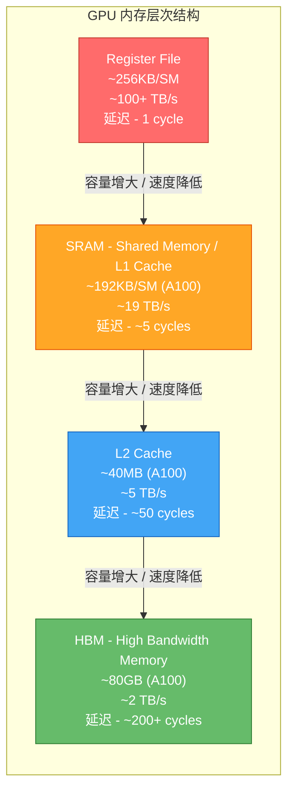
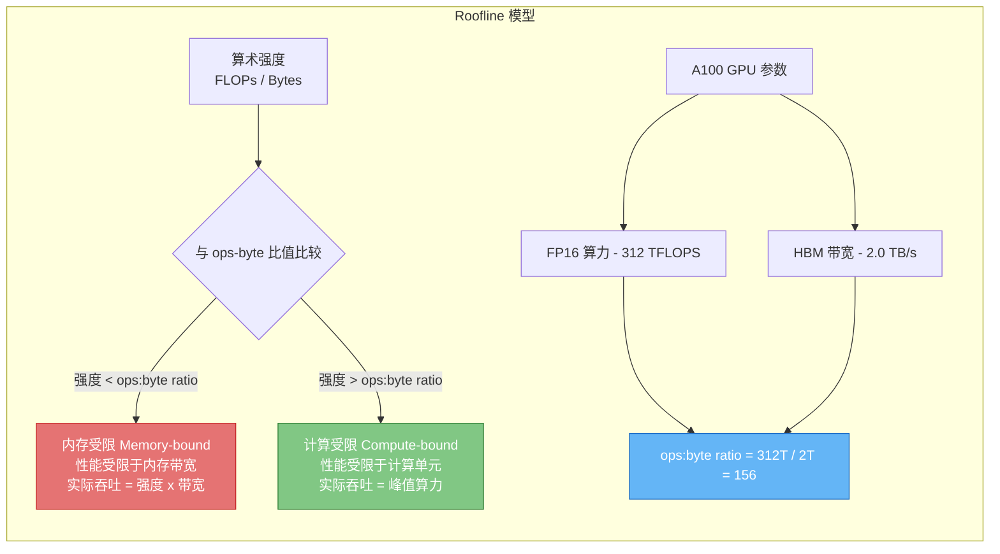
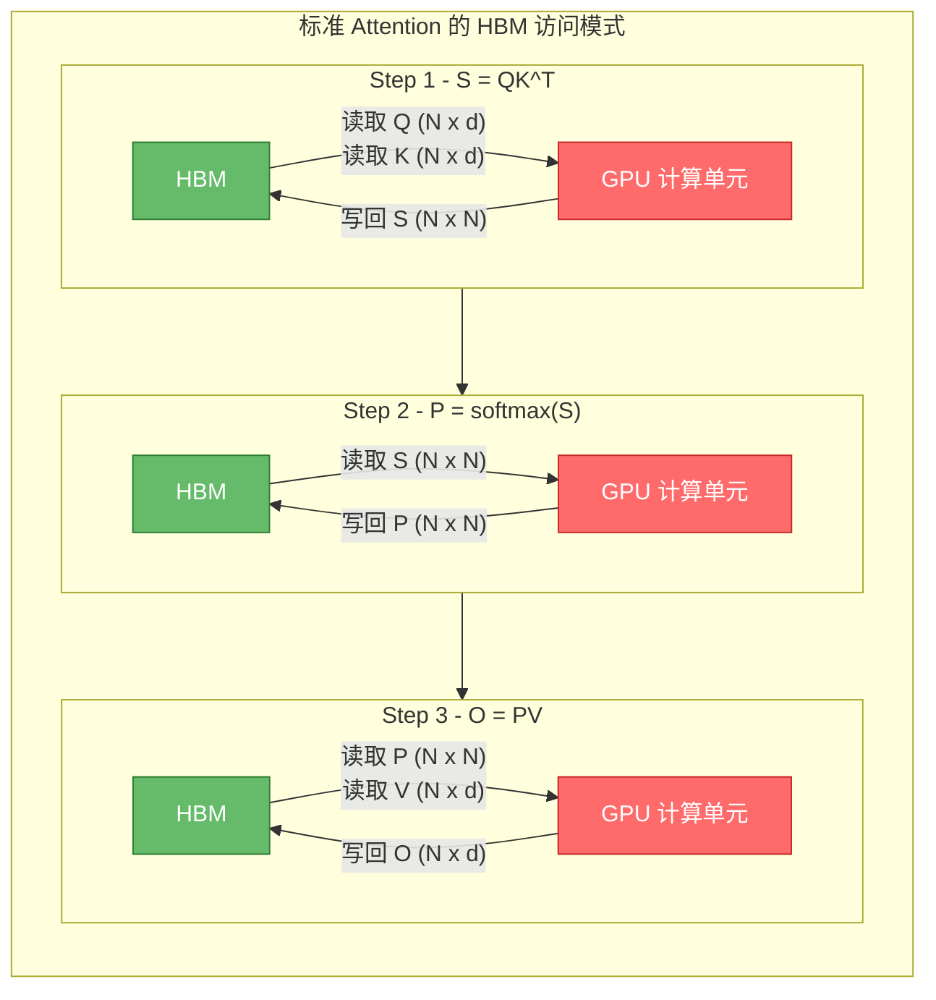
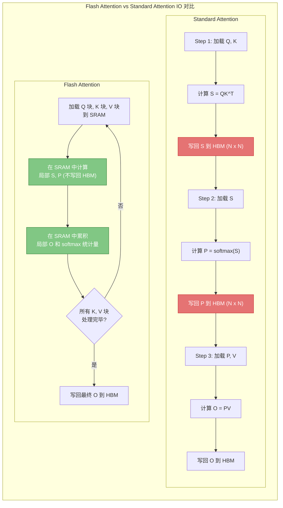

> Flash Attention 的核心洞察并非算法层面的创新，而是对 GPU 内存层次结构的深刻理解和针对性优化。本文将从硬件架构出发，系统分析标准 Attention 的 IO 瓶颈，并阐明 Flash Attention 如何通过 IO 感知的算法设计实现数量级的性能提升。

---

## 1. GPU 内存层次结构

现代 GPU 的内存系统是一个多级层次结构，不同层级在容量、带宽和延迟之间存在显著的权衡关系。理解这一层次结构是优化 GPU 程序的基础。

### 1.1 四级内存层次

#### Register File - 寄存器文件

- **容量**: 每个 SM (Streaming Multiprocessor) 约 256KB
- **带宽**: 理论上超过 100 TB/s（片上访问，无需经过互连）
- **延迟**: 1 个时钟周期
- **特点**: 每个线程拥有私有寄存器，是最快的存储资源。编译器负责寄存器分配，当寄存器用量超出限制时会发生 register spilling，数据被溢出到 local memory（实际位于 HBM），性能急剧下降

#### SRAM - 共享内存 / L1 Cache

- **容量**: A100 每个 SM 约 192KB（可配置 shared memory 与 L1 的比例）
- **带宽**: 约 19 TB/s（全芯片聚合带宽）
- **延迟**: 约 5 个时钟周期
- **特点**: 同一线程块 (thread block) 内的所有线程共享访问。程序员可以显式管理，是 CUDA 优化的核心资源。Flash Attention 的 tiling 策略正是围绕 SRAM 的大小来设计分块尺寸

#### L2 Cache

- **容量**: A100 约 40MB，H100 约 50MB
- **带宽**: 约 5 TB/s
- **延迟**: 约 50 个时钟周期
- **特点**: 全芯片共享，由硬件自动管理。对程序员透明，但可以通过访存模式间接影响其命中率

#### HBM - 高带宽内存

- **容量**: A100 约 80GB（HBM2e），H100 约 80GB（HBM3）
- **带宽**: A100 约 2.0 TB/s，H100 约 3.35 TB/s
- **延迟**: 200+ 个时钟周期
- **特点**: GPU 的主存，容量最大但相对最慢。所有模型参数、输入数据、中间结果默认存储在 HBM 中

### 1.2 关键洞察 - 速度差距

SRAM 与 HBM 之间存在巨大的性能鸿沟：

| 指标 | SRAM | HBM | 差距 |
|------|------|-----|------|
| 带宽 | ~19 TB/s | ~2 TB/s | **~10x** |
| 延迟 | ~5 cycles | ~200+ cycles | **~40x** |
| 容量 | ~192KB/SM | ~80GB | **~400,000x** |

> **核心矛盾**: SRAM 比 HBM 快 10-100 倍，但容量小了约 40 万倍。Flash Attention 的设计哲学就是最大化利用 SRAM 的速度优势，同时通过精巧的分块策略克服容量限制。

---

## 2. 计算强度与 Roofline 模型

### 2.1 算术强度

算术强度 (Arithmetic Intensity) 是衡量一个操作是计算密集型还是内存密集型的关键指标：

$$
\text{Arithmetic Intensity} = \frac{\text{FLOPs (浮点运算数)}}{\text{Bytes Transferred (内存传输字节数)}}
$$

单位为 FLOPs/Byte。这个比值决定了操作的性能瓶颈在哪里。

### 2.2 Roofline 模型

Roofline 模型是分析 GPU 程序性能上界的经典方法。其核心思想是：每个操作的实际吞吐量受限于两个上界中较低的那个。

对于 NVIDIA A100 GPU：

- **FP16 峰值算力**: 312 TFLOPS
- **HBM 带宽**: 2.0 TB/s
- **ops:byte ratio**: $\frac{312 \times 10^{12}}{2 \times 10^{12}} \approx 156$ FLOPs/Byte

这意味着：
- 当一个操作的算术强度 **< 156** 时，该操作是 **内存受限** (memory-bound) 的
- 当一个操作的算术强度 **> 156** 时，该操作是 **计算受限** (compute-bound) 的

### 2.3 标准 Attention 各操作的算术强度分析

设序列长度为 $N$，注意力头维度为 $d$（通常 $d = 64$ 或 $128$）。

#### 操作 1 - $S = QK^T$ (矩阵乘法)

- **FLOPs**: $O(N^2 \cdot d)$ — 对于 $N \times d$ 和 $d \times N$ 矩阵相乘
- **内存访问**: 读取 $Q$（$N \times d$）和 $K$（$N \times d$），写出 $S$（$N \times N$），共 $O(N \cdot d + N^2)$ 元素
- **算术强度**: $\frac{N^2 \cdot d}{N \cdot d + N^2} \approx d$（当 $N \gg d$ 时）

以 $d = 128$ 为例，算术强度约为 128，**小于** A100 的 ops:byte ratio (156)。即便是矩阵乘法，在 Attention 场景下也接近内存受限！

#### 操作 2 - $P = \text{softmax}(S)$ (逐元素操作)

- **FLOPs**: $O(N^2)$ — 指数运算 + 归一化
- **内存访问**: 读取 $S$（$N \times N$），写出 $P$（$N \times N$），共 $O(N^2)$ 元素
- **算术强度**: $\frac{N^2}{N^2} = 1$

算术强度仅为 **1**，远低于 156 的阈值。Softmax 是极度内存受限的操作！

#### 操作 3 - $O = PV$ (矩阵乘法)

- **FLOPs**: $O(N^2 \cdot d)$
- **内存访问**: 读取 $P$（$N \times N$）和 $V$（$N \times d$），写出 $O$（$N \times d$），共 $O(N^2 + N \cdot d)$ 元素
- **算术强度**: $\frac{N^2 \cdot d}{N^2 + N \cdot d} \approx d$（当 $N \gg d$ 时）

#### 强度汇总

| 操作 | FLOPs | 内存访问 | 算术强度 | 瓶颈类型 |
|------|-------|---------|---------|---------|
| $S = QK^T$ | $O(N^2 d)$ | $O(Nd + N^2)$ | $\approx d$ (~128) | 接近内存受限 |
| $P = \text{softmax}(S)$ | $O(N^2)$ | $O(N^2)$ | $\approx 1$ | **极度内存受限** |
| $O = PV$ | $O(N^2 d)$ | $O(N^2 + Nd)$ | $\approx d$ (~128) | 接近内存受限 |

> 关键发现: 标准 Attention 的所有操作都位于 Roofline 模型的内存受限区域。即使 GPU 拥有强大的 312 TFLOPS 计算能力，大部分时间都浪费在等待 HBM 数据传输上。

---

## 3. 标准 Attention 的 IO 瓶颈分析

### 3.1 逐步内存访问分析

标准 Attention 的计算按照三个独立的 kernel 依次执行，每个 kernel 都需要从 HBM 读取输入并将结果写回 HBM。

### 3.2 详细 IO 统计

以 FP16（每个元素 2 字节）为例，详细统计每一步的 HBM 访问量：

**Step 1: $S = QK^T$**

| 方向 | 数据 | 元素数 | 字节数 |
|------|------|--------|--------|
| 读取 | $Q$ | $N \times d$ | $2Nd$ |
| 读取 | $K$ | $N \times d$ | $2Nd$ |
| 写回 | $S$ | $N \times N$ | $2N^2$ |
| **合计** | | | $4Nd + 2N^2$ |

**Step 2: $P = \text{softmax}(S)$**

| 方向 | 数据 | 元素数 | 字节数 |
|------|------|--------|--------|
| 读取 | $S$ | $N \times N$ | $2N^2$ |
| 写回 | $P$ | $N \times N$ | $2N^2$ |
| **合计** | | | $4N^2$ |

**Step 3: $O = PV$**

| 方向 | 数据 | 元素数 | 字节数 |
|------|------|--------|--------|
| 读取 | $P$ | $N \times N$ | $2N^2$ |
| 读取 | $V$ | $N \times d$ | $2Nd$ |
| 写回 | $O$ | $N \times d$ | $2Nd$ |
| **合计** | | | $4N^2 + 4Nd$ |

**总 HBM 访问量**:

$$
\text{Total IO} = (4Nd + 2N^2) + 4N^2 + (4N^2 + 4Nd) = 8Nd + 10N^2 \text{ bytes}
$$

当 $N \gg d$ 时，$N^2$ 项占主导地位：

$$
\text{Total IO} \approx 10N^2 \text{ bytes}
$$

### 3.3 数值实例

以 $N = 4096$，$d = 128$（典型的 GPT 级别参数）为例：

| 项目 | 大小 |
|------|------|
| $Q, K, V$ 各自大小 | $4096 \times 128 \times 2 = 1$ MB |
| $S$ 矩阵大小 | $4096 \times 4096 \times 2 = 32$ MB |
| $P$ 矩阵大小 | $4096 \times 4096 \times 2 = 32$ MB |
| 输出 $O$ 大小 | $4096 \times 128 \times 2 = 1$ MB |
| **总 HBM 传输量** | **~160 MB** (per head) |
| A100 HBM 带宽下的传输时间 | $\frac{160 \text{ MB}}{2 \text{ TB/s}} \approx 0.08$ ms |
| 实际计算 FLOPs | $\approx 2 \times 4096^2 \times 128 \times 2 \approx 8.6$ GFLOPs |
| A100 计算时间 | $\frac{8.6 \text{ GFLOPs}}{312 \text{ TFLOPS}} \approx 0.028$ ms |

> 即使在理想条件下，内存传输时间（0.08 ms）也是计算时间（0.028 ms）的约 3 倍。实际情况中，由于 kernel launch overhead、内存对齐、bank conflict 等因素，差距更大。

### 3.4 中间矩阵 - 问题的根源

标准 Attention 的核心问题在于 $N \times N$ 的中间矩阵 $S$ 和 $P$：

1. **内存占用**: 当 $N = 8192$ 时，单个注意力头的 $S$ 矩阵就需要 $8192^2 \times 2 = 128$ MB。多头注意力下（如 32 个头），仅中间矩阵就需要 4 GB
2. **HBM 往返**: $S$ 和 $P$ 各自需要一次写入和一次读取，贡献了总 IO 的大部分
3. **二次增长**: 随着序列长度增长，IO 量以 $O(N^2)$ 的速度增加，而有效计算（最终输出 $O$）仅需 $O(Nd)$ 的存储

---

## 4. Flash Attention 的 IO 优化思路

### 4.1 核心思想

Flash Attention 的核心思想可以用一句话概括：

> **永远不要在 HBM 中物化完整的 $N \times N$ 注意力矩阵。**

取而代之的是，将计算分块 (tiling) 到 SRAM 中完成，每个分块的大小恰好能放入 SRAM，通过在线算法 (online algorithm) 逐块累积最终结果。

### 4.2 分块策略

将 $Q$、$K$、$V$ 沿序列维度分块：

- $Q$ 分成 $T_r = \lceil N / B_r \rceil$ 个块，每块大小 $B_r \times d$
- $K, V$ 分成 $T_c = \lceil N / B_c \rceil$ 个块，每块大小 $B_c \times d$

其中 $B_r$ 和 $B_c$ 的选择满足：

$$
B_r \times d + B_c \times d + B_r \times B_c \leq M
$$

$M$ 为 SRAM 大小（如 A100 上约 192KB / 2 bytes = 96K 元素）。

### 4.3 IO 复杂度对比

**Standard Attention HBM 访问量**:

$$
\Theta(Nd + N^2) \text{ 字节}
$$

**Flash Attention HBM 访问量**:

$$
\Theta\left(\frac{N^2 d^2}{M}\right) \text{ 字节}
$$

其中 $M$ 为 SRAM 大小。推导过程如下：

- 外层循环遍历 $K, V$ 的 $T_c = N / B_c$ 个块
- 内层循环遍历 $Q$ 的 $T_r = N / B_r$ 个块
- 每次内层迭代加载: $B_r \times d + B_c \times d$ 元素
- 总加载量: $T_c \times T_r \times (B_r + B_c) \times d = \frac{N}{B_c} \times \frac{N}{B_r} \times (B_r + B_c) \times d$
- 化简（取 $B_r \approx B_c \approx \sqrt{M/d}$ 时最优）: $\Theta\left(\frac{N^2 d^2}{M}\right)$

### 4.4 渐近改进

当 SRAM 大小 $M = \Omega(Nd)$（即 SRAM 能容纳一整行 Q 和一整行 K/V）时：

$$
\frac{N^2 d^2}{M} = \frac{N^2 d^2}{Nd} = Nd
$$

此时 Flash Attention 的 HBM 访问量为 $O(Nd)$，相比标准 Attention 的 $O(N^2)$：

$$
\text{IO 加速比} = \frac{N^2}{Nd} = \frac{N}{d}
$$

以 $N = 4096$，$d = 128$ 为例：

$$
\text{IO 加速比} = \frac{4096}{128} = 32\times
$$

这意味着 Flash Attention 将 HBM 访问量减少了约 **32 倍**！

### 4.5 数值对比

| 指标 | Standard Attention | Flash Attention | 改进 |
|------|-------------------|-----------------|------|
| HBM 访问量 ($N=4096, d=128$) | ~160 MB | ~5 MB | **32x** |
| IO 复杂度 | $O(N^2)$ | $O(Nd)$ | $N/d$ 倍 |
| 额外 HBM 存储 | $O(N^2)$ (S, P 矩阵) | $O(N)$ (softmax 统计量) | $N$ 倍 |
| Kernel 数量 | 3 个独立 kernel | 1 个融合 kernel | 消除 launch overhead |

### 4.6 为什么 IO 减少不影响计算正确性

Flash Attention 的数学输出与标准 Attention **完全一致**（bit-exact，排除浮点重结合误差）。它减少的仅仅是不必要的 HBM 往返：

1. 中间矩阵 $S$ 和 $P$ 从未完整写入 HBM，而是在 SRAM 中即时计算、即时使用
2. 通过在线 softmax 算法（详见下一篇），每个分块的局部 softmax 统计量可以正确地合并为全局结果
3. 最终输出 $O$ 与标准算法完全相同

---

## 5. A100 vs H100 内存参数对比

不同代际 GPU 的内存层次结构差异直接影响 Flash Attention 的实现策略和性能表现。

### 5.1 硬件参数对比

| 参数 | A100 (SM80) | H100 (SM90) | 变化 |
|------|-------------|-------------|------|
| HBM 容量 | 80 GB (HBM2e) | 80 GB (HBM3) | - |
| HBM 带宽 | 2.0 TB/s | 3.35 TB/s | +67.5% |
| L2 Cache | 40 MB | 50 MB | +25% |
| Shared Memory / SM | 192 KB | 228 KB | +18.75% |
| Register File / SM | 256 KB | 256 KB | - |
| SM 数量 | 108 | 132 | +22.2% |
| FP16 Tensor Core 算力 | 312 TFLOPS | 990 TFLOPS | +217% |
| ops:byte ratio | ~156 | ~296 | +90% |
| TMA (Tensor Memory Accelerator) | 不支持 | 支持 | 新增 |

### 5.2 对 Flash Attention 的影响

**HBM 带宽提升 (2.0 -> 3.35 TB/s)**:
- 标准 Attention 在 H100 上因为带宽增加而变快，但 IO 瓶颈的本质不变
- Flash Attention 的 IO 优化在 H100 上依然关键，因为 ops:byte ratio 从 156 增长到 296，意味着更多操作变成了内存受限

**SRAM 增大 (192KB -> 228KB)**:
- Flash Attention 可以使用更大的分块尺寸 $B_r, B_c$
- 更大的分块意味着更少的 HBM 访问次数: $T_r \times T_c$ 减小
- 但分块尺寸增长有限 (约 18.75%)，实际 IO 改进不显著

**TMA (Tensor Memory Accelerator)**:
- H100 引入的专用硬件单元，用于高效的多维数据搬运
- 支持异步拷贝，计算与数据搬运可以完全重叠 (overlap)
- Flash Attention 3 (针对 H100 的版本) 充分利用 TMA 实现了更高效的数据流水线
- 无需手动计算地址偏移，由硬件处理复杂的地址映射

**算力大幅提升 (312 -> 990 TFLOPS)**:
- ops:byte ratio 几乎翻倍，意味着更多操作变得内存受限
- Flash Attention 的 IO 优化在 H100 上的收益反而更大
- 减少的每一字节 HBM 传输在 H100 上都更加珍贵

### 5.3 Roofline 对比

在 A100 上，$d=128$ 的矩阵乘法算术强度为 128，距离 ops:byte ratio (156) 不远，处于过渡区域。

在 H100 上，同样的操作算术强度仍为 128，但 ops:byte ratio 增至 296，该操作更加深入内存受限区域。这意味着：

$$
\text{H100 上的 IO 优化收益} > \text{A100 上的 IO 优化收益}
$$

> Flash Attention 的设计理念随着 GPU 代际演进而愈发重要 -- 算力增长速度远快于内存带宽增长速度，IO 感知的算法设计将成为高性能 GPU 编程的核心范式。

---

## 6. 总结

本文系统分析了 Flash Attention 背后的 IO 感知设计理念：

1. **GPU 内存层次结构** 中，SRAM 比 HBM 快 10-100 倍，但容量小 40 万倍
2. **Roofline 模型** 表明标准 Attention 的所有操作都是内存受限的，尤其 softmax 的算术强度仅为 1
3. **标准 Attention 的 IO 瓶颈** 源于 $N \times N$ 中间矩阵在 HBM 上的反复读写，总 IO 为 $O(N^2)$
4. **Flash Attention** 通过分块 + 融合 kernel 的策略将 IO 降至 $O(Nd)$，实现了 $N/d$ 倍的 IO 加速
5. **硬件演进** 使 IO 优化愈发重要，H100 的更高 ops:byte ratio 意味着更多操作受限于内存带宽

下一篇将深入讨论 Flash Attention 实现这一 IO 优化的关键算法组件 -- **在线 Softmax** (Online Softmax)，这是使分块 Attention 在数学上正确的核心技术。

---

## 参考文献

1. Dao, T. (2022). *FlashAttention: Fast and Memory-Efficient Exact Attention with IO-Awareness*. NeurIPS 2022.
2. Dao, T. (2023). *FlashAttention-2: Faster Attention with Better Parallelism and Work Partitioning*.
3. Williams, S., Waterman, A., & Patterson, D. (2009). *Roofline: An Insightful Visual Performance Model for Multicore Architectures*. Communications of the ACM.
4. NVIDIA. (2022). *NVIDIA A100 Tensor Core GPU Architecture Whitepaper*.
5. NVIDIA. (2023). *NVIDIA H100 Tensor Core GPU Architecture Whitepaper*.

---

## 导航

- 上一篇：[Standard Attention 数学推导](01-standard-attention.md)
- 下一篇：[Flash Attention 理论推导](03-flash-attention-theory.md)
- [返回目录](../README.md)
