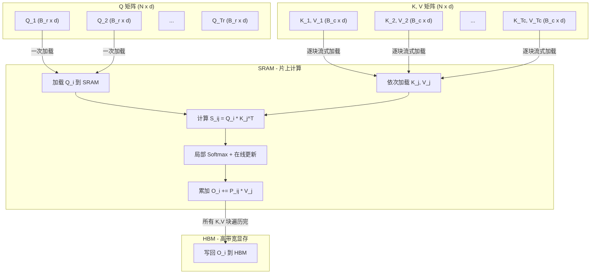
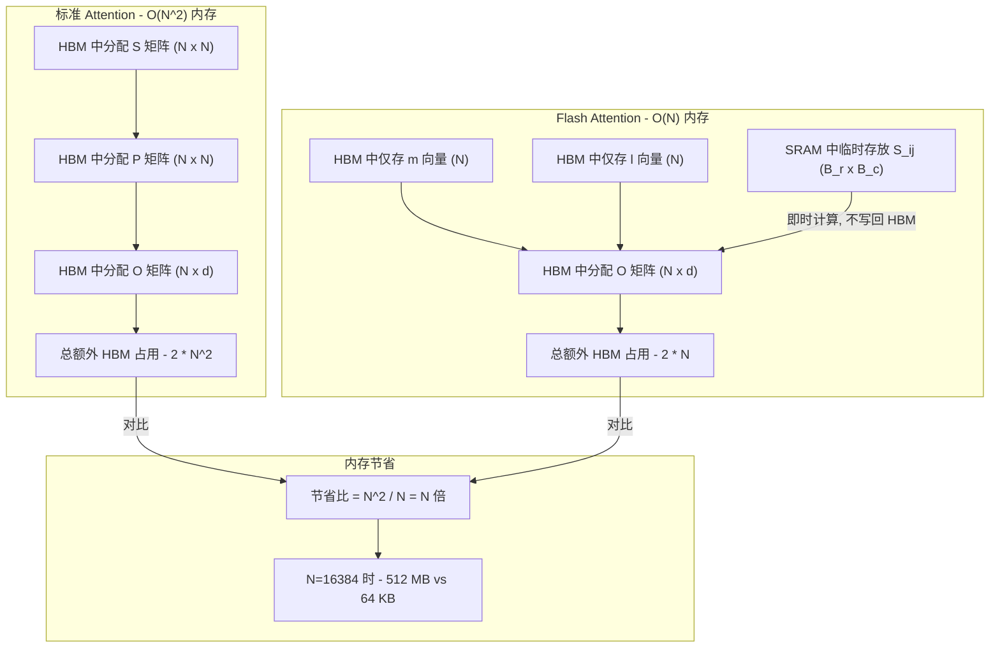
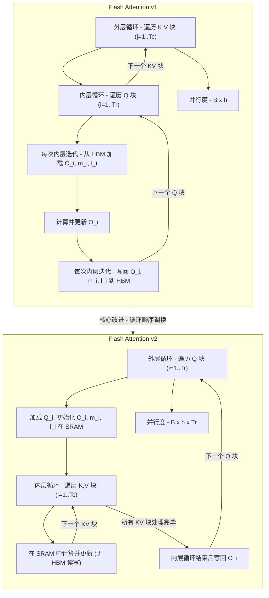

## 目录

- [1. 问题背景 - 为什么需要 Flash Attention](#1-问题背景---为什么需要-flash-attention)
- [2. 分块（Tiling）策略](#2-分块tiling策略)
- [3. Online Softmax 理论推导](#3-online-softmax-理论推导)
- [4. 完整算法伪代码](#4-完整算法伪代码)
- [5. 内存复杂度分析](#5-内存复杂度分析)
- [6. IO 复杂度分析](#6-io-复杂度分析)
- [7. Flash Attention v1 vs v2 的关键改进](#7-flash-attention-v1-vs-v2-的关键改进)

---

## 1. 问题背景 - 为什么需要 Flash Attention

标准 Self-Attention 的计算过程如下：

$$
\text{Attention}(Q, K, V) = \text{softmax}\left(\frac{QK^T}{\sqrt{d}}\right) V
$$

其中 $Q, K, V \in \mathbb{R}^{N \times d}$，$N$ 为序列长度，$d$ 为 head dimension。

标准实现的核心瓶颈在于：中间矩阵 $S = QK^T \in \mathbb{R}^{N \times N}$ 和注意力权重矩阵 $P = \text{softmax}(S) \in \mathbb{R}^{N \times N}$ 需要完整地在 HBM（高带宽显存）中实例化。当 $N$ 很大时（如 $N = 16384$），这两个矩阵各占据 $N^2$ 的存储空间，导致：

1. **内存占用过高**：$O(N^2)$ 的显存占用使得长序列训练受限
2. **HBM 访问成为瓶颈**：GPU 的计算能力（FLOPS）远超内存带宽，Attention 运算是 **memory-bound** 的
3. **无法利用快速 SRAM**：标准实现在 HBM 和 SRAM 之间产生大量数据搬运

Flash Attention 的核心思想是：**通过分块计算（Tiling）和在线 Softmax（Online Softmax）算法，避免实例化完整的 $N \times N$ 注意力矩阵，将所有中间计算保持在 GPU 的片上 SRAM 中，从而大幅减少 HBM 访问次数。**

---

## 2. 分块（Tiling）策略

### 2.1 基本思想

分块策略的核心是将大矩阵的计算拆分为小块，使每个小块能够完全驻留在 GPU 的 SRAM 中。具体做法如下：

- 将 $Q \in \mathbb{R}^{N \times d}$ 按行分为 $T_r = \lceil N / B_r \rceil$ 个块，每块 $Q_i \in \mathbb{R}^{B_r \times d}$
- 将 $K, V \in \mathbb{R}^{N \times d}$ 按行分为 $T_c = \lceil N / B_c \rceil$ 个块，每块 $K_j \in \mathbb{R}^{B_c \times d}$，$V_j \in \mathbb{R}^{B_c \times d}$
- 其中 $B_r$ 和 $B_c$ 为块大小，需要满足 SRAM 容量限制

### 2.2 分块计算过程

对于第 $i$ 个 Q 块，我们依次遍历所有 K、V 块，计算局部注意力分数：

$$
S_{ij} = Q_i \cdot K_j^T \in \mathbb{R}^{B_r \times B_c}
$$

**关键观察**：$S_{ij}$ 的尺寸仅为 $B_r \times B_c$，远小于完整的 $N \times N$ 矩阵。只要块大小选取合理，$S_{ij}$ 可以完全放入 SRAM 中进行计算，而无需写回 HBM。

### 2.3 块大小的选取

设 SRAM 大小为 $M$，我们需要同时在 SRAM 中容纳：

| 数据 | 尺寸 | 存储量 |
|------|------|--------|
| $Q_i$ 块 | $B_r \times d$ | $B_r \cdot d$ |
| $K_j$ 块 | $B_c \times d$ | $B_c \cdot d$ |
| $V_j$ 块 | $B_c \times d$ | $B_c \cdot d$ |
| $S_{ij}$ 块 | $B_r \times B_c$ | $B_r \cdot B_c$ |
| $O_i$ 累加器 | $B_r \times d$ | $B_r \cdot d$ |

因此需要满足：

$$
2 B_r d + 2 B_c d + B_r B_c \leq M
$$

通常取 $B_c = \lceil M / (4d) \rceil$，$B_r = \min\left(\lceil M / (4d) \rceil, d\right)$，以确保所有数据能驻留 SRAM。

### 2.4 分块计算示意图



上图展示了分块计算的核心流程：Q 块加载一次后固定在 SRAM 中，然后逐块流式加载 K、V 块，在 SRAM 中完成局部注意力分数的计算和累加，最终只将结果 $O_i$ 写回 HBM。

---

## 3. Online Softmax 理论推导

分块策略面临的核心挑战是：**Softmax 需要知道整行所有元素的最大值和归一化因子，但我们只能逐块处理数据。** Online Softmax 算法通过增量更新解决了这个问题。

### 3.1 标准安全 Softmax

对于向量 $\mathbf{x} = (x_1, x_2, \ldots, x_N)$，标准的数值稳定 Softmax 为：

$$
m = \max(x_1, x_2, \ldots, x_N)
$$

$$
l = \sum_{i=1}^{N} \exp(x_i - m)
$$

$$
\text{softmax}(x_i) = \frac{\exp(x_i - m)}{l}
$$

减去最大值 $m$ 是为了防止指数运算溢出。但该计算需要**三次遍历**数据：一次求 $m$，一次求 $l$，一次求最终结果。

### 3.2 两块情形的推导

考虑将 $\mathbf{x}$ 分为两个块 $\mathbf{x}^{(1)} = (x_1, \ldots, x_B)$ 和 $\mathbf{x}^{(2)} = (x_{B+1}, \ldots, x_{2B})$。

**第一块的局部统计量：**

$$
m_1 = \max(x_1, \ldots, x_B), \quad l_1 = \sum_{i=1}^{B} \exp(x_i - m_1)
$$

$$
O_1 = \text{diag}\left(\frac{1}{l_1}\right) \sum_{i=1}^{B} \exp(x_i - m_1) \cdot v_i
$$

**第二块的局部统计量：**

$$
m_2 = \max(x_{B+1}, \ldots, x_{2B}), \quad l_2 = \sum_{i=B+1}^{2B} \exp(x_i - m_2)
$$

$$
O_2 = \text{diag}\left(\frac{1}{l_2}\right) \sum_{i=B+1}^{2B} \exp(x_i - m_2) \cdot v_i
$$

**合并两块：**

全局最大值为：

$$
m = \max(m_1, m_2)
$$

全局归一化因子需要将两块的局部归一化因子"对齐"到同一个最大值：

$$
l = \exp(m_1 - m) \cdot l_1 + \exp(m_2 - m) \cdot l_2
$$

**推导过程**：第一块中 $\exp(x_i - m_1)$ 需要转换为 $\exp(x_i - m)$，利用恒等式：

$$
\exp(x_i - m) = \exp(x_i - m_1) \cdot \exp(m_1 - m)
$$

因此：

$$
\sum_{i=1}^{B} \exp(x_i - m) = \exp(m_1 - m) \cdot \sum_{i=1}^{B} \exp(x_i - m_1) = \exp(m_1 - m) \cdot l_1
$$

全局输出同样需要重新校正：

$$
O = \frac{\exp(m_1 - m) \cdot l_1 \cdot O_1 + \exp(m_2 - m) \cdot l_2 \cdot O_2}{l}
$$

展开后即为：

$$
O = \frac{\exp(m_1 - m)}{l} \cdot l_1 \cdot O_1 + \frac{\exp(m_2 - m)}{l} \cdot l_2 \cdot O_2
$$

### 3.3 一般递推公式（核心）

将上述推导推广到 $T_c$ 个块的情形。设处理到第 $j$ 个 K/V 块后的状态为 $(m^{(j)}, l^{(j)}, O^{(j)})$，则递推关系为：

**Step 1 - 更新全局最大值：**

$$
m^{(j)} = \max\left(m^{(j-1)},\; \text{rowmax}(S_{ij})\right)
$$

其中 $S_{ij} = Q_i K_j^T / \sqrt{d}$，$\text{rowmax}$ 表示按行取最大值。

**Step 2 - 更新归一化因子：**

$$
l^{(j)} = \exp\left(m^{(j-1)} - m^{(j)}\right) \cdot l^{(j-1)} + \sum_k \exp\left(S_{ij}[k] - m^{(j)}\right)
$$

这里第一项将旧的归一化因子从旧最大值 $m^{(j-1)}$ 校正到新最大值 $m^{(j)}$，第二项加上当前块在新最大值下的贡献。

**Step 3 - 更新输出累加器：**

$$
O^{(j)} = \text{diag}\left(\exp\left(m^{(j-1)} - m^{(j)}\right)\right) \cdot O^{(j-1)} + \exp\left(S_{ij} - m^{(j)}\right) \cdot V_j
$$

这里 $O^{(j)}$ 存储的是**未归一化**的加权和。第一项将旧累加器的每一行乘以校正因子 $\exp(m^{(j-1)} - m^{(j)})$；第二项是当前块的贡献。

**最终输出：**

所有 $T_c$ 个块处理完毕后：

$$
O_i = \text{diag}\left(\frac{1}{l^{(T_c)}}\right) \cdot O^{(T_c)}
$$

### 3.4 正确性证明（简要）

我们通过归纳法证明，处理完前 $j$ 个块后，$O^{(j)}$ 满足：

$$
O^{(j)} = \sum_{t=1}^{j} \exp\left(S_{it} - m^{(j)}\right) \cdot V_t
$$

$$
l^{(j)} = \sum_{t=1}^{j} \text{rowsum}\left(\exp\left(S_{it} - m^{(j)}\right)\right)
$$

**基础情形** ($j = 1$)：

$$
m^{(1)} = \text{rowmax}(S_{i1}), \quad l^{(1)} = \text{rowsum}(\exp(S_{i1} - m^{(1)}))
$$

$$
O^{(1)} = \exp(S_{i1} - m^{(1)}) \cdot V_1
$$

显然成立。

**归纳步骤** ($j-1 \to j$)：

假设 $O^{(j-1)} = \sum_{t=1}^{j-1} \exp(S_{it} - m^{(j-1)}) \cdot V_t$，则：

$$
\text{diag}(\exp(m^{(j-1)} - m^{(j)})) \cdot O^{(j-1)} = \sum_{t=1}^{j-1} \exp(S_{it} - m^{(j)}) \cdot V_t
$$

加上当前块的贡献 $\exp(S_{ij} - m^{(j)}) \cdot V_j$ 后：

$$
O^{(j)} = \sum_{t=1}^{j} \exp(S_{it} - m^{(j)}) \cdot V_t
$$

归纳完成。最终 $O_i = O^{(T_c)} / l^{(T_c)}$ 即为标准 Attention 的精确结果。

### 3.5 Online Softmax 增量更新流程图

```mermaid
graph LR
    subgraph init["初始化"]
        S0["m = -inf, l = 0, O = 0"]
    end

    subgraph block1["处理 K_1, V_1"]
        C1_1["S_i1 = Q_i * K_1^T / sqrt(d)"]
        C1_2["m_new = max(m, rowmax(S_i1))"]
        C1_3["l = exp(m - m_new) * l + rowsum(exp(S_i1 - m_new))"]
        C1_4["O = exp(m - m_new) * O + exp(S_i1 - m_new) * V_1"]
        C1_5["m = m_new"]
        C1_1 --> C1_2 --> C1_3 --> C1_4 --> C1_5
    end

    subgraph block2["处理 K_2, V_2"]
        C2_1["S_i2 = Q_i * K_2^T / sqrt(d)"]
        C2_2["m_new = max(m, rowmax(S_i2))"]
        C2_3["l = exp(m - m_new) * l + rowsum(exp(S_i2 - m_new))"]
        C2_4["O = exp(m - m_new) * O + exp(S_i2 - m_new) * V_2"]
        C2_5["m = m_new"]
        C2_1 --> C2_2 --> C2_3 --> C2_4 --> C2_5
    end

    subgraph blockJ["处理 K_j, V_j (一般情形)"]
        CJ_1["S_ij = Q_i * K_j^T / sqrt(d)"]
        CJ_2["m_new = max(m, rowmax(S_ij))"]
        CJ_3["l = exp(m - m_new) * l + rowsum(exp(S_ij - m_new))"]
        CJ_4["O = exp(m - m_new) * O + exp(S_ij - m_new) * V_j"]
        CJ_5["m = m_new"]
        CJ_1 --> CJ_2 --> CJ_3 --> CJ_4 --> CJ_5
    end

    subgraph final["最终归一化"]
        F1["O_i = O / l"]
    end

    S0 -->|"状态传递"| C1_1
    C1_5 -->|"状态传递"| C2_1
    C2_5 -->|"..."| CJ_1
    CJ_5 -->|"所有块处理完毕"| F1
```



上图展示了 Online Softmax 的核心流程：状态 $(m, l, O)$ 在处理每个 K/V 块时进行增量更新，每次更新都通过指数校正因子 $\exp(m_{\text{old}} - m_{\text{new}})$ 将历史累积量对齐到最新的最大值，最终一次性归一化得到精确结果。

---

## 4. 完整算法伪代码

### 4.1 Flash Attention Forward Pass

```
算法: Flash Attention 前向传播
━━━━━━━━━━━━━━━━━━━━━━━━━━━━━━━━━━━━━━━━━━━━━━

输入: Q, K, V ∈ R^{N×d}
      块大小 B_r, B_c（由 SRAM 大小 M 决定）
输出: O ∈ R^{N×d}

1.  将 Q 分为 T_r = ⌈N/B_r⌉ 个块: Q_1, Q_2, ..., Q_{T_r}
    将 K 分为 T_c = ⌈N/B_c⌉ 个块: K_1, K_2, ..., K_{T_c}
    将 V 分为 T_c = ⌈N/B_c⌉ 个块: V_1, V_2, ..., V_{T_c}

2.  FOR i = 1 TO T_r:                         // 外层循环: 遍历 Q 块
        (a) 从 HBM 加载 Q_i ∈ R^{B_r × d} 到 SRAM
        (b) 在 SRAM 中初始化:
            O_i ← 0 ∈ R^{B_r × d}            // 输出累加器
            m_i ← (-∞) ∈ R^{B_r}             // 行最大值向量
            l_i ← 0 ∈ R^{B_r}                // 行归一化因子

        (c) FOR j = 1 TO T_c:                 // 内层循环: 遍历 K,V 块
                (i)   从 HBM 加载 K_j, V_j ∈ R^{B_c × d} 到 SRAM

                (ii)  在 SRAM 中计算注意力分数:
                      S_ij ← Q_i · K_j^T / √d    ∈ R^{B_r × B_c}

                (iii) 计算当前块的行最大值:
                      m_ij ← rowmax(S_ij)          ∈ R^{B_r}

                (iv)  计算当前块的局部 softmax（未归一化）:
                      P_ij ← exp(S_ij - m_ij)      ∈ R^{B_r × B_c}

                (v)   计算当前块的行和:
                      l_ij ← rowsum(P_ij)           ∈ R^{B_r}

                (vi)  更新全局最大值:
                      m_new ← max(m_i, m_ij)        ∈ R^{B_r}

                (vii) 更新全局归一化因子:
                      l_new ← exp(m_i - m_new) · l_i + exp(m_ij - m_new) · l_ij

                (viii)更新输出累加器（含历史校正）:
                      O_i ← diag(l_i / l_new) · exp(m_i - m_new) · O_i
                            + diag(1 / l_new) · exp(m_ij - m_new) · P_ij · V_j

                (ix)  更新状态:
                      m_i ← m_new
                      l_i ← l_new

        (d) 将 O_i 从 SRAM 写回 HBM

3.  RETURN O = [O_1; O_2; ...; O_{T_r}]
```

> **注意**：上述伪代码中第 (viii) 步将归一化融入了累加过程。等价的写法是保持 $O_i$ 为未归一化的累积量，最后再做一次归一化（Flash Attention v2 采用此策略以减少非矩阵乘法运算）。

### 4.2 关于 Dropout 和 Mask 的处理

在实际实现中，Flash Attention 还需要处理：

- **Causal Mask**：在计算 $S_{ij}$ 后，将未来位置（$j > i$）设为 $-\infty$
- **Dropout**：在 $P_{ij}$ 上应用 Dropout mask，需要在 SRAM 中即时生成随机数（使用 Philox PRNG）
- **Softmax Scaling**：$S_{ij}$ 除以 $\sqrt{d}$ 在计算 $Q_i K_j^T$ 后立即执行

---

## 5. 内存复杂度分析

### 5.1 标准 Attention 的内存占用

标准 Attention 需要在 HBM 中存储以下中间矩阵：

| 矩阵 | 尺寸 | 用途 |
|-------|------|------|
| $S = QK^T / \sqrt{d}$ | $N \times N$ | 注意力分数 |
| $P = \text{softmax}(S)$ | $N \times N$ | 注意力权重 |
| $O = PV$ | $N \times d$ | 输出 |

**总额外内存**：$O(N^2)$（主要是 $S$ 和 $P$ 矩阵）

对于多头注意力，总占用为 $O(B \cdot h \cdot N^2)$，其中 $B$ 是 batch size，$h$ 是 head 数量。

### 5.2 Flash Attention 的内存占用

Flash Attention 只需要在 HBM 中额外存储：

| 数据 | 尺寸 | 用途 |
|------|------|------|
| $m$ 向量 | $N$ | 每行的最大值 |
| $l$ 向量 | $N$ | 每行的归一化因子 |
| $O$ 矩阵 | $N \times d$ | 输出 |

**总额外内存**：$O(N)$

中间计算过程中，SRAM 中的临时数据（$S_{ij}, P_{ij}$ 等）不计入 HBM 占用，因为它们始终驻留在 SRAM 中且被即时覆盖。

### 5.3 内存节省的量化分析

$$
\text{内存节省比} = \frac{O(N^2)}{O(N)} = O(N)
$$

这意味着对于序列长度 $N = 16384$，Flash Attention 的额外内存占用相比标准 Attention 减少约 **16384 倍**。具体数值：

| 序列长度 $N$ | 标准 Attention 额外内存 (fp16) | Flash Attention 额外内存 (fp16) |
|-------------|-------------------------------|--------------------------------|
| 1024 | 2 MB | 4 KB |
| 4096 | 32 MB | 16 KB |
| 16384 | 512 MB | 64 KB |
| 65536 | 8 GB | 256 KB |

> 上表仅计算单个 head 的额外内存开销（不含 Q, K, V, O 本身）。

### 5.4 内存使用对比图



---

## 6. IO 复杂度分析

IO 复杂度是 Flash Attention 的理论核心之一。在 memory-bound 的运算中，算法的实际运行速度主要取决于 HBM 访问次数，而非 FLOPs。

### 6.1 标准 Attention 的 IO 复杂度

标准 Attention 的 HBM 访问模式如下：

| 步骤 | 操作 | HBM 读取 | HBM 写入 |
|------|------|---------|---------|
| 1 | $S = QK^T$ | $O(Nd)$ 读 Q, K | $O(N^2)$ 写 S |
| 2 | $P = \text{softmax}(S)$ | $O(N^2)$ 读 S | $O(N^2)$ 写 P |
| 3 | $O = PV$ | $O(N^2) + O(Nd)$ 读 P, V | $O(Nd)$ 写 O |

**总 HBM 访问量**：$\Theta(Nd + N^2)$

当 $N \gg d$ 时（通常 $N = 1024 \sim 65536$，$d = 64 \sim 128$），主导项为 $\Theta(N^2)$。

### 6.2 Flash Attention 的 IO 复杂度

**定理**：设 SRAM 大小为 $M$，且 $M \geq 2d$ 和 $d \leq M$，则 Flash Attention 的 HBM 访问次数为：

$$
\Theta\left(\frac{N^2 d^2}{M}\right)
$$

**证明**：

外层循环遍历 $T_r = \lceil N / B_r \rceil$ 个 Q 块。对于每个 Q 块 $Q_i$：

1. **读取 $Q_i$**：$B_r \cdot d$ 次 HBM 读取
2. **内层循环**：遍历 $T_c = \lceil N / B_c \rceil$ 个 K/V 块
   - 每次读取 $K_j$：$B_c \cdot d$ 次 HBM 读取
   - 每次读取 $V_j$：$B_c \cdot d$ 次 HBM 读取
   - 内层循环总读取：$T_c \cdot 2 B_c d = N / B_c \cdot 2 B_c d = 2Nd$
3. **写回 $O_i$**：$B_r \cdot d$ 次 HBM 写入

每个 Q 块的总 HBM 访问：$B_r d + 2Nd + B_r d = 2B_r d + 2Nd$

所有 Q 块的总 HBM 访问：

$$
T_r \cdot (2B_r d + 2Nd) = \frac{N}{B_r} \cdot (2B_r d + 2Nd) = 2Nd + \frac{2N^2 d}{B_r}
$$

取 $B_r = \Theta(M / d)$（在满足 SRAM 约束的前提下），代入得：

$$
\text{HBM accesses} = 2Nd + \frac{2N^2 d}{M/d} = 2Nd + \frac{2N^2 d^2}{M} = \Theta\left(\frac{N^2 d^2}{M}\right)
$$

（当 $N^2 d^2 / M$ 主导 $Nd$ 项时，即 $Nd / M > 1$，通常成立。）

### 6.3 最优性分析

当 SRAM 大小 $M = \Theta(Nd)$ 时（即 SRAM 能容纳一整行的 Q 或 K/V）：

$$
\text{HBM accesses} = \Theta\left(\frac{N^2 d^2}{Nd}\right) = \Theta(Nd)
$$

这与仅读写输入输出矩阵 Q, K, V, O 所需的 $\Theta(Nd)$ 次访问相同，即 **达到了 IO 复杂度的下界**。

### 6.4 加速比的直觉理解

Flash Attention 相对标准 Attention 的 HBM 访问减少倍数为：

$$
\text{加速比} = \frac{\Theta(Nd + N^2)}{\Theta(N^2 d^2 / M)} \approx \frac{N^2}{N^2 d^2 / M} = \frac{M}{d^2}
$$

对于 A100 GPU（$M = 192$ KB $\approx 10^5$ 元素，$d = 64$）：

$$
\text{加速比} \approx \frac{10^5}{64^2} \approx 24\text{x}
$$

实际测量中，Flash Attention 通常实现 2-4 倍的壁钟时间加速（因为还有计算和其他开销的影响）。

---

## 7. Flash Attention v1 vs v2 的关键改进

### 7.1 循环顺序的调换

这是 v1 到 v2 最核心的架构改变。

**Flash Attention v1**：
- 外层循环遍历 K, V 块（$j = 1, \ldots, T_c$）
- 内层循环遍历 Q 块（$i = 1, \ldots, T_r$）
- 问题：每个 Q 块的 $O_i, m_i, l_i$ 在每次外层迭代都需要从 HBM 读出再写回

**Flash Attention v2**：
- 外层循环遍历 Q 块（$i = 1, \ldots, T_r$）
- 内层循环遍历 K, V 块（$j = 1, \ldots, T_c$）
- 优势：$Q_i$ 加载一次后在 SRAM 中固定，$O_i, m_i, l_i$ 全程在 SRAM 寄存器中更新

```
v1 的循环结构:                    v2 的循环结构:
━━━━━━━━━━━━━━━━━━━              ━━━━━━━━━━━━━━━━━━━
FOR j in K,V blocks:              FOR i in Q blocks:
  Load K_j, V_j                     Load Q_i
  FOR i in Q blocks:                Init O_i, m_i, l_i in SRAM
    Load Q_i, O_i, m_i, l_i        FOR j in K,V blocks:
    Compute and update                Load K_j, V_j
    Write O_i, m_i, l_i              Compute and update (in SRAM)
                                    Write O_i to HBM
```

### 7.2 并行性的提升

v2 的循环顺序直接带来了更好的 GPU 并行性：

- **v1**：外层循环在 K/V 块上，内层的不同 Q 块需要共享同一个 K/V 块，限制了 Q 维度的并行
- **v2**：外层循环在 Q 块上，**每个 Q 块可以完全独立处理**，因此可以同时并行以下维度：
  - Batch 维度
  - Head 维度
  - Q 块维度

对于 GPU thread block 的分配，v2 的总并行单位为 $B \times h \times T_r$，远大于 v1 的 $B \times h$（其中 $B$ 为 batch size，$h$ 为 head 数）。

### 7.3 减少非矩阵乘法运算

**v1 的问题**：在累加 $O_i$ 时，每次都需要执行 rescaling：

$$
O_i \leftarrow \text{diag}\left(\frac{l_i}{l_{\text{new}}}\right) \cdot \exp(m_i - m_{\text{new}}) \cdot O_i + \text{diag}\left(\frac{1}{l_{\text{new}}}\right) \cdot \exp(m_{ij} - m_{\text{new}}) \cdot P_{ij} \cdot V_j
$$

其中 $\text{diag}(l_i / l_{\text{new}})$ 涉及逐元素除法等非矩阵乘法操作，这些操作在 Tensor Core 上效率极低。

**v2 的改进**：延迟归一化，将 $O_i$ 保持为未归一化的累加量：

$$
O_i \leftarrow \exp(m_i - m_{\text{new}}) \cdot O_i + \exp(S_{ij} - m_{\text{new}}) \cdot V_j
$$

只在最终输出时做一次归一化 $O_i \leftarrow O_i / l_i$。这消除了内层循环中的 $\text{diag}(l_i / l_{\text{new}})$ 和 $\text{diag}(1/l_{\text{new}})$ 运算。

### 7.4 Warp 级别的工作划分

Flash Attention v2 对 GPU warp 的工作进行了更精细的划分：

**前向传播**：
- **Warp Group 1**：负责计算 $Q_i K_j^T$（GEMM 操作）
- **Warp Group 2**：负责计算 $P_{ij} V_j$（GEMM 操作）
- 两组 warp 之间通过共享内存通信，形成流水线

**反向传播**：
- 类似的 warp 分工用于 $dQ$, $dK$, $dV$ 的计算

这种划分避免了 warp 间的同步开销，最大化了 Tensor Core 的利用率。

### 7.5 性能对比总结

| 指标 | Flash Attention v1 | Flash Attention v2 |
|------|-------------------|-------------------|
| 外层循环 | K, V 块 | Q 块 |
| 并行维度 | $B \times h$ | $B \times h \times T_r$ |
| 非 GEMM 操作 | 内层循环中有 rescaling | 仅最终归一化 |
| Warp 分工 | 无特殊划分 | $QK^T$ 和 $PV$ 分别分配 |
| 相对 v1 加速 | 1x (基准) | **约 2x** |
| A100 前向 FLOPs 利用率 | ~30-50% | ~60-70% |

### 7.6 v1 与 v2 架构对比



---

## 总结

Flash Attention 的理论基础可以概括为三个核心支柱：

1. **分块策略（Tiling）**：将 $N \times N$ 的注意力计算拆解为 $B_r \times B_c$ 的小块，使所有中间数据可以驻留在 GPU SRAM 中。

2. **Online Softmax**：通过维护增量更新的统计量 $(m, l, O)$，在仅遍历一次数据的情况下精确计算 Softmax，无需实例化完整的 $N \times N$ 矩阵。其核心递推公式为：

$$
m^{(j)} = \max(m^{(j-1)}, \text{rowmax}(S_{ij}))
$$

$$
l^{(j)} = e^{m^{(j-1)} - m^{(j)}} l^{(j-1)} + \text{rowsum}(e^{S_{ij} - m^{(j)}})
$$

$$
O^{(j)} = \text{diag}(e^{m^{(j-1)} - m^{(j)}}) O^{(j-1)} + e^{S_{ij} - m^{(j)}} V_j
$$

3. **IO 复杂度最优**：将 HBM 访问从标准实现的 $\Theta(Nd + N^2)$ 降低到 $\Theta(N^2 d^2 / M)$，在 SRAM 大小 $M = \Theta(Nd)$ 时达到最优的 $\Theta(Nd)$。

Flash Attention v2 在此基础上，通过调换循环顺序、减少非矩阵乘法运算和优化 warp 分工，实现了约 2 倍的额外加速，使前向传播在 A100 上达到了约 60-70% 的理论 FLOPs 利用率。

---

## 导航

- 上一篇：[IO-Awareness 分析](02-io-awareness.md)
- 下一篇：[Online Softmax 深度解析](../02-core-algorithm/01-online-softmax.md)
- [返回目录](../README.md)
