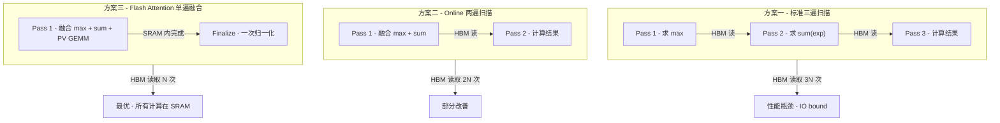
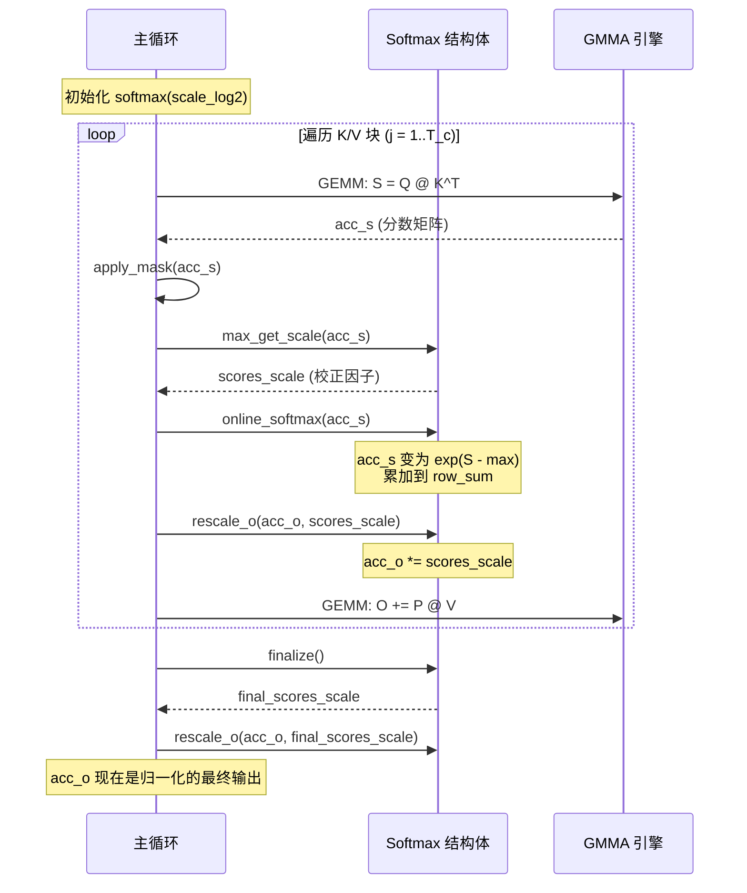

## 目录

- [1. 从理论到实现 - 回顾与动机](#1-从理论到实现---回顾与动机)
- [2. 三种 Softmax 实现策略对比](#2-三种-softmax-实现策略对比)
- [3. Flash Attention 的单遍 Online Softmax](#3-flash-attention-的单遍-online-softmax)
- [4. 源码解析 - hopper/softmax.h](#4-源码解析---hoppersoftmaxh)
- [5. exp2f 优化 - 为什么不用 expf](#5-exp2f-优化---为什么不用-expf)
- [6. FP8 Max_offset 技巧](#6-fp8-max_offset-技巧)
- [7. 数值稳定性分析](#7-数值稳定性分析)
- [8. LSE 的计算与用途](#8-lse-的计算与用途)

---

## 1. 从理论到实现 - 回顾与动机

在 [Flash Attention 核心理论](../01-theory/03-flash-attention-theory.md) 中，我们推导了 Online Softmax 的递推公式。处理到第 $j$ 个 K/V 块后，状态 $(m^{(j)}, l^{(j)}, O^{(j)})$ 通过以下递推关系更新：

$$
m^{(j)} = \max\left(m^{(j-1)},\; \text{rowmax}(S_{ij})\right)
$$

$$
l^{(j)} = \exp\left(m^{(j-1)} - m^{(j)}\right) \cdot l^{(j-1)} + \text{rowsum}\left(\exp\left(S_{ij} - m^{(j)}\right)\right)
$$

$$
O^{(j)} = \exp\left(m^{(j-1)} - m^{(j)}\right) \cdot O^{(j-1)} + \exp\left(S_{ij} - m^{(j)}\right) \cdot V_j
$$

理论推导保证了数学正确性，但从理论到高性能 GPU 实现，还有若干关键的工程问题需要解决：

1. **`exp` 函数的效率**：GPU 上 `expf(x)` 不是最快的指数函数，如何优化？
2. **跨线程归约**：GPU 的 Tensor Core 以 warp（32 线程）为单位计算，`row_max` 和 `row_sum` 如何跨线程高效归约？
3. **归一化时机**：在主循环中每步都归一化还是延迟到最后？
4. **FP8 精度范围**：FP8 的有效范围仅 [0,1]（exp 输出），如何扩展利用？
5. **反向传播的 LSE**：如何高效计算 $\text{LSE} = \log(\sum \exp)$ 供反向传播使用？

本文将逐一回答这些问题，完整解析 `hopper/softmax.h` 中的实现。

---

## 2. 三种 Softmax 实现策略对比

在深入代码之前，先梳理 Softmax 的三种典型实现方案，理解 Flash Attention 选择的设计空间。

### 2.1 方案一：标准三遍扫描（Safe Softmax）

给定向量 $\mathbf{x} = (x_1, x_2, \ldots, x_N)$：

```
Pass 1: m = max(x_1, x_2, ..., x_N)           // 求最大值
Pass 2: l = Σ exp(x_i - m)                     // 求归一化因子
Pass 3: softmax(x_i) = exp(x_i - m) / l        // 计算结果
```

- **优点**：简单，数值稳定
- **缺点**：需要三次遍历数据，每次都需要从 HBM 加载

### 2.2 方案二：Online Softmax 两遍扫描（Milakov & Gimelshein, 2018）

将 Pass 1 和 Pass 2 合并为一次遍历，利用增量更新：

```
Pass 1 (fused max + sum):
  m = -∞, l = 0
  for i = 1 to N:
    m_new = max(m, x_i)
    l = exp(m - m_new) * l + exp(x_i - m_new)
    m = m_new

Pass 2 (compute result):
  softmax(x_i) = exp(x_i - m) / l
```

- **优点**：减少一次 HBM 遍历
- **缺点**：仍需两次遍历

### 2.3 方案三：Flash Attention 单遍融合（本文核心）

Flash Attention 进一步将 Softmax 与矩阵乘法（$P \cdot V$）融合，实现 **单遍扫描**：

```
Pass 1 (fused max + sum + PV):
  m = -∞, l = 0, O = 0
  for j = 1 to T_c:
    S_ij = Q_i @ K_j^T                         // GEMM
    m_new = max(m, rowmax(S_ij))                // 更新最大值
    O = exp(m - m_new) * O                      // 校正历史累加器
    P_ij = exp(S_ij - m_new)                    // 局部 softmax
    l = exp(m - m_new) * l + rowsum(P_ij)       // 更新归一化因子
    O += P_ij @ V_j                             // GEMM + 累加
    m = m_new

Finalize:
  O = O / l                                     // 一次性归一化
```

- **优点**：只需一次遍历 K/V 数据，且与 GEMM 完全融合
- **缺点**：需要维护额外的校正状态

### 2.4 三种方案对比



关键区别在于：方案三不是单纯地计算 Softmax，而是将 Softmax 计算 **嵌入到** 分块矩阵乘法的主循环中，使得 K/V 数据只需从 HBM 加载一次。

---

## 3. Flash Attention 的单遍 Online Softmax

### 3.1 算法的四个阶段

在 Flash Attention 的 SM90 主循环 (`mainloop_fwd_sm90_tma_gmma_ws.hpp`) 中，每次处理一个 K/V 块时，Online Softmax 经历四个阶段：

| 阶段 | 函数 | 作用 |
|------|------|------|
| **1. 更新最大值** | `max_get_scale()` | 计算新的行最大值，返回历史校正因子 |
| **2. 应用 Softmax** | `online_softmax()` | 对分数矩阵应用 $\exp$ 并累加行和 |
| **3. 校正输出** | `rescale_o()` | 将历史输出累加器乘以校正因子 |
| **4. 最终归一化** | `finalize()` | 所有块处理完后，跨线程归约并计算 LSE |

### 3.2 主循环中的调用顺序

以下是简化后的主循环伪代码，展示 Online Softmax 各函数的调用位置：

```cpp
// mainloop_fwd_sm90_tma_gmma_ws.hpp 中的 mma() 方法
Softmax<kNRows> softmax(softmax_scale_log2);

for (int n_block = n_block_min; n_block < n_block_max; ++n_block) {
    // 1. GEMM: S = Q @ K^T（由 TiledMmaQK 执行）
    cute::gemm(tiled_mma_qk, acc_s, ...);

    // 2. 应用 mask（causal, local 等）
    apply_mask(acc_s, ...);

    // 3. Online Softmax: 更新 max 并获取校正因子
    auto scores_scale = softmax.max_get_scale<Is_first>(acc_s);

    // 4. Online Softmax: 对 S 应用 exp 并累加行和
    softmax.online_softmax<Is_first>(acc_s);

    // 5. 校正历史输出累加器
    softmax.rescale_o(acc_o, scores_scale);

    // 6. GEMM: O += P @ V（由 TiledMmaPV 执行）
    cute::gemm(tiled_mma_pv, acc_o, ...);
}

// 7. 最终归一化 + LSE 计算
auto scores_scale = softmax.finalize();
softmax.rescale_o(acc_o, scores_scale);
```



### 3.3 为什么 `rescale_o` 在 `online_softmax` 之后？

注意一个关键的顺序细节：`rescale_o(acc_o, scores_scale)` 在 `online_softmax(acc_s)` **之后**、PV GEMM **之前**调用。这允许 GPU 在执行 `rescale_o`（简单的逐元素乘法）时，与 `online_softmax` 的结果流水线化。

实际上，在 `IntraWGOverlap` 模式下，`rescale_o` 和下一个 QK GEMM 可以与 PV GEMM 重叠执行，进一步提升吞吐。

---

## 4. 源码解析 - hopper/softmax.h

### 4.1 文件结构概览

`hopper/softmax.h`（170 行）包含以下组件：

| 行号 | 组件 | 说明 |
|------|------|------|
| 22-33 | `thread_reduce_()` | 线程内归约（max 或 sum） |
| 36-42 | `quad_allreduce_()` | 4 线程 warp 内全归约 |
| 44-48 | `reduce_()` | 组合：线程归约 + warp 全归约 |
| 50-54 | `reduce_max()` | 封装的 max 归约 |
| 56-61 | `reduce_sum()` | 封装的 sum 归约（可选 warp 归约） |
| 64-88 | `scale_apply_exp2()` | 核心：对分数矩阵应用 $\exp_2$ |
| 92-168 | `Softmax` 结构体 | 封装 Online Softmax 的完整状态和方法 |

### 4.2 归约函数：`thread_reduce_` 和 `quad_allreduce_`

```cpp
// hopper/softmax.h:22-33
template<bool zero_init=true, typename Engine0, typename Layout0,
         typename Engine1, typename Layout1, typename Operator>
__device__ __forceinline__ void thread_reduce_(
    Tensor<Engine0, Layout0> const &tensor,
    Tensor<Engine1, Layout1> &summary,
    Operator &op) {
    // tensor: 2D (nrow, ncol), summary: 1D (nrow)
    for (int ni = 0; ni < size<1>(tensor); ni++) {
        for (int mi = 0; mi < size<0>(tensor); mi++) {
            summary(mi) = zero_init && ni == 0
                ? tensor(mi, ni)
                : op(summary(mi), tensor(mi, ni));
        }
    }
}
```

**作用**：在单个线程内，对 2D tensor 的每一行执行归约操作（max 或 sum）。`zero_init=true` 时第一个元素直接赋值，后续元素用 `op` 累积。

**为什么是 "quad" allreduce？**

```cpp
// hopper/softmax.h:36-42
template<typename Engine0, typename Layout0, typename Engine1, typename Layout1, typename Operator>
__device__ __forceinline__ void quad_allreduce_(
    Tensor<Engine0, Layout0> &dst, Tensor<Engine1, Layout1> &src, Operator &op) {
    for (int i = 0; i < size(dst); i++) {
        dst(i) = Allreduce<4>::run(src(i), op);
    }
}
```

在 SM90 Hopper 架构上，GMMA（Group Matrix Multiply Accumulate）指令以 **warpgroup**（128 线程 = 4 warps）为单位执行。但 MMA 的结果分布在 4 个线程（一个 "quad"）中——每个 quad 的 4 个线程持有同一行不同列的计算结果。因此：

- `thread_reduce_` 先在每个线程内将自己持有的列元素归约为每行一个值
- `quad_allreduce_` 再在 4 个线程间做全归约（使用 `__shfl_xor_sync`），得到完整的行级 max 或 sum

### 4.3 核心函数：`scale_apply_exp2`

```cpp
// hopper/softmax.h:64-88
template <bool Scale_max=true, bool Check_inf=true, int Max_offset=0,
        typename Engine0, typename Layout0, typename Engine1, typename Layout1>
__forceinline__ __device__ void scale_apply_exp2(
    Tensor<Engine0, Layout0> &tensor,
    Tensor<Engine1, Layout1> const &max,
    const float scale) {

    static constexpr float max_offset = float(Max_offset);

    for (int mi = 0; mi < size<0>(tensor); ++mi) {
        // 处理 -inf 的特殊情况
        const float max_scaled = Check_inf
            ? (max(mi) == -INFINITY ? 0.f : max(mi) * scale - max_offset)
            : max(mi) * scale - max_offset;

        for (int ni = 0; ni < size<1>(tensor); ++ni) {
            // 关键：使用 exp2f 而非 expf
            tensor(mi, ni) = exp2f(tensor(mi, ni) * scale - max_scaled);
        }
    }
}
```

这个函数完成的数学运算是：

$$
\text{tensor}[m][n] \leftarrow 2^{(\text{tensor}[m][n] \cdot \text{scale} - \text{max}[m] \cdot \text{scale} + \text{max\_offset})}
$$

当 `scale = softmax_scale_log2 = log2(e) / √d` 时，等价于：

$$
\text{tensor}[m][n] \leftarrow \exp\left(\frac{\text{tensor}[m][n] - \text{max}[m]}{\sqrt{d}}\right) \cdot 2^{\text{max\_offset}}
$$

其中 $2^{\text{max\_offset}}$ 是 FP8 场景下的范围扩展因子（详见第 6 节）。

### 4.4 Softmax 结构体

```cpp
// hopper/softmax.h:92-168
template <int kNRows, int Max_offset=0>
struct Softmax {
    using TensorT = decltype(make_tensor<float>(Shape<Int<kNRows>>{}));
    TensorT row_max, row_sum;
    float const softmax_scale_log2;

    CUTLASS_DEVICE Softmax(float const softmax_scale_log2_)
        : softmax_scale_log2(softmax_scale_log2_) {};
    // ...
};
```

**状态变量**：
- `row_max`：每行的当前最大值，大小为 `kNRows`（寄存器向量）
- `row_sum`：每行的当前累积 $\sum \exp$，大小为 `kNRows`（寄存器向量）
- `softmax_scale_log2`：$\log_2(e) / \sqrt{d}$，预计算的缩放因子

`kNRows` 通常等于 `2 * MMA_M`，其中 MMA_M 是 GMMA 在 M 维度上的分块数。这对应于每个 warpgroup 负责计算的 Q 行数。

### 4.5 `max_get_scale()` 方法详解

```cpp
// hopper/softmax.h:101-124
template<bool Is_first, bool Check_inf=false, typename Tensor0>
__forceinline__ __device__ TensorT max_get_scale(Tensor0 &acc_s) {
    Tensor scores = make_tensor(acc_s.data(),
        flash::convert_layout_acc_rowcol(acc_s.layout()));
    TensorT scores_scale;

    if constexpr (Is_first) {
        // 第一个 K 块：直接用当前分数的 max 初始化
        flash::reduce_max<true>(scores, row_max);
        cute::fill(scores_scale, 1.f);
    } else {
        // 后续 K 块：增量更新
        Tensor scores_max_prev = make_fragment_like(row_max);
        cute::copy(row_max, scores_max_prev);          // 保存旧 max
        flash::reduce_max<false>(scores, row_max);      // 用当前分数更新 max

        for (int mi = 0; mi < size(row_max); ++mi) {
            float scores_max_cur = !Check_inf
                ? row_max(mi)
                : (row_max(mi) == -INFINITY ? 0.0f : row_max(mi));
            // 校正因子: 2^((m_prev - m_cur) * log2(e) / √d)
            scores_scale(mi) = exp2f(
                (scores_max_prev(mi) - scores_max_cur) * softmax_scale_log2);
            // 校正累积和: l *= scores_scale
            row_sum(mi) *= scores_scale(mi);
        }
    }
    return scores_scale;
}
```

**两种模式的区别**：

| 模式 | `Is_first = true` | `Is_first = false` |
|------|-------------------|---------------------|
| 触发 | 处理第一个 K 块 | 处理后续 K 块 |
| max 操作 | `reduce_max<zero_init=true>` 直接初始化 | `reduce_max<zero_init=false>` 与旧值取 max |
| scores_scale | 全 1（无需校正） | $2^{(m_\text{prev} - m_\text{cur}) \cdot \text{scale}}$ |
| row_sum 更新 | 不更新（由 `online_softmax` 初始化） | `row_sum *= scores_scale`（校正旧值） |

**返回值 `scores_scale`** 将用于校正输出累加器 `acc_o`。

### 4.6 `online_softmax()` 方法详解

```cpp
// hopper/softmax.h:126-135
template<bool Is_first, bool Check_inf=false, typename Tensor0>
__forceinline__ __device__ void online_softmax(Tensor0 &acc_s) {
    Tensor scores = make_tensor(acc_s.data(),
        flash::convert_layout_acc_rowcol(acc_s.layout()));

    // 对分数矩阵就地应用 exp2：S[m][n] = exp2(S[m][n] * scale - max_scaled)
    flash::scale_apply_exp2<true, Check_inf, Max_offset>(
        scores, row_max, softmax_scale_log2);

    // 累加行和到 row_sum（不做跨线程归约）
    flash::reduce_sum<Is_first, /*warp_reduce=*/false>(scores, row_sum);
}
```

**关键设计决策**：`warp_reduce=false`

行和的跨线程归约（`quad_allreduce_`）被**延迟到** `finalize()` 中执行。原因是：

1. 在主循环的每次迭代中，我们只需要 `row_sum` 用于最终归一化，并不需要在中间步骤使用它的精确值
2. `row_sum *= scores_scale` 的校正操作（在 `max_get_scale` 中）只需要线程本地的 `row_sum`，不需要全局一致的值
3. 将跨线程同步推迟到最后，减少了主循环中的同步开销

### 4.7 `finalize()` 方法详解

```cpp
// hopper/softmax.h:137-154
__forceinline__ __device__ TensorT finalize(float const final_scale=1.f) {
    SumOp<float> sum_op;
    // 此处才做跨线程归约
    quad_allreduce_(row_sum, row_sum, sum_op);

    TensorT scores_scale;
    for (int mi = 0; mi < size(row_sum); ++mi) {
        float sum = row_sum(mi);
        // 处理 sum=0 或 NaN 的情况
        float inv_sum = (sum == 0.f || sum != sum) ? 0.f : 1.f / sum;
        scores_scale(mi) = inv_sum * final_scale;

        // FP8 的 sum 修正
        if constexpr (Max_offset != 0) {
            static constexpr float sum_scale = 1.f / float(1 << Max_offset);
            sum *= sum_scale;
        }

        // 计算 LSE = max * scale + ln(sum)
        row_sum(mi) = (sum == 0.f || sum != sum)
            ? -INFINITY
            : row_max(mi) * (softmax_scale_log2 * float(M_LN2)) + __logf(sum);
    }
    return scores_scale;
}
```

这个方法完成三件事：

**1. 跨线程行和归约**

```cpp
quad_allreduce_(row_sum, row_sum, sum_op);
```

之前所有 `online_softmax()` 调用中累积的 `row_sum` 都只是线程本地的部分和。`finalize()` 将它们在 quad（4 线程）内做 allreduce，得到完整的行级归一化因子。

**2. 计算最终缩放因子**

```cpp
scores_scale(mi) = inv_sum * final_scale;
```

返回 `1/sum * final_scale`，后续用 `rescale_o(acc_o, scores_scale)` 将输出累加器归一化。

**3. 计算 LSE（Log-Sum-Exp）**

```cpp
row_sum(mi) = row_max(mi) * (softmax_scale_log2 * M_LN2) + __logf(sum);
```

等价于：

$$
\text{LSE}_i = m_i \cdot \frac{\log_2(e)}{\sqrt{d}} \cdot \ln(2) + \ln(l_i) = \frac{m_i}{\sqrt{d}} + \ln(l_i)
$$

其中 `softmax_scale_log2 * M_LN2 = log2(e)/√d * ln(2) = 1/√d`。

LSE 被写回 `row_sum` tensor（复用存储），随后被存储到 HBM 中。这个值在反向传播中用于恢复 Softmax 的梯度。

### 4.8 `rescale_o()` 方法

```cpp
// hopper/softmax.h:156-166
template<typename Tensor1>
__forceinline__ __device__ void rescale_o(Tensor1 &acc_o, TensorT const &scores_scale) {
    Tensor acc_o_rowcol = make_tensor(acc_o.data(),
        flash::convert_layout_acc_rowcol(acc_o.layout()));
    for (int mi = 0; mi < size<0>(acc_o_rowcol); ++mi) {
        for (int ni = 0; ni < size<1>(acc_o_rowcol); ++ni) {
            acc_o_rowcol(mi, ni) *= scores_scale(mi);
        }
    }
};
```

简单的逐行缩放：$O[m][\cdot] \leftarrow O[m][\cdot] \times \text{scores\_scale}[m]$。

这个函数在两个地方被调用：
1. **主循环中**：用 `max_get_scale()` 返回的校正因子缩放 `acc_o`，将旧的输出校正到新的最大值
2. **`finalize()` 后**：用最终的 `1/sum` 缩放 `acc_o`，完成归一化

---

## 5. exp2f 优化 - 为什么不用 expf

### 5.1 FFMA 融合指令

在 `scale_apply_exp2()` 的核心计算中：

```cpp
tensor(mi, ni) = exp2f(tensor(mi, ni) * scale - max_scaled);
```

为什么使用 `exp2f`（$2^x$）而不是 `expf`（$e^x$）？

标准 Softmax 需要计算 $\exp(x - m)$。如果直接使用 `expf`，编译器会生成：

```
// 使用 expf 的指令序列
FADD  r1, x, -max     // r1 = x - max
EXP   r2, r1           // r2 = expf(r1)
```

但利用恒等式 $e^x = 2^{x \cdot \log_2(e)}$，改写为：

$$
\exp(x - m) = 2^{(x - m) \cdot \log_2(e)} = 2^{x \cdot \log_2(e) - m \cdot \log_2(e)}
$$

代码中预计算了 `scale = log2(e) / √d`（即 `softmax_scale_log2`），则：

```cpp
exp2f(x * scale - max * scale)
```

编译器可以将 `x * scale - max_scaled` 融合为一条 **FFMA（Fused Floating-point Multiply-Add）** 指令：

```
// 使用 exp2f 的指令序列
FFMA  r1, x, scale, -max_scaled   // r1 = x * scale - max_scaled（单条指令）
EX2   r2, r1                       // r2 = exp2f(r1)
```

### 5.2 性能收益

| 方案 | 指令数 | 说明 |
|------|--------|------|
| `expf(x - max)` | 2 (FMUL + FADD + EXP) | 分离的乘法、减法、指数 |
| `exp2f(x * scale - max_scaled)` | 2 (FFMA + EX2) | 乘加融合 + 底数 2 指数 |

实际上指令数相近，但 FFMA 相比分离的 FMUL + FADD：
- 只有一次舍入误差（而非两次）
- 单条指令的调度开销更低
- `EX2`（底数 2 指数）在某些 GPU 上比 `EXP`（底数 e 指数）的特殊函数单元延迟更低

### 5.3 softmax_scale_log2 的由来

在 `flash_api.cpp` 中：

```cpp
float const softmax_scale = 1.0 / sqrtf(d);
float const softmax_scale_log2 = softmax_scale * M_LOG2E;
// M_LOG2E = log2(e) ≈ 1.4427
```

因此 `softmax_scale_log2 = log2(e) / √d`，将原始的 $\exp(x / \sqrt{d})$ 转换为 $2^{x \cdot \log_2(e) / \sqrt{d}}$。

---

## 6. FP8 Max_offset 技巧

### 6.1 问题：FP8 的有限范围

FP8 E4M3 格式的有效范围约为 $[-448, 448]$，但 Softmax 的输出 $P_{ij} = \exp(S_{ij} - m) \in [0, 1]$，只利用了 FP8 正数范围的很小一部分 $[0, 1]$，导致严重的精度损失。

### 6.2 解决方案：Max_offset = 8

`Softmax` 结构体的模板参数 `Max_offset` 默认为 0（FP16/BF16），在 FP8 模式下设为 8。效果是：

```cpp
// scale_apply_exp2 中
tensor(mi, ni) = exp2f(tensor(mi, ni) * scale - (max * scale - Max_offset));
```

即在减去最大值后，**加上** `Max_offset = 8`，使得 Softmax 输出变为：

$$
P'_{ij} = 2^{(S_{ij} - m) \cdot \text{scale} + 8} = P_{ij} \cdot 2^8 = P_{ij} \cdot 256
$$

这将输出范围从 $[0, 1]$ 扩展到 $[0, 256]$，充分利用了 FP8 E4M3 的正数范围。

### 6.3 补偿

由于 P 被放大了 $2^8$ 倍，在 `finalize()` 中需要补偿：

```cpp
if constexpr (Max_offset != 0) {
    static constexpr float sum_scale = 1.f / float(1 << Max_offset);
    sum *= sum_scale;  // sum /= 256
}
```

LSE 的计算使用修正后的 `sum`，确保反向传播的正确性。而输出累加器 `acc_o` 的补偿在 epilogue 中通过 `final_scale` 参数完成。

---

## 7. 数值稳定性分析

### 7.1 `-INFINITY` 处理

代码中多处检查 `-INFINITY`：

```cpp
// max_get_scale 中
const float max_scaled = Check_inf
    ? (max(mi) == -INFINITY ? 0.f : max(mi) * scale - max_offset)
    : max(mi) * scale - max_offset;
```

当整行被 mask 为 $-\infty$ 时（例如 causal attention 中完全被遮蔽的行），`max = -INFINITY`。如果不特殊处理：
- `(-INFINITY) - (-INFINITY) = NaN`
- `exp2f(NaN) = NaN`

代码通过将 `max_scaled` 设为 0 来避免 NaN 传播。此时 `exp2f((-inf) * scale - 0) = exp2f(-inf) = 0`，正确地将被 mask 的元素设为 0。

### 7.2 Sum = 0 或 NaN 处理

```cpp
// finalize 中
float inv_sum = (sum == 0.f || sum != sum) ? 0.f : 1.f / sum;
```

`sum != sum` 是 NaN 检测的经典技巧（NaN 是唯一不等于自身的浮点数）。当所有元素被 mask 时，`sum = 0`，此时 `inv_sum = 0`，使输出为全零向量。

### 7.3 LSE 的边界情况

```cpp
row_sum(mi) = (sum == 0.f || sum != sum)
    ? -INFINITY
    : row_max(mi) * (softmax_scale_log2 * float(M_LN2)) + __logf(sum);
```

当 sum = 0 时，LSE 设为 $-\infty$。这在反向传播中会使对应行的梯度为零，符合数学定义。

---

## 8. LSE 的计算与用途

### 8.1 LSE 的数学定义

Log-Sum-Exp（LSE）定义为：

$$
\text{LSE}(x_1, \ldots, x_N) = \log\left(\sum_{i=1}^{N} \exp(x_i)\right)
$$

在注意力的上下文中，对于第 $i$ 行：

$$
\text{LSE}_i = \log\left(\sum_{j=1}^{N} \exp\left(\frac{S_{ij}}{\sqrt{d}}\right)\right) = \frac{m_i}{\sqrt{d}} + \ln(l_i)
$$

其中 $m_i$ 是该行的最大值，$l_i$ 是校正后的指数和。

### 8.2 代码中的 LSE 计算

```cpp
// finalize() 中
row_sum(mi) = row_max(mi) * (softmax_scale_log2 * float(M_LN2)) + __logf(sum);
```

分解各项：
- `softmax_scale_log2 = log2(e) / √d`
- `M_LN2 = ln(2)`
- `softmax_scale_log2 * M_LN2 = log2(e) * ln(2) / √d = 1 / √d`
- 因此：`row_max * (1/√d) + ln(sum) = m/√d + ln(l)` = LSE

### 8.3 为什么反向传播需要 LSE

在反向传播中，我们需要从保存的 LSE 恢复 Softmax 概率：

$$
P_{ij} = \exp\left(\frac{S_{ij}}{\sqrt{d}} - \text{LSE}_i\right)
$$

这避免了存储整个 $N \times N$ 的 $P$ 矩阵，只需存储 $N$ 个 LSE 值。反向传播时：

1. 重计算 $S_{ij} = Q_i K_j^T$（GEMM）
2. 利用保存的 $\text{LSE}_i$ 直接恢复 $P_{ij}$（无需再执行 Online Softmax）
3. 计算梯度 $dQ$, $dK$, $dV$

这正是 Flash Attention 内存高效的关键所在——前向传播只需额外存储 $O(N)$ 的 LSE，而非 $O(N^2)$ 的 $P$ 矩阵。

> 详见 [反向传播算法详解](./04-backward-pass.md) 中关于重计算策略的讨论。

---

## 总结

Online Softmax 是 Flash Attention 的核心算法构件，将数值稳定的 Softmax 与分块矩阵乘法完美融合。在 `hopper/softmax.h` 的 170 行代码中，包含了以下关键工程优化：

| 优化 | 技术手段 | 效果 |
|------|---------|------|
| **指数函数优化** | `exp2f` + FFMA 融合 | 减少指令数，降低延迟 |
| **延迟归约** | `warp_reduce=false` | 减少主循环中的同步开销 |
| **FP8 范围扩展** | `Max_offset=8` | 将有效范围从 [0,1] 扩展到 [0,256] |
| **数值安全** | `-inf` / NaN 检测 | 避免 mask 导致的数值错误 |
| **LSE 复用** | `row_sum` 存储 LSE | 零额外寄存器开销 |

这些优化共同确保了 Online Softmax 在 GPU 上的高效、稳定执行，为 Flash Attention 的整体性能奠定了基础。

---

## 导航

- 上一篇：[Flash Attention 核心理论](../01-theory/03-flash-attention-theory.md)
- 下一篇：[分块策略与调度](02-tiling-strategy.md)
- [返回目录](../README.md)
