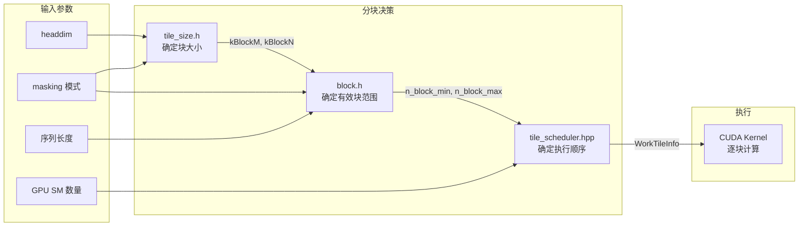
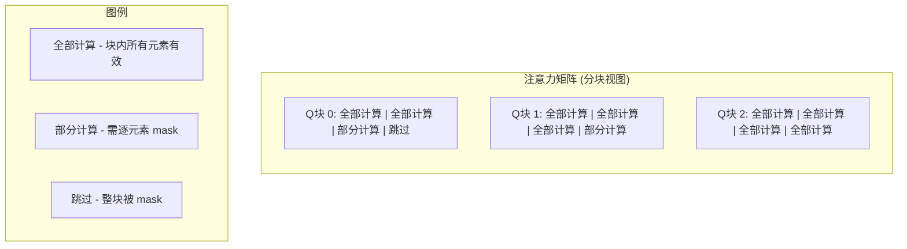
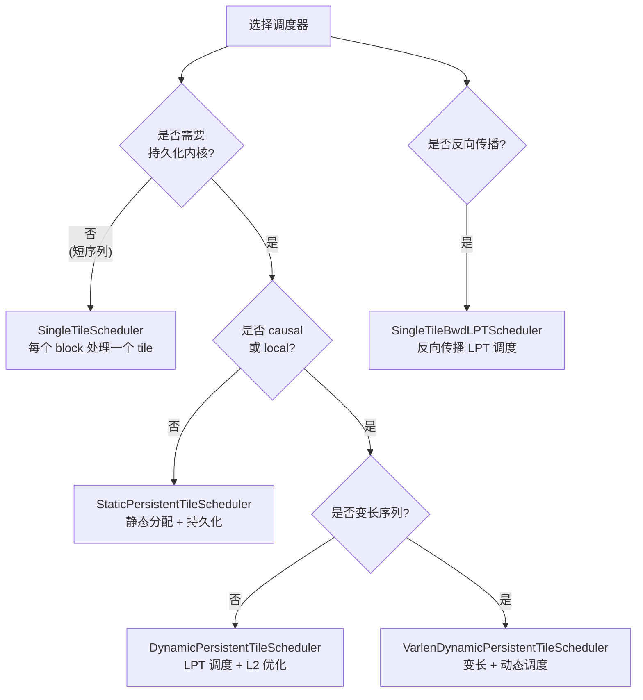
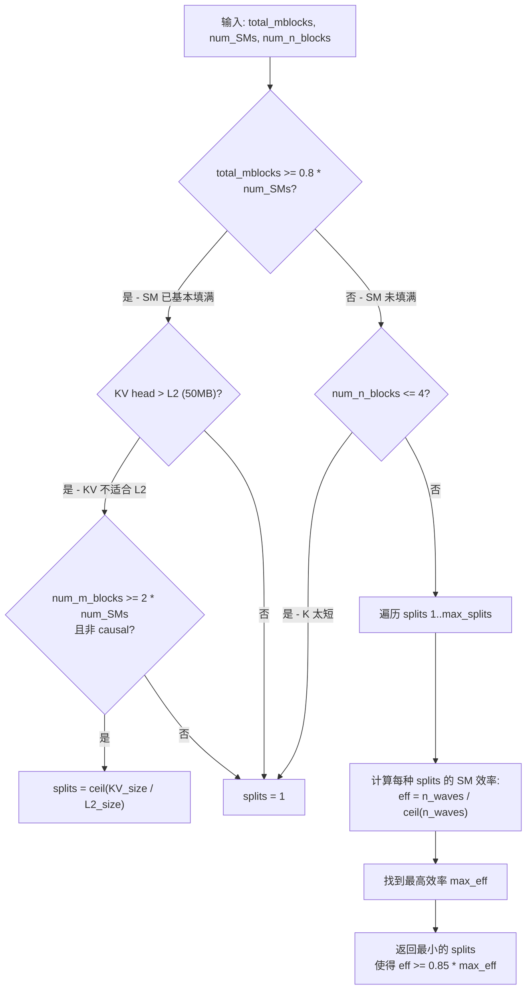

## 目录

- [1. 分块策略概述](#1-分块策略概述)
- [2. 动态分块大小选择 - tile_size.h](#2-动态分块大小选择---tile_sizeh)
- [3. 块级遮蔽跳过优化 - block.h](#3-块级遮蔽跳过优化---blockh)
- [4. Tile 调度器 - tile_scheduler.hpp](#4-tile-调度器---tile_schedulerhpp)
- [5. Split-K 策略与 num_splits 启发式](#5-split-k-策略与-num_splits-启发式)
- [6. PackGQA 与分块的交互](#6-packgqa-与分块的交互)

---

## 1. 分块策略概述

在 [Flash Attention 核心理论](../01-theory/03-flash-attention-theory.md) 中，我们推导了分块计算的基本原理：将 $Q, K, V$ 矩阵按行分为大小为 $B_r \times d$ 和 $B_c \times d$ 的块，使中间计算 $S_{ij} = Q_i K_j^T$ 可以驻留在 GPU 的 SRAM 中。

从理论到实际的 GPU 内核实现，分块策略需要回答三个核心问题：

| 问题 | 对应代码 | 关键影响 |
|------|---------|---------|
| **块多大？** | `tile_size.h` | SRAM 利用率、Tensor Core 效率 |
| **哪些块需要计算？** | `block.h` | Causal/Local masking 优化 |
| **块的执行顺序？** | `tile_scheduler.hpp` | SM 利用率、L2 Cache 命中率 |



---

## 2. 动态分块大小选择 - tile_size.h

### 2.1 核心函数签名

`hopper/tile_size.h` 提供了两个编译期函数，分别为 SM90 (Hopper) 和 SM80 (Ampere) 选择最优块大小：

```cpp
// SM90 (Hopper): 返回 {kBlockM, kBlockN, MmaPV_is_RS, IntraWGOverlap}
constexpr std::tuple<int, int, bool, bool> tile_size_fwd_sm90(
    int headdim, int headdim_v, bool is_causal, bool is_local,
    int element_size=2, bool v_colmajor=false,
    bool paged_kv_non_TMA=false, bool softcap=false);

// SM80 (Ampere): 返回 {kBlockM, kBlockN, kNWarps, kStages, Q_in_regs}
constexpr std::tuple<int, int, int, int, bool> tile_size_fwd_sm8x(
    bool sm86_or_89, int headdim, int headdim_v, bool is_causal, bool is_local,
    int element_size=2, bool paged_kv=false, bool varlen_and_split=false,
    bool softcap=false, bool append_kv=false);
```

### 2.2 SM90 分块大小映射

对于 FP16/BF16（`element_size=2`），SM90 的分块选择逻辑如下：

| headdim | kBlockM | kBlockN | MmaPV_is_RS | IntraWGOverlap | 备注 |
|---------|---------|---------|-------------|----------------|------|
| ≤ 64 (hdv=512) | 64 | 64 | false | false | 大 V 维度，小块 |
| ≤ 64 (hdv=256) | 128 | 96 | true | false | 中等 V 维度 |
| ≤ 64 (其他) | 192 | 128/192 | varies | true | causal/local 用 128 |
| ≤ 96 | 192 | 128/144 | false | true | local/paged 用 128 |
| ≤ 128 | 128 | 128/176 | true | true | causal/local 用 128 |
| ≤ 192 | 128 | 96~128 | true | true | 按 paged/local/hdv 选 |
| > 192 | 128 | 64/80 | true | true | SRAM 限制最严格 |

### 2.3 四个返回值的含义

**kBlockM 和 kBlockN**

- `kBlockM`：Q 矩阵每个分块的行数，即一个 thread block 处理多少 Q 行
- `kBlockN`：K/V 矩阵每个分块的行数，即内层循环每次处理多少 K/V 行

块越大，矩阵乘法效率越高（更好的 Tensor Core 利用率），但 SRAM 占用也越大。SRAM 预算约束为：

$$
\text{SRAM} \geq \underbrace{B_r \times d}_{\text{Q block}} + \underbrace{B_c \times d}_{\text{K block}} + \underbrace{B_c \times d_v}_{\text{V block}} + \underbrace{B_r \times d_v}_{\text{O 累加器}}
$$

当 `headdim > 192` 时，`kBlockN` 降至 64~80，因为 K/V block 本身已经很大。

**MmaPV_is_RS (Register-Stationary)**

控制 $P \cdot V$ 矩阵乘法的数据布局：
- `true`（RS = Register-Stationary）：P 矩阵从寄存器读取，V 从共享内存读取。适用于大多数情况
- `false`（SS = Shared-Stationary）：P 和 V 都从共享内存读取。在 `headdim ≤ 96` 时使用，因为此时共享内存有余量

RS 模式通常更快，因为寄存器带宽远高于共享内存。但 RS 需要更多寄存器来存储 P 矩阵的中间结果。

**IntraWGOverlap (Warp Group 内重叠)**

控制是否在同一个 Warp Group 内重叠 QK GEMM 和 PV GEMM：
- `true`：当一个 K 块的 QK 计算完成后，立即开始 PV 计算，同时预取下一个 K 块的数据。这隐藏了数据加载延迟
- `false`：顺序执行 QK 和 PV

大多数配置启用此优化，但在极端情况下（如 `headdim=512` 的 V 维度）因寄存器压力而禁用。

### 2.4 SM80 的差异

SM80（Ampere）没有 TMA 和 GMMA，使用传统的 `cp.async` 加载和 warp-level MMA。其块大小选择返回不同的参数：

- `kNWarps`：使用的 warp 数量（4 或 8），SM80 没有 warp specialization
- `kStages`：流水线阶段数（1 或 2），控制共享内存的双缓冲
- `Q_in_regs`：是否将 Q 保持在寄存器中（减少共享内存压力）

SM80 的 kBlockM 统一为 128，kBlockN 的范围更窄（32~128），因为没有 TMA 的高效异步加载。

### 2.5 为什么 Causal/Local 使用更小的 kBlockN？

代码中反复出现这个模式：

```cpp
bool const use_blockN_128 = is_causal || is_local || paged_kv_non_TMA;
return {128, use_blockN_128 ? 128 : 176, true, true};
```

原因是：
1. **Causal masking** 下，右上角的块被完全跳过，但边界块仍需处理部分元素。更小的 kBlockN 意味着边界块中无效元素的比例更低
2. **块量化效应**：kBlockN 越大，`ceil(seqlen_k / kBlockN)` 的取整浪费越严重，尤其在短序列时
3. **Paged KV**：非 TMA 的分页 KV 访问不能利用 TMA 的大块传输优势，小块更匹配 `cp.async` 的传输粒度

---

## 3. 块级遮蔽跳过优化 - block.h

### 3.1 核心思想

标准 Causal Attention 需要对 $N \times N$ 矩阵应用下三角遮蔽。但逐元素检查遮蔽条件非常低效。Flash Attention 的关键优化是在 **块级别** 跳过完全不需要计算的块。



对于 Causal Attention，第 $i$ 个 Q 块只需与前 $n_{\text{max}}$ 个 K 块计算：

$$
n_{\text{block\_max}} = \left\lceil \frac{(m_{\text{block}} + 1) \times B_r + \text{seqlen\_k} - \text{seqlen\_q}}{B_c} \right\rceil
$$

对于 Local（滑动窗口）Attention，还有下界：

$$
n_{\text{block\_min}} = \max\left(0, \left\lfloor \frac{m_{\text{block}} \times B_r + \text{seqlen\_k} - \text{seqlen\_q} - \text{window\_size\_left}}{B_c} \right\rfloor\right)
$$

### 3.2 `BlockMN::get_n_block_min_max()` 实现

```cpp
// hopper/block.h:14-59
template <class SeqlenInfo_t, int kBlockM, int kBlockN,
          bool Is_causal, bool Is_local, bool PackGQA, bool Split>
struct BlockMN {
    static CUTLASS_DEVICE
    cute::tuple<int, int> get_n_block_min_max(
            SeqlenInfo_t const& seqlen_info,
            int const m_block, int const bidb,
            int const split_idx, int const num_splits,
            int const window_size_left, int const window_size_right,
            cutlass::FastDivmod const& attention_chunk_divmod,
            cutlass::FastDivmod const& qhead_per_khead_divmod) {

        int const seqlen_k = seqlen_info.seqlen_k;
        int const seqlen_q = seqlen_info.seqlen_q;
        int n_block_max = cute::ceil_div(seqlen_k, kBlockN);

        // Causal 或 Local: 计算上界
        if constexpr (Is_causal || Is_local) {
            int m_idx_max = (m_block + 1) * kBlockM;
            if (PackGQA) {
                m_idx_max = qhead_per_khead_divmod.divide(m_idx_max - 1) + 1;
            }
            int const n_idx = m_idx_max + seqlen_k - seqlen_q;
            int n_idx_right = !Is_local ? n_idx : n_idx + window_size_right;
            n_block_max = std::min(n_block_max, cute::ceil_div(n_idx_right, kBlockN));
        }

        // Local: 计算下界
        int n_block_min = 0;
        if constexpr (Is_local) {
            int m_idx_min = m_block * kBlockM;
            if (PackGQA) {
                m_idx_min = qhead_per_khead_divmod.divide(m_idx_min);
            }
            int const n_idx = m_idx_min + seqlen_k - seqlen_q;
            int n_idx_left = n_idx - window_size_left;
            n_block_min = std::max(0, n_idx_left / kBlockN);
        }

        // Split: 在多个 split 间分配 N 块
        if constexpr (Split) {
            int num_splits_actual = /* decode from split_idx */;
            int num_n_blocks_per_split = ceil_div(n_block_max - n_block_min, num_splits_actual);
            n_block_min = n_block_min + split_idx_actual * num_n_blocks_per_split;
            n_block_max = std::min(n_block_min + num_n_blocks_per_split, n_block_max);
        }
        return {n_block_min, n_block_max};
    }
};
```

### 3.3 跳过优化的效果

以 Causal Attention 为例，假设 $N = 4096$，$B_r = B_c = 128$，共 $T = 32$ 个块：

| 方案 | 计算的块数 | 比例 |
|------|-----------|------|
| 无跳过 | $32 \times 32 = 1024$ | 100% |
| 块级跳过 | $\sum_{i=1}^{32} i = 528$ | 51.6% |

Causal Attention 几乎跳过一半的块，性能接近非 causal 情况的一半计算量。

### 3.4 反向传播的 `get_m_block_min_max`

反向传播采用 N-outer Q-inner 的循环结构（与前向相反），因此需要计算每个 K 块对应的有效 Q 块范围：

```cpp
// hopper/block.h:83-101
static CUTLASS_DEVICE
cute::tuple<int, int> get_m_block_min_max(
        SeqlenInfo_t const& seqlen_info,
        int const n_block, int const bidb,
        int const window_size_left, int const window_size_right,
        int const sink_token_length) {

    int m_block_max = cute::ceil_div(seqlen_q, kBlockM);
    if constexpr (Is_local) {
        m_block_max = std::min(m_block_max,
            cute::ceil_div((n_block + 1) * kBlockN + seqlen_q - seqlen_k + window_size_left, kBlockM));
    }

    int m_block_min = 0;
    if constexpr (Is_causal || Is_local) {
        m_block_min = std::max(m_block_min,
            (n_block * kBlockN + seqlen_q - seqlen_k - window_size_right) / kBlockM);
    }
    return {m_block_min, m_block_max};
}
```

这是前向 `get_n_block_min_max` 的"逆向"版本——给定 K 块位置，计算需要遍历的 Q 块范围。

---

## 4. Tile 调度器 - tile_scheduler.hpp

### 4.1 调度器概览

`hopper/tile_scheduler.hpp` 实现了五种调度策略，适用于不同场景：



### 4.2 SingleTileScheduler - 最简单的调度

```cpp
static dim3 get_grid_shape(Params const& params, int num_sm) {
    return {num_blocks, num_head * (Split ? num_splits : 1), num_batch};
}
```

**Grid 布局**：`(num_m_blocks, num_heads * num_splits, batch_size)`

每个 CUDA block 恰好处理一个 tile，通过 `blockIdx` 直接映射到 `(m_block, head, batch)`。处理完一个 tile 后内核退出。

**优点**：简单，无同步开销
**缺点**：当总 tile 数不能均匀填满所有 SM 时，尾部 SM 空闲

### 4.3 StaticPersistentTileScheduler - 静态持久化

```cpp
static dim3 get_grid_shape(Params const& params, int num_sm) {
    return {num_sm};  // 只启动与 SM 数量相同的 block
}

// get_next_work: 步进 gridDim.x
WorkTileInfo get_next_work(Params const& params, WorkTileInfo const& current_work) const {
    return {current_work.tile_idx + int(gridDim.x)};
}
```

**工作原理**：
1. 启动 `num_sm` 个 CUDA block（每个 SM 一个）
2. 每个 block 处理完当前 tile 后，自动拿下一个（跳 `num_sm` 步）
3. 直到所有 tile 处理完毕

**优点**：减少内核启动开销，提高 SM 利用率
**缺点**：对负载不均匀（如 causal）不友好

### 4.4 DynamicPersistentTileScheduler - 动态持久化（核心调度器）

这是 Flash Attention 最核心的调度器，用于 causal/local 场景。它结合了两个关键优化：

**优化 1：Longest-Processing-Time-First (LPT) 调度**

Causal Attention 中，不同 Q 块需要处理的 K 块数量不同——越靠后的 Q 块需要计算更多的 K 块。LPT 策略将最"重"的 tile 优先分配给空闲的 SM：

```cpp
// hopper/tile_scheduler.hpp:310
// Longest-processing-time-first: 反转块索引
block = params.m_block_divmod.divisor - 1 - block;
```

直觉上，这类似于装箱问题的贪心策略——先放大物品可以更好地填满箱子。

**优化 2：L2 Cache Swizzling**

为了最大化 L2 Cache 命中率，调度器将相邻的 head/batch 组成一个 "section"，使同一 section 内的 K/V 数据尽量保持在 L2 中：

```cpp
// hopper/tile_scheduler.hpp:253-261
long long size_one_kv_head = long(seqlen_k) * long(headdim + headdim_v) * long(element_size);
int const size_l2 = 32 * 1024 * 1024;  // 32 MB for K & V
int const swizzle = nearest_power_of_2(size_l2 / size_one_kv_head)
                    * (PackGQA ? 1 : qhead_per_khead);
```

例如，如果一个 KV head 占 4 MB，L2 可容纳 32 MB / 4 MB = 8 个 head。那么 head 0~7 组成第一个 section，head 8~15 组成第二个 section。同一 section 内的 tile 连续执行，使得 K/V 数据在 L2 中被重复利用。

**工作窃取机制**

空闲 SM 通过原子操作获取下一个 tile：

```cpp
// hopper/tile_scheduler.hpp:337-339
void prefetch_next_work(Params const& params, WorkTileInfo& current_work) const {
    if (threadIdx.x % NumProducerThreads == 0) {
        current_work.tile_idx = atomicAdd(params.tile_count_semaphore, 1) + int(gridDim.x);
    }
}
```

只有 Producer Warp 的线程 0 执行原子操作（每 SM 一次），开销极低。新的 tile 索引通过 Named Barrier 从 Producer 传递给 Consumer。

### 4.5 VarlenDynamicPersistentTileScheduler

变长序列的调度更加复杂，因为不同序列的 tile 数量不同。这个调度器使用 warp-prefix-sum 来计算每个序列的累积 tile 数，支持在变长场景下的动态负载均衡。

### 4.6 SingleTileBwdLPTScheduler

反向传播专用的 LPT 调度器。与前向的区别在于：
- 反向传播的外层循环在 N 块（而非 Q 块）
- L2 Cache 需要容纳的是 Q、dO 和 dQ_accum，而非 K、V
- L2 大小预算为 40 MB（而非前向的 32 MB）

---

## 5. Split-K 策略与 num_splits 启发式

### 5.1 为什么需要 Split

当序列长度非常长但 batch × heads 较小时（例如 batch=1, heads=8, seqlen=65536），总的 Q 块数（$T_r = 512$）可能足以填满 SM，但每个 Q 块需要遍历的 K/V 块数（$T_c = 512$）非常多，导致单个 tile 的执行时间极长。

Split-K 策略将内层的 K/V 遍历拆分到多个 SM 上并行执行：

$$
\text{K 块 } [0, T_c) \rightarrow \begin{cases} \text{Split 0: } [0, T_c / S) \\ \text{Split 1: } [T_c / S, 2T_c / S) \\ \vdots \\ \text{Split S-1: } [(S-1)T_c / S, T_c) \end{cases}
$$

每个 split 独立计算一个局部的 $(m, l, O)$，最后通过一个单独的 **combine kernel** 合并结果。这就是所谓的 **Flash Decoding** 策略。

### 5.2 `num_splits_heuristic()` 决策逻辑

`hopper/heuristics.h` 中的启发式函数决定最优的 split 数量：

```cpp
inline int num_splits_heuristic(
    int total_mblocks,    // batch * heads * num_m_blocks
    int num_SMs,          // GPU 的 SM 数量
    int num_n_blocks,     // K/V 块数
    int num_m_blocks,     // Q 块数
    int size_one_kv_head, // 单个 KV head 的字节数
    bool is_causal_or_local,
    int max_splits) {
```



核心思路是 **最大化 SM 利用率**。例如，如果有 108 个 SM 和 48 个 tile：
- 1 split：48 / 108 = 0.44 waves → 效率 44%
- 2 splits：96 / 108 = 0.89 waves → 效率 89%
- 3 splits：144 / 108 = 1.33 waves → 效率 67%

算法会选择 2 splits，因为它在效率 ≥ 85% × 89% = 75.6% 的条件下是最小的 split 数。

### 5.3 Split 在 `block.h` 中的实现

当启用 Split 时，`get_n_block_min_max` 会将 N 块范围均匀划分：

```cpp
if constexpr (Split) {
    int num_n_blocks_per_split = ceil_div(n_block_max - n_block_min, num_splits_actual);
    n_block_min = n_block_min + split_idx * num_n_blocks_per_split;
    n_block_max = std::min(n_block_min + num_n_blocks_per_split, n_block_max);
}
```

注意 `split_idx` 使用了一个巧妙的位打包：低 16 位存储实际的 split 索引，高 16 位存储该 batch 对应的总 split 数（用于变长序列场景中不同序列可能有不同的 split 数）。

---

## 6. PackGQA 与分块的交互

### 6.1 PackGQA 的动机

在 Grouped Query Attention (GQA) 中，多个 Q head 共享同一个 K/V head。当 `seqlen_q` 较短时（如推理阶段），Q 维度的 tile 数量太少，无法充分利用所有 SM。

PackGQA 将多个 Q head "打包"到 M 维度中：

$$
\text{有效 seqlen\_q} = \text{seqlen\_q} \times \text{qhead\_per\_khead}
$$

这增加了 Q 维度的 tile 数量，提高了并行度。

### 6.2 `should_pack_gqa()` 启发式

```cpp
// hopper/heuristics.h:9-17
inline bool should_pack_gqa(bool varlen_q, int seqlen_q, int qhead_per_khead, int blockM) {
    if (varlen_q) return true;  // 变长场景始终打包

    auto round_up = [](int a, int b) { return (a + b - 1) / b * b; };
    float nopack_efficiency = float(seqlen_q) / float(round_up(seqlen_q, blockM));
    float pack_efficiency = float(seqlen_q * qhead_per_khead)
                          / float(round_up(seqlen_q * qhead_per_khead, blockM));
    return nopack_efficiency < 0.9 * pack_efficiency;
}
```

**效率定义**：有效元素数 / 对齐到 kBlockM 后的元素数

例如，`seqlen_q = 100`，`kBlockM = 128`，`qhead_per_khead = 8`：
- 不打包：$100 / 128 = 78.1\%$
- 打包：$800 / 896 = 89.3\%$
- $78.1\% < 0.9 \times 89.3\% = 80.4\%$ → 使用 PackGQA

### 6.3 对块范围计算的影响

当启用 PackGQA 时，`block.h` 中的 Q 行索引需要从"打包后"的行号转换回"原始"的行号：

```cpp
// block.h:27
if (PackGQA) {
    m_idx_max = qhead_per_khead_divmod.divide(m_idx_max - 1) + 1;
}
```

这确保 causal masking 的计算基于原始序列位置而非打包后的位置。

---

## 总结

Flash Attention 的分块策略是一个多层次的优化系统：

| 层次 | 组件 | 功能 |
|------|------|------|
| **块大小** | `tile_size.h` | 根据 headdim 和配置选择最优的 kBlockM × kBlockN |
| **有效范围** | `block.h` | 根据 causal/local mask 跳过无效块 |
| **执行顺序** | `tile_scheduler.hpp` | LPT + L2 swizzling + 动态负载均衡 |
| **并行拆分** | `heuristics.h` | Split-K 策略提高 SM 利用率 |
| **GQA 优化** | `heuristics.h` | PackGQA 增加并行度 |

这些优化协同工作，使得 Flash Attention 在各种序列长度、头维度和注意力模式下都能高效利用 GPU 资源。

---

## 导航

- 上一篇：[Online Softmax 算法详解](01-online-softmax.md)
- 下一篇：[前向传播算法详解](03-forward-pass.md)
- [返回目录](../README.md)
