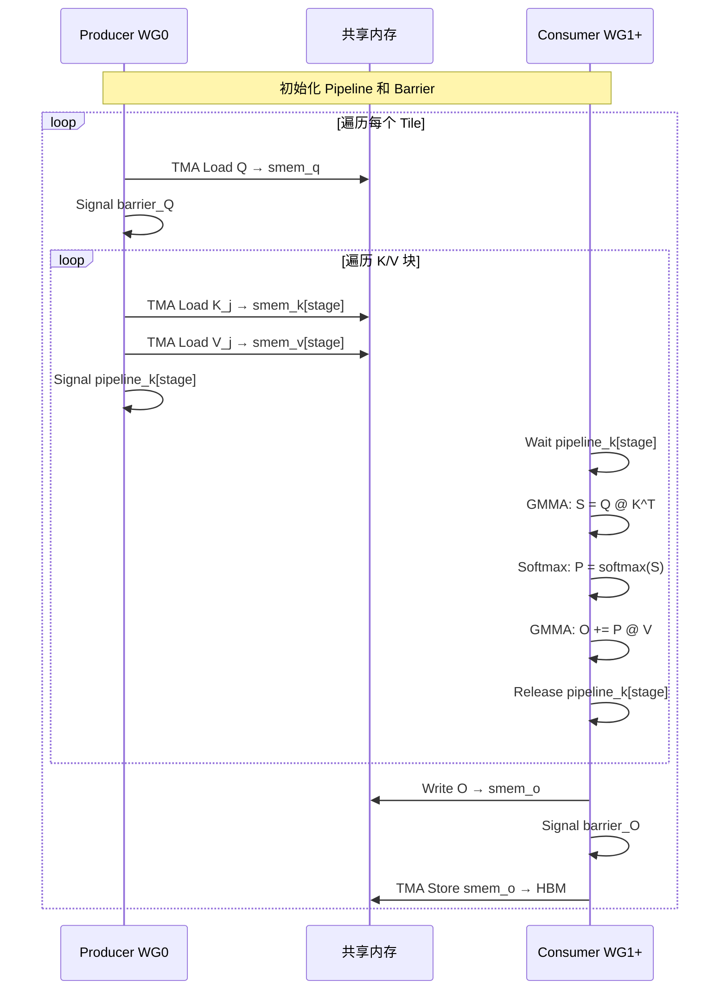
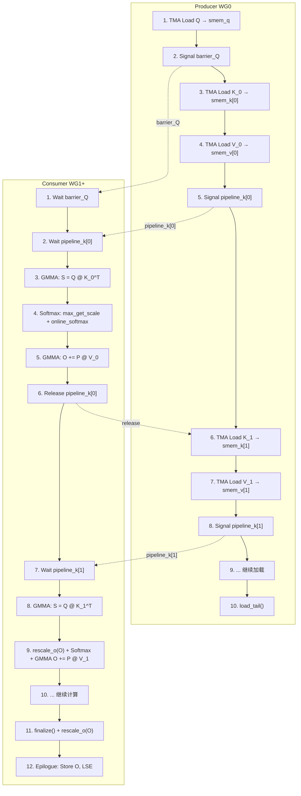

## 目录

- [1. 前向传播的整体架构](#1-前向传播的整体架构)
- [2. Warp Specialization - Producer-Consumer 模式](#2-warp-specialization---producer-consumer-模式)
- [3. Producer 执行路径 - 数据加载](#3-producer-执行路径---数据加载)
- [4. Consumer 执行路径 - 计算主循环](#4-consumer-执行路径---计算主循环)
- [5. Pipeline 多阶段流水线](#5-pipeline-多阶段流水线)
- [6. IntraWGOverlap - 组内重叠优化](#6-intrawgoverlap---组内重叠优化)
- [7. Epilogue - 输出与 LSE 写回](#7-epilogue---输出与-lse-写回)
- [8. 完整执行时序](#8-完整执行时序)

---

## 1. 前向传播的整体架构

### 1.1 内核类结构

Flash Attention 的 SM90 前向内核由三个可替换的组件构成：

```cpp
// hopper/flash_fwd_kernel_sm90.h:27-28
template <class CollectiveMainloop_, class CollectiveEpilogue_, class TileScheduler_>
class FlashAttnFwdSm90 {
```

| 组件 | 类名 | 职责 |
|------|------|------|
| **Mainloop** | `CollectiveMainloopFwdSm90` | Q/K/V 加载、QK GEMM、Softmax、PV GEMM |
| **Epilogue** | `CollectiveEpilogueFwd` | 输出 O 和 LSE 写回 HBM |
| **Scheduler** | `TileScheduler` | 分配 tile 到 SM |

这种模板组合设计允许通过编译期参数选择不同的实现变体（FP8、Paged KV、Varlen 等），而无需运行时分支。

### 1.2 线程组织

```
Thread Block (MaxThreadsPerBlock)
├── Warp Group 0 (128 threads) ─── Producer: 数据加载
├── Warp Group 1 (128 threads) ─── Consumer: MMA 计算
├── Warp Group 2 (128 threads) ─── Consumer: MMA 计算 (可选)
└── Warp Group 3 (128 threads) ─── Consumer: MMA 计算 (可选)
```

```cpp
// hopper/flash_fwd_kernel_sm90.h:74-78
static constexpr uint32_t NumLoadWarpGroups = 1;
static constexpr uint32_t NumMmaWarpGroups = size(TiledMmaPV{}) / NumThreadsPerWarpGroup;
static constexpr uint32_t MaxThreadsPerBlock = size(TiledMmaPV{}) + NumLoadWarpGroups * NumThreadsPerWarpGroup;
// NumMmaWarpGroups 可以是 1, 2, 或 3
```

**寄存器预算分配**：

| WG | 寄存器/线程 | 说明 |
|----|-----------|------|
| Producer (WG0) | 24~56 | 只需加载数据，寄存器需求低 |
| Consumer (WG1+) | 160~240 | 需要存储 MMA 累加器、Softmax 状态等 |

```cpp
// hopper/flash_fwd_kernel_sm90.h:82-83
static constexpr uint32_t LoadRegisterRequirement = NumMmaWarpGroups == 2 ? 24 : 32;
static constexpr uint32_t MmaRegisterRequirement = NumMmaWarpGroups == 2 ? 240 : 160;
```

通过 `warpgroup_reg_dealloc`（Producer）和 `warpgroup_reg_alloc`（Consumer），Hopper 架构可以动态调整每个 Warp Group 的寄存器分配，使寄存器利用最大化。

### 1.3 共享内存布局

```cpp
// hopper/flash_fwd_kernel_sm90.h:94-117
struct SharedStorage {
    struct TensorStorage {
        union {                     // Mainloop 和 Epilogue 共享内存重叠
            struct {
                padding_;           // 对齐填充
                mainloop;           // smem_q, smem_k, smem_v
            };
            epilogue;               // smem_o（与 smem_v 重叠）
        };
    } tensors;
    struct PipelineStorage {
        barrier_Q;                  // Q 加载同步
        barrier_O;                  // O 输出同步
        pipeline_k;                 // K 加载流水线状态
        pipeline_v;                 // V 加载流水线状态
        pipeline_vt;                // V 转置流水线状态 (FP8)
        smem_scheduler;             // 调度器共享内存
    } pipelines;
};
```

**关键设计**：`smem_o` 和 `smem_v` 通过 `union` 重叠。这是因为在 Epilogue 阶段写回 O 时，V 的共享内存已不再需要。这种内存复用节省了宝贵的共享内存空间。

---

## 2. Warp Specialization - Producer-Consumer 模式

### 2.1 核心思想

Hopper 架构引入了 **Warp Specialization**：不同的 Warp Group 执行不同的代码路径，通过异步流水线（Pipeline）进行同步。



### 2.2 分支入口

```cpp
// hopper/flash_fwd_kernel_sm90.h:308-452
if (warp_group_idx == 0) {  // Producer
    cutlass::arch::warpgroup_reg_dealloc<LoadRegisterRequirement>();
    // ... TMA 加载逻辑
} else {  // Consumer
    cutlass::arch::warpgroup_reg_alloc<MmaRegisterRequirement>();
    // ... MMA 计算逻辑
}
```

注意 `warpgroup_reg_dealloc` 和 `warpgroup_reg_alloc` 的调用——Producer 释放多余的寄存器给 Consumer 使用，使得 Consumer 有足够的寄存器存储 MMA 的累加器。

---

## 3. Producer 执行路径 - 数据加载

### 3.1 Producer 的工作循环

```cpp
// hopper/flash_fwd_kernel_sm90.h:328-359（简化）
for (auto work_tile_info = scheduler.get_initial_work<IsProducerWarp>(params.scheduler);
     work_tile_info.is_valid(params.scheduler);
     work_tile_info = scheduler.get_next_work<IsProducerWarp>(params.scheduler, work_tile_info)) {

    // 1. 构造序列长度信息
    SeqlenInfo_t seqlen_info{bidb, shape_Q, shape_K, ...};

    // 2. 如果启用 AppendKV，先加载新的 KV
    if constexpr (AppendKV) {
        mainloop.load_kv_new(params.mainloop, pipeline_k_new, pipeline_v_new, ...);
    }

    // 3. 预取下一个 tile 的工作信息
    auto scheduler_prefetch = [&]() {
        scheduler.prefetch_next_work(params.scheduler, work_tile_info);
    };

    // 4. 加载 Q, K, V 到共享内存
    mainloop.load(params.mainloop, pipeline_k, pipeline_v, pipeline_vt,
                  smem_pipe_write, shared_storage, scheduler_prefetch, seqlen_info, block_coord, work_idx);
}
// 5. 通知所有流水线加载结束
mainloop.load_tail(pipeline_k, pipeline_v, pipeline_vt, smem_pipe_write, ...);
```

### 3.2 `mainloop.load()` 的内部流程

`CollectiveMainloopFwdSm90::load()` 方法执行以下步骤：

1. **加载 Q 到共享内存**：通过 TMA（或 cp.async）将 Q 块从 HBM 加载到 smem_q。Q 在整个 K/V 内层循环中保持不变
2. **计算有效的 N 块范围**：调用 `BlockMN::get_n_block_min_max()` 确定需要遍历的 K/V 块
3. **内层循环加载 K/V**：对每个有效的 N 块：
   - 通过 TMA 将 K_j 加载到 `smem_k[current_stage]`
   - 通过 TMA 将 V_j 加载到 `smem_v[current_stage]`
   - 推进流水线状态到下一个 stage
4. **调度器预取**：在加载间隙预取下一个 tile 的工作信息

### 3.3 TMA 异步加载

TMA（Tensor Memory Accelerator）是 Hopper 架构的硬件特性，允许在不占用任何 warp 周期的情况下从 HBM 加载数据到共享内存：

```
传统 cp.async:
  Warp → 发起 cp.async 指令 → 等待完成 → 继续执行

TMA:
  线程 0 → 发起 TMA 描述符 → TMA 引擎自动执行 → Warp 继续做其他事
```

TMA 加载完成后通过 Pipeline Barrier 通知 Consumer。

---

## 4. Consumer 执行路径 - 计算主循环

### 4.1 Consumer 的工作循环

```cpp
// hopper/flash_fwd_kernel_sm90.h:360-451（简化）
cutlass::arch::warpgroup_reg_alloc<MmaRegisterRequirement>();
TiledMmaPV tiled_mma_pv;

for (auto work_tile_info = scheduler.get_initial_work(params.scheduler);
     work_tile_info.is_valid(params.scheduler);
     /* work_tile_info 在 epilogue 前更新 */) {

    // 1. FP8 缩放因子调整
    float softmax_scale_log2 = params.mainloop.softmax_scale_log2;
    if constexpr (Is_FP8) {
        softmax_scale_log2 *= q_descale * k_descale;
    }

    // 2. 初始化 Softmax 和输出累加器
    Softmax softmax(softmax_scale_log2);
    Tensor tOrO = partition_fragment_C(tiled_mma_pv, ...);  // 输出寄存器

    // 3. 执行主循环 MMA
    bool tile_valid = mainloop.mma(
        params.mainloop, pipeline_k, pipeline_v, smem_pipe_read,
        tOrO, softmax, threadIdx.x, work_idx, seqlen_info, block_coord, shared_storage);

    // 4. 预取下一个 tile（在 epilogue 之前！）
    work_tile_info = scheduler.get_next_work(params.scheduler, work_tile_info);

    // 5. 写回结果
    if (tile_valid) {
        epilogue.store(params.epilogue, tOrO, softmax.row_sum, ...);
    } else {
        epilogue.store_zero(params.epilogue, ...);  // 全零 O, -inf LSE
    }
}
```

### 4.2 `mainloop.mma()` 的核心算法

`CollectiveMainloopFwdSm90::mma()` 是整个 Flash Attention 前向传播的计算核心。以下是其简化的算法流程：

```
函数 mma(params, pipeline_k, pipeline_v, acc_o, softmax):
    // 等待 Q 加载完成
    wait(barrier_Q)

    // 计算有效的 N 块范围
    [n_block_min, n_block_max] = BlockMN::get_n_block_min_max(...)
    if n_block_max <= n_block_min: return false  // 无需计算

    // 主循环：遍历 K/V 块
    for n_block = n_block_max - 1 downto n_block_min:  // 从后向前遍历
        // === Phase 1: QK GEMM ===
        wait(pipeline_k[stage])           // 等待 K 块加载完成
        acc_s = 0
        GMMA(acc_s, smem_q, smem_k)      // S = Q @ K^T

        // === Phase 2: Masking ===
        if is_causal or is_local:
            apply_causal_mask(acc_s)
        if has_softcap:
            acc_s = tanh(acc_s / softcap) * softcap

        // === Phase 3: Online Softmax ===
        scores_scale = softmax.max_get_scale<Is_first>(acc_s)
        softmax.online_softmax<Is_first>(acc_s)

        // === Phase 4: Rescale Output ===
        softmax.rescale_o(acc_o, scores_scale)

        // === Phase 5: PV GEMM ===
        wait(pipeline_v[stage])           // 等待 V 块加载完成
        GMMA(acc_o, acc_s, smem_v)        // O += P @ V

        release(pipeline_k[stage])        // 释放 K 共享内存
        advance(stage)                    // 推进到下一个 pipeline stage

    // === Phase 6: 最终归一化 ===
    final_scale = softmax.finalize()
    softmax.rescale_o(acc_o, final_scale)

    return true
```

### 4.3 从后向前遍历的原因

注意主循环是从 `n_block_max - 1` **递减**到 `n_block_min`：

```cpp
for n_block = n_block_max - 1 downto n_block_min
```

这是因为在 Causal Attention 中，边界处（需要 masking 的块）位于右上角。从后向前遍历意味着 **先处理需要 masking 的边界块，后处理完全有效的块**。这样可以在检测到当前块完全有效后，关闭后续块的 masking 检查，减少分支开销。

### 4.4 GMMA 矩阵乘法

Flash Attention 使用两种 GMMA 操作：

| GMMA | 作用 | 操作数来源 |
|------|------|-----------|
| `TiledMmaQK` | S = Q @ K^T | Q 从 smem 或寄存器，K 从 smem |
| `TiledMmaPV` | O += P @ V | P 从寄存器或 smem，V 从 smem |

GMMA（Grouped Matrix Multiply Accumulate）是 Hopper 的 warpgroup 级矩阵乘法指令，一次操作 128 个线程，在一个周期内完成一个 tile 的矩阵乘法。

---

## 5. Pipeline 多阶段流水线

### 5.1 流水线的目的

流水线的目标是 **重叠数据加载和计算**。当 Consumer 处理第 $j$ 个 K/V 块时，Producer 可以同时预加载第 $j+1$ 个块：

```
时间 →
Producer:  [加载 K_0/V_0] [加载 K_1/V_1] [加载 K_2/V_2] ...
Consumer:  [  等待   ] [计算 K_0/V_0] [计算 K_1/V_1] ...
```

### 5.2 流水线阶段数

流水线的阶段数（`kStages`）决定了共享内存中 K/V 的缓冲区数量：

- `kStages = 2`：双缓冲，smem_k 有两个 slot，Producer 写一个的同时 Consumer 读另一个
- `kStages > 2`：更深的流水线，可以容忍更长的加载延迟

阶段数受限于共享内存大小。在 `mainloop_fwd_sm90_tma_gmma_ws.hpp` 中，共享内存按如下方式组织：

```
smem_k: [kBlockN × kHeadDim × kStages]    // K 的多阶段缓冲
smem_v: [kBlockN × kHeadDimV × kStages]   // V 的多阶段缓冲（或等效布局）
smem_q: [kBlockM × kHeadDim]              // Q 只需一份（内层循环不变）
```

### 5.3 Barrier 同步机制

TMA Pipeline 使用两类 barrier：

1. **Producer Barrier**：Producer 完成 TMA 加载后 signal，Consumer wait 此 barrier 后才能读取共享内存
2. **Consumer Release**：Consumer 使用完共享内存后 release，Producer 可以在此 stage 写入新数据

```
Stage 0: Producer signal → Consumer wait → 计算 → Consumer release → Producer 可复用
Stage 1: Producer signal → Consumer wait → 计算 → Consumer release → Producer 可复用
```

---

## 6. IntraWGOverlap - 组内重叠优化

### 6.1 标准执行顺序的瓶颈

在没有 IntraWGOverlap 的情况下，每个 K 块的处理是严格顺序的：

```
[QK GEMM] → [Softmax] → [Rescale O] → [PV GEMM] → [下一个 QK GEMM]
```

`[QK GEMM]` 的结果需要先完成 Softmax 才能开始 `[PV GEMM]`，而 `[PV GEMM]` 完成后才能开始下一个 `[QK GEMM]`。

### 6.2 IntraWGOverlap 的优化

开启 IntraWGOverlap 后，利用 GMMA 的异步性质，可以将不同阶段的计算重叠：

```
K 块 j:    [QK_j GEMM] → [Softmax_j] → [PV_j GEMM 开始]
                                              ↕ 重叠
K 块 j+1:                                [QK_{j+1} GEMM] → [Softmax_{j+1}] → ...
```

具体做法是：
1. 在 PV GEMM 的 GMMA 指令发出后（异步执行中），立即开始下一个 K 块的 QK GEMM
2. QK GEMM 的同时，PV GEMM 的硬件 pipeline 在后台完成
3. 在需要 PV 结果时（下一次 `rescale_o`），等待 PV GMMA 完成

这要求 QK 和 PV 使用不同的累加器寄存器，以避免写后读冲突。

---

## 7. Epilogue - 输出与 LSE 写回

### 7.1 Epilogue 的触发

当 Consumer 完成一个 tile 的所有 K/V 块遍历后，进入 Epilogue 阶段：

```cpp
// hopper/flash_fwd_kernel_sm90.h:442-449
if (tile_valid) {
    epilogue.store(params.epilogue, tOrO, softmax.row_sum, shared_storage,
                   tiled_mma_pv, threadIdx.x, block_coord);
} else {
    epilogue.store_zero(params.epilogue, threadIdx.x, block_coord);
}
```

### 7.2 写回的内容

| 数据 | 来源 | 目标 | 用途 |
|------|------|------|------|
| O (输出) | `tOrO` 寄存器 | `gO` (HBM) | Attention 的最终输出 |
| LSE | `softmax.row_sum` | `gLSE` (HBM) | 反向传播需要的 log-sum-exp |

### 7.3 O 的写回方式

O 的写回有两种路径：

1. **TMA Store**（`Use_TMA_O = true`）：
   - Consumer 将 `tOrO` 从寄存器写入 `smem_o`（与 `smem_v` 共享内存重叠）
   - 然后通过 TMA 将 `smem_o` 异步写回 HBM
   - 适用于标准（非 varlen、非 GQA packed）场景

2. **Direct Store**（`Use_TMA_O = false`）：
   - Consumer 直接通过全局内存写指令将 `tOrO` 写回 HBM
   - 用于 varlen 或 PackGQA 场景，因为这些场景的内存布局不适合 TMA 的连续块传输

### 7.4 Split 模式的 Epilogue

当使用 Split-K 时，每个 split 产生一个局部的 $(O_\text{partial}, \text{LSE}_\text{partial})$。这些部分结果被写入临时缓冲区，随后由单独的 **combine kernel**（`flash_fwd_combine_kernel.h`）合并：

$$
O_\text{final} = \frac{\sum_s \exp(\text{LSE}_s - \text{LSE}_\text{max}) \cdot O_s}{\sum_s \exp(\text{LSE}_s - \text{LSE}_\text{max})}
$$

---

## 8. 完整执行时序

### 8.1 单个 Tile 的执行流程



### 8.2 多 Tile 的持久化执行

持久化内核中，Producer 和 Consumer 都在一个大循环中处理多个 tile：

```
Producer:                     Consumer:
┌─ Tile 0 ──────────────┐    ┌─ Tile 0 ──────────────┐
│ Load Q_0               │    │ Wait Q_0               │
│ Load K_0[0..n], V_0    │    │ MMA + Softmax          │
│ load_tail()            │    │ Epilogue: Store O_0     │
└────────────────────────┘    └────────────────────────┘
         ↓ get_next_work()             ↓ get_next_work()
┌─ Tile 1 ──────────────┐    ┌─ Tile 1 ──────────────┐
│ Load Q_1               │    │ Wait Q_1               │
│ Load K_1[0..n], V_1    │    │ MMA + Softmax          │
│ load_tail()            │    │ Epilogue: Store O_1     │
└────────────────────────┘    └────────────────────────┘
         ↓ ...                         ↓ ...
```

注意 Consumer 在调用 Epilogue **之前** 就已经通过 `scheduler.get_next_work()` 获取了下一个 tile 的信息。这允许 Producer 在 Consumer 执行 Epilogue 的同时开始加载下一个 tile 的数据。

### 8.3 性能关键路径

| 阶段 | 时间占比 | 瓶颈 |
|------|---------|------|
| TMA 加载 K/V | ~20-30% | 内存带宽 |
| QK GMMA | ~25-35% | 计算 |
| Softmax + Rescale | ~5-10% | 非 GEMM 运算 |
| PV GMMA | ~25-35% | 计算 |
| Epilogue | ~5-10% | 内存带宽 |

理想情况下，TMA 加载被 GMMA 计算完全隐藏（pipeline 的目标）。实际性能取决于 headdim 和序列长度：
- 大 headdim（≥128）：计算密集，TMA 易被隐藏
- 小 headdim（≤64）：内存密集，需要更多 pipeline stage

---

## 总结

Flash Attention 的 SM90 前向传播内核通过以下关键设计实现高性能：

| 设计 | 实现 | 效果 |
|------|------|------|
| **Warp Specialization** | Producer WG0 加载，Consumer WG1+ 计算 | 数据加载与计算重叠 |
| **TMA 异步加载** | 硬件级 HBM → SRAM 传输 | 零 warp 周期数据加载 |
| **多阶段 Pipeline** | K/V 双缓冲或多缓冲 | 隐藏加载延迟 |
| **IntraWG Overlap** | QK 和 PV GEMM 部分重叠 | 减少计算间隙 |
| **寄存器动态分配** | Producer 少寄存器，Consumer 多寄存器 | 最大化寄存器利用 |
| **SMEM 内存复用** | O 和 V 共享内存重叠 | 减少 SMEM 占用 |
| **持久化内核** | 每个 SM 处理多个 tile | 消除内核启动开销 |

> 更详细的 CUDA 内核代码逐行解析见 [前向内核实现解析](../03-cuda-kernel/03-forward-kernel-impl.md)。

---

## 导航

- 上一篇：[分块策略与调度](02-tiling-strategy.md)
- 下一篇：[反向传播算法详解](04-backward-pass.md)
- [返回目录](../README.md)
