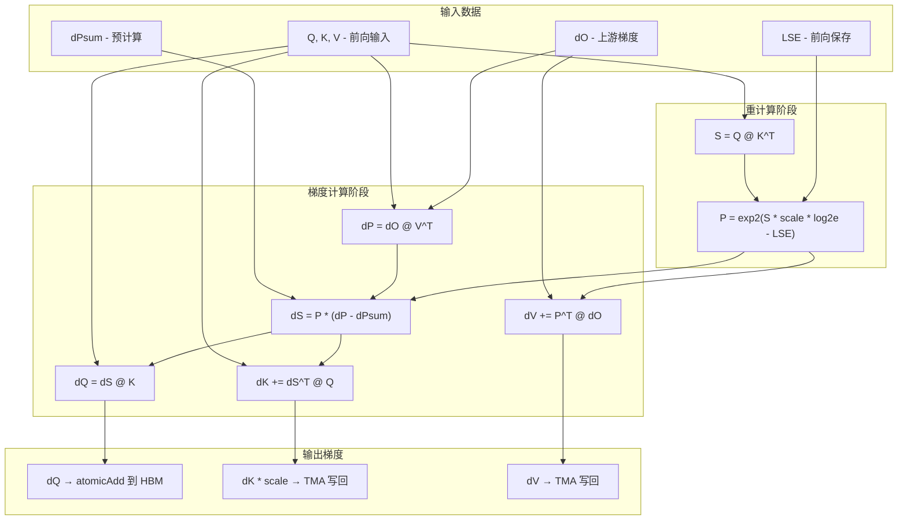
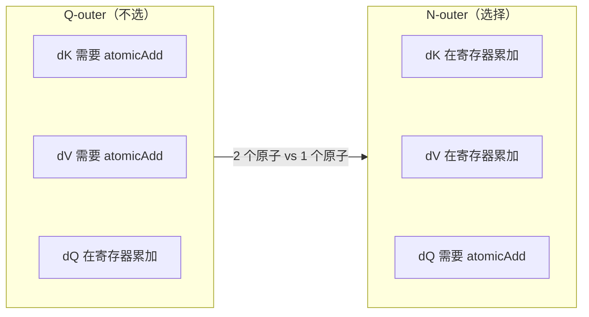
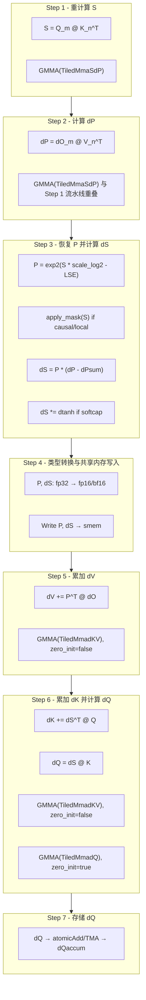
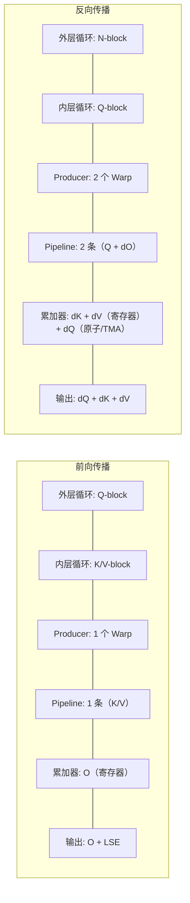

## 目录

- [1. 反向传播的挑战与核心策略](#1-反向传播的挑战与核心策略)
- [2. 梯度推导 - 从数学到代码](#2-梯度推导---从数学到代码)
- [3. N-outer Q-inner 循环结构](#3-n-outer-q-inner-循环结构)
- [4. FlashAttnBwdSm90 内核架构](#4-flashattnbwdsm90-内核架构)
- [5. Consumer 主循环 - bwd_step 逐步解析](#5-consumer-主循环---bwd_step-逐步解析)
- [6. dQ 的存储策略 - 原子累加与 TMA](#6-dq-的存储策略---原子累加与-tma)
- [7. 与前向传播的架构对比](#7-与前向传播的架构对比)
- [8. 高级优化技巧](#8-高级优化技巧)

---

## 1. 反向传播的挑战与核心策略

### 1.1 为什么反向传播比前向更难

在标准 Attention 的反向传播中，我们需要计算损失函数 $L$ 对 $Q$, $K$, $V$ 三个输入的梯度。回顾前向公式：

$$
S = QK^T, \quad P = \text{softmax}(S), \quad O = PV
$$

要计算 $\frac{\partial L}{\partial Q}$, $\frac{\partial L}{\partial K}$, $\frac{\partial L}{\partial V}$，需要用到中间矩阵 $P$（Attention 权重矩阵）。然而 $P$ 的大小为 $N \times N$——这正是 Flash Attention 极力避免存储的东西。

**核心矛盾**：

| | 标准实现 | Flash Attention |
|---|---|---|
| 前向 | 存储 $P \in \mathbb{R}^{N \times N}$ | 不存储 $P$，只保存 $O$ 和 LSE |
| 反向 | 直接读取 $P$ | $P$ 不存在，必须 **重计算** |

### 1.2 重计算策略

Flash Attention 的反向传播采用 **重计算（Recomputation）** 策略：在反向传播中重新计算 $S = QK^T$，然后利用前向保存的 LSE 恢复 $P$：

$$
P_{ij} = \exp(S_{ij} \cdot \text{scale} \cdot \log_2 e - \text{LSE}_i)
$$

其中 $\text{LSE}_i = \log \sum_j \exp(S_{ij} \cdot \text{scale})$ 已在前向传播时保存到 HBM。

**重计算的代价与收益**：

```
存储 P 矩阵：
  - 内存：O(N²) HBM 读/写 → 大序列长度时内存带宽成为瓶颈
  - 计算：0 额外 FLOP

重计算 P 矩阵：
  - 内存：仅需 O(N) 的 LSE 向量
  - 计算：额外 1 次 QK^T GEMM（前向已算过一次）
  - 净效果：用 ~33% 额外计算换取 O(N²) → O(N) 的内存节省
```

这个权衡在现代 GPU 上是值得的，因为计算吞吐量的增长远快于内存带宽。

### 1.3 前向传播需要保存什么

前向传播只需保存以下数据供反向使用：

| 保存数据 | 大小 | 用途 |
|----------|------|------|
| $Q$ | $[B, H, N, d]$ | 重计算 $S = QK^T$ |
| $K$ | $[B, H_{\text{kv}}, N, d]$ | 重计算 $S = QK^T$ |
| $V$ | $[B, H_{\text{kv}}, N, d]$ | 计算 $dP = dO \cdot V^T$ |
| $O$ | $[B, H, N, d]$ | 计算 $dP_{\text{sum}}$（部分实现中） |
| $\text{LSE}$ | $[B, H, N]$ | 恢复 $P = \exp(S - \text{LSE})$ |

总内存复杂度为 $O(BHNd)$——与输入同阶，无 $O(N^2)$ 项。

---

## 2. 梯度推导 - 从数学到代码

### 2.1 五个核心梯度

给定上游梯度 $dO = \frac{\partial L}{\partial O}$，需要计算五个中间/最终梯度：

#### (1) $dV$ — 对 V 的梯度

$$
O = PV \implies dV = P^T \cdot dO
$$

**代码对应**：$dV$ 在所有 Q-block 上累加，`zero_init=false`。

#### (2) $dP$ — 对 Attention 权重的梯度

$$
O = PV \implies dP = dO \cdot V^T
$$

**代码对应**：每个 Q-block 新计算，`zero_init=true`。

#### (3) $dS$ — 对分数矩阵的梯度（Softmax 反传核心）

Softmax 的 Jacobian 较为特殊。设 $p_i = \frac{\exp(s_i)}{\sum_j \exp(s_j)}$，则：

$$
\frac{\partial p_i}{\partial s_j} = p_i(\delta_{ij} - p_j)
$$

利用此 Jacobian 推导：

$$
dS_{ij} = P_{ij} \cdot \left( dP_{ij} - \text{dPsum}_i \right)
$$

其中 $\text{dPsum}_i = \sum_j P_{ij} \cdot dP_{ij} = \sum_j dO_i \cdot O_i^T$（逐行求和）。

> **注**：$\text{dPsum}_i$ 实际上等价于 $\sum_j dO_{ij} \cdot O_{ij}$，即 $dO$ 和 $O$ 的逐行点积。这可以在反向内核启动前预先计算。

如果启用了 **softcap**（$S = \text{softcap} \cdot \tanh(S_{\text{raw}} / \text{softcap})$），需要额外乘以 $\tanh$ 的导数：

$$
dS_{\text{raw}} = dS \cdot (1 - \tanh^2(S_{\text{raw}} / \text{softcap}))
$$

#### (4) $dQ$ — 对 Q 的梯度

$$
S = Q \cdot K^T \implies dQ = dS \cdot K
$$

**代码对应**：每个 Q-block 新计算（`zero_init=true`），然后原子累加到全局 `dQaccum`。

#### (5) $dK$ — 对 K 的梯度

$$
S = Q \cdot K^T \implies dK = dS^T \cdot Q
$$

最后需要乘以 `softmax_scale`：

$$
dK_{\text{final}} = dK \cdot \text{softmax\_scale}
$$

```cpp
// hopper/mainloop_bwd_sm90_tma_gmma_ws.hpp:~1037
for (int i = 0; i < size(tdKrdK); ++i) {
    tdKrdK(i) *= params.softmax_scale;
}
```

**代码对应**：$dK$ 在所有 Q-block 上累加，`zero_init=false`。

### 2.2 计算流程总结



### 2.3 FLOP 分析

| 操作 | FLOP | 说明 |
|------|------|------|
| $S = QK^T$ | $2N^2d$ | 重计算，前向已算过 |
| $dP = dO \cdot V^T$ | $2N^2d$ | 新计算 |
| $dS = P \odot (dP - \text{dPsum})$ | $3N^2$ | 逐元素 |
| $dV = P^T \cdot dO$ | $2N^2d$ | 累加 |
| $dK = dS^T \cdot Q$ | $2N^2d$ | 累加 |
| $dQ = dS \cdot K$ | $2N^2d$ | 每轮新算 |
| **总计** | $\approx 10N^2d$ | 前向为 $4N^2d$，反向约 2.5 倍 |

反向传播的计算量约为前向的 **2.5 倍**，这也是为什么反向内核在优化上更具挑战性。

---

## 3. N-outer Q-inner 循环结构

### 3.1 前向 vs 反向的循环顺序

Flash Attention 前向和反向使用了 **相反的循环嵌套顺序**：

```
前向传播 (Q-outer K-inner):          反向传播 (N-outer Q-inner):
for each Q-block (m_block):          for each N-block (n_block):
    clear(O)                             clear(dK, dV)
    for each K/V-block (n_block):        for each Q-block (m_block):
        S = Q @ K^T                          S = Q @ K^T
        P = softmax(S)                       P = exp(S - LSE)
        O += P @ V                           dP = dO @ V^T
    finalize(O)                              dS = P * (dP - dPsum)
    store(O, LSE)                            dV += P^T @ dO
                                             dK += dS^T @ Q
                                             dQ ← atomicAdd to HBM
                                         store(dK * scale, dV)
```

### 3.2 为什么反向选择 N-outer

循环顺序的选择取决于 **哪些梯度需要跨块累加**：

| 梯度 | 累加维度 | 前向类比 |
|------|---------|---------|
| $dK$ | 跨所有 Q-block 累加 | 类似前向中 $O$ 跨 K-block 累加 |
| $dV$ | 跨所有 Q-block 累加 | 类似前向中 $O$ 跨 K-block 累加 |
| $dQ$ | 跨所有 N-block 累加 | 无前向类比 |

如果选择 Q-outer（像前向一样），那么 $dK$ 和 $dV$ 需要原子累加——两个矩阵都需要原子操作，代价高昂。

选择 N-outer 后，$dK$ 和 $dV$ 在寄存器中累加（无需原子操作），只有 $dQ$ 需要原子累加。一个矩阵的原子操作总好过两个。



### 3.3 块坐标系统

反向内核中，Tile 的坐标系统为 `(n_block, bidh, bidb)`：

```cpp
// hopper/flash_bwd_kernel_sm90.h:222
auto [n_block, bidh, bidb, _ /*split_idx*/] = block_coord_;
```

对比前向的 `(m_block, bidh, bidb)`。这一差异体现了外层循环维度的交换。

### 3.4 Q-inner 循环中的 Masking 分离

内层循环遍历 Q-block 时，Causal Mask 的边界块处理可以被分离为三个阶段：

```cpp
// hopper/mainloop_bwd_sm90_tma_gmma_ws.hpp:~1003-1033
// 阶段 1: 需要 Causal Masking 的 Q-block（边界区域）
if constexpr ((Is_causal || Is_local) && SeparateMaskingIterations) {
    for (; m_block < m_block_masking_max; ++m_block) {
        bwd_step(m_block, causal_mask_fn);
    }
}

// 阶段 2: 完全有效的 Q-block（无需 masking）
for (; m_block < m_block_max_before_local_mask; ++m_block) {
    bwd_step(m_block, no_mask_fn);
}

// 阶段 3: 需要 Local Masking 的 Q-block（窗口边界）
if constexpr (Is_local && SeparateMaskingIterations) {
    for (; m_block < m_block_max; ++m_block) {
        bwd_step(m_block, local_mask_fn);
    }
}
```

`SeparateMaskingIterations` 在 `headdim ≤ 64` 时启用，将 masking 相关的分支完全从主循环中消除，减少指令发射压力。

---

## 4. FlashAttnBwdSm90 内核架构

### 4.1 类结构与模板参数

```cpp
// hopper/flash_bwd_kernel_sm90.h:24-25
template <class CollectiveMainloop_, class CollectiveEpilogue_, class TileScheduler_>
class FlashAttnBwdSm90 {
```

与前向内核相同的三组件模板设计。但反向内核有两种不同的 MMA 类型：

```cpp
// hopper/flash_bwd_kernel_sm90.h:38-39
using TiledMmaSdP = typename CollectiveMainloop::TiledMmaSdP;   // 用于 S=QK^T 和 dP=dO·V^T
using TiledMmadKV = typename CollectiveMainloop::TiledMmadKV;   // 用于 dK, dV 累加
```

| MMA 类型 | 用途 | 输出维度 |
|----------|------|---------|
| `TiledMmaSdP` | $S = QK^T$, $dP = dO \cdot V^T$ | $[\text{kBlockM}, \text{kBlockN}]$ |
| `TiledMmadKV` | $dK = dS^T Q$, $dV = P^T dO$ | $[\text{kBlockN}, d]$ |

### 4.2 线程组织 — 双 Warp Producer

反向内核的 Producer Warp Group (WG0) 内部有 **两个专用 Warp**：

```
Thread Block
├── Warp Group 0 (128 threads) ── Producer
│   ├── Warp 0: TMA 加载 Q, dO, LSE
│   └── Warp 1: TMA 存储 dQ
├── Warp Group 1 (128 threads) ── Consumer: MMA 计算
└── Warp Group 2 (128 threads) ── Consumer: MMA 计算
```

```cpp
// hopper/flash_bwd_kernel_sm90.h:211-240
if (warp_group_idx == 0) {  // Producer
    int warp_idx_in_warpgroup = __shfl_sync(0xffffffff, (threadIdx.x / 32) % 4, 0);
    if (warp_idx_in_warpgroup == 0) {
        // Warp 0: 加载 Q, dO, LSE 到共享内存
        mainloop.load(params.mainloop, pipeline_q, pipeline_do, ...);
    } else if (warp_idx_in_warpgroup == 1) {
        // Warp 1: 将 dQ 从共享内存写回 HBM
        mainloop.store_dq(params.mainloop, shared_storage, block_coord);
    }
}
```

**为什么需要两个 Warp？**

前向传播只有一个方向的数据流（HBM → SRAM → 计算 → HBM），一个加载 Warp 足够。但反向传播有额外的 **dQ 回写需求**：每个 Q-block 计算出 $dQ$ 后，需要通过 TMA 写回全局内存中的 `dQaccum` 缓冲区。如果共用一个 Warp，加载和存储会互相阻塞。

### 4.3 双 Pipeline 设计

反向内核使用两条独立的 Pipeline：

```cpp
// hopper/flash_bwd_kernel_sm90.h:82-83
alignas(16) typename CollectiveMainloop::MainloopPipeline::SharedStorage pipeline_q;
alignas(16) typename CollectiveMainloop::MainloopPipeline_dO::SharedStorage pipeline_do;
```

| Pipeline | 管理数据 | Stage 数 | 生产者 | 消费者 |
|----------|---------|---------|--------|--------|
| `pipeline_q` | Q + LSE | `Stages` | Warp 0 | Consumer WG |
| `pipeline_do` | dO + dPsum | `Stages_dO` | Warp 0 | Consumer WG |

Q 和 dO 可能有不同的 Pipeline 深度（`Stages` vs `Stages_dO`），因为它们的加载模式和消费节奏可能不同。

### 4.4 共享内存布局

```cpp
// hopper/flash_bwd_kernel_sm90.h:72-87
struct SharedStorage {
    struct TensorStorage {
        union {
            typename CollectiveMainloop::TensorStorage mainloop;
            // mainloop 包含: smem_q, smem_k, smem_v, smem_do, smem_ds, smem_dq, smem_lse 等
            typename CollectiveEpilogue::TensorStorage epilogue;
            // epilogue 包含: smem_dk, smem_dv
        };
    } tensors;
    struct PipelineStorage {
        barrier_KV;        // K, V 加载同步（单次使用）
        pipeline_q;        // Q 加载流水线
        pipeline_do;       // dO 加载流水线
        smem_scheduler;    // 调度器状态
    } pipelines;
};
```

**关键设计**：Mainloop 和 Epilogue 共享内存通过 `union` 重叠，与前向相同。Mainloop 阶段使用大量共享内存存储 Q, K, V, dO, dS, P 等中间数据；Epilogue 阶段复用这些空间存储 dK, dV。

### 4.5 K, V 的加载时机

与前向不同，反向内核中 K 和 V 对于整个 Q-inner 循环是 **不变的**（属于当前 N-block）。它们在内层循环开始前一次性加载到共享内存，并通过 `barrier_KV` 同步：

```cpp
// hopper/flash_bwd_kernel_sm90.h:81
alignas(16) cutlass::arch::ClusterTransactionBarrier barrier_KV;
```

Producer Warp 0 在进入 Q-inner 循环前加载 K 和 V，通过 `barrier_KV` 通知 Consumer 加载完成。Consumer 在整个内层循环中重复使用这些 K, V 数据。

---

## 5. Consumer 主循环 - bwd_step 逐步解析

### 5.1 Consumer 的整体流程

```cpp
// hopper/flash_bwd_kernel_sm90.h:241-276（简化）
cutlass::arch::warpgroup_reg_alloc<MmaRegisterRequirement>();
TiledMmadKV tiled_mma_dKV;

for (auto work_tile_info = scheduler.get_initial_work(params.scheduler); ...) {
    // 为当前 N-block 初始化 dK, dV 累加器
    Tensor tdKrdK = partition_fragment_C(tiled_mma_dKV, ...);  // 寄存器中的 dK
    Tensor tdVrdV = partition_fragment_C(tiled_mma_dKV, ...);  // 寄存器中的 dV
    clear(tdKrdK);  clear(tdVrdV);  // 初始化为零

    // 执行 Q-inner 主循环
    bool tile_valid = mainloop.mma(params.mainloop, pipeline_q, pipeline_do,
                                    smem_pipe_read, smem_pipe_read_do,
                                    tdKrdK, tdVrdV, ...);

    // 写回 dK, dV
    if (tile_valid) {
        epilogue.store(params.epilogue, tdKrdK, tdVrdV, ...);
    } else {
        epilogue.store_zero(params.epilogue, ...);
    }
}
```

### 5.2 bwd_step — 单个 Q-block 的梯度计算

`bwd_step` 是反向传播的计算核心，对一个 $(Q_m, K_n)$ 块对执行完整的梯度计算。以下是其七个步骤：



下面逐步详解每个步骤的代码实现。

#### Step 1: 重计算 S = QK^T

```cpp
// mainloop_bwd_sm90_tma_gmma_ws.hpp:~835-837
Tensor tSrS = partition_fragment_C(tiled_mma_SdP, ...);
consumer_wait(pipeline_q, smem_pipe_read);      // 等待 Q 加载完成
flash::gemm</*zero_init=*/true, /*wg_wait=*/-1, /*SwapAB=*/SdP_swapAB>(
    tiled_mma_SdP,
    tSrQ(_, _, _, smem_pipe_read.index()),       // Q 从 smem
    tSrK,                                         // K 常驻 smem
    tSrS);                                        // 输出: S 矩阵
```

- `zero_init=true`：每轮 QK 重新计算
- `wg_wait=-1`：不等待之前的 GMMA（异步发射）
- `SdP_swapAB`：布局优化，若为 true 则计算 $K \cdot Q^T$ 而非 $Q \cdot K^T$

#### Step 2: 计算 dP = dO · V^T

```cpp
// mainloop_bwd_sm90_tma_gmma_ws.hpp:~848-851
Tensor tdPrdP = partition_fragment_C(tiled_mma_SdP, ...);
consumer_wait(pipeline_do, smem_pipe_read_do_cur);   // 等待 dO 加载完成
flash::gemm</*zero_init=*/true, /*wg_wait=*/-1, /*SwapAB=*/SdP_swapAB>(
    tiled_mma_SdP,
    tdPrdO(_, _, _, smem_pipe_read_do_cur.index()),  // dO 从 smem
    tdPrV,                                            // V 常驻 smem
    tdPrdP);                                          // 输出: dP 矩阵
```

Step 1 和 Step 2 使用相同的 `TiledMmaSdP`，因为它们的矩阵维度相同（$M \times N$）。两个 GEMM 可以通过 `wg_wait` 实现流水线重叠。

#### Step 3: 恢复 P 并计算 dS

```cpp
// mainloop_bwd_sm90_tma_gmma_ws.hpp:~852-896
warpgroup_wait<1>();  // 等待 S 计算完成

// 3a. 应用 softcap 并预计算 dtanh（如果启用）
if constexpr (Has_softcap) { flash::apply_softcap(tSrS, params.softcap_val); }
auto dtanh = Has_softcap ? flash::calculate_dtanh(scores) : nullptr;

// 3b. 应用 causal/local mask
mask_fn(tSrS, m_block);

// 3c. 恢复 P = exp2(S * scale * log2e - LSE)
for (int mi = 0; mi < size<0>(scores); ++mi) {
    float lse_scaled = tLSErLSE(mi);
    for (int ni = 0; ni < size<1>(scores); ++ni) {
        scores(mi, ni) = exp2f(scores(mi, ni) * params.softmax_scale_log2 - lse_scaled);
    }
}

// 3d. 等待 dP 完成，计算 dS = P * (dP - dPsum)
warpgroup_wait<0>();
for (int mi = 0; mi < size<0>(dS); ++mi) {
    float dP_sum_cur = tLSErdPsum(mi);
    for (int ni = 0; ni < size<1>(dS); ++ni) {
        dS(mi, ni) = scores(mi, ni) * (dS(mi, ni) - dP_sum_cur);
        if constexpr (Has_softcap) { dS(mi, ni) *= dtanh(mi, ni); }
    }
}
```

这里有两个关键的 `warpgroup_wait` 调用：
- `warpgroup_wait<1>()`：等待 S 的 GMMA 完成（允许 dP 的 GMMA 继续异步执行）
- `warpgroup_wait<0>()`：等待 dP 的 GMMA 也完成

#### Step 4: 类型转换与共享内存写入

```cpp
// mainloop_bwd_sm90_tma_gmma_ws.hpp:~898-924
// P: fp32 → fp16/bf16
Tensor rP = make_tensor_like<Element>(tSrS);
flash::convert_type_out(tSrS, rP);

// dS: fp32 → fp16/bf16
Tensor rdS = make_tensor_like<Element>(tdPrdP);
flash::convert_type_out(tdPrdP, rdS);

// 写入共享内存（用于后续 dKV 的 GEMM）
if constexpr (!Mma_dKV_is_RS) {
    NamedBarrier::sync(NumMmaThreads, BwdNamedBarriers::PdS);  // 同步所有 MMA warp
    cute::copy(smem_tiled_copy_PdS, tPaP, tPsP);    // P → smem
}
cute::copy(smem_tiled_copy_PdS, tdSadS, tdSsdS);    // dS → smem
NamedBarrier::sync(NumMmaThreads, BwdNamedBarriers::PdS);
```

`Mma_dKV_is_RS`（Row-Stationary）优化：如果为 true，P 和 dS 直接从寄存器参与下一步的 GEMM 运算，无需先写入共享内存。

#### Step 5: 累加 dV

```cpp
// mainloop_bwd_sm90_tma_gmma_ws.hpp:~925-935
if constexpr (Mma_dKV_is_RS) {
    // RS 模式：P 直接从寄存器参与 GEMM
    Tensor tdVrP = make_tensor(rP.data(), convert_layout_acc_Aregs<TiledMmadKV>(...));
    flash::gemm</*zero_init=*/false>(tiled_mma_dKV, tdVrP, tdVrdO, tdVrdV);
} else {
    // 标准模式：P 从共享内存读取
    flash::gemm</*zero_init=*/false, /*SwapAB=*/dKV_swapAB>(
        tiled_mma_dKV, tdVrP_cur, tdVrdO, tdVrdV);
}
```

`zero_init=false` 意味着 dV 跨 Q-block **累加**——这是 N-outer 循环设计的核心优势。

#### Step 6: 计算 dK 和 dQ

```cpp
// mainloop_bwd_sm90_tma_gmma_ws.hpp:~938-950
// dQ = dS @ K（每轮重新计算）
flash::gemm</*zero_init=*/true, /*wg_wait=*/1, /*SwapAB=*/dQ_swapAB>(
    tiled_mma_dQ, tdQrdS_cur, tdQrK, tdQrdQ);

pipeline_do.consumer_release(smem_pipe_read_do_cur);  // 释放 dO 共享内存

// dK += dS^T @ Q（累加）
if constexpr (Mma_dKV_is_RS) {
    Tensor tdKrdS = make_tensor(rdS.data(), convert_layout_acc_Aregs<TiledMmadKV>(...));
    flash::gemm</*zero_init=*/false, /*wg_wait=*/1>(tiled_mma_dKV, tdKrdS, tdKrQ, tdKrdK);
} else {
    flash::gemm</*zero_init=*/false, /*wg_wait=*/1, /*SwapAB=*/dKV_swapAB>(
        tiled_mma_dKV, tdKrdS_cur, tdKrQ, tdKrdK);
}
```

注意 $dQ$ 和 $dK$ 使用不同的 MMA 类型：
- $dQ$: `TiledMmadQ`，输出维度 $[M, d]$
- $dK$: `TiledMmadKV`，输出维度 $[N, d]$（与 dV 相同）

#### Step 7: 存储 dQ

dQ 的存储在下一节详细分析。

---

## 6. dQ 的存储策略 - 原子累加与 TMA

### 6.1 dQ 的特殊性

$dQ$ 是唯一需要 **跨 N-block 累加** 的梯度。由于 N-outer 循环结构，不同的 N-block 可能由不同的 SM 处理，因此 $dQ$ 的累加必须通过全局内存完成。

Flash Attention 提供两种策略：

### 6.2 策略 1: 原子累加（Atomic Add）

```cpp
// mainloop_bwd_sm90_tma_gmma_ws.hpp:~960-966（简化）
if constexpr (!dQacc_use_TMA) {
    // 将 dQ 重新解释为 float4 以减少原子操作次数
    Tensor tdQrdQ_atomic = recast<float4>(tdQrdQ);
    Tensor tdQgdQaccum_atomic = recast<float4>(tdQgdQaccum(_, _, _, m_block));

    for (int i = 0; i < size(tdQrdQ_atomic); ++i) {
        atomicAdd(&tdQgdQaccum_atomic(i), tdQrdQ_atomic(i));
    }
}
```

- 使用 `float4` 原子加（一次操作 4 个 float），减少全局内存事务数
- 适用于 `headdim ≥ 256`
- 不需要共享内存中转
- **缺点**：原子操作引入竞争，多个 SM 可能同时更新相同 dQ 行

### 6.3 策略 2: TMA 写回

```cpp
// mainloop_bwd_sm90_tma_gmma_ws.hpp:~951-958（简化）
if constexpr (dQacc_use_TMA) {
    int warp_group_idx = canonical_warp_group_idx_nosync() - 1;

    // 等待 dQ 共享内存空闲（Producer Warp 1 已完成上一次写回）
    NamedBarrier::sync(NumThreadsPerWarpGroup + NumThreadsPerWarp,
                       BwdNamedBarriers::dQEmptyWG1 + warp_group_idx);

    // Consumer 将 dQ 写入共享内存
    cute::copy(r2s_tiled_copy_dQaccum, taccdQrdQ, tdQsdQaccum);
    fence_view_async_shared();

    // 通知 Producer Warp 1 可以执行 TMA 写回
    NamedBarrier::arrive(NumThreadsPerWarpGroup + NumThreadsPerWarp,
                         BwdNamedBarriers::dQFullWG1 + warp_group_idx);
}
```

这个策略利用了 Producer WG0 中的 **Warp 1** 作为 dQ 的 TMA 写回线程：

```
Consumer WG1                    Producer Warp 1
    │                               │
    ├─ 计算 dQ                      │
    ├─ Wait(dQEmpty)                │
    ├─ Copy dQ → smem               │
    ├─ Signal(dQFull)  ────────►    ├─ Wait(dQFull)
    │                               ├─ TMA Store smem → HBM (dQaccum)
    │                               ├─ Signal(dQEmpty)  ────────►  下一轮
    ├─ 继续下一个 Q-block            │
```

- 适用于 `headdim < 256`
- Consumer 和 Producer 通过 Named Barrier 乒乓交换
- **优点**：TMA 异步写回不占用 Consumer 的计算时间

### 6.4 Deterministic 模式

在 GQA（Grouped Query Attention）场景中，多个 query head 共享一个 KV head。不同 query head 的 $dQ$ 累加到同一目标位置时，原子操作的顺序不确定会导致浮点结果不可复现。

Deterministic 模式通过信号量实现严格的串行化：

```cpp
// hopper/epilogue_bwd.hpp:~463-515（简化）
if constexpr (Deterministic) {
    // 等待：当前 query head 在 group 中的序号匹配时才执行
    Barrier::wait_eq(lock_ptr, thread_idx, n_block * num_batch * num_head_kv, bidh_idx_in_group);
}

// 执行原子累加
atomicAdd(&tdVgdV_atomic(i), tdVrdV_atomic(i));

if constexpr (Deterministic) {
    // 通知：下一个 query head 可以开始
    Barrier::arrive_inc(lock_ptr, thread_idx, n_block * num_batch * num_head_kv);
}
```

---

## 7. 与前向传播的架构对比

### 7.1 结构对比



### 7.2 详细对比表

| 维度 | 前向 | 反向 |
|------|------|------|
| **外层循环** | Q-block (m_block) | N-block (n_block) |
| **内层循环** | K/V-block (n_block) | Q/dO-block (m_block) |
| **常驻 SRAM** | Q（内层不变） | K, V（内层不变） |
| **流式加载** | K, V（Pipeline） | Q, dO, LSE, dPsum（Pipeline） |
| **寄存器累加** | O | dK, dV |
| **全局累加** | 无 | dQ（atomicAdd 或 TMA） |
| **Producer Warp** | 1（加载 K/V） | 2（Warp 0 加载 Q/dO, Warp 1 存储 dQ） |
| **Pipeline 数** | 1（或 2 含 V 转置） | 2（pipeline_q + pipeline_do） |
| **MMA 类型** | 2（QK + PV） | 3~4（SdP + dKV + dQ, 可选 dP） |
| **GMMA 次数/块** | 2 | 5（S, dP, dV, dK, dQ） |
| **Softmax 方向** | 前向 Online Softmax | 反向：exp2(S - LSE) 恢复 P |
| **计算量** | ~$4N^2d$ | ~$10N^2d$（2.5×） |

### 7.3 为什么反向更复杂

1. **更多 GEMM 操作**：前向每块 2 次 GEMM，反向每块 5 次
2. **三路梯度输出**：dQ, dK, dV vs 前向仅 O
3. **dQ 全局同步**：需要跨 SM 的原子操作或 TMA 写回
4. **更大的寄存器压力**：同时在寄存器中保存 dK, dV 累加器、S, dP, dS 中间结果
5. **两条 Pipeline**：Q 和 dO 独立加载，同步更复杂
6. **Masking 的双向影响**：Causal mask 影响有效 Q-block 范围的计算

---

## 8. 高级优化技巧

### 8.1 dKV_swapAB — 矩阵布局转置

`dKV_swapAB` 控制 P 和 dS 在共享内存中的存储布局：

```cpp
// 标准模式 (dKV_swapAB = false):
// dV = P^T @ dO，P 按行主序存储
flash::gemm<SwapAB=false>(tiled_mma_dKV, P, dO, dV);

// SwapAB 模式 (dKV_swapAB = true):
// dV = dO^T @ P^T，P 转置存储在 smem，减少 bank conflict
flash::gemm<SwapAB=true>(tiled_mma_dKV, dO, P_transposed, dV);
```

转置存储可以改善共享内存的 bank 访问模式，在某些 headdim 配置下提高吞吐量。

### 8.2 Mma_dKV_is_RS — 寄存器直接参与 GEMM

当 `Mma_dKV_is_RS = true` 时，P 和 dS 直接从寄存器（而非共享内存）参与 dK/dV 的 GMMA 运算：

```cpp
if constexpr (Mma_dKV_is_RS) {
    // 寄存器 → GMMA A 操作数
    Tensor tdVrP = make_tensor(rP.data(), convert_layout_acc_Aregs<TiledMmadKV>(...));
    flash::gemm<zero_init=false>(tiled_mma_dKV, tdVrP, tdVrdO, tdVrdV);
}
```

**优势**：跳过 smem 写/读的延迟和带宽开销。**限制**：需要足够的寄存器预算。

### 8.3 Slice_dQKV_Mma — headdim=256 的切片优化

当 `headdim = 256` 时，寄存器压力极大。Slice 优化将 GMMA 拆成两半：

```cpp
// 第一半
flash::gemm<..., M_slice=0>(tiled_mma_dKV, tdVrP_cur, tdVrdO, tdVrdV);

// 交替执行 dQ 原子加（释放寄存器）
for (int i = 0; i < size(tdQrdQ_atomic) / 2; ++i) {
    atomicAdd(&tdQgdQaccum_atomic(i), tdQrdQ_atomic(i));
}

// 第二半
flash::gemm<..., M_slice=1>(tiled_mma_dKV, tdVrP_cur, tdVrdO, tdVrdV);
```

通过将 GEMM 和 dQ 原子操作交织，保持硬件忙碌的同时降低峰值寄存器需求。

### 8.4 ShuffleLSE — 寄存器节省

在 `SdP_swapAB && headdim ≤ 64` 时，LSE 值通过 warp 内的 shuffle 指令在 8 个线程间共享：

```cpp
if constexpr (ShuffleLSE) {
    // 每 8 个线程共享一份 LSE
    for (int i = 0; i < kStatsPerThread; ++i) {
        tLSErLSE(i) = tLSEsLSE((thread_idx % 32) / 4 + i * 8, smem_pipe_read.index());
    }
    // 使用时通过 __shfl_sync 获取对应线程的值
    float lse_scaled = __shfl_sync(0xffffffff, tLSErLSE(mi / 8), (mi % 8) * 4 + (thread_idx % 4));
}
```

用 shuffle 通信的延迟换取 8 倍的寄存器节省（对于小 headdim 的场景尤为重要）。

### 8.5 Epilogue — dK/dV 的写回

反向内核的 Epilogue 将寄存器中的 dK, dV 写回 HBM：

```
dK/dV 在寄存器（fp32）
    ↓ convert_type_out
dK/dV 在寄存器（fp16/bf16）
    ↓ copy (R2S)
dK/dV 在共享内存
    ↓ TMA Store
dK/dV 在 HBM
```

对于 GQA 场景，多个 query head 的 dK/dV 需要累加到同一个 KV head 位置：

```cpp
// epilogue_bwd.hpp:~450（简化）
int bidh_kv = params.qhead_per_khead_divmod.divmod(bidh_idx_in_group, bidh);
// bidh_kv: KV head 索引
// bidh_idx_in_group: 当前 query head 在 group 中的序号
```

GQA Epilogue 使用 fp32 精度的 `dKaccum`/`dVaccum` 缓冲区进行累加，最终再转换为输出精度。

---

## 总结

Flash Attention 的反向传播通过以下核心设计实现了 IO 最优的梯度计算：

| 设计决策 | 原因 | 效果 |
|----------|------|------|
| **重计算 P** | 避免存储 $O(N^2)$ 矩阵 | 内存 $O(N)$，增加 ~33% 计算 |
| **N-outer 循环** | dK, dV 寄存器累加 | 减少 2/3 原子操作 |
| **双 Warp Producer** | dQ TMA 写回不阻塞加载 | 加载/存储完全并行 |
| **双 Pipeline** | Q 和 dO 独立调度 | 灵活的 stage 配置 |
| **5 次 GEMM/块** | S, dP, dV, dK, dQ 全部分块 | 所有操作 IO-aware |
| **dQ 原子/TMA 双模式** | 适配不同 headdim | 大/小 headdim 各有最优路径 |
| **Masking 分离** | 边界块与完整块独立循环 | 消除主循环分支开销 |

> 更详细的 CUDA 内核代码逐行解析见 [反向内核实现解析](../03-cuda-kernel/04-backward-kernel-impl.md)。

---

## 导航

- 上一篇：[前向传播算法详解](03-forward-pass.md)
- 下一篇：[GPU 编程基础](../03-cuda-kernel/01-gpu-programming-basics.md)
- [返回目录](../README.md)
