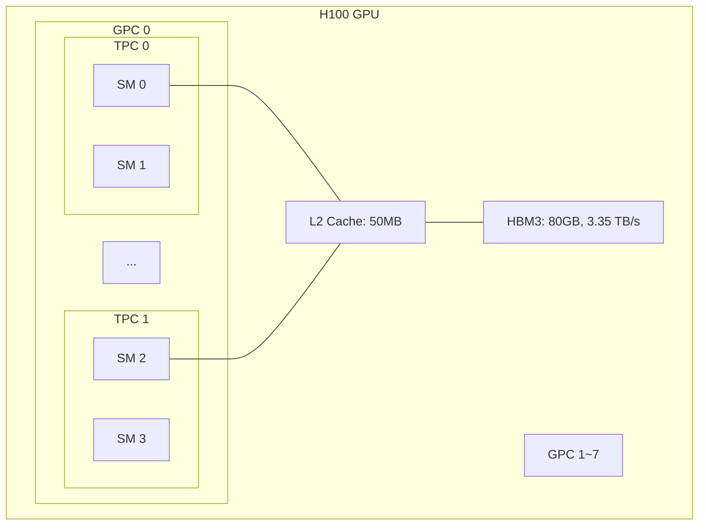
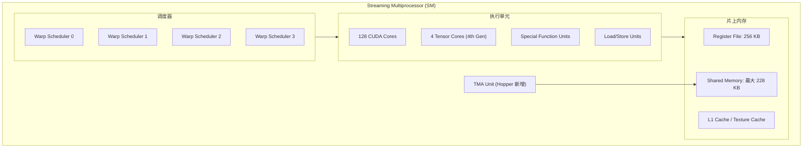
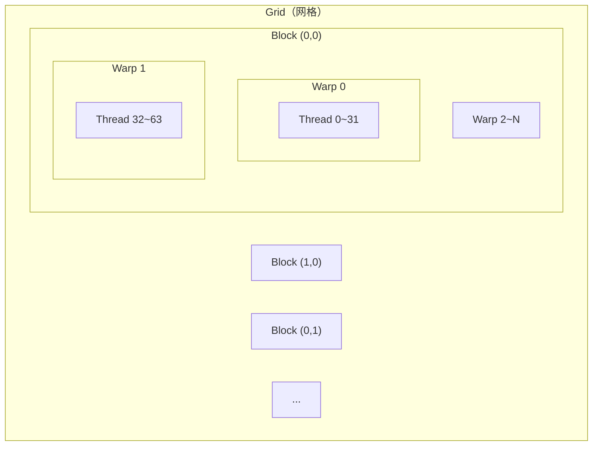
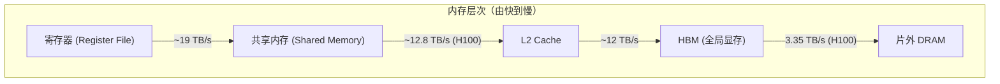
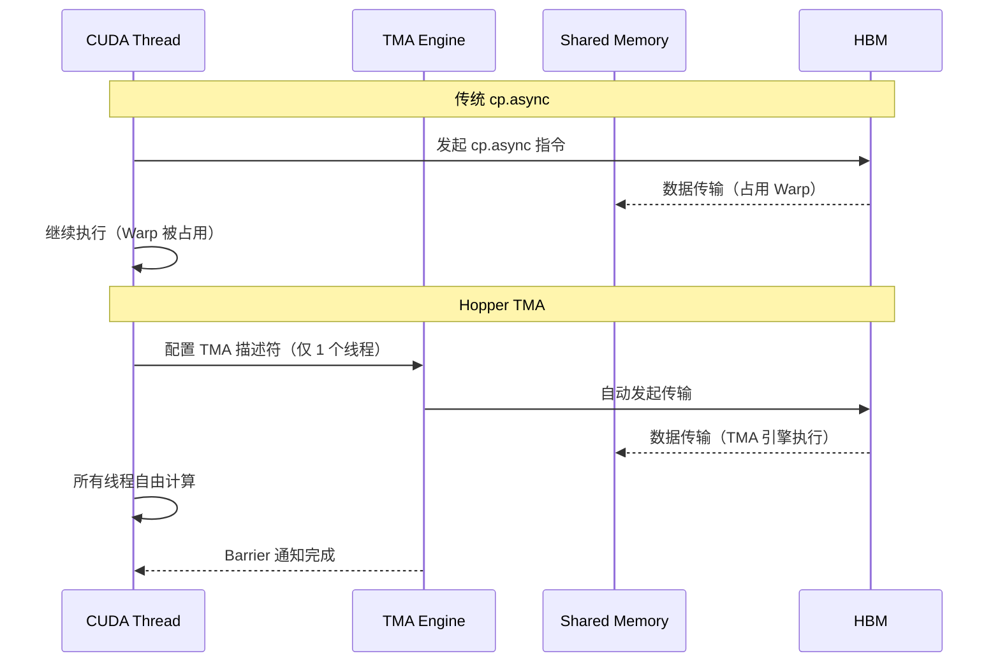
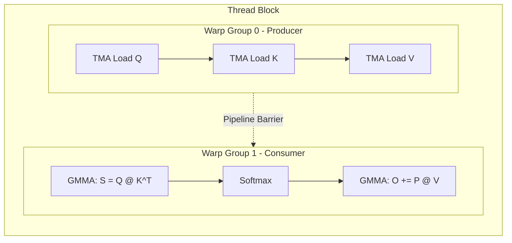
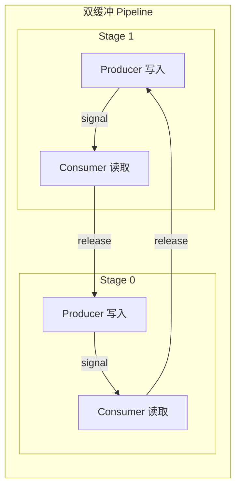
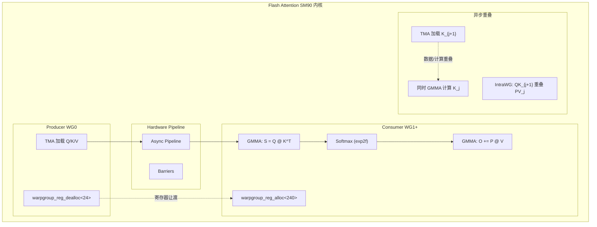

## 目录

- [1. GPU 硬件架构概览](#1-gpu-硬件架构概览)
- [2. CUDA 编程模型](#2-cuda-编程模型)
- [3. 内存层次与带宽](#3-内存层次与带宽)
- [4. CUTLASS 与 CuTe 框架](#4-cutlass-与-cute-框架)
- [5. Hopper 架构新特性](#5-hopper-架构新特性)
- [6. Flash Attention 中的 Hopper 特性应用](#6-flash-attention-中的-hopper-特性应用)

---

## 1. GPU 硬件架构概览

### 1.1 从 CPU 到 GPU

CPU 和 GPU 有着根本不同的设计哲学：

| 维度 | CPU | GPU |
|------|-----|-----|
| 核心数 | 8~64 个强核心 | 数千个轻量核心 |
| 设计目标 | 低延迟，单线程性能 | 高吞吐，大规模并行 |
| 缓存 | 大容量多级缓存 | 小缓存，宽带宽 |
| 控制流 | 复杂分支预测 | 简单控制，SIMT 执行 |

Flash Attention 的性能关键在于充分利用 GPU 的 **大规模并行** 和 **高内存带宽**，同时规避 **内存墙**（计算速度远快于内存传输速度）。

### 1.2 GPU 硬件层次

以 NVIDIA H100（Hopper 架构）为例：



**关键参数（H100 SXM）**：

| 层级 | 数量 | 说明 |
|------|------|------|
| GPC | 8 | Graphics Processing Cluster |
| TPC / GPC | 9 | Texture Processing Cluster |
| SM / TPC | 2 | Streaming Multiprocessor |
| SM 总数 | 132 | 实际可用约 128~132 |
| CUDA Core / SM | 128 | FP32 运算单元 |
| Tensor Core / SM | 4 | 矩阵运算单元（第四代） |
| 寄存器 / SM | 256 KB | 最快的存储 |
| 共享内存 / SM | 最大 228 KB | 可编程的片上缓存 |
| L2 Cache | 50 MB | 全局共享 |
| HBM3 | 80 GB, 3.35 TB/s | 全局显存 |

### 1.3 SM 内部结构

每个 SM（Streaming Multiprocessor）是 GPU 的基本计算单元：



**Warp — GPU 执行的基本单位**：

- 1 个 Warp = 32 个线程，执行相同指令（SIMT 模型）
- 1 个 SM 最多同时驻留 64 个 Warp（2048 个线程）
- Warp 内线程可通过 `__shfl_sync` 直接交换数据（零开销）

**Warp Group — Hopper 新概念**：

- 1 个 Warp Group = 4 个 Warp = 128 个线程
- Hopper 的 GMMA 指令以 Warp Group 为粒度执行
- Flash Attention 中，1 个 Warp Group 作为 Producer，1~3 个 Warp Group 作为 Consumer

---

## 2. CUDA 编程模型

### 2.1 Grid → Block → Thread 层次

CUDA 将并行计算组织为三级层次：



| 层级 | 映射到硬件 | 同步机制 | 数据共享 |
|------|-----------|---------|---------|
| Grid | 整个 GPU | 无（内核间同步） | 全局内存 |
| Block | 1 个 SM | `__syncthreads()` | 共享内存 |
| Warp | 32 线程 SIMT | 隐式同步 | 寄存器 shuffle |

### 2.2 内核启动

```cpp
// 典型的 CUDA 内核启动
dim3 grid(num_blocks_x, num_blocks_y, num_blocks_z);
dim3 block(threads_per_block);
kernel<<<grid, block, shared_mem_size>>>(args...);
```

Flash Attention 的内核启动：

```cpp
// flash_api.cpp 中的启动方式（简化）
dim3 grid = FlashAttnFwdSm90::get_grid_shape(params);    // 由调度器决定
dim3 block = FlashAttnFwdSm90::get_block_shape();         // 256~512 线程
int smem_size = FlashAttnFwdSm90::SharedStorageSize;       // 通常接近 228 KB 上限
kernel<<<grid, block, smem_size, stream>>>(params, smem_buf);
```

### 2.3 持久化内核（Persistent Kernel）

传统 CUDA 内核每个 Block 处理一个数据块后退出。Flash Attention 使用 **持久化内核**——每个 Block 在一个循环中处理多个数据块：

```
传统内核:
  Block 0 → Tile 0 → 退出
  Block 1 → Tile 1 → 退出
  ... (启动 N 个 Block)

持久化内核:
  Block 0 → Tile 0 → Tile 4 → Tile 8 → ... → 退出
  Block 1 → Tile 1 → Tile 5 → Tile 9 → ... → 退出
  Block 2 → Tile 2 → Tile 6 → Tile 10 → ... → 退出
  Block 3 → Tile 3 → Tile 7 → Tile 11 → ... → 退出
  (只启动 SM_count 个 Block)
```

**优势**：
- 消除内核启动开销（内核启动在 GPU 上需要 5~15 μs）
- Block 数量固定为 SM 数量，不浪费调度资源
- 启用 L2 Cache Swizzling 等跨 Block 的优化

---

## 3. 内存层次与带宽

### 3.1 内存层次详解



| 内存类型 | 容量 (H100) | 带宽 | 延迟 | 作用域 |
|----------|------------|------|------|--------|
| 寄存器 | 256 KB / SM | ~19 TB/s | 1 cycle | 单线程 |
| 共享内存 | 228 KB / SM | ~12.8 TB/s | ~20 cycles | Block 内 |
| L2 Cache | 50 MB | ~12 TB/s | ~200 cycles | 全 GPU |
| HBM3 | 80 GB | 3.35 TB/s | ~400 cycles | 全 GPU |

### 3.2 Arithmetic Intensity（算术强度）

**算术强度** 定义为计算量（FLOP）与内存访问量（Byte）之比：

$$
\text{Arithmetic Intensity} = \frac{\text{FLOP}}{\text{Bytes Transferred}}
$$

H100 的 **平衡点（Ridge Point）**：

$$
\frac{\text{FP16 TFLOPS}}{\text{HBM Bandwidth}} = \frac{989.5 \text{ TFLOPS}}{3.35 \text{ TB/s}} \approx 295 \frac{\text{FLOP}}{\text{Byte}}
$$

这意味着：每从 HBM 读取 1 Byte 数据，GPU 需要执行 295 次 FP16 运算才能充分利用计算能力。低于这个比值，内核是 **内存瓶颈**（memory-bound）；高于则是 **计算瓶颈**（compute-bound）。

**Standard Attention vs Flash Attention**：

```
Standard Attention (N=4096, d=128):
  读写 S, P 矩阵: 2 × N² × 2 bytes = 64 MB
  计算: 4 × N² × d FLOP ≈ 8.6 GFLOP
  Intensity ≈ 128 FLOP/Byte → 内存瓶颈

Flash Attention (分块后):
  读写 Q, K, V, O: 4 × N × d × 2 bytes ≈ 4 MB
  计算: 4 × N² × d FLOP ≈ 8.6 GFLOP
  Intensity ≈ 2048 FLOP/Byte → 计算瓶颈 ✓
```

Flash Attention 通过消除 $O(N^2)$ 的中间矩阵读写，将算术强度从 $O(d)$ 提升到 $O(Nd/B)$（$B$ 为块大小），从内存瓶颈转变为计算瓶颈。

### 3.3 Bank Conflict

共享内存被划分为 32 个 **bank**，每个 bank 宽 4 bytes。当同一 Warp 中多个线程访问同一 bank 的不同地址时，发生 **bank conflict**，导致串行化访问：

```
无 conflict（stride-1 访问）:
  Thread 0 → Bank 0
  Thread 1 → Bank 1
  ...
  Thread 31 → Bank 31
  → 单周期完成

有 conflict（stride-2 访问）:
  Thread 0 → Bank 0
  Thread 1 → Bank 2
  ...
  Thread 16 → Bank 0  ← 与 Thread 0 冲突！
  → 2 周期完成（2-way conflict）
```

Flash Attention 通过 **Swizzle** 布局消除 bank conflict。CuTe 框架提供了 `Swizzle<B, M, S>` 模板自动生成无冲突的内存访问模式。

---

## 4. CUTLASS 与 CuTe 框架

### 4.1 CUTLASS 简介

[CUTLASS](https://github.com/NVIDIA/cutlass)（CUDA Templates for Linear Algebra Subroutines）是 NVIDIA 开发的 C++ 模板库，用于高性能矩阵运算。Flash Attention 基于 CUTLASS 3.x 构建。

CUTLASS 的分层架构：

| 层 | 抽象 | Flash Attention 中的对应 |
|----|------|------------------------|
| Device | 内核启动与参数 | `flash_api.cpp` |
| Kernel | 线程组织与共享内存 | `FlashAttnFwdSm90` |
| Collective | 多线程协作的 GEMM | `CollectiveMainloopFwdSm90` |
| MMA Atom | 单条 Tensor Core 指令 | GMMA wgmma.mma_async |
| Copy Atom | 单条内存操作指令 | TMA cp.async.bulk |

### 4.2 CuTe — 统一的张量抽象

CuTe（CUTLASS Tensor Engine）是 CUTLASS 3.x 的核心抽象层，用统一接口描述张量的 **形状（Shape）** 和 **布局（Layout）**：

```cpp
// CuTe Layout 示例
// 一个 128×64 的矩阵，行主序（stride = 64）
auto layout = make_layout(make_shape(128, 64), make_stride(64, 1));

// Swizzle 布局（消除 bank conflict）
auto swizzled = composition(Swizzle<3, 3, 3>{}, layout);
```

**CuTe 在 Flash Attention 中的应用**：

1. **张量分区（Partition）**：将全局矩阵按 MMA 指令的需求切分为线程级别的 fragment
2. **布局转换**：在寄存器、共享内存、全局内存之间转换数据布局
3. **TMA 描述符**：生成 TMA 硬件所需的内存描述符

```cpp
// Flash Attention 中典型的 CuTe 用法
Tensor sQ = make_tensor(make_smem_ptr(smem_q), SmemLayoutQ{});    // 共享内存张量
Tensor tSrS = partition_fragment_C(tiled_mma, TileShape{});        // MMA 输出寄存器
Tensor gK = local_tile(mK, TileShape{}, make_coord(n_block, _0{})); // 全局内存切片
```

### 4.3 TiledMma 与 TiledCopy

CUTLASS 使用 `TiledMma` 和 `TiledCopy` 描述多线程协作的计算和内存操作：

```
TiledMma:
  - 描述一组线程如何协作完成一个矩阵乘法
  - 包含 MMA Atom（硬件指令）+ 线程映射 + Permutation
  - Flash Attention 中: TiledMmaQK (S = Q @ K^T), TiledMmaPV (O += P @ V)

TiledCopy:
  - 描述一组线程如何协作完成一次数据拷贝
  - 包含 Copy Atom（内存指令）+ 线程映射
  - Flash Attention 中: TMA copy (HBM → SMEM), R2S copy (Register → SMEM)
```

---

## 5. Hopper 架构新特性

Hopper（SM90, H100）引入了四项对 Flash Attention 至关重要的新特性。

### 5.1 TMA — Tensor Memory Accelerator

TMA 是一个 **硬件级的内存拷贝引擎**，可以在不占用任何 CUDA Core 或 Warp 的情况下完成数据传输：



**TMA 的关键优势**：

| 特性 | 传统 cp.async | TMA |
|------|-------------|-----|
| 发起线程 | 所有线程参与 | 仅 1 个线程 |
| Warp 占用 | 占用发起 Warp | 不占用任何 Warp |
| 地址计算 | 每个线程单独计算 | TMA 硬件自动计算 |
| 多维支持 | 需手动计算偏移 | 原生支持 1D~5D 张量 |
| 边界处理 | 需手动 predicate | 自动填充越界区域为 0 |

```cpp
// Flash Attention 中的 TMA 使用示例
// 1. 在 host 端创建 TMA 描述符
auto tma_load_Q = make_tma_copy(SM90_TMA_LOAD{}, gQ, sQ_layout, TileShape{}, ClusterShape{});

// 2. 在 device 端仅需 1 个线程发起
if (cute::elect_one_sync()) {
    cute::copy(tma_load_Q, tQgQ, tQsQ);   // 1 条指令，TMA 引擎自动完成
}
```

### 5.2 GMMA — 异步 Warp Group 级矩阵乘法

GMMA（Group Matrix Multiply Accumulate）是 Hopper 的第四代 Tensor Core 指令，以 **Warp Group（128 线程）** 为粒度执行矩阵乘法：

| 特性 | Ampere (SM80) HMMA | Hopper (SM90) GMMA |
|------|--------------------|--------------------|
| 执行粒度 | Warp (32 线程) | Warp Group (128 线程) |
| 指令 | `mma.sync.aligned` | `wgmma.mma_async` |
| 操作数来源 | 寄存器 + 共享内存 | 寄存器/共享内存 + 共享内存 |
| 异步性 | 同步执行 | 异步执行 + `wgmma.wait_group` |
| 矩阵尺寸 | M16×N8×K16 | M64×N8~256×K16 |

```cpp
// GMMA 的异步特性
flash::gemm</*zero_init=*/true, /*wg_wait=*/-1>(
    tiled_mma, A, B, C);                    // 异步发射 GMMA

// ... 可以在此执行其他计算（GMMA 在后台执行）...

warpgroup_wait<0>();                          // 等待所有 GMMA 完成
// 此时 C 中的结果可用
```

`wg_wait` 参数控制等待策略：
- `-1`：不等待（完全异步）
- `0`：等待所有之前的 GMMA 完成
- `N`：等待到最多剩余 N 个未完成的 GMMA

Flash Attention 利用这种异步性实现 **IntraWGOverlap**：在 PV GEMM 执行的同时启动下一个 QK GEMM。

### 5.3 Warp Specialization

Hopper 支持在同一 Thread Block 内，不同 Warp Group 执行 **完全不同的代码路径**，并通过硬件 Pipeline 同步：



**寄存器重分配**：

```cpp
// Producer 释放多余寄存器
cutlass::arch::warpgroup_reg_dealloc<24>();   // 只保留 24 个寄存器/线程

// Consumer 获取额外寄存器
cutlass::arch::warpgroup_reg_alloc<240>();    // 获得 240 个寄存器/线程
```

每个 SM 的寄存器总量是固定的（256 KB = 65536 个 32-bit 寄存器）。Producer 只需加载数据，无需 MMA 累加器，因此可以将大量寄存器让渡给 Consumer。这使得 Consumer 有足够空间存储 Online Softmax 状态、MMA 输出、中间分数矩阵等。

### 5.4 异步 Pipeline

Hopper 提供了硬件支持的 **异步流水线（Async Pipeline）**，用于协调 Producer 和 Consumer 的数据流：



```
时间 →
Stage 0: [Producer 写 K0] [Consumer 读 K0] [Producer 写 K2] [Consumer 读 K2] ...
Stage 1: [              ] [Producer 写 K1] [Consumer 读 K1] [Producer 写 K3] ...
```

Pipeline 的操作原语：

| 操作 | 调用者 | 作用 |
|------|--------|------|
| `producer_acquire(stage)` | Producer | 等待 stage 被 Consumer 释放 |
| `producer_commit(stage)` | Producer | 通知数据写入完成 |
| `consumer_wait(stage)` | Consumer | 等待 stage 的数据可用 |
| `consumer_release(stage)` | Consumer | 释放 stage 供 Producer 复用 |

Flash Attention 的前向传播使用 2~3 个 stage 的 K/V Pipeline，反向传播使用独立的 Q Pipeline 和 dO Pipeline。

---

## 6. Flash Attention 中的 Hopper 特性应用

### 6.1 特性组合全景

Flash Attention 将上述四项 Hopper 特性组合使用，形成高度优化的内核架构：



### 6.2 前向传播中的应用

| Hopper 特性 | 应用场景 | 代码位置 |
|------------|---------|---------|
| TMA Load | Q, K, V 从 HBM 加载到 SMEM | `mainloop_fwd_sm90_tma_gmma_ws.hpp::load()` |
| TMA Store | O 从 SMEM 写回 HBM | `epilogue_fwd.hpp::store()` |
| GMMA | QK GEMM 和 PV GEMM | `mainloop_fwd_sm90_tma_gmma_ws.hpp::mma()` |
| Warp Spec | WG0=Producer, WG1+=Consumer | `flash_fwd_kernel_sm90.h::operator()` |
| Pipeline | K/V 双缓冲 | `pipeline_k`, `pipeline_v` |

### 6.3 反向传播中的应用

| Hopper 特性 | 应用场景 | 与前向的差异 |
|------------|---------|------------|
| TMA Load | Q, dO, LSE, dPsum 加载 | 管理两条独立 Pipeline |
| TMA Store | dQ 从 SMEM 写回 dQaccum | Producer Warp 1 专用 |
| GMMA | S, dP, dV, dK, dQ 共 5 次 GEMM | 前向只有 2 次 |
| Warp Spec | WG0 分 Warp 0 (加载) 和 Warp 1 (存储 dQ) | 前向只有 1 个加载 Warp |
| Pipeline | Q 和 dO 独立 Pipeline | 可能不同 stage 数 |

### 6.4 与 SM80 (Ampere) 的对比

Flash Attention 同时支持 SM80 和 SM90 两种架构，实现方式差异显著：

| 维度 | SM80 (Ampere) | SM90 (Hopper) |
|------|--------------|---------------|
| 数据加载 | `cp.async`（全线程参与） | TMA（单线程发起） |
| 矩阵乘法 | `mma.sync`（Warp 级） | `wgmma.mma_async`（Warp Group 级） |
| 线程分工 | 所有线程执行相同逻辑 | Warp Specialization |
| Pipeline | 软件模拟 | 硬件原生支持 |
| 共享内存 | 最大 164 KB | 最大 228 KB |
| 代码文件 | `mainloop_fwd_sm80.hpp` | `mainloop_fwd_sm90_tma_gmma_ws.hpp` |
| 性能 | 基准 | 通常快 1.5~2× |

SM80 的实现逻辑更简单（没有 Producer-Consumer 分离），但受限于较低的共享内存容量和缺少 TMA/GMMA 等硬件特性，性能不及 SM90。

### 6.5 Cluster — SM 间协作

Hopper 还引入了 **Thread Block Cluster**，允许多个 SM 上的 Block 通过分布式共享内存通信：

```
Cluster (2 SM):
  SM 0: Block 0  ←→  SM 1: Block 1
         ↕ 分布式共享内存 ↕
  Block 0 可以直接读取 Block 1 的共享内存
```

Flash Attention 目前主要使用 `ClusterShape = (1, 1, 1)`（单 SM），但框架已预留了 Cluster 支持接口，未来可用于跨 SM 的 KV 共享等优化。

---

## 总结

理解以下 GPU 编程概念是深入 Flash Attention 内核的前提：

| 概念 | 要点 | Flash Attention 中的体现 |
|------|------|------------------------|
| **内存层次** | HBM → L2 → SMEM → Register | IO-aware 算法设计的基础 |
| **算术强度** | FLOP / Byte 比值 | Flash Attention 消除 $O(N^2)$ IO，提升强度 |
| **Warp / Warp Group** | 32 / 128 线程同步执行 | GMMA 以 Warp Group 为粒度 |
| **TMA** | 硬件异步内存引擎 | Producer 零开销加载数据 |
| **GMMA** | 异步矩阵乘法 | 允许计算重叠 |
| **Warp Specialization** | 不同 WG 执行不同逻辑 | Producer-Consumer 模式 |
| **Pipeline** | 多 stage 异步数据流 | 隐藏内存延迟 |
| **持久化内核** | 1 Block 处理多 Tile | 减少启动开销，启用 L2 优化 |

> 下一篇将深入 Flash Attention 的 SM90 内核架构，展示这些硬件特性如何被组合成完整的高性能内核。

---

## 导航

- 上一篇：[反向传播算法详解](../02-core-algorithm/04-backward-pass.md)
- 下一篇：[SM90 内核架构解析](02-kernel-architecture-sm90.md)
- [返回目录](../README.md)
