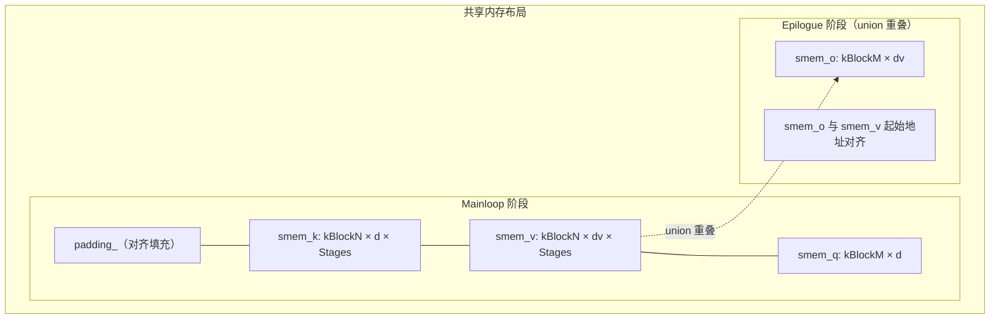
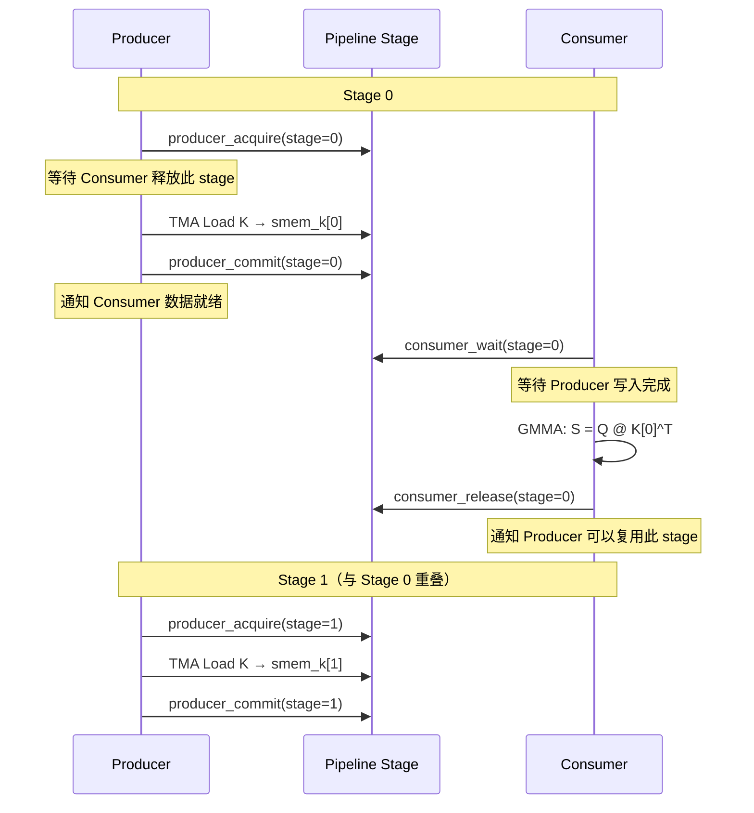
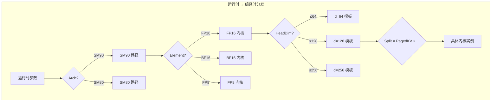
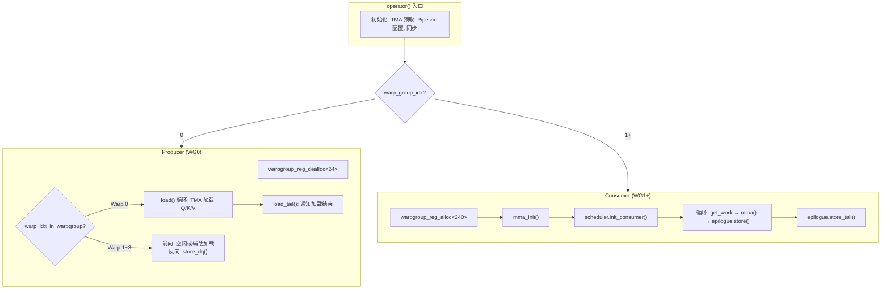

## 目录

- [1. 模板驱动的架构设计](#1-模板驱动的架构设计)
- [2. 共享内存布局](#2-共享内存布局)
- [3. 寄存器预算管理](#3-寄存器预算管理)
- [4. Pipeline 基础设施](#4-pipeline-基础设施)
- [5. 内核启动与配置](#5-内核启动与配置)
- [6. 编译期变体选择](#6-编译期变体选择)
- [7. 命名屏障与同步机制](#7-命名屏障与同步机制)

---

## 1. 模板驱动的架构设计

### 1.1 三组件模板结构

Flash Attention SM90 内核（前向和反向）都采用统一的三组件模板架构：

```cpp
// hopper/flash_fwd_kernel_sm90.h:27-28
template <class CollectiveMainloop_, class CollectiveEpilogue_, class TileScheduler_>
class FlashAttnFwdSm90 {
```

| 组件 | 职责 | 核心方法 |
|------|------|---------|
| **CollectiveMainloop** | 数据加载 + GEMM + Softmax | `load()`, `mma()` |
| **CollectiveEpilogue** | 输出写回 HBM | `store()`, `store_zero()` |
| **TileScheduler** | Tile 到 SM 的映射 | `get_initial_work()`, `get_next_work()` |

这种设计的核心优势是 **编译期多态**——不同功能变体（FP8、PagedKV、Causal、Split-K 等）通过不同的模板实例化生成，运行时无分支开销。

### 1.2 编译时特征提取

内核类从 Mainloop 和 Epilogue 中提取大量编译时常量：

```cpp
// hopper/flash_fwd_kernel_sm90.h:35-53
static constexpr bool Is_causal = CollectiveMainloop::Is_causal;
static constexpr bool Is_local = CollectiveMainloop::Is_local;
static constexpr bool Has_softcap = CollectiveMainloop::Has_softcap;
static constexpr bool Varlen = CollectiveMainloop::Varlen;
static constexpr bool Split = CollectiveMainloop::Split;
static constexpr bool Is_FP8 = CollectiveMainloop::Is_FP8;
static constexpr bool Transpose_V = CollectiveMainloop::Transpose_V;
static constexpr bool AppendKV = CollectiveMainloop::AppendKV;
static constexpr bool Use_TMA_Q = CollectiveMainloop::Use_TMA_Q;
static constexpr bool Use_TMA_KV = CollectiveMainloop::Use_TMA_KV;
static constexpr bool Use_TMA_O = CollectiveEpilogue::Use_TMA_O;
static constexpr bool PackGQA = CollectiveMainloop::PackGQA;
```

每个 `constexpr bool` 都会在编译时展开 `if constexpr` 分支，生成仅包含实际需要逻辑的二进制代码。

### 1.3 Mainloop 模板参数

`CollectiveMainloopFwdSm90` 本身也是高度参数化的：

```cpp
// hopper/mainloop_fwd_sm90_tma_gmma_ws.hpp:~31-43
template <int Stages, class ClusterShape_, class TileShape_MNK_, int kHeadDimV,
          class Element_, class ElementAccum_, class ArchTag_,
          bool Is_causal_, bool Is_local_, bool Has_softcap_, bool Varlen_,
          bool PagedKVNonTMA_, bool AppendKV_, bool HasQv_,
          bool MmaPV_is_RS, bool IntraWGOverlap, bool PackGQA_, bool Split_, bool V_colmajor_>
struct CollectiveMainloopFwdSm90
```

| 参数 | 含义 | 影响 |
|------|------|------|
| `Stages` | Pipeline 深度 | 共享内存中 K/V 的缓冲区数量 |
| `TileShape_MNK_` | 分块大小 | 如 `(128, 128, 64)` |
| `MmaPV_is_RS` | PV GEMM 是否用寄存器操作数 | 跳过 P 到 smem 的写入 |
| `IntraWGOverlap` | 组内计算重叠 | QK 和 PV GEMM 异步重叠 |
| `V_colmajor_` | V 是否列主序 | FP8 场景需要转置 |
| `PagedKVNonTMA_` | 分页 KV 非 TMA 模式 | 使用 cp.async 替代 TMA |

---

## 2. 共享内存布局

### 2.1 Union 重叠策略

共享内存是 SM 上最宝贵的资源之一（H100 最大 228 KB/SM）。Flash Attention 通过精心设计的 `union` 实现 Mainloop 和 Epilogue 的内存重叠：

```cpp
// hopper/flash_fwd_kernel_sm90.h:94-117
struct SharedStorage {
    struct TensorStorage : cute::aligned_struct<128, _1> {
        union {
            struct {
                cute::array<uint32_t, mainloop_smem_padding / sizeof(uint32_t)> padding_;
                typename CollectiveMainloop::TensorStorage mainloop;
            };
            typename CollectiveEpilogue::TensorStorage epilogue;
        };
    } tensors;
    struct PipelineStorage : cute::aligned_struct<16, _1> {
        alignas(16) BarrierQ barrier_Q;
        alignas(16) BarrierQ barrier_Qv;
        alignas(16) cutlass::arch::ClusterBarrier barrier_O;
        alignas(16) typename CollectiveMainloop::MainloopPipelineK::SharedStorage pipeline_k;
        alignas(16) typename CollectiveMainloop::MainloopPipelineV::SharedStorage pipeline_v;
        alignas(16) typename CollectiveMainloop::MainloopPipelineVt::SharedStorage pipeline_vt;
        alignas(16) typename TileScheduler::SharedStorage smem_scheduler;
    } pipelines;
};
```

### 2.2 smem_o 与 smem_v 的对齐

内核有一个精巧的填充机制，确保 `smem_o` 准确覆盖 `smem_v` 的位置：

```cpp
// hopper/flash_fwd_kernel_sm90.h:92-93
static constexpr int mainloop_smem_padding_ =
    int(sizeof(typename CollectiveEpilogue::TensorStorage))
    - int(sizeof(decltype((typename CollectiveMainloop::TensorStorage{}).smem_v)));
static constexpr int mainloop_smem_padding = mainloop_smem_padding_ < 0 ? 0 : mainloop_smem_padding_;
```



**为什么 smem_o 要与 smem_v 对齐？**

- Epilogue 写 O 时，Mainloop 阶段已结束，K/V 的 smem 不再需要
- `smem_o` 覆盖 `smem_v` 的位置，实现零额外内存开销
- 填充确保即使 `sizeof(smem_o) > sizeof(smem_v)`，也能正确对齐

### 2.3 Mainloop 内部的 TensorStorage

```cpp
// hopper/mainloop_fwd_sm90_tma_gmma_ws.hpp:~308-312
struct TensorStorageWithoutPNoTranspose : cute::aligned_struct<128, _0> {
    cute::array_aligned<Element, cosize_v<SmemLayoutVt>, SmemAlignmentVtNoTranspose> smem_v;
    cute::array_aligned<Element, cosize_v<SmemLayoutQ>, SmemAlignmentQ> smem_q;
    cute::array_aligned<Element, cosize_v<SmemLayoutK>, SmemAlignmentK> smem_k;
};
```

**典型共享内存大小估算**（kBlockM=128, kBlockN=128, d=128, dv=128, Stages=2, FP16）：

| 缓冲区 | 计算 | 大小 |
|--------|------|------|
| smem_q | 128 × 128 × 2B | 32 KB |
| smem_k | 128 × 128 × 2 stages × 2B | 64 KB |
| smem_v | 128 × 128 × 2 stages × 2B | 64 KB |
| Pipeline barriers | ~1 KB | 1 KB |
| **总计** | | **~161 KB** |

对于 `d=256` 或更多 Pipeline stages，共享内存会接近 228 KB 的上限，此时需要减小分块大小或 stage 数。

### 2.4 反向内核的共享内存

反向内核的共享内存布局与前向类似，但有额外的缓冲区：

```cpp
// hopper/flash_bwd_kernel_sm90.h:72-87
struct SharedStorage {
    struct TensorStorage {
        union {
            typename CollectiveMainloop::TensorStorage mainloop;
            // mainloop 包含: smem_q, smem_k, smem_v, smem_do, smem_ds, smem_dq, smem_lse
            typename CollectiveEpilogue::TensorStorage epilogue;
            // epilogue 包含: smem_dk, smem_dv
        };
    } tensors;
    struct PipelineStorage {
        barrier_KV;        // K, V 一次性加载同步
        pipeline_q;        // Q 流式加载
        pipeline_do;       // dO 流式加载
        smem_scheduler;
    } pipelines;
};
```

反向比前向多出 `smem_do`、`smem_ds`、`smem_dq`、`smem_lse` 等缓冲区，但同样通过 `union` 与 Epilogue 的 `smem_dk`/`smem_dv` 重叠。

---

## 3. 寄存器预算管理

### 3.1 动态寄存器分配

H100 每个 SM 有 256 KB（65536 个 32-bit）寄存器。Flash Attention 通过 Hopper 的 `warpgroup_reg_alloc/dealloc` 指令在 Producer 和 Consumer 之间动态重分配寄存器：

```cpp
// 前向内核
// hopper/flash_fwd_kernel_sm90.h:82-83
static constexpr uint32_t LoadRegisterRequirement =
    NumMmaWarpGroups == 1 ? 56 : (NumMmaWarpGroups == 2 ? (Use_TMA_KV ? 24 : 40) : 32);
static constexpr uint32_t MmaRegisterRequirement =
    NumMmaWarpGroups == 1 ? 256 : (NumMmaWarpGroups == 2 ? (Use_TMA_KV ? 240 : 232) : 160);
```

### 3.2 寄存器分配一览表

**前向内核**：

| 配置 | WG 数 | Producer Reg/Thread | Consumer Reg/Thread | 总寄存器使用 |
|------|-------|--------------------|--------------------|------------|
| 1 MMA WG + TMA | 2 WG | 56 | 256 | 56×128 + 256×128 = 39,936 |
| 2 MMA WG + TMA | 3 WG | 24 | 240 | 24×128 + 240×256 = 64,512 |
| 2 MMA WG + cp.async | 3 WG | 40 | 232 | 40×128 + 232×256 = 64,512 |
| 3 MMA WG + TMA | 4 WG | 32 | 160 | 32×128 + 160×384 = 65,536 |

注意 3 MMA WG 的配置正好用满了 65536 个寄存器。

**反向内核**：

```cpp
// hopper/flash_bwd_kernel_sm90.h:64-65
static constexpr uint32_t LoadRegisterRequirement = NumMmaWarpGroups == 2 ? 24 : 32;
static constexpr uint32_t MmaRegisterRequirement = NumMmaWarpGroups == 2 ? 240 : 160;
```

反向内核总是使用 TMA 加载（没有 `Use_TMA_KV` 的条件判断），因此 Producer 的寄存器需求始终较低。

### 3.3 Consumer 的寄存器用途

Consumer（MMA Warp Group）需要大量寄存器存储以下数据：

| 数据 | 大小（寄存器数） | 说明 |
|------|----------------|------|
| QK GEMM 累加器 `tSrS` | ~64 | M×N 个 FP32 值 |
| PV GEMM 累加器 `tOrO` | ~64 | M×dv 个 FP32 值 |
| Softmax 状态 | ~8 | `max`, `sum`, `scale` 每行 |
| Q 寄存器片段 `tSrQ` | ~32 | RS 模式下 Q 在寄存器中 |
| 临时变量 | ~32 | 类型转换、mask 应用等 |

总计约 200 个寄存器/线程，接近 240 的分配量。

---

## 4. Pipeline 基础设施

### 4.1 Pipeline 类型

前向内核使用多条 Pipeline 管理不同数据流：

```cpp
// hopper/flash_fwd_kernel_sm90.h:105-114
struct PipelineStorage : cute::aligned_struct<16, _1> {
    alignas(16) BarrierQ barrier_Q;              // Q 加载同步（单次）
    alignas(16) BarrierQ barrier_Qv;             // Qv 加载同步（可选）
    alignas(16) ClusterBarrier barrier_O;         // O 输出同步
    alignas(16) MainloopPipelineK pipeline_k;     // K 多阶段流水线
    alignas(16) MainloopPipelineV pipeline_v;     // V 多阶段流水线
    alignas(16) MainloopPipelineVt pipeline_vt;   // V 转置流水线（FP8）
    alignas(16) MainloopPipelineKVNew pipeline_k_new;  // AppendKV 新 K
    alignas(16) MainloopPipelineKVNew pipeline_v_new;  // AppendKV 新 V
    alignas(16) TileScheduler::SharedStorage smem_scheduler;  // 调度器
};
```

### 4.2 Pipeline 角色分配

```cpp
// hopper/flash_fwd_kernel_sm90.h:219-222
PipelineParamsK pipeline_params_k;
pipeline_params_k.role = warp_group_idx == 0
    ? MainloopPipelineK::ThreadCategory::Producer
    : MainloopPipelineK::ThreadCategory::Consumer;
```

对于 TMA 模式和 cp.async 模式，Pipeline 的配置不同：

```cpp
// hopper/flash_fwd_kernel_sm90.h:223-230
if constexpr (Use_TMA_KV) {
    // TMA 模式：只需 1 个 leader 线程
    pipeline_params_k.transaction_bytes = CollectiveMainloop::TmaTransactionBytesK;
    pipeline_params_k.is_leader = warp_group_thread_idx == 0;
    pipeline_params_k.num_consumers = NumMmaThreads;
} else {
    // cp.async 模式：需要所有 Producer 线程参与
    pipeline_params_k.consumer_arv_count = NumMmaThreads;
    pipeline_params_k.producer_arv_count = NumProducerThreads;
}
```

### 4.3 Pipeline 操作流程



### 4.4 Barrier vs Pipeline

Flash Attention 使用两种同步原语：

| 原语 | 用途 | 多阶段 | 示例 |
|------|------|--------|------|
| **Barrier** | 一次性同步 | 否 | Q 加载、O 输出 |
| **Pipeline** | 循环多阶段 | 是 | K/V 加载 |

Q 只需加载一次（整个 K/V 内层循环中不变），因此用简单的 Barrier。K/V 每个块都需要新加载，需要多阶段 Pipeline 实现重叠。

---

## 5. 内核启动与配置

### 5.1 参数转换

内核启动前需要将 host 端参数转换为 device 端参数：

```cpp
// hopper/flash_fwd_kernel_sm90.h:142-164
static Params to_underlying_arguments(Arguments const& args) {
    int sm_count = args.hw_info.sm_count;
    if (sm_count <= 0) {
        sm_count = cutlass::KernelHardwareInfo::query_device_multiprocessor_count(args.hw_info.device_id);
    }
    return {
        CollectiveMainloop::to_underlying_arguments(args.mainloop),
        CollectiveEpilogue::to_underlying_arguments(args.epilogue),
        {args.hw_info.device_id, sm_count},
        TileScheduler::to_underlying_arguments(args.scheduler)
    };
}
```

### 5.2 Grid 和 Block 尺寸

```cpp
// hopper/flash_fwd_kernel_sm90.h:167-175
static dim3 get_grid_shape(Params const& params) {
    return TileScheduler::get_grid_shape(params.scheduler, params.hw_info.sm_count);
}

static dim3 get_block_shape() {
    return dim3(MaxThreadsPerBlock, 1, 1);  // 1D block
}
```

- **Grid 尺寸**由 TileScheduler 决定：
  - `SingleTileScheduler`：`(num_m_blocks, num_heads, batch_size)`
  - `DynamicPersistentTileScheduler`：`(num_sm, 1, 1)`
- **Block 尺寸**由 MMA WG 数量决定：
  - 2 WG (1 Producer + 1 Consumer)：256 线程
  - 3 WG (1 Producer + 2 Consumer)：384 线程
  - 4 WG (1 Producer + 3 Consumer)：512 线程

### 5.3 共享内存动态分配

Flash Attention 的共享内存需求通常超过默认限制，需要动态设置：

```cpp
// 通过 cudaFuncSetAttribute 设置共享内存上限
cudaFuncSetAttribute(kernel_fn, cudaFuncAttributeMaxDynamicSharedMemorySize, SharedStorageSize);
```

`SharedStorageSize` 在编译时已知，可达 200+ KB。

---

## 6. 编译期变体选择

### 6.1 API 层的动态分发

`flash_api.cpp` 通过嵌套的 `SWITCH` 宏将运行时参数转换为编译时模板参数：

```cpp
// flash_api.cpp:~367-385（简化）
void run_mha_fwd(Flash_fwd_params &params, cudaStream_t stream) {
    ARCH_SWITCH(params.arch, Arch, [&] {               // SM80 vs SM90
        SPLIT_SWITCH(params.num_splits > 1, Split, [&] { // 是否 Split-K
            PAGEDKV_SWITCH(..., PagedKVNonTMA, [&] {     // 分页 KV
                PACKGQA_SWITCH(..., PackGQA_, [&] {       // GQA 打包
                    SOFTCAP_SWITCH(..., Has_softcap, [&] { // Softcap
                        run_mha_fwd_constexpr<Arch, Split, PagedKVNonTMA, PackGQA, Has_softcap>(
                            params, stream);
                    });
                });
            });
        });
    });
}
```

### 6.2 HeadDim 分发

在确定了布尔特征后，进一步按 `headdim` 选择分块大小：

```cpp
// flash_api.cpp:~255-335（简化）
template <int Arch, int Split, bool PagedKVNonTMA, bool PackGQA, bool Has_softcap>
void run_mha_fwd_constexpr(Flash_fwd_params &params, cudaStream_t stream) {
    if (params.is_bf16) {
        if (params.d <= 64) {
            return run_mha_fwd_<Arch, cutlass::bfloat16_t, 64, 64, Split, ...>(params, stream);
        } else if (params.d <= 128) {
            return run_mha_fwd_<Arch, cutlass::bfloat16_t, 128, 128, Split, ...>(params, stream);
        } else if (params.d <= 256) {
            return run_mha_fwd_<Arch, cutlass::bfloat16_t, 256, 256, Split, ...>(params, stream);
        }
    }
}
```

### 6.3 变体组合爆炸

编译时特征的组合数量巨大：

```
Arch: {80, 90} × Element: {FP16, BF16, FP8} × HeadDim: {64, 128, 192, 256}
× Split: {true, false} × PagedKV: {true, false} × PackGQA: {true, false}
× Softcap: {true, false} × Causal: {true, false} × ...
```

为了控制编译时间和二进制大小，Flash Attention 使用条件编译宏（如 `FLASHATTENTION_DISABLE_HDIM256`）禁用不常用的变体。



---

## 7. 命名屏障与同步机制

### 7.1 前向内核的命名屏障

Flash Attention 使用 CUDA 的 Named Barriers 在 Warp Group 之间精确同步：

```cpp
// 前向内核中使用的命名屏障
enum class FwdNamedBarriers {
    QueryEmpty = 0,   // Q 共享内存已被 Consumer 消费，Producer 可以加载新 Q
    AppendKV = 1,     // AppendKV 操作完成同步
    // ... 更多屏障
};
```

**QueryEmpty 屏障的工作流**：

```
Tile 0:
  Producer → 加载 Q_0 到 smem_q
  Producer → signal barrier_Q（Q_0 就绪）
  Consumer → wait barrier_Q → 使用 Q_0 → signal QueryEmpty（Q_0 已消费）

Tile 1:
  Producer → wait QueryEmpty → 加载 Q_1 到 smem_q（覆盖 Q_0）
  ...
```

### 7.2 反向内核的命名屏障

反向内核的同步更复杂，因为有更多的数据流：

```cpp
// 反向内核中使用的命名屏障
enum class BwdNamedBarriers {
    PdS = 1,           // P 和 dS 已写入共享内存
    dQEmptyWG1 = 2,    // dQ smem 可用（WG1）
    dQEmptyWG2 = 3,    // dQ smem 可用（WG2）
    dQFullWG1 = 5,     // dQ smem 已写入（WG1）
    dQFullWG2 = 6,     // dQ smem 已写入（WG2）
};
```

**dQ 乒乓交换**：每个 Consumer WG 有独立的 `dQEmpty/dQFull` 屏障对，实现 Consumer 写 dQ 和 Producer Warp 1 读 dQ 的无冲突交替。

### 7.3 同步开销控制

Named Barrier 的同步开销取决于参与线程数。Flash Attention 精确控制每个屏障的参与者：

```cpp
// hopper/flash_fwd_kernel_sm90.h:211
shared_storage.pipelines.barrier_Q.init(Use_TMA_Q ? 1 : NumProducerThreads);
// TMA 模式下只需 1 个线程参与，减少同步开销
```

```cpp
// hopper/flash_fwd_kernel_sm90.h:215
shared_storage.pipelines.barrier_O.init(
    size(ClusterShape{}) * (Use_TMA_O ? 1 : NumMmaThreads));
// TMA Store 同样只需 1 个线程，但非 TMA 模式需要所有 MMA 线程
```

---

## 8. operator() 入口点全流程

### 8.1 初始化阶段

内核入口的前半部分处理初始化工作：

```cpp
// hopper/flash_fwd_kernel_sm90.h:179-306
void operator()(Params const& params, char* smem_buf) {
    // 1. 类型定义和共享内存绑定
    SharedStorage& shared_storage = *reinterpret_cast<SharedStorage*>(smem_buf);

    // 2. TMA 描述符预取（单线程）
    if (warp_idx == 0 && lane_predicate) {
        CollectiveMainloop::prefetch_tma_descriptors(params.mainloop);
        CollectiveEpilogue::prefetch_tma_descriptors(params.epilogue);
    }

    // 3. Barrier 初始化（单线程）
    if (warp_idx == 0 && lane_predicate) {
        shared_storage.pipelines.barrier_Q.init(...);
        shared_storage.pipelines.barrier_O.init(...);
    }

    // 4. Pipeline 参数配置
    PipelineParamsK pipeline_params_k;
    pipeline_params_k.role = warp_group_idx == 0 ? Producer : Consumer;
    // ... K, V, Vt Pipeline 初始化

    // 5. 全局同步
    __syncthreads();  // 确保所有初始化对所有线程可见

    // 6. 创建调度器实例
    TileScheduler scheduler(&shared_storage.pipelines.smem_scheduler);
}
```

### 8.2 Producer-Consumer 分支



### 8.3 Consumer 主循环细节

```cpp
// hopper/flash_fwd_kernel_sm90.h:375-451
CUTLASS_PRAGMA_NO_UNROLL  // 禁止循环展开（迭代次数运行时确定）
for (auto work_tile_info = scheduler.get_initial_work(params.scheduler);
     work_tile_info.is_valid(params.scheduler);
     /* work_tile_info 在 epilogue 前更新 */) {

    // 1. 获取坐标和序列长度
    auto block_coord = work_tile_info.get_block_coord(params.scheduler);
    SeqlenInfo_t seqlen_info{bidb, shape_Q, shape_K, ...};

    // 2. AppendKV（可选）
    if constexpr (AppendKV) {
        mainloop.store_kv_new(...);
    }

    // 3. FP8 缩放因子调整（可选）
    float softmax_scale_log2 = params.mainloop.softmax_scale_log2;
    if constexpr (Is_FP8) {
        softmax_scale_log2 *= q_descale * k_descale;
    }

    // 4. 初始化 Softmax 和输出累加器
    Softmax softmax(softmax_scale_log2);
    Tensor tOrO = partition_fragment_C(tiled_mma_pv, ...);

    // 5. 执行 MMA 主循环
    bool tile_valid = mainloop.mma(params, pipeline_k, pipeline_v, smem_pipe_read,
                                    tOrO, softmax, ...);

    // 6. 预取下一个 tile（在 epilogue 之前！）
    work_tile_info = scheduler.get_next_work(params.scheduler, work_tile_info);

    // 7. 写回结果
    if (tile_valid) {
        epilogue.store(params, tOrO, softmax.row_sum, ...);
    } else {
        epilogue.store_zero(params, ...);
    }
}
epilogue.store_tail();  // 等待最后一次 TMA Store 完成
```

**关键细节**：步骤 6 中 `get_next_work()` 在 `epilogue.store()` **之前**调用。这样 Producer 可以在 Consumer 执行 Epilogue 的同时就开始加载下一个 tile 的数据，减少空闲等待。

---

## 总结

Flash Attention SM90 内核的架构设计体现了以下工程原则：

| 原则 | 实现 | 效果 |
|------|------|------|
| **编译时多态** | 模板参数 + `if constexpr` | 零运行时分支开销 |
| **内存复用** | `union` 重叠 smem_v/smem_o | 最大化可用 SRAM |
| **寄存器动态分配** | `reg_alloc/dealloc` | Producer 让渡寄存器给 Consumer |
| **多层次同步** | Barrier（一次性）+ Pipeline（多阶段） | 精确控制数据流 |
| **工作窃取** | 持久化内核 + TileScheduler | 负载均衡 |
| **预取重叠** | `get_next_work` 先于 Epilogue | 数据加载提前开始 |

> 下一篇将深入前向内核的实现细节，逐行解析 `mainloop.load()`、`mainloop.mma()` 和 `epilogue.store()` 的代码。

---

## 导航

- 上一篇：[GPU 编程基础](01-gpu-programming-basics.md)
- 下一篇：[前向内核实现解析](03-forward-kernel-impl.md)
- [返回目录](../README.md)
