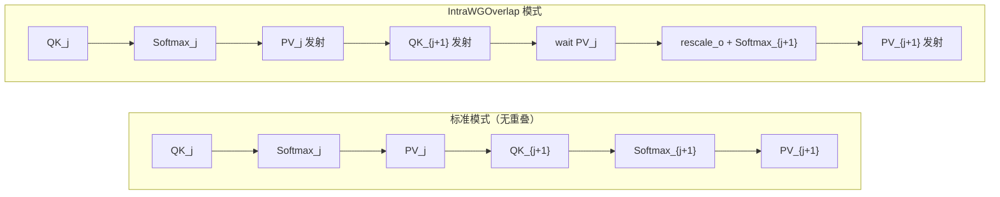
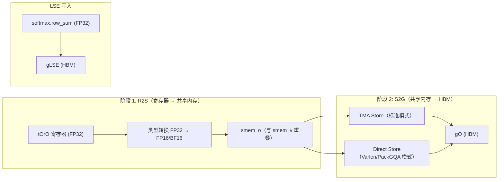
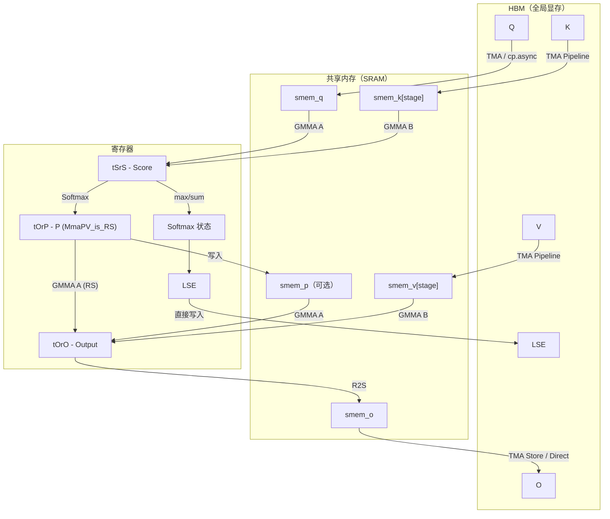

## 目录

- [1. Producer 加载路径 — load() 详解](#1-producer-加载路径--load-详解)
- [2. Consumer 计算路径 — mma() 详解](#2-consumer-计算路径--mma-详解)
- [3. IntraWGOverlap 实现细节](#3-intrawgoverlap-实现细节)
- [4. Masking 实现](#4-masking-实现)
- [5. Epilogue 输出路径](#5-epilogue-输出路径)
- [6. FP8 专用路径](#6-fp8-专用路径)
- [7. 关键代码段注释汇总](#7-关键代码段注释汇总)

---

## 1. Producer 加载路径 — load() 详解

### 1.1 load() 的整体结构

`CollectiveMainloopFwdSm90::load()` 是 Producer Warp Group（WG0）的核心方法，负责将 Q、K、V 从 HBM 加载到共享内存。

```cpp
// mainloop_fwd_sm90_tma_gmma_ws.hpp::load()（简化结构）
template <typename SharedStorage>
CUTLASS_DEVICE void load(
    Params const& params,
    MainloopPipelineK pipeline_k,
    MainloopPipelineV pipeline_v,
    MainloopPipelineVt pipeline_vt,
    PipelineState& smem_pipe_write,
    SharedStorage& shared_storage,
    auto scheduler_prefetch,
    SeqlenInfo_t const& seqlen_info,
    cute::tuple<int32_t, int32_t, int32_t, int32_t> block_coord,
    int work_idx) {
    // 1. 加载 Q → smem_q
    // 2. 计算有效 N 块范围
    // 3. 循环加载 K/V → smem_k[stage], smem_v[stage]
    // 4. 调度器预取
}
```

### 1.2 Q 的加载

Q 在每个 tile 处理开始时加载一次，在整个 K/V 内层循环中保持不变：

```cpp
// mainloop_fwd_sm90_tma_gmma_ws.hpp:~812-846（简化）
// TMA 模式
if constexpr (Use_TMA_Q) {
    if (warp_idx_in_warpgroup == 0) {
        // 等待 Consumer 消费完上一个 Q
        cutlass::arch::NamedBarrier::sync(NumMmaThreadsQK + cutlass::NumThreadsPerWarp,
            static_cast<uint32_t>(FwdNamedBarriers::QueryEmpty));

        if (cute::elect_one_sync()) {
            // 通知 TMA 即将写入的字节数
            shared_storage.pipelines.barrier_Q.arrive_and_expect_tx(TmaTransactionBytesQ);
            // 发起 TMA 加载（仅 1 个线程）
            copy(params.tma_load_Q.with(
                     reinterpret_cast<BarrierQ::ValueType&>(shared_storage.pipelines.barrier_Q),
                     0 /*mcast_mask*/),
                 tQgQ(_, m_block, bidh_kv, bidb_kv),
                 tQsQ);
        }
    }
}
```

**关键细节**：
- `NamedBarrier::sync(QueryEmpty)` 确保上一个 tile 的 Q 已经被 Consumer 使用完毕
- `arrive_and_expect_tx` 同时设置 barrier 的期望事务字节数
- TMA `copy` 由单个线程发起，TMA 引擎自动完成数据传输
- 加载完成后通过 `barrier_Q` 通知 Consumer

### 1.3 K/V 的循环加载

K 和 V 在内层循环中按块加载，每块占用一个 Pipeline stage：

```cpp
// mainloop_fwd_sm90_tma_gmma_ws.hpp:~750-770（简化）
auto load_K = [&](int const n_block, auto const& smem_pipe_write, auto need_seqlenk_masking_type) {
    pipeline_k.producer_acquire(smem_pipe_write);     // 等待 stage 可用

    if constexpr (!PagedKVNonTMA) {
        // TMA 模式
        copy(params.tma_load_K.with(
                 *pipeline_k.producer_get_barrier(smem_pipe_write),
                 mcast_mask_kv,
                 TMA::CacheHintSm90::EVICT_LAST),     // L2 缓存提示
             tKgK_TMA(_, n_block_idx, bidb_kv_idx),
             tKsK_TMA(_, smem_pipe_write.index()));
    } else {
        // cp.async 模式（PagedKV 非 TMA）
        paged_kv_manager.template load_K<Seqlenk_mask>(n_block, sK_pi(_, _, smem_pipe_write.index()));
        pipeline_k.producer_commit(smem_pipe_write, cutlass::arch::cpasync_barrier_arrive);
    }
};

auto load_V = [&](int const n_block, auto const& smem_pipe_write, auto need_seqlenk_masking_type) {
    auto pipeline_v_load = cute::conditional_return<!Transpose_V>(pipeline_v, pipeline_vt);
    pipeline_v_load.producer_acquire(smem_pipe_write);

    copy(params.tma_load_V.with(
             *pipeline_v_load.producer_get_barrier(smem_pipe_write),
             mcast_mask_kv,
             TMA::CacheHintSm90::EVICT_LAST),
         tVgVt_TMA(_, n_block_idx, bidb_kv_idx),
         tVsVt_TMA(_, smem_pipe_write.index()));
};
```

### 1.4 内层循环与 Pipeline 推进

```cpp
// mainloop_fwd_sm90_tma_gmma_ws.hpp:~860-888（简化）
int n_block_prev = n_block_max - 1;

// 首先加载第一个 K 块
load_K(n_block_max - 1, smem_pipe_write, ...);

// 内层循环：从后向前遍历 N 块
#pragma unroll (!Transpose_V && Use_TMA_KV ? 2 : 1)
for (; n_block >= n_block_min; --n_block) {
    PipelineState smem_pipe_write_v = smem_pipe_write;  // V 使用当前 stage
    ++smem_pipe_write;                                   // K 推进到下一个 stage

    load_K(n_block, smem_pipe_write, ...);               // 加载下一个 K

    if constexpr (IntraWGOverlap) {
        load_V(n_block_prev, smem_pipe_write_v, ...);    // 加载上一个 V（重叠）
    } else {
        load_V(n_block, smem_pipe_write_v, ...);         // 加载当前 V
    }

    n_block_prev = n_block;
}
```

**IntraWGOverlap 的加载序列**：

```
时间     K Pipeline        V Pipeline
  0    load K[n-1] → s[0]
  1    load K[n-2] → s[1]  load V[n-1] → s[0]    ← V 滞后一步
  2    load K[n-3] → s[0]  load V[n-2] → s[1]
  3    load K[n-4] → s[1]  load V[n-3] → s[0]
  ...
```

V 的加载比 K 延迟一个迭代，因为 Consumer 会先用 K 计算 QK^T（Score），然后才需要 V 计算 PV。这个延迟允许 Producer 提前加载下一个 K。

### 1.5 load_tail() — 通知加载结束

```cpp
// mainloop_fwd_sm90_tma_gmma_ws.hpp（简化）
CUTLASS_DEVICE void load_tail(
    MainloopPipelineK pipeline_k, MainloopPipelineV pipeline_v,
    MainloopPipelineVt pipeline_vt, PipelineState& smem_pipe_write, ...) {
    // 在最后一个 stage 发送"空"提交，通知 Consumer 数据流结束
    pipeline_k.producer_tail(smem_pipe_write);
    pipeline_v.producer_tail(smem_pipe_write);
}
```

`producer_tail()` 发送一个特殊信号，让 Consumer 知道不会有更多数据到来，防止 Consumer 永久等待。

---

## 2. Consumer 计算路径 — mma() 详解

### 2.1 mma() 的初始化

```cpp
// mainloop_fwd_sm90_tma_gmma_ws.hpp::mma()（简化）
CUTLASS_DEVICE bool mma(
    Params const& params,
    MainloopPipelineK pipeline_k,
    MainloopPipelineV pipeline_v,
    PipelineState& smem_pipe_read,
    Tensor<Engine, Layout>& tOrO,       // 输出累加器（寄存器）
    Softmax& softmax,
    int thread_idx, int work_idx,
    SeqlenInfo_t const& seqlen_info,
    cute::tuple<...> block_coord,
    SharedStorage& shared_storage) {

    // 共享内存张量绑定
    Tensor sQ = make_tensor(make_smem_ptr(shared_storage.tensors.mainloop.smem_q.data()), SmemLayoutQ{});
    Tensor sK = make_tensor(make_smem_ptr(shared_storage.tensors.mainloop.smem_k.data()), SmemLayoutK{});
    Tensor sV = make_tensor(make_smem_ptr(shared_storage.tensors.mainloop.smem_v.data()), SmemLayoutVtMma{});

    // MMA 对象
    TiledMmaQK tiled_mma_qk;    // Q × K → Score
    TiledMmaPV tiled_mma_pv;    // P × V → Output

    // 线程级张量分区
    Tensor tSrQ = tiled_mma_qk.partition_fragment_A(sQ);              // Q 在寄存器中的片段
    Tensor tSrK = tiled_mma_qk.partition_fragment_B(sK);              // K 的共享内存视图
    Tensor tOrV = tiled_mma_pv.partition_fragment_B(sV);              // V 的共享内存视图
```

### 2.2 等待 Q 加载

```cpp
    // 等待 Q 加载完成
    shared_storage.pipelines.barrier_Q.wait(work_idx % 2);

    // 计算有效的 N 块范围
    auto [n_block_min, n_block_max] = BlockMN::get_n_block_min_max(
        seqlen_info, m_block, bidb, split_idx, params.num_splits,
        kBlockM, kBlockN, params.window_size_left, params.window_size_right);

    if (n_block_max <= n_block_min) {
        // 通知 Producer 可以加载新 Q
        if (warp_group_thread_idx == 0) {
            NamedBarrier::arrive(NumMmaThreadsQK + NumThreadsPerWarp,
                static_cast<uint32_t>(FwdNamedBarriers::QueryEmpty));
        }
        return false;  // 无有效块，跳过
    }
```

### 2.3 非 IntraWGOverlap 的标准流程

```cpp
    // mainloop_fwd_sm90_tma_gmma_ws.hpp:~1254-1349（简化）
    clear(tOrO);  // 输出归零

    auto fwd_step = [&](int n_block, auto mask_fn, auto check_inf_type) {
        // === Step 1: 等待 K 就绪 ===
        consumer_wait(pipeline_k, smem_pipe_read);

        // === Step 2: Score GEMM — S = Q @ K^T ===
        Tensor tSrS = partition_fragment_C(tiled_mma_qk, select<0, 1>(TileShape_MNK{}));
        flash::gemm</*zero_init=*/true, /*wg_wait=*/-1>(
            tiled_mma_qk, tSrQ, tSrK(_, _, _, smem_pipe_read.index()), tSrS);
        warpgroup_wait<0>();                    // 等待 GMMA 完成

        // === Step 3: Softcap（可选）===
        if constexpr (Has_softcap) {
            flash::apply_softcap(tSrS, params.softcap_val);
        }

        // === Step 4: Masking ===
        mask_fn(tSrS, n_block);

        // === Step 5: Online Softmax ===
        Tensor scores_scale = softmax.template max_get_scale<Is_first, Check_inf>(tSrS);
        softmax.template online_softmax<Is_first, Check_inf>(tSrS);

        // === Step 6: Rescale 已有输出 ===
        softmax.rescale_o(tOrO, scores_scale);

        // === Step 7: 将 P 写入 smem 或保持在寄存器 ===
        if constexpr (!MmaPV_is_RS) {
            // 类型转换：FP32 → FP16/BF16
            Tensor tOrP = make_tensor_like<Element>(tSrS);
            flash::convert_type_out(tSrS, tOrP);
            // 写入共享内存
            cute::copy(smem_tiled_copy_P, tOrP, tPsP);
        }

        // === Step 8: 等待 V 就绪 ===
        consumer_wait(pipeline_v, smem_pipe_read);

        // === Step 9: Output GEMM — O += P @ V ===
        flash::gemm</*zero_init=*/false, /*wg_wait=*/-1>(
            tiled_mma_pv,
            cute::conditional_return<MmaPV_is_RS>(tOrP_reg, tOsP),
            tOrV(_, _, _, smem_pipe_read.index()),
            tOrO);
        warpgroup_wait<0>();

        // === Step 10: 释放 K/V Pipeline stage ===
        pipeline_k.consumer_release(smem_pipe_read);
        ++smem_pipe_read;
    };

    // 遍历所有 N 块（从后向前）
    for (int n_block = n_block_max - 1; n_block >= n_block_min; --n_block) {
        fwd_step(n_block, mask_fn, ...);
    }

    // === 最终归一化 ===
    Tensor final_scale = softmax.finalize();
    softmax.rescale_o(tOrO, final_scale);

    return true;
```

### 2.4 MmaPV_is_RS 优化

当 `MmaPV_is_RS = true` 时，P 矩阵直接从寄存器参与 PV GEMM，跳过写入共享内存的步骤：

```
MmaPV_is_RS = false（标准模式）:
  Score(reg) → convert FP16 → write smem → PV GEMM(smem × smem)

MmaPV_is_RS = true（RS 模式）:
  Score(reg) → convert FP16 → PV GEMM(reg × smem)
  ↑ 跳过 smem 写入，减少延迟和带宽
```

RS 模式需要更多寄存器来保持 P 在寄存器中，但在寄存器预算允许时能提升性能。

---

## 3. IntraWGOverlap 实现细节

### 3.1 重叠策略

IntraWGOverlap 是 Flash Attention SM90 的关键性能优化。它利用 GMMA 的异步特性，将不同迭代的计算重叠：



### 3.2 fwd_step 的重叠实现

```cpp
// mainloop_fwd_sm90_tma_gmma_ws.hpp:~1170-1207（简化）
auto fwd_step = [&](int n_block, auto mask_fn, auto check_inf_type) {
    // V 使用上一个 stage，K 使用当前 stage
    PipelineState smem_pipe_read_v(smem_pipe_read.index(), smem_pipe_read.phase(), ...);
    ++smem_pipe_read;  // K 推进到下一个 stage

    // === 等待 K 就绪并发射 QK GEMM ===
    consumer_wait(pipeline_k, smem_pipe_read);
    warp_scheduler_barrier_sync();

    Tensor tSrS = partition_fragment_C(tiled_mma_qk, ...);
    flash::gemm</*zero_init=*/true, /*wg_wait=*/-1>(
        tiled_mma_qk, tSrQ, tSrK(_, _, _, smem_pipe_read.index()), tSrS);

    // === 在 QK GMMA 异步执行的同时，做上一轮的 rescale ===
    if constexpr (RescaleOBeforeGemm) {
        softmax.rescale_o(tOrO, scores_scale);  // 使用上一轮的 scale
    }

    // === 发射 PV GEMM（使用上一轮的 P 和上一个 stage 的 V） ===
    flash::gemm</*zero_init=*/false, /*wg_wait=*/-1>(
        tiled_mma_pv,
        cute::conditional_return<MmaPV_is_RS>(tOrP, tOsP),
        tOrV(_, _, _, smem_pipe_read_v.index()),  // 上一个 V stage
        tOrO);

    warp_scheduler_barrier_arrive();

    // === 等待 QK GEMMA 完成（PV 可能仍在后台执行） ===
    warpgroup_wait<1>();     // 等待到最多 1 个 GMMA 未完成（即 PV）
    pipeline_k.consumer_release(smem_pipe_read);

    // === 对当前 Score 做 Softcap + Mask + Softmax ===
    scoremod_premask_fn(tSrS);
    mask_fn(tSrS, n_block);

    cute::copy(softmax.template max_get_scale<false, Check_inf>(tSrS), scores_scale);
    softmax.template online_softmax<false, Check_inf>(tSrS);

    // === 将 P 转换为 FP16 并写入 smem ===
    if constexpr (!MmaPV_is_RS) {
        write_P_to_smem(tOrP);
    }

    if constexpr (!RescaleOBeforeGemm) {
        softmax.rescale_o(tOrO, scores_scale);
    }
};
```

### 3.3 wg_wait 的精确控制

`warpgroup_wait<N>()` 等待直到未完成的 GMMA 操作数量 ≤ N：

| 调用 | 含义 | 使用场景 |
|------|------|---------|
| `warpgroup_wait<0>()` | 等待所有 GMMA 完成 | 需要所有结果时 |
| `warpgroup_wait<1>()` | 允许 1 个 GMMA 仍在后台 | QK 已完成，PV 可继续 |
| `wg_wait=-1`（gemm 参数） | 不等待，完全异步 | GMMA 发射后立即返回 |

IntraWGOverlap 的关键在于：
1. 发射 PV GEMM 后 **不等待**（`wg_wait=-1`）
2. 立即发射下一个 QK GEMM（也是 `wg_wait=-1`）
3. 然后 `warpgroup_wait<1>`：确保 QK 完成（因为要用 Score 做 Softmax），但允许 PV 继续后台执行
4. 到下一轮的 `rescale_o` 时，PV 的结果才真正被需要

### 3.4 Pipeline 阶段的交错

IntraWGOverlap 模式下，K 和 V 使用不同阶段的 Pipeline：

```
迭代 j:
  K Pipeline: read stage s   → QK GEMM
  V Pipeline: read stage s-1 → PV GEMM（使用上一轮的 P）

迭代 j+1:
  K Pipeline: read stage s+1 → QK GEMM
  V Pipeline: read stage s   → PV GEMM
```

这要求 Producer 端也做对应的交错加载（V 滞后于 K 一个迭代），如第 1.4 节所述。

---

## 4. Masking 实现

### 4.1 Masking 的三种模式

Flash Attention 支持三种 masking 模式，通过 `if constexpr` 在编译时选择：

| 模式 | 条件 | 效果 |
|------|------|------|
| 无 Mask | `!Is_causal && !Is_local` | 所有位置可见 |
| Causal | `Is_causal` | $j > i$ 的位置被遮蔽 |
| Local | `Is_local` | $j \notin [i - \text{left}, i + \text{right}]$ 的位置被遮蔽 |

### 4.2 块级跳过

在进入内层循环之前，通过 `BlockMN::get_n_block_min_max()` 确定有效的 N 块范围，完全跳过全部被遮蔽的块：

```cpp
auto [n_block_min, n_block_max] = BlockMN::get_n_block_min_max(...);
// n_block_min ~ n_block_max 之外的块完全跳过
```

### 4.3 元素级 Masking

对于部分遮蔽的边界块，在 Score 矩阵上逐元素应用 mask：

```cpp
// hopper/mask.h（简化）
template <bool Seqlenk_mask, bool Causal_mask, bool Local_mask>
CUTLASS_DEVICE void apply(Tensor& tSrS, int m_block, int n_block) {
    #pragma unroll
    for (int mi = 0; mi < size<0>(tSrS); ++mi) {
        int const row_idx = m_block * kBlockM + get<0>(idx_row(mi));
        #pragma unroll
        for (int ni = 0; ni < size<1>(tSrS); ++ni) {
            int const col_idx = n_block * kBlockN + get<1>(idx_col(ni));
            if constexpr (Causal_mask) {
                if (col_idx > row_idx + seqlen_k - seqlen_q) {
                    tSrS(mi, ni) = -INFINITY;  // 因果遮蔽
                }
            }
            if constexpr (Local_mask) {
                if (col_idx > row_idx + window_size_right || col_idx < row_idx - window_size_left) {
                    tSrS(mi, ni) = -INFINITY;  // 窗口遮蔽
                }
            }
        }
    }
}
```

### 4.4 Masking 迭代分离

主循环将 N 块分为三类，分别处理：

```cpp
// 类型 1: 需要 Causal/Local masking 的边界块
for (n_block = n_block_max - 1; n_block >= n_block_min_causal_local_mask; --n_block) {
    fwd_step(n_block, causal_local_mask_fn, /*Check_inf=*/true);
}

// 类型 2: 完全有效的块（无需 masking）
for (; n_block >= n_block_min_before_local_mask; --n_block) {
    fwd_step(n_block, no_mask_fn, /*Check_inf=*/false);
}

// 类型 3: 需要 Local masking 的边界块（窗口左边界）
if constexpr (Is_local) {
    for (; n_block >= n_block_min; --n_block) {
        fwd_step(n_block, local_mask_fn, /*Check_inf=*/true);
    }
}
```

**Check_inf 的作用**：在有 masking 的块中，Score 可能包含 `-INFINITY`，`exp2f(-INFINITY) = 0`。`Check_inf=true` 时 Softmax 会额外检查这种情况，避免 NaN 传播。在完全有效的块中跳过此检查（`Check_inf=false`），节省指令。

---

## 5. Epilogue 输出路径

### 5.1 Epilogue 的两阶段流程



### 5.2 R2S — 寄存器到共享内存

```cpp
// epilogue_fwd.hpp:~251-265（简化）
if constexpr (Use_smem) {
    // 类型转换
    Tensor tOrO_out = make_tensor_like<Element>(tOrO);
    flash::convert_type_out(tOrO, tOrO_out);  // FP32 → FP16/BF16

    // 写入 smem_o
    auto smem_tiled_copy_O = make_tiled_copy_C(SmemCopyAtomO{}, tiled_mma);
    auto smem_thr_copy_O = smem_tiled_copy_O.get_thread_slice(thread_idx);
    Tensor taccOrO = smem_thr_copy_O.retile_S(tOrO_out);
    Tensor taccOsO = smem_thr_copy_O.partition_D(sO);
    cute::copy(smem_tiled_copy_O, taccOrO, taccOsO);

    // 如果使用 TMA Store，通知 TMA 数据已就绪
    if constexpr (Use_TMA_O) {
        cutlass::arch::fence_view_async_shared();
        cutlass::arch::NamedBarrier::arrive(NumEpilogueThreads + cutlass::NumThreadsPerWarp,
            cutlass::arch::ReservedNamedBarriers::EpilogueBarrier);
    }
}
```

### 5.3 TMA Store 路径

```cpp
// epilogue_fwd.hpp:~311-330（简化）
if constexpr (Use_TMA_O) {
    // 构造 TMA 张量
    Tensor mO = params.tma_store_O.get_tma_tensor(params.shape_O)(_, _, bidh, bidb, split_idx);
    Tensor gO = local_tile(mO, select<0, 1>(TileShape_MNK_PV{}), make_coord(m_block, _0{}));

    auto block_tma_O = params.tma_store_O.get_slice(_0{});
    Tensor tOgO = block_tma_O.partition_D(gO);
    Tensor tOsO = block_tma_O.partition_S(sO);

    // 最后一个 warp 执行 TMA Store
    int warp_idx_sync = __shfl_sync(0xffffffff, thread_idx / NumThreadsPerWarp, 0);
    if (warp_idx_sync == NumEpilogueThreads / NumThreadsPerWarp - 1) {
        // 等待所有线程完成 smem 写入
        cutlass::arch::NamedBarrier::sync(NumEpilogueThreads + cutlass::NumThreadsPerWarp,
            cutlass::arch::ReservedNamedBarriers::EpilogueBarrier);
        if (cute::elect_one_sync()) {
            cute::copy(params.tma_store_O, tOsO, tOgO);    // TMA 异步写回
            tma_store_arrive();
            tma_store_wait<0>();                              // 等待写回完成
            // 通知 Cluster 内其他 block
            for (uint32_t cta_id = 0; cta_id < size(ClusterShape{}); ++cta_id) {
                shared_storage.pipelines.barrier_O.arrive(cta_id);
            }
        }
    }
}
```

**为什么只有最后一个 warp 执行 TMA Store？** 减少线程竞争和 barrier 同步的开销。

### 5.4 Direct Store 路径

对于 Varlen 或 PackGQA 场景，内存布局不适合 TMA 的连续块传输：

```cpp
// epilogue_fwd.hpp:~331-401（简化）
if constexpr (!Use_TMA_O) {
    Tensor mO = make_tensor(make_gmem_ptr(params.ptr_O + offset_o * stride_O), ...);
    Tensor gO = local_tile(mO, TileShape_PV{}, make_coord(m_block, _0{}));

    // 使用向量化全局内存写入
    GmemTiledCopyO gmem_tiled_copy_O;
    auto gmem_thr_copy_O = gmem_tiled_copy_O.get_thread_slice(thread_idx);
    Tensor tOrO = make_fragment_like(tOsO);
    cute::copy(gmem_tiled_copy_O, tOsO, tOrO);     // smem → register

    // 带 predicate 的全局内存写入
    Tensor tOpO = make_tensor<bool>(make_shape(size<2>(tOsO)));
    for (int k = 0; k < size(tOpO); ++k) {
        tOpO(k) = get<1>(tOcO(_0{}, _0{}, k)) < get<1>(params.shape_O);  // 列边界检查
    }
    flash::copy</*Is_even_MN=*/false, /*Is_even_K=*/false>(
        gmem_tiled_copy_O, tOrO, tOgO, tOcO, tOpO, seqlen_o - m_block * kBlockM);
}
```

### 5.5 LSE 写入

LSE（Log-Sum-Exp）直接从 Consumer 寄存器写入 HBM，无需经过共享内存：

```cpp
// epilogue_fwd.hpp:~281-308（简化）
Tensor mLSE = make_tensor(make_gmem_ptr(params.ptr_LSE + offset * stride_LSE), ...)(_, bidh, bidb);

for (int mi = 0; mi < size(lse); ++mi) {
    int const row = m_block * kBlockM + get<0>(taccOcO_row(mi));
    if (get<1>(taccOcO_row(_0{})) == 0 && row < seqlen_o) {
        mLSE(row) = lse(mi);   // 直接全局内存写入
    }
}
```

只有每行的"第一个线程"（`get<1>(...) == 0`）负责写入 LSE，避免重复写入。

### 5.6 Split-K 的 Epilogue

当使用 Split-K 时，每个 split 产生局部结果：

```cpp
// 非 Split 模式：直接写入 gO, gLSE
// Split 模式：写入 gO_partial, gLSE_partial
if constexpr (Split) {
    Tensor mOpartial = make_tensor(make_gmem_ptr(params.ptr_O_partial + ...),
        params.shape_O_packed, ...)(_, _, bidh, bidb, split_idx);
    // 写入临时缓冲区
}
```

局部结果随后由独立的 `flash_fwd_combine_kernel.h` 合并。

---

## 6. FP8 专用路径

### 6.1 V 转置（Transpose_V）

FP8 场景下 V 通常以行主序存储，但 PV GEMM 需要列主序。Flash Attention 在 Producer 端完成转置：

```
Producer:
  1. TMA Load V → smem_vt (行主序)     // 通过 pipeline_vt
  2. LDSM (smem_vt → register)          // 读取
  3. STSM (register → smem_v, 转置)     // 转置写回
  4. Signal pipeline_v                  // 通知 Consumer 列主序 V 就绪
```

```cpp
// Producer 端的 V 转置
auto copy_Vt_to_V = [&](auto const& smem_pipe_write) {
    pipeline_vt.consumer_wait(smem_pipe_write);     // 等待 TMA 加载完成
    pipeline_v.producer_acquire(smem_pipe_write);   // 获取 V pipeline stage

    // LDSM: 读取 smem_vt 到寄存器
    cute::copy(LDSM_copy, tVsVt(_, _, _, smem_pipe_write.index()), tVrV);
    // STSM: 转置写入寄存器到 smem_v
    cute::copy(STSM_copy, tVrV, tVsV(_, _, _, smem_pipe_write.index()));

    pipeline_vt.consumer_release(smem_pipe_write);
    cute::arch::fence_view_async_shared();
    pipeline_v.producer_commit(smem_pipe_write);
};
```

### 6.2 FP8 缩放因子

FP8 的动态范围有限，需要额外的缩放因子：

```cpp
// hopper/flash_fwd_kernel_sm90.h:408-415
if constexpr (Is_FP8 && !Has_softcap) {
    int const bidh_kv = !PackGQA ? params.mainloop.qhead_per_khead_divmod.divide(bidh) : bidh;
    float const q_descale = params.mainloop.ptr_q_descale == nullptr
        ? 1.0f : params.mainloop.ptr_q_descale[bidb * stride + bidh_kv * stride];
    float const k_descale = params.mainloop.ptr_k_descale == nullptr
        ? 1.0f : params.mainloop.ptr_k_descale[bidb * stride + bidh_kv * stride];
    softmax_scale_log2 *= q_descale * k_descale;  // 将 descale 融入 softmax scale
}
```

### 6.3 Max_offset 技巧

FP8 模式下 Softmax 使用 `Max_offset = 8`：

```cpp
// hopper/flash_fwd_kernel_sm90.h:416
flash::Softmax<..., /*Max_offset=*/!Is_FP8 ? 0 : 8> softmax(softmax_scale_log2);
```

这将 $\exp_2$ 的输入从 $[0, 1]$ 扩展到 $[0, 256]$ 范围，使得 FP8 的有限动态范围下也能保持数值精度。详见 [Online Softmax 算法详解](../02-core-algorithm/01-online-softmax.md) 中的分析。

---

## 7. 关键代码段注释汇总

### 7.1 文件路径索引

| 文件 | 核心内容 | 关键行号 |
|------|---------|---------|
| `flash_fwd_kernel_sm90.h` | 内核入口、线程分支 | `operator()`: 179-454 |
| `mainloop_fwd_sm90_tma_gmma_ws.hpp` | Q/K/V 加载、MMA 计算 | `load()`: ~589-891, `mma()`: ~954-1352 |
| `epilogue_fwd.hpp` | O/LSE 写回 | `store()`: ~215-401 |
| `softmax.h` | Online Softmax 实现 | 全文 170 行 |
| `mask.h` | Causal/Local masking | `apply()`: 核心方法 |
| `block.h` | 块范围计算 | `get_n_block_min_max()`: ~50-90 |

### 7.2 数据流总览



### 7.3 性能关键路径分析

| 操作 | 延迟 | 是否被隐藏 | 隐藏方式 |
|------|------|-----------|---------|
| TMA Load Q | ~400 cycles | 部分 | Barrier 等待前做初始化 |
| TMA Load K | ~400 cycles | 是 | Pipeline 双缓冲 |
| TMA Load V | ~400 cycles | 是 | Pipeline + IntraWGOverlap |
| GMMA QK | ~100 cycles | 部分 | 异步发射，与 PV 重叠 |
| Softmax | ~50 cycles | 否 | 依赖 QK 结果，无法隐藏 |
| GMMA PV | ~100 cycles | 是 | 与下一个 QK 重叠 |
| TMA Store O | ~400 cycles | 是 | Epilogue 与下一 tile 加载重叠 |

理想的性能关键路径仅包含：**QK GEMM → Softmax → PV GEMM**（序列依赖），所有内存操作被计算完全隐藏。

---

## 总结

前向内核实现的核心设计模式：

| 模式 | 实现 | 效果 |
|------|------|------|
| **异步加载** | TMA 单线程发起 + Pipeline 多阶段 | 内存操作零 warp 开销 |
| **异步计算** | GMMA `wg_wait=-1` 发射 | 计算间重叠 |
| **IntraWGOverlap** | PV 和 QK 交错发射 | 消除 GEMM 间空闲 |
| **MmaPV_is_RS** | P 从寄存器直接参与 GMMA | 省去 smem 写/读 |
| **Masking 分离** | 边界块独立循环 | 消除主循环分支 |
| **smem_o/smem_v 重叠** | union 内存复用 | 节省 SRAM |
| **TMA Store** | Epilogue 与下一 tile 加载重叠 | 隐藏输出延迟 |

> 更详细的反向内核实现解析见 [反向内核实现解析](./04-backward-kernel-impl.md)。

---

## 导航

- 上一篇：[SM90 内核架构解析](02-kernel-architecture-sm90.md)
- 下一篇：[反向内核实现解析](04-backward-kernel-impl.md)
- [返回目录](../README.md)
