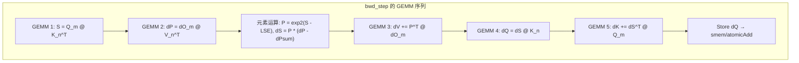

## 目录

- [1. Producer 双 Warp 架构](#1-producer-双-warp-架构)
- [2. K/V 一次性加载与 Barrier 同步](#2-kv-一次性加载与-barrier-同步)
- [3. Consumer mma() 主循环实现](#3-consumer-mma-主循环实现)
- [4. bwd_step 的 GEMM 编排](#4-bwd_step-的-gemm-编排)
- [5. dQ 回写实现](#5-dq-回写实现)
- [6. Epilogue — dK/dV 写回](#6-epilogue--dkdv-写回)
- [7. 寄存器压力与优化手段](#7-寄存器压力与优化手段)

---

## 1. Producer 双 Warp 架构

### 1.1 前向 vs 反向的 Producer 差异

前向内核的 Producer WG0 只有一个职责：加载数据到共享内存。反向内核的 Producer WG0 则需要同时处理 **加载** 和 **存储** 两个方向的数据流。

```cpp
// hopper/flash_bwd_kernel_sm90.h:211-240
if (warp_group_idx == 0) {  // Producer
    cutlass::arch::warpgroup_reg_dealloc<LoadRegisterRequirement>();
    int warp_idx_in_warpgroup = __shfl_sync(0xffffffff, (threadIdx.x / 32) % 4, 0);

    if (warp_idx_in_warpgroup == 0) {
        // Warp 0: TMA 加载 Q, dO, LSE, dPsum → 共享内存
        for (auto work_tile_info = scheduler.get_initial_work<true>(...); ...) {
            mainloop.load(params, pipeline_q, pipeline_do, smem_pipe_write,
                          smem_pipe_write_do, shared_storage, scheduler_prefetch, block_coord);
        }
        mainloop.load_tail(pipeline_q, pipeline_do, smem_pipe_write, smem_pipe_write_do);

    } else if (warp_idx_in_warpgroup == 1) {
        // Warp 1: TMA 存储 dQ ← 共享内存 → HBM
        for (auto work_tile_info = scheduler.get_initial_work<false>(...); ...) {
            mainloop.store_dq(params, shared_storage, block_coord);
        }
    }
}
```

### 1.2 为什么需要两个 Warp

```mermaid
graph LR
    subgraph warp0["Warp 0 - 加载"]
        L1["TMA Load Q_m → smem_q"]
        L2["TMA Load dO_m → smem_do"]
        L3["TMA Load LSE_m → smem_lse"]
        L4["Signal pipeline_q / pipeline_do"]
        L1 --> L2 --> L3 --> L4
    end

    subgraph warp1["Warp 1 - 存储"]
        S1["Wait dQFull"]
        S2["TMA Store smem_dq → dQaccum (HBM)"]
        S3["Signal dQEmpty"]
        S1 --> S2 --> S3
    end

    subgraph consumer["Consumer WG1+"]
        C1["Wait pipeline_q"]
        C2["计算 S, dP, dS, dV, dK, dQ"]
        C3["Write dQ → smem_dq"]
        C4["Signal dQFull"]
        C1 --> C2 --> C3 --> C4
    end

    L4 -.->|"pipeline_q"| C1
    C4 -.->|"dQFull"| S1
    S3 -.->|"dQEmpty"| C3
```



如果只用一个 Warp 处理加载和存储，两者会互相阻塞：
- Warp 0 在等待 TMA Load 完成时，无法执行 TMA Store
- 导致 Consumer 等待 dQ smem 被释放的时间变长

两个独立的 Warp 可以各自等待各自的 TMA 操作，实现完全并行。

### 1.3 双 Pipeline 设计

反向内核使用两条独立的 Pipeline 管理 Q 和 dO 的加载：

```cpp
// hopper/flash_bwd_kernel_sm90.h:82-83
alignas(16) typename CollectiveMainloop::MainloopPipeline::SharedStorage pipeline_q;
alignas(16) typename CollectiveMainloop::MainloopPipeline_dO::SharedStorage pipeline_do;
```

```cpp
// hopper/flash_bwd_kernel_sm90.h:178-179
pipeline_params.transaction_bytes =
    CollectiveMainloop::TmaTransactionBytesQ + CollectiveMainloop::TmaTransactionBytesLSE;
```

Q Pipeline 的每个 stage 包含 Q 数据 **和** LSE 数据（打包在同一个 TMA 事务中），因为这两者同步消费、大小较小。

---

## 2. K/V 一次性加载与 Barrier 同步

### 2.1 K/V 在反向中的特殊地位

在反向的 N-outer 循环中，K 和 V 对应当前 N-block，在整个 Q-inner 循环中保持不变。因此 K/V 只需加载一次：

```cpp
// mainloop_bwd_sm90_tma_gmma_ws.hpp::load()（简化）
// 在 Q-inner 循环开始前，一次性加载 K, V
if (cute::elect_one_sync()) {
    shared_storage.pipelines.barrier_KV.arrive_and_expect_tx(
        TmaTransactionBytesK + TmaTransactionBytesV);
    copy(params.tma_load_K.with(...), tKgK, tKsK);   // TMA Load K
    copy(params.tma_load_V.with(...), tVgV, tVsV);   // TMA Load V
}
```

### 2.2 Barrier_KV 同步

```cpp
// hopper/flash_bwd_kernel_sm90.h:81
alignas(16) cutlass::arch::ClusterTransactionBarrier barrier_KV;
```

`barrier_KV` 是一个简单的 Transaction Barrier（非多阶段 Pipeline），因为 K/V 只加载一次：

```
Producer Warp 0:
  arrive_and_expect_tx(BytesK + BytesV)  // 设置期望字节数
  TMA Load K → smem_k
  TMA Load V → smem_v
  // TMA 完成后 barrier 自动满足

Consumer:
  barrier_KV.wait(...)                    // 等待 K/V 加载完成
  // 之后在整个 Q-inner 循环中重复使用 smem_k, smem_v
```

对比前向的 K/V Pipeline（每个 N-block 都需要新加载），反向的 K/V 加载简单得多。

---

## 3. Consumer mma() 主循环实现

### 3.1 整体结构

```cpp
// mainloop_bwd_sm90_tma_gmma_ws.hpp::mma()（简化结构）
CUTLASS_DEVICE bool mma(
    Params const& params,
    MainloopPipeline pipeline_q,
    MainloopPipeline_dO pipeline_do,
    PipelineState& smem_pipe_read,
    PipelineState_dO& smem_pipe_read_do,
    FrgTensordKV& tdKrdK,      // dK 累加器（寄存器，跨 Q-block 累加）
    FrgTensordKV& tdVrdV,      // dV 累加器（寄存器，跨 Q-block 累加）
    int thread_idx, int& work_idx,
    cute::tuple<...> block_coord,
    SharedStorage& shared_storage) {

    // 1. 初始化
    clear(tdKrdK);  // dK = 0
    clear(tdVrdV);  // dV = 0

    // 2. 等待 K/V 加载完成
    shared_storage.pipelines.barrier_KV.wait(...);

    // 3. 计算有效 Q-block 范围
    auto [m_block_min, m_block_max] = get_m_block_min_max(...);

    // 4. Q-inner 循环
    for (int m_block = m_block_min; m_block < m_block_max; ++m_block) {
        bwd_step(m_block, mask_fn);
    }

    // 5. dK 乘以 softmax_scale
    for (int i = 0; i < size(tdKrdK); ++i) {
        tdKrdK(i) *= params.softmax_scale;
    }

    return true;
}
```

### 3.2 Masking 迭代分离

与前向类似，反向也将 Q-block 按 masking 需求分为三类：

```cpp
// mainloop_bwd_sm90_tma_gmma_ws.hpp:~1003-1033（简化）
// 阶段 1: 需要 Causal Masking 的 Q-block
if constexpr ((Is_causal || Is_local) && SeparateMaskingIterations) {
    int const m_block_masking_max = ((n_block + 1) * kBlockN - 1 + seqlen_q - seqlen_k
                                      - params.window_size_right) / kBlockM + 1;
    for (; m_block < std::min(m_block_max, m_block_masking_max); ++m_block) {
        bwd_step(m_block, causal_mask_fn);
    }
}

// 阶段 2: 完全有效的 Q-block
for (; m_block < m_block_max_before_local_mask; ++m_block) {
    bwd_step(m_block, no_mask_fn);
}

// 阶段 3: 需要 Local Masking 的 Q-block
if constexpr (Is_local && SeparateMaskingIterations) {
    for (; m_block < m_block_max; ++m_block) {
        bwd_step(m_block, local_mask_fn);
    }
}
```

`SeparateMaskingIterations` 在 `headdim ≤ 64` 时启用。对于较大的 headdim，masking 的分支开销相对于 GEMM 计算可忽略，不需要分离。

---

## 4. bwd_step 的 GEMM 编排

### 4.1 五次 GEMM 的执行顺序

每个 `bwd_step` 执行以下计算：



### 4.2 GEMM 1 & 2: S 和 dP 的异步重叠

```cpp
// mainloop_bwd_sm90_tma_gmma_ws.hpp:~835-851（简化）
// GEMM 1: S = Q @ K^T
Tensor tSrS = partition_fragment_C(tiled_mma_SdP, ...);
consumer_wait(pipeline_q, smem_pipe_read);          // 等待 Q 就绪
flash::gemm</*zero_init=*/true, /*wg_wait=*/-1, /*SwapAB=*/SdP_swapAB>(
    tiled_mma_SdP, tSrQ(_, _, _, smem_pipe_read.index()), tSrK, tSrS);

// GEMM 2: dP = dO @ V^T（与 GEMM 1 异步重叠）
Tensor tdPrdP = partition_fragment_C(tiled_mma_SdP, ...);
consumer_wait(pipeline_do, smem_pipe_read_do_cur);  // 等待 dO 就绪
flash::gemm</*zero_init=*/true, /*wg_wait=*/-1, /*SwapAB=*/SdP_swapAB>(
    tiled_mma_SdP, tdPrdO(_, _, _, smem_pipe_read_do_cur.index()), tdPrV, tdPrdP);
```

两个 GEMM 使用相同的 `TiledMmaSdP`，但操作数不同（Q×K vs dO×V）。由于 GMMA 的异步特性（`wg_wait=-1`），它们可以背靠背发射。

### 4.3 等待与元素运算

```cpp
// mainloop_bwd_sm90_tma_gmma_ws.hpp:~852-896（简化）
warpgroup_wait<1>();  // 等待 GEMM 1 (S) 完成，GEMM 2 (dP) 可仍在后台

// 应用 softcap（可选）
if constexpr (Has_softcap) {
    flash::apply_softcap(tSrS, params.softcap_val);
    auto dtanh = flash::calculate_dtanh(scores);     // 预计算 tanh 导数
}

// 应用 mask
mask_fn(tSrS, m_block);

// 恢复 P = exp2(S * scale * log2e - LSE)
for (int mi = 0; mi < size<0>(scores); ++mi) {
    float lse_scaled = tLSErLSE(mi);
    for (int ni = 0; ni < size<1>(scores); ++ni) {
        scores(mi, ni) = exp2f(scores(mi, ni) * params.softmax_scale_log2 - lse_scaled);
    }
}

warpgroup_wait<0>();  // 等待 GEMM 2 (dP) 完成

// 计算 dS = P * (dP - dPsum)
for (int mi = 0; mi < size<0>(dS); ++mi) {
    float dP_sum_cur = tLSErdPsum(mi);
    for (int ni = 0; ni < size<1>(dS); ++ni) {
        dS(mi, ni) = scores(mi, ni) * (dS(mi, ni) - dP_sum_cur);
        if constexpr (Has_softcap) { dS(mi, ni) *= dtanh(mi, ni); }
    }
}
```

**`warpgroup_wait<1>()` 的精妙用法**：只等待 S 的 GEMM 完成（因为需要对 S 做 Softmax），允许 dP 的 GEMM 继续后台执行。等到确实需要 dP 结果时才调用 `warpgroup_wait<0>()`。

### 4.4 GEMM 3: dV += P^T @ dO

```cpp
// mainloop_bwd_sm90_tma_gmma_ws.hpp:~925-935（简化）
if constexpr (Mma_dKV_is_RS) {
    // RS 模式：P 直接从寄存器
    Tensor tdVrP = make_tensor(rP.data(), convert_layout_acc_Aregs<TiledMmadKV>(...));
    flash::gemm</*zero_init=*/false, /*wg_wait=*/-1>(
        tiled_mma_dKV, tdVrP, tdVrdO(_, _, _, smem_pipe_read_do_cur.index()), tdVrdV);
} else {
    // 标准模式：P 从共享内存
    flash::gemm</*zero_init=*/false, /*wg_wait=*/-1, /*SwapAB=*/dKV_swapAB>(
        tiled_mma_dKV, tdVrP_cur, tdVrdO(_, _, _, smem_pipe_read_do_cur.index()), tdVrdV);
}
```

`zero_init=false` 是关键——dV 跨所有 Q-block **累加**。

### 4.5 GEMM 4 & 5: dQ 和 dK

```cpp
// mainloop_bwd_sm90_tma_gmma_ws.hpp:~938-950（简化）
// GEMM 4: dQ = dS @ K（每个 Q-block 重新计算）
flash::gemm</*zero_init=*/true, /*wg_wait=*/1, /*SwapAB=*/dQ_swapAB>(
    tiled_mma_dQ, tdQrdS_cur, tdQrK, tdQrdQ);

pipeline_do.consumer_release(smem_pipe_read_do_cur);  // 释放 dO smem

// GEMM 5: dK += dS^T @ Q（累加）
if constexpr (Mma_dKV_is_RS) {
    flash::gemm</*zero_init=*/false, /*wg_wait=*/1>(
        tiled_mma_dKV, tdKrdS, tdKrQ(_, _, _, smem_pipe_read.index()), tdKrdK);
} else {
    flash::gemm</*zero_init=*/false, /*wg_wait=*/1, /*SwapAB=*/dKV_swapAB>(
        tiled_mma_dKV, tdKrdS_cur, tdKrQ(_, _, _, smem_pipe_read.index()), tdKrdK);
}
```

注意 `wg_wait=1`：dQ 的 GEMM 发射后，允许 1 个未完成的 GMMA（dV 的），然后等待 dV 完成。dK 的 GEMM 发射后，同样允许 1 个未完成的 GMMA（dQ 的），然后等待 dQ 完成。这形成了 **两个 GEMM 的交替等待**模式。

### 4.6 三种 MMA 类型

反向内核使用三种不同的 `TiledMma`：

| MMA 类型 | 用于 | 输出维度 | 输入操作数 |
|----------|------|---------|-----------|
| `TiledMmaSdP` | $S = QK^T$, $dP = dO \cdot V^T$ | $[M, N]$ | Q/dO × K/V |
| `TiledMmadKV` | $dK = dS^T Q$, $dV = P^T dO$ | $[N, d]$ | dS/P × Q/dO |
| `TiledMmadQ` | $dQ = dS \cdot K$ | $[M, d]$ | dS × K |

前向只需 2 种（QK 和 PV），反向需要 3~4 种，这也是反向寄存器压力更大的原因之一。

---

## 5. dQ 回写实现

### 5.1 TMA 回写路径

当 `dQacc_use_TMA = true`（通常 `headdim < 256`）时，dQ 通过共享内存中转，由 Producer Warp 1 执行 TMA Store：

```cpp
// mainloop_bwd_sm90_tma_gmma_ws.hpp:~951-958（简化）
if constexpr (dQacc_use_TMA) {
    int warp_group_idx = flash::canonical_warp_group_idx_nosync() - 1;

    // 等待 smem_dq 空闲
    NamedBarrier::sync(NumThreadsPerWarpGroup + NumThreadsPerWarp,
        static_cast<uint32_t>(BwdNamedBarriers::dQEmptyWG1) + warp_group_idx);

    // R2S: dQ 从寄存器写入共享内存
    cute::copy(r2s_tiled_copy_dQaccum, taccdQrdQ, tdQsdQaccum);
    fence_view_async_shared();

    // 通知 Warp 1 可以执行 TMA Store
    NamedBarrier::arrive(NumThreadsPerWarpGroup + NumThreadsPerWarp,
        static_cast<uint32_t>(BwdNamedBarriers::dQFullWG1) + warp_group_idx);
}
```

**Warp 1 端**：

```cpp
// mainloop_bwd_sm90_tma_gmma_ws.hpp::store_dq()（简化）
CUTLASS_DEVICE void store_dq(Params const& params, SharedStorage& shared_storage, ...) {
    for (int m_block = m_block_min; m_block < m_block_max; ++m_block) {
        // 等待 Consumer 写入 dQ
        for (int wg_idx = 0; wg_idx < NumMmaWarpGroups; ++wg_idx) {
            NamedBarrier::sync(NumThreadsPerWarpGroup + NumThreadsPerWarp,
                static_cast<uint32_t>(BwdNamedBarriers::dQFullWG1) + wg_idx);
        }

        // TMA Store: smem_dq → dQaccum (HBM)
        if (cute::elect_one_sync()) {
            cute::copy(params.tma_store_dQaccum, tdQsdQaccum, tdQgdQaccum(_, m_block));
            tma_store_arrive();
        }
        tma_store_wait<0>();

        // 通知 Consumer smem_dq 已释放
        for (int wg_idx = 0; wg_idx < NumMmaWarpGroups; ++wg_idx) {
            NamedBarrier::arrive(NumThreadsPerWarpGroup + NumThreadsPerWarp,
                static_cast<uint32_t>(BwdNamedBarriers::dQEmptyWG1) + wg_idx);
        }
    }
}
```

### 5.2 原子累加路径

当 `dQacc_use_TMA = false`（通常 `headdim ≥ 256`）时，直接原子加到全局内存：

```cpp
// mainloop_bwd_sm90_tma_gmma_ws.hpp:~960-966
if constexpr (!dQacc_use_TMA) {
    Tensor tdQrdQ_atomic = recast<float4>(r2s_thr_copy_dQaccum.retile_S(tdQrdQ));
    Tensor tdQgdQaccum_atomic = recast<float4>(tdQgdQaccum(_, _, _, m_block));

    #pragma unroll
    for (int i = 0; i < size(tdQrdQ_atomic); ++i) {
        atomicAdd(&tdQgdQaccum_atomic(i), tdQrdQ_atomic(i));
    }
}
```

**`recast<float4>`**：将数据重新解释为 `float4`（4 个 float），使每次原子操作处理 16 字节而非 4 字节，减少 75% 的原子事务数。

### 5.3 dQaccum 的后处理

无论使用哪种路径，dQ 都先累加到 FP32 精度的 `dQaccum` 缓冲区。最终结果需要转换回输入精度（FP16/BF16），这个步骤在 Python 端完成：

```python
# flash_attn_interface.py（简化）
dq_accum = torch.empty(..., dtype=torch.float32)
# 反向内核写入 dq_accum
dq = dq_accum.to(q.dtype)  # FP32 → FP16/BF16
```

---

## 6. Epilogue — dK/dV 写回

### 6.1 标准 Epilogue

当所有 Q-block 遍历完成后，Consumer 持有最终的 dK 和 dV 寄存器值（已在 Q-inner 循环中累加）。Epilogue 将它们写回 HBM：

```cpp
// hopper/flash_bwd_kernel_sm90.h:267-273
if (tile_valid) {
    epilogue.store(params.epilogue, tdKrdK, tdVrdV, shared_storage,
                   tiled_mma_dKV, threadIdx.x - NumCopyThreads, block_coord);
} else {
    epilogue.store_zero(params.epilogue, threadIdx.x - NumCopyThreads, block_coord);
}
```

### 6.2 写回流程

```cpp
// epilogue_bwd.hpp::store()（简化）
// Step 1: FP32 → FP16/BF16
Tensor tdVrdV_out = make_tensor_like<Element>(tdVrdV);
flash::convert_type_out(tdVrdV, tdVrdV_out);
Tensor tdKrdK_out = make_tensor_like<Element>(tdKrdK);
flash::convert_type_out(tdKrdK, tdKrdK_out);

// Step 2: R2S（寄存器 → 共享内存）
named_barrier_sync(NumEpilogueThreads, EpilogueBarrier);
cute::copy(smem_tiled_copy_dKV, taccdVrdV, taccdVsdV);  // dV → smem_dv
cute::copy(smem_tiled_copy_dKV, taccdKrdK, taccdKsdK);  // dK → smem_dk

// Step 3: S2G（共享内存 → HBM）
if constexpr (Use_TMA) {
    // TMA Store 路径
    fence_view_async_shared();
    NamedBarrier::arrive(NumEpilogueThreads + NumThreadsPerWarp, EpilogueBarrier);

    // 最后一个 warp 执行 TMA Store
    if (warp_idx_sync == last_warp && cute::elect_one_sync()) {
        NamedBarrier::sync(NumEpilogueThreads + NumThreadsPerWarp, EpilogueBarrier);
        cute::copy(params.tma_store_dV, tdVsdV, tdVgdV);
        cute::copy(params.tma_store_dK, tdKsdK, tdKgdK);
        tma_store_arrive();
        tma_store_wait<0>();
    }
} else {
    // Direct Store 路径（带 predicate 的全局内存写入）
    flash::copy<Is_even_MN, Is_even_K>(gmem_tiled_copy_dKV, tdKVrdV, tdKVgdV, ...);
}
```

### 6.3 GQA Epilogue

GQA（Grouped Query Attention）场景下，多个 query head 的 dK/dV 需要累加到同一个 KV head：

```cpp
// epilogue_bwd.hpp::store()（GQA 路径，简化）
int bidh_kv = params.qhead_per_khead_divmod.divmod(bidh_idx_in_group, bidh);

// Deterministic 模式：信号量串行化
if constexpr (Deterministic) {
    Barrier::wait_eq(lock_ptr, thread_idx,
        n_block * num_batch * num_head_kv, bidh_idx_in_group);
}

// 原子累加 dV 到 dVaccum (FP32)
for (int i = 0; i < size(tdVrdV_atomic); ++i) {
    atomicAdd(&tdVgdV_atomic(i), tdVrdV_atomic(i));
}

if constexpr (Deterministic) {
    Barrier::arrive_inc(lock_ptr, thread_idx, n_block * num_batch * num_head_kv);
}

// 同样处理 dK
```

**Deterministic 模式**确保无论 GPU 的线程调度顺序如何，累加结果都是 bitwise 一致的。

---

## 7. 寄存器压力与优化手段

### 7.1 反向的寄存器压力分析

Consumer 需要同时在寄存器中保持以下数据：

| 数据 | 寄存器数 | 生命周期 |
|------|---------|---------|
| `tdKrdK` - dK 累加器 | ~64 | 整个 Q-inner 循环 |
| `tdVrdV` - dV 累加器 | ~64 | 整个 Q-inner 循环 |
| `tSrS` - Score 矩阵 | ~32 | 单个 bwd_step |
| `tdPrdP` - dP 矩阵 | ~32 | 单个 bwd_step |
| `rP` - P (FP16) | ~16 | dS 计算后到 dV GEMM |
| `rdS` - dS (FP16) | ~16 | dV GEMM 后到 dK GEMM |
| `tdQrdQ` - dQ | ~32 | dQ GEMM 到 store_dq |
| LSE, dPsum | ~4 | 单个 bwd_step |
| **总计** | **~260** | |

240 个寄存器/线程（2 MMA WG 配置）接近极限。

### 7.2 Mma_dKV_is_RS — 寄存器直传

当启用时，P 和 dS 从寄存器直接作为 GMMA 的 A 操作数，跳过共享内存写入：

```
标准模式:
  P(reg) → convert FP16 → write smem → sync → GMMA(smem × smem) → dV
  dS(reg) → convert FP16 → write smem → sync → GMMA(smem × smem) → dK

RS 模式:
  P(reg) → convert FP16 → GMMA(reg × smem) → dV    // 跳过 smem 写
  dS(reg) → convert FP16 → GMMA(reg × smem) → dK   // 跳过 smem 写
```

**优势**：减少 smem 带宽和 Named Barrier 同步。**代价**：寄存器保持 P/dS 更久。

### 7.3 ShuffleLSE — Warp 内数据共享

```cpp
// mainloop_bwd_sm90_tma_gmma_ws.hpp:~838-845
if constexpr (ShuffleLSE) {
    // 每 8 个线程共享一份 LSE，通过 warp shuffle 广播
    for (int i = 0; i < kStatsPerThread; ++i) {
        tLSErLSE(i) = tLSEsLSE((thread_idx % 32) / 4 + i * 8, smem_pipe_read.index());
    }
    // 使用时：
    float lse = __shfl_sync(0xffffffff, tLSErLSE(mi / 8), (mi % 8) * 4 + (thread_idx % 4));
}
```

用 1 个 shuffle 指令（~5 cycles）替代 8 个寄存器的存储，在小 headdim 下节省宝贵的寄存器。

### 7.4 Slice_dQKV_Mma — headdim=256 切片

对于 `headdim = 256`，将每次 GEMM 切成两半执行：

```cpp
// mainloop_bwd_sm90_tma_gmma_ws.hpp:~967-995（简化）
if constexpr (Slice_dQKV_Mma) {
    // 第一半 dV
    flash::gemm<false, -1, dKV_swapAB, /*M_slice=*/0>(
        tiled_mma_dKV, tdVrP_cur, tdVrdO, tdVrdV);

    // 同步 + 第一半 dQ
    NamedBarrier::sync(NumMmaThreads, BwdNamedBarriers::PdS);
    flash::gemm<true, -1, dQ_swapAB, /*M_slice=*/0>(
        tiled_mma_dQ, tdQrdS_cur, tdQrK, tdQrdQ);

    // 第二半 dV（与第一半 dQ 的 atomicAdd 重叠）
    flash::gemm<false, 1, dKV_swapAB, /*M_slice=*/1>(
        tiled_mma_dKV, tdVrP_cur, tdVrdO, tdVrdV);

    // 第一半 dQ 的 atomicAdd（在第二半 dV GEMM 的同时执行）
    for (int i = 0; i < size(tdQrdQ_atomic) / 2; ++i) {
        atomicAdd(&tdQgdQaccum_atomic(i), tdQrdQ_atomic(i));
    }

    // 继续 dK 的两半 + 剩余 dQ atomicAdd ...
}
```

**交织策略**：GEMM 的两半和 atomicAdd 交替执行，确保硬件单元（Tensor Core 和 LSU）都保持忙碌。

### 7.5 dKV_swapAB — 共享内存布局优化

```cpp
// 控制 P/dS 在共享内存中的布局
static constexpr bool dKV_swapAB = CollectiveMainloop::dKV_swapAB;
```

当 `dKV_swapAB = true` 时，P 和 dS 以转置形式存储在共享内存中。这改变了 GMMA 的操作数角色（A 和 B 交换），可以改善特定 headdim 配置下的 bank 访问模式。

---

## 总结

反向内核实现的核心复杂度在于 **5 个 GEMM 的精确编排** 和 **dQ 双模式回写**：

| 设计 | 实现手段 | 效果 |
|------|---------|------|
| **S/dP 异步重叠** | `wg_wait=-1` + `warpgroup_wait<1>` | 两个 GEMM 部分并行 |
| **dV/dK 寄存器累加** | `zero_init=false`，N-outer 循环 | 避免原子操作 |
| **dQ TMA 回写** | Producer Warp 1 + Named Barrier 乒乓 | 与加载完全并行 |
| **dQ 原子累加** | `recast<float4>` + atomicAdd | 减少事务数 |
| **RS 模式** | P/dS 从寄存器直接参与 GMMA | 跳过 smem 中转 |
| **Slice MMA** | 半精度 GEMM + 交织 atomicAdd | 降低峰值寄存器 |
| **ShuffleLSE** | Warp 内 shuffle 共享 | 节省寄存器 |
| **Masking 分离** | 三阶段循环 | 消除分支开销 |

> 下一篇将对比 SM80 (Ampere) 的实现差异，展示 Hopper 特性如何提升了内核性能。

---

## 导航

- 上一篇：[前向内核实现解析](03-forward-kernel-impl.md)
- 下一篇：[SM80 内核实现对比](05-kernel-sm80.md)
- [返回目录](../README.md)
