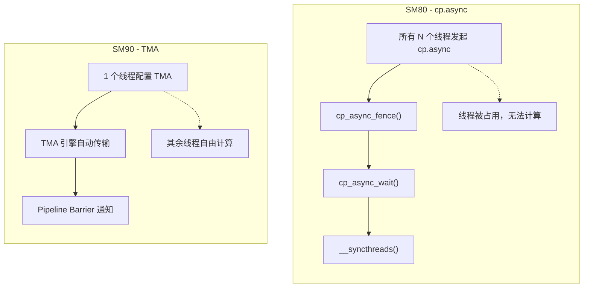
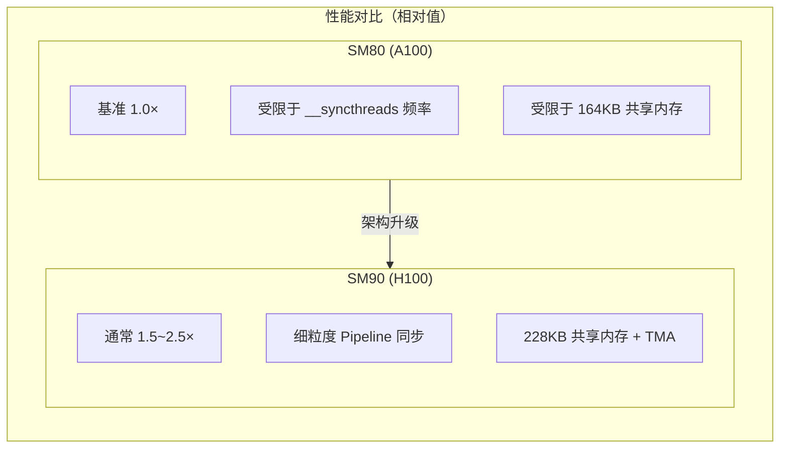

## 目录

- [1. SM80 架构特点](#1-sm80-架构特点)
- [2. 数据加载 — cp.async vs TMA](#2-数据加载--cpasync-vs-tma)
- [3. 线程组织 — 统一模型 vs Warp Specialization](#3-线程组织--统一模型-vs-warp-specialization)
- [4. Pipeline 管理](#4-pipeline-管理)
- [5. 计算路径差异](#5-计算路径差异)
- [6. 共享内存策略](#6-共享内存策略)
- [7. 性能对比与适用场景](#7-性能对比与适用场景)

---

## 1. SM80 架构特点

### 1.1 Ampere vs Hopper 硬件差异

| 特性 | SM80 (A100) | SM90 (H100) |
|------|-----------|-----------|
| Tensor Core | 第三代, Warp 级 | 第四代, Warp Group 级 |
| 内存加载 | `cp.async`（软件管理） | TMA（硬件引擎） |
| 线程分工 | 统一执行 | Warp Specialization |
| 共享内存 | 最大 164 KB / SM | 最大 228 KB / SM |
| Pipeline | 软件模拟 | 硬件原生 |
| Cluster | 不支持 | 支持跨 SM 协作 |
| MMA 指令 | `mma.sync.aligned` | `wgmma.mma_async` |

### 1.2 代码文件对应

| 功能 | SM80 文件 | SM90 文件 |
|------|----------|----------|
| 前向主循环 | `mainloop_fwd_sm80.hpp` | `mainloop_fwd_sm90_tma_gmma_ws.hpp` |
| Tensor Core 原语 | `SM80_16x8x16_F32F16F16F32_TN` | `GMMA::ss_op_selector / rs_op_selector` |
| 内存拷贝原语 | `SM80_CP_ASYNC_CACHEGLOBAL_ZFILL` | TMA 描述符 |
| 分块大小 | `tile_size_fwd_sm8x()` | `tile_size_fwd_sm90()` |

---

## 2. 数据加载 — cp.async vs TMA

### 2.1 SM80 的 cp.async 加载

SM80 使用 `cp.async`（cooperative asynchronous copy）指令从全局内存加载数据到共享内存：

```cpp
// mainloop_fwd_sm80.hpp:~110-113（简化）
using GmemCopyAtomKV = cute::Copy_Atom<SM80_CP_ASYNC_CACHEGLOBAL_ZFILL<cute::uint128_t>, Element>;
// 128-bit (16 bytes) 对齐的异步拷贝
```

**加载模式**：

```
SM80 cp.async:
  所有线程参与 → 每个线程加载一段数据 → cp_async_fence → 等待完成

  Thread 0: cp.async [smem_k + 0, gmem_k + 0]
  Thread 1: cp.async [smem_k + 16, gmem_k + 16]
  Thread 2: cp.async [smem_k + 32, gmem_k + 32]
  ...
  All: cp_async_fence()       // 提交所有异步拷贝
  All: cp_async_wait<N>()     // 等待完成
  All: __syncthreads()         // 全局同步
```

### 2.2 SM90 的 TMA 加载

```
SM90 TMA:
  单个线程配置 TMA → TMA 引擎自动执行 → Barrier 通知完成

  Thread 0: copy(tma_load_K, tKgK, tKsK)   // 1 条指令
  其余线程: 自由执行其他计算
  Pipeline barrier: 自动通知 Consumer
```

### 2.3 关键差异



| 维度 | SM80 cp.async | SM90 TMA |
|------|-------------|---------|
| 参与线程数 | 全部线程 | 1 个线程 |
| 地址计算 | 每个线程单独计算偏移 | TMA 硬件自动计算 |
| 边界处理 | 手动 predicate 判断 | TMA 自动越界填零 |
| Warp 占用 | 占用发起 Warp 的执行单元 | 不占用任何 Warp |
| 多维支持 | 需手动线性化 | 原生 1D~5D 张量描述符 |
| 同步方式 | `__syncthreads()` | Pipeline Barrier |

---

## 3. 线程组织 — 统一模型 vs Warp Specialization

### 3.1 SM80 的统一线程模型

SM80 内核中，**所有线程既是数据加载者也是计算者**：

```
SM80 Thread Block (128~256 threads):
├── Warp 0  ─── 加载 K/V + MMA 计算
├── Warp 1  ─── 加载 K/V + MMA 计算
├── Warp 2  ─── 加载 K/V + MMA 计算
└── Warp 3  ─── 加载 K/V + MMA 计算
  (所有 Warp 执行相同代码)
```

```cpp
// mainloop_fwd_sm80.hpp:~75
static constexpr int NumProducerThreads = NumMmaThreads;  // 所有线程都是 Producer
```

执行流程是严格的 **加载-同步-计算** 交替：

```
__syncthreads()
cp.async Load K[n] → smem_k[stage]     // 所有线程参与加载
cp_async_fence()
cp_async_wait<Stages-2>()
__syncthreads()                          // 全局同步
MMA: S = Q @ K[n]^T                     // 所有线程参与计算
Softmax(S)
MMA: O += P @ V[n]                      // 所有线程参与计算
__syncthreads()                          // 全局同步
```

### 3.2 SM90 的 Warp Specialization

SM90 将线程分为不同角色：

```
SM90 Thread Block (256~512 threads):
├── Warp Group 0 (128 threads) ─── Producer: TMA 加载
├── Warp Group 1 (128 threads) ─── Consumer: GMMA 计算
└── Warp Group 2 (128 threads) ─── Consumer: GMMA 计算 (可选)
  (不同 WG 执行不同代码，通过 Pipeline 同步)
```

### 3.3 影响分析

**SM80 统一模型的优势**：
- 实现简单，调试容易
- 所有线程都参与 MMA，计算吞吐量高
- 无 Warp Specialization 的额外同步开销

**SM80 统一模型的劣势**：
- 加载和计算无法重叠——加载时所有线程都在做加载，计算时所有线程都在做计算
- `__syncthreads()` 是重量级的全局同步
- 寄存器无法动态重分配

---

## 4. Pipeline 管理

### 4.1 SM80 的软件 Pipeline

SM80 使用软件管理的多阶段 Pipeline：

```cpp
// mainloop_fwd_sm80.hpp:~530-621（简化结构）

// Prologue: 预加载前 kStages-1 个 K 块
for (int stage = 0; stage < kStages - 1; ++stage) {
    cp_async_load_K(n_block_max - 1 - stage, stage);
    cp_async_fence();
}

// 主循环
for (int n_block = n_block_max - 1; n_block >= n_block_min; --n_block) {
    // 等待当前 stage 的 K 加载完成
    cp_async_wait<kStages * 2 - 2>();
    __syncthreads();

    // QK GEMM
    gemm_sm80<Q_in_regs>(tiled_mma_qk, tSrQ, tSrK(_, _, _, stage), tSrS);

    // 开始加载下一个 V 和 K（流水线推进）
    cp_async_load_V(n_block, stage);
    cp_async_load_K(n_block - 1, next_stage);
    cp_async_fence();

    // Softmax
    softmax.online_softmax(tSrS);

    // 等待 V 加载完成
    cp_async_wait<kStages - 1>();
    __syncthreads();

    // PV GEMM
    gemm_rs_sm80(tiled_mma_pv, tOrP, tOrV(_, _, _, stage), tOrO);

    stage = next_stage;
}
```

**关键特征**：
- `cp_async_wait<N>`：等待直到未完成的异步拷贝数 ≤ N
- `kStages` 控制 Pipeline 深度（通常 2~4）
- `__syncthreads()` 在每次 GEMM 前后插入

### 4.2 SM90 的硬件 Pipeline

SM90 使用 CUTLASS 的 `PipelineAsync` 类：

```cpp
// SM90 Pipeline 操作
pipeline_k.producer_acquire(smem_pipe_write);   // 等待 Consumer 释放
// TMA Load K
pipeline_k.consumer_wait(smem_pipe_read);       // 等待 Producer 完成
// GMMA: S = Q @ K^T
pipeline_k.consumer_release(smem_pipe_read);    // 通知 Producer 可复用
```

**关键差异**：
- 无 `__syncthreads()`——使用细粒度的 Pipeline Barrier
- Producer 和 Consumer 独立推进 Pipeline 状态
- 硬件 Transaction Barrier 跟踪 TMA 字节数自动满足

---

## 5. 计算路径差异

### 5.1 MMA 指令级别

```cpp
// SM80: Warp 级 mma.sync
// 每个 Warp (32 线程) 执行一个 16×8×16 的矩阵乘法
SM80_16x8x16_F32F16F16F32_TN

// SM90: Warp Group 级 wgmma.mma_async
// 每个 Warp Group (128 线程) 执行一个 64×N×K 的矩阵乘法
GMMA::ss_op_selector<Element, Element, ElementAccum, TileShape>
```

| 属性 | SM80 mma.sync | SM90 wgmma |
|------|-------------|-----------|
| 粒度 | 32 线程 (1 Warp) | 128 线程 (4 Warps) |
| M 维度 | 16 | 64 |
| 异步性 | 同步执行 | 异步执行 + wait_group |
| 操作数来源 | 寄存器×共享内存 | 寄存器/共享内存×共享内存 |

### 5.2 GEMM 调用方式

```cpp
// SM80
gemm_sm80<Q_in_regs>(tiled_mma_qk, tSrQ, tSrK, tSrS);     // 同步执行
__syncthreads();                                               // 全局同步
gemm_rs_sm80(tiled_mma_pv, tOrP, tOrV, tOrO);                // 同步执行

// SM90
flash::gemm<true, /*wg_wait=*/-1>(tiled_mma_qk, tSrQ, tSrK, tSrS);  // 异步发射
// 可以在此做其他计算（如 rescale_o）
flash::gemm<false, -1>(tiled_mma_pv, tOrP, tOrV, tOrO);               // 异步发射
warpgroup_wait<0>();                                                     // 等待完成
```

SM90 的 `wg_wait` 机制允许 QK 和 PV GEMM 的部分重叠（IntraWGOverlap），SM80 无此能力。

### 5.3 Q_in_regs 优化

SM80 有一个特殊的优化选项——`Q_in_regs`：

```cpp
// mainloop_fwd_sm80.hpp:~tile_size_fwd_sm8x()
// 返回值包含 Q_in_regs 标志
auto [kBlockM, kBlockN, kNWarps, kStages, Q_in_regs] = tile_size_fwd_sm8x(d, ...);
```

当 `Q_in_regs = true` 时，Q 数据在首次从共享内存加载到寄存器后，在整个 K/V 内层循环中保持在寄存器中，避免重复的 smem 读取。这类似于 SM90 的 RS 模式。

---

## 6. 共享内存策略

### 6.1 SM80 的共享内存布局

```cpp
// mainloop_fwd_sm80.hpp:~157-173（简化）
struct TensorStorage {
    cute::array_aligned<Element, smem_size_v> smem_v;     // V 缓冲区
    cute::array_aligned<Element, smem_size_q> smem_q;     // Q 缓冲区
    cute::array_aligned<Element, smem_size_k> smem_k;     // K 缓冲区（多阶段）
};
```

SM80 的共享内存更小（最大 164 KB），因此需要更激进的优化：

### 6.2 Share_QV_Smem 优化

SM80 支持 Q 和 V 共享同一块共享内存（通过 `union`），因为 Q 在 QK GEMM 后不再需要，而 V 在 PV GEMM 时才被使用：

```cpp
// mainloop_fwd_sm80.hpp:~160-167
union {
    cute::array_aligned<Element, smem_size_v> smem_v;
    cute::array_aligned<Element, smem_size_q> smem_q;
};
```

这种优化在 SM90 中体现为 smem_o 和 smem_v 的重叠。

### 6.3 Swizzle 模式

两种架构都使用 Swizzle 消除共享内存 bank conflict：

```cpp
// SM80
using SmemLayoutAtomQKV = decltype(
    composition(Swizzle<kSwizzle, kSwizzleBase, kSwizzleBase>{}, base_layout));

// SM90（类似，但参数不同）
using SmemLayoutQ = decltype(
    tile_to_shape(SmemLayoutAtomQ{}, Shape<Int<kBlockM>, Int<kHeadDim>>{}));
```

---

## 7. 性能对比与适用场景

### 7.1 端到端性能对比



### 7.2 分块大小对比

```cpp
// SM80: tile_size_fwd_sm8x() 的典型输出
// d=64:  kBlockM=128, kBlockN=128, kNWarps=4, kStages=2
// d=128: kBlockM=128, kBlockN=64,  kNWarps=4, kStages=3
// d=256: kBlockM=64,  kBlockN=32,  kNWarps=4, kStages=2

// SM90: tile_size_fwd_sm90() 的典型输出
// d=64:  kBlockM=192, kBlockN=128, MmaPV_is_RS=true, IntraWGOverlap=true
// d=128: kBlockM=128, kBlockN=128, MmaPV_is_RS=true, IntraWGOverlap=true
// d=256: kBlockM=128, kBlockN=64,  MmaPV_is_RS=false, IntraWGOverlap=true
```

SM90 通常使用更大的 kBlockM（得益于更大的共享内存和 Warp Group 级 GMMA），直接提升了计算与内存访问比。

### 7.3 适用场景总结

| 场景 | SM80 表现 | SM90 表现 | 原因 |
|------|----------|----------|------|
| 小 batch, 短序列 | 良好 | 一般 | Warp Specialization 开销相对较高 |
| 大 batch, 长序列 | 受限 | 优异 | Pipeline 和 TMA 优势充分发挥 |
| 小 headdim (≤64) | 良好 | 优异 | SM90 的 Q_in_regs + IntraWGOverlap |
| 大 headdim (256) | 受限 | 良好 | SM90 的 Slice MMA + 更大 SRAM |
| FP8 | 不支持 | 优异 | Hopper 原生 FP8 Tensor Core |
| PagedKV | cp.async | cp.async（回退） | 两者类似，SM90 回退到 cp.async |

### 7.4 设计哲学对比

| 维度 | SM80 设计 | SM90 设计 |
|------|----------|----------|
| **复杂度** | 较低，代码量少 | 高，大量模板参数和分支 |
| **数据流** | 加载-同步-计算交替 | Producer-Consumer 并行 |
| **同步粒度** | 粗（`__syncthreads`） | 细（Named Barrier + Pipeline） |
| **内存管理** | 手动地址计算 | TMA 描述符自动化 |
| **可维护性** | 较好 | 需要深入理解 Hopper 硬件 |
| **扩展性** | 线性扩展 | Cluster 跨 SM 扩展 |

---

## 总结

SM80 和 SM90 的 Flash Attention 实现体现了两代 GPU 架构的根本差异：

- **SM80**：软件驱动的流水线，所有线程统一执行，通过 `cp.async` 实现加载与计算的有限重叠。设计简洁但受限于全局同步和较小的共享内存。

- **SM90**：硬件辅助的异步编程模型，Producer-Consumer 分离通过 TMA 和 Pipeline 实现加载与计算的完全重叠。GMMA 的异步特性进一步允许计算间的重叠（IntraWGOverlap）。

Flash Attention 充分利用了每代架构的优势，SM90 版本的实现复杂度虽然更高，但性能收益显著——在大多数工作负载下能获得 1.5~2.5 倍的加速。

---

## 导航

- 上一篇：[反向内核实现解析](04-backward-kernel-impl.md)
- 下一篇：[API 参考](../04-python-api/01-api-reference.md)
- [返回目录](../README.md)
