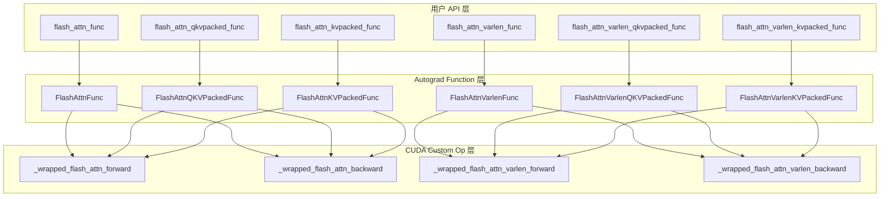
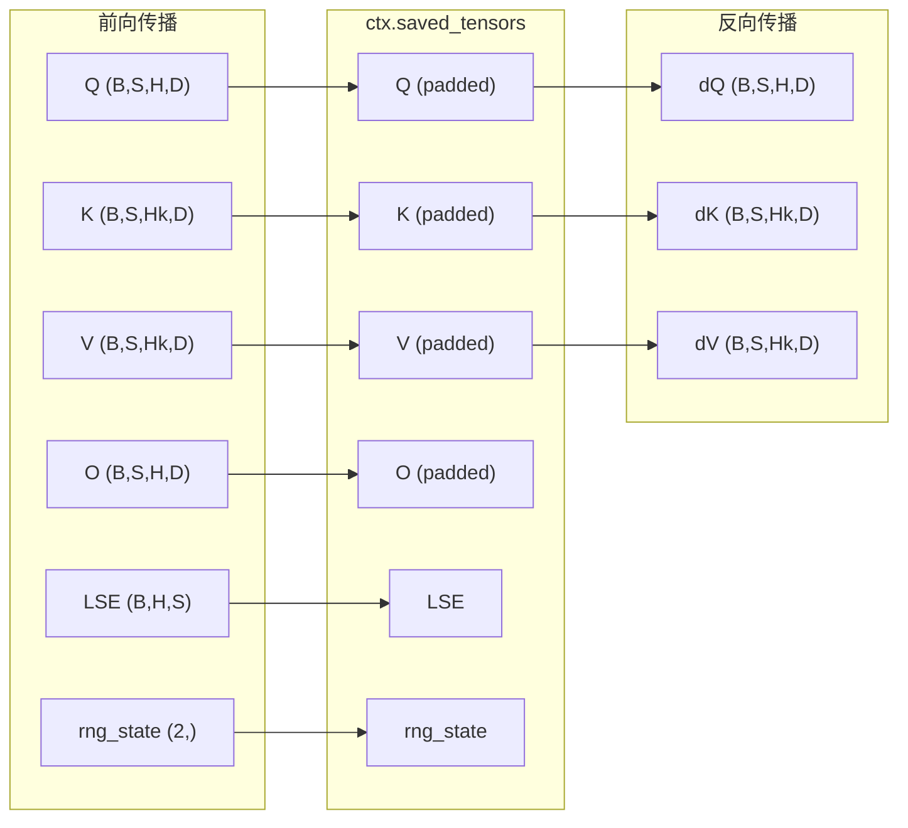

## 目录

- [1. 概述](#1-概述)
- [2. Autograd Function 架构](#2-autograd-function-架构)
- [3. FlashAttnFunc 详解](#3-flashattnfunc-详解)
- [4. 变体 Function 对比](#4-变体-function-对比)
- [5. torch.compile 集成](#5-torchcompile-集成)
- [6. Dropout 与 RNG 状态管理](#6-dropout-与-rng-状态管理)
- [7. Head Dimension Padding](#7-head-dimension-padding)
- [8. 梯度流分析](#8-梯度流分析)

---

## 1. 概述

Flash Attention 的 Python API 通过 `torch.autograd.Function` 将 CUDA 内核封装为可自动微分的 PyTorch 算子。这一层的核心职责包括：

- **前向/反向调度**：将用户调用路由到对应的 CUDA 前向和反向内核
- **上下文管理**：在前向时保存反向所需的中间结果（`q`, `k`, `v`, `out`, `softmax_lse`, `rng_state`）
- **Head Dimension 对齐**：自动 padding 到 8 的倍数以满足 CUDA 内核对齐要求
- **torch.compile 兼容**：通过 `torch.library.custom_op` 注册为可被编译器追踪的自定义算子
- **RNG 状态捕获**：保存 Dropout 随机数生成器状态，确保反向传播时能精确重放 Dropout mask

```python
# flash_attn/flash_attn_interface.py 的分层结构
#
# 用户 API（flash_attn_func 等）
#   ↓ 调用
# Autograd Function（FlashAttnFunc.apply）
#   ↓ 调用
# Custom Op Wrapper（_wrapped_flash_attn_forward）
#   ↓ 调用
# CUDA 绑定（flash_attn_gpu.fwd / flash_attn_gpu.bwd）
```

---

## 2. Autograd Function 架构

### 2.1 六个 Function 类

Flash Attention 定义了 6 个 `torch.autograd.Function` 子类，与 6 个训练 API 一一对应：



### 2.2 标准 vs Varlen 分支

6 个 Function 类在底层只使用 4 个 CUDA 函数——标准版的 `fwd`/`bwd` 和变长版的 `varlen_fwd`/`varlen_bwd`：

| Function 类 | 前向 CUDA 函数 | 反向 CUDA 函数 |
|-------------|---------------|---------------|
| `FlashAttnFunc` | `flash_attn_gpu.fwd` | `flash_attn_gpu.bwd` |
| `FlashAttnQKVPackedFunc` | `flash_attn_gpu.fwd` | `flash_attn_gpu.bwd` |
| `FlashAttnKVPackedFunc` | `flash_attn_gpu.fwd` | `flash_attn_gpu.bwd` |
| `FlashAttnVarlenFunc` | `flash_attn_gpu.varlen_fwd` | `flash_attn_gpu.varlen_bwd` |
| `FlashAttnVarlenQKVPackedFunc` | `flash_attn_gpu.varlen_fwd` | `flash_attn_gpu.varlen_bwd` |
| `FlashAttnVarlenKVPackedFunc` | `flash_attn_gpu.varlen_fwd` | `flash_attn_gpu.varlen_bwd` |

Packed 变体的主要区别在于**梯度的内存布局**——它们将 dQ/dK/dV 写入连续的 `dqkv` 或 `dkv` 张量，避免了反向传播时的梯度拼接操作。

---

## 3. FlashAttnFunc 详解

以最常用的 `FlashAttnFunc`（`flash_attn/flash_attn_interface.py:817-900`）为例，逐步分析前向和反向的实现。

### 3.1 前向传播

```python
# flash_attn/flash_attn_interface.py:818-867
class FlashAttnFunc(torch.autograd.Function):
    @staticmethod
    def forward(
        ctx, q, k, v, dropout_p, softmax_scale, causal,
        window_size, softcap, alibi_slopes, deterministic,
        return_softmax, is_grad_enabled,
    ):
        # 步骤 1：判断是否需要梯度
        is_grad = is_grad_enabled and any(
            x.requires_grad for x in [q, k, v]
        )

        # 步骤 2：计算默认 softmax_scale
        if softmax_scale is None:
            softmax_scale = q.shape[-1] ** (-0.5)

        # 步骤 3：Head dimension padding
        head_size_og = q.size(3)
        if head_size_og % 8 != 0:
            q = torch.nn.functional.pad(q, [0, 8 - head_size_og % 8])
            k = torch.nn.functional.pad(k, [0, 8 - head_size_og % 8])
            v = torch.nn.functional.pad(v, [0, 8 - head_size_og % 8])

        # 步骤 4：调用 CUDA 前向内核
        out_padded, softmax_lse, S_dmask, rng_state = \
            _wrapped_flash_attn_forward(
                q, k, v, dropout_p, softmax_scale,
                causal=causal,
                window_size_left=window_size[0],
                window_size_right=window_size[1],
                softcap=softcap,
                alibi_slopes=alibi_slopes,
                return_softmax=return_softmax and dropout_p > 0,
            )

        # 步骤 5：保存反向所需张量
        if is_grad:
            ctx.save_for_backward(q, k, v, out_padded, softmax_lse, rng_state)
            ctx.dropout_p = dropout_p
            ctx.softmax_scale = softmax_scale
            ctx.causal = causal
            ctx.window_size = window_size
            ctx.softcap = softcap
            ctx.alibi_slopes = alibi_slopes
            ctx.deterministic = deterministic

        # 步骤 6：截断 padding 后返回
        out = out_padded[..., :head_size_og]
        return out if not return_softmax else (out, softmax_lse, S_dmask)
```

**关键设计决策**：

1. **`is_grad_enabled` 参数**：从外部传入 `torch.is_grad_enabled()` 的结果，因为在 `Function.apply()` 内部无法直接访问外部的梯度开关状态
2. **有条件保存**：仅当需要梯度时才执行 `ctx.save_for_backward()`，推理时完全跳过，节省内存
3. **标量存 ctx 属性**：`dropout_p`、`softmax_scale` 等标量参数存储在 `ctx` 的属性中而非 `save_for_backward()`，因为后者只能保存 Tensor

### 3.2 反向传播

```python
# flash_attn/flash_attn_interface.py:869-900
@staticmethod
def backward(ctx, dout, *args):
    # 步骤 1：恢复保存的张量
    q, k, v, out, softmax_lse, rng_state = ctx.saved_tensors

    # 步骤 2：预分配梯度内存
    dq, dk, dv = torch.empty_like(q), torch.empty_like(k), torch.empty_like(v)

    # 步骤 3：dout padding
    head_size_og = dout.size(3)
    dout_padded = dout
    if head_size_og % 8 != 0:
        dout_padded = torch.nn.functional.pad(dout, [0, 8 - head_size_og % 8])

    # 步骤 4：调用 CUDA 反向内核
    _wrapped_flash_attn_backward(
        dout_padded, q, k, v, out, softmax_lse,
        dq, dk, dv,            # 原地写入
        ctx.dropout_p, ctx.softmax_scale, ctx.causal,
        ctx.window_size[0], ctx.window_size[1],
        ctx.softcap, ctx.alibi_slopes, ctx.deterministic,
        rng_state=rng_state,
    )

    # 步骤 5：截断 padding 维度
    dq = dq[..., : dout.shape[-1]]
    dk = dk[..., : dout.shape[-1]]
    dv = dv[..., : dout.shape[-1]]

    # 返回 12 个梯度（对应 forward 的 12 个输入参数）
    return dq, dk, dv, None, None, None, None, None, None, None, None, None
```

**关键设计决策**：

1. **原地写入梯度**：`dq`, `dk`, `dv` 在调用 CUDA 内核前预分配，内核直接写入这些缓冲区，避免额外的内存分配
2. **`mutates_args` 声明**：CUDA 反向函数通过 `@_torch_custom_op_wrapper("flash_attn::_flash_attn_backward", mutates_args=("dq", "dk", "dv"))` 声明原地修改，使 torch.compile 能正确处理
3. **返回 12 个值**：`forward()` 有 12 个输入参数（`ctx` 除外），因此 `backward()` 必须返回 12 个梯度值，非 Tensor 参数的梯度为 `None`

### 3.3 前向与反向的内存占用对比



> **内存分析**：Flash Attention 不保存 $O(N^2)$ 的 attention 矩阵 P，仅保存输入 Q/K/V（共 $O(N \cdot d)$）、输出 O（$O(N \cdot d)$）和 LSE（$O(N)$）。反向时通过重计算 P 来获取梯度。详见 [反向传播算法](../02-core-algorithm/04-backward-pass.md)。

---

## 4. 变体 Function 对比

### 4.1 QKVPacked 变体

`FlashAttnQKVPackedFunc`（`flash_attn/flash_attn_interface.py:450-529`）接受合并的 QKV 张量：

```python
# 输入: qkv (batch_size, seqlen, 3, nheads, headdim)
q, k, v = qkv[:, :, 0].detach(), qkv[:, :, 1].detach(), qkv[:, :, 2].detach()
```

反向传播中，梯度直接写入连续的 `dqkv` 张量：

```python
# 反向: 分配连续梯度张量
qkv_shape = q.shape[:-2] + (3, *q.shape[-2:])
dqkv = torch.empty(qkv_shape, dtype=q.dtype, device=q.device)

# 将 dqkv 的切片传给 CUDA 内核
_wrapped_flash_attn_backward(
    ...,
    dqkv[:, :, 0],   # dQ 切片
    dqkv[:, :, 1],   # dK 切片
    dqkv[:, :, 2],   # dV 切片
    ...
)
```

**性能优势**：使用连续的 `dqkv` 张量避免了在反向传播结束时将 `dq`, `dk`, `dv` 拼接（`torch.cat`）的开销。当 Q/K/V 头数相同时（标准 MHA），这种方式更快。

### 4.2 KVPacked 变体

`FlashAttnKVPackedFunc`（`flash_attn/flash_attn_interface.py:626-710`）适用于 MQA/GQA 场景，Q 独立传入，K/V 合并：

```python
# 输入: q (B, S, H, D), kv (B, S, 2, Hk, D)
k, v = kv[:, :, 0].detach(), kv[:, :, 1].detach()

# 反向: Q 单独分配, K/V 合并
dq = torch.empty_like(q)
kv_shape = k.shape[:-2] + (2, *k.shape[-2:])
dkv = torch.empty(kv_shape, dtype=k.dtype, device=k.device)
```

### 4.3 Varlen 变体

Varlen 系列的差异主要在两方面：

**张量形状不同**：

| 维度 | 标准版 | Varlen 版 |
|------|--------|----------|
| Q | `(B, S_q, H, D)` | `(total_q, H, D)` |
| K/V | `(B, S_k, Hk, D)` | `(total_k, Hk, D)` |
| Out | `(B, S_q, H, D)` | `(total_q, H, D)` |
| LSE | `(B, H, S_q)` | `(H, total_q)` |

**额外保存序列信息**：

```python
# FlashAttnVarlenFunc.forward 中
if is_grad:
    ctx.save_for_backward(
        q, k, v, out_padded, softmax_lse,
        cu_seqlens_q, cu_seqlens_k,  # 额外保存累计长度
        rng_state
    )
    ctx.max_seqlen_q = max_seqlen_q   # 额外保存最大长度
    ctx.max_seqlen_k = max_seqlen_k
```

### 4.4 各变体保存张量统计

| Function | `save_for_backward` 张量数 | ctx 标量属性数 | `backward` 返回值数 |
|----------|-------------------------|--------------|-------------------|
| `FlashAttnFunc` | 6 | 7 | 12 |
| `FlashAttnQKVPackedFunc` | 6 | 7 | 10 |
| `FlashAttnKVPackedFunc` | 6 | 7 | 11 |
| `FlashAttnVarlenFunc` | 8 | 9 | 17 |
| `FlashAttnVarlenQKVPackedFunc` | 7 | 8 | 12 |
| `FlashAttnVarlenKVPackedFunc` | 8 | 9 | 15 |

---

## 5. torch.compile 集成

### 5.1 Custom Op 注册机制

Flash Attention 通过 PyTorch 2.4+ 的 `torch.library.custom_op` 和 `torch.library.register_fake` API 实现对 `torch.compile()` 的兼容。这是因为 `torch.compile` 需要通过符号追踪（symbolic tracing）来分析计算图，但原生的 CUDA 扩展函数对编译器是不透明的。

```python
# flash_attn/flash_attn_interface.py:53-73
# 版本兼容处理
if torch.__version__ >= "2.4.0":
    _torch_custom_op_wrapper = torch.library.custom_op
    _torch_register_fake_wrapper = torch.library.register_fake
else:
    # PyTorch < 2.4 时使用空操作装饰器
    def noop_custom_op_wrapper(name, fn=None, /, *, mutates_args, ...):
        def wrap(func):
            return func
        ...
    _torch_custom_op_wrapper = noop_custom_op_wrapper
    _torch_register_fake_wrapper = noop_register_fake_wrapper
```

### 5.2 Custom Op 前向注册

每个 CUDA 函数注册两个实现——真实实现和 Fake 实现：

```python
# 真实实现：在 CUDA 上执行的实际操作
@_torch_custom_op_wrapper(
    "flash_attn::_flash_attn_forward",
    mutates_args=(),           # 前向不修改输入
    device_types="cuda"
)
def _flash_attn_forward(q, k, v, dropout_p, softmax_scale, ...):
    out, softmax_lse, S_dmask, rng_state = flash_attn_gpu.fwd(...)
    return out, softmax_lse, S_dmask, rng_state

# Fake 实现：编译时的形状推导
@_torch_register_fake_wrapper("flash_attn::_flash_attn_forward")
def _flash_attn_forward_fake(q, k, v, dropout_p, softmax_scale, ...):
    batch_size, seqlen_q, num_heads, head_size = q.shape
    out = torch.empty_like(q)
    softmax_lse = torch.empty(
        (batch_size, num_heads, seqlen_q),
        dtype=torch.float32, device=q.device
    )
    p = torch.empty((0,), dtype=q.dtype, device=q.device)
    rng_state = torch.empty((2,), dtype=torch.int64, device=q.device)
    return out, softmax_lse, p, rng_state
```

**Fake 函数的作用**：在 `torch.compile()` 的追踪阶段，编译器不执行真实的 CUDA 操作，而是调用 Fake 函数来推导输出张量的**形状、dtype 和 device**。这让编译器能够：

1. 正确推断后续算子的输入形状
2. 分配正确大小的中间缓冲区
3. 生成优化的融合计算图

### 5.3 Custom Op 反向注册

反向函数声明了 `mutates_args`，告知编译器哪些参数会被原地修改：

```python
@_torch_custom_op_wrapper(
    "flash_attn::_flash_attn_backward",
    mutates_args=("dq", "dk", "dv"),   # 声明原地修改
    device_types="cuda"
)
def _flash_attn_backward(dout, q, k, v, out, softmax_lse, dq, dk, dv, ...):
    dq, dk, dv, softmax_d = flash_attn_gpu.bwd(...)
    return softmax_d
```

### 5.4 Op 分发包装

根据 PyTorch 版本选择不同的调用路径：

```python
# flash_attn/flash_attn_interface.py:139-142
if torch.__version__ >= "2.4.0":
    # 通过 torch.ops 命名空间调用，可被 torch.compile 追踪
    _wrapped_flash_attn_forward = torch.ops.flash_attn._flash_attn_forward
else:
    # 直接调用 Python 函数，不支持编译
    _wrapped_flash_attn_forward = _flash_attn_forward
```

`torch.ops.flash_attn._flash_attn_forward` 是注册到 PyTorch dispatcher 的算子引用。通过这个路径调用，`torch.compile` 可以将 Flash Attention 作为一个不透明算子嵌入编译图中，同时利用 Fake 函数进行形状推导。

### 5.5 完整调用链

```mermaid
graph TB
    subgraph compile["torch.compile 模式"]
        User["用户代码"] --> Compile["torch.compile()"]
        Compile --> Trace["符号追踪"]
        Trace --> Fake["_flash_attn_forward_fake<br/>形状推导"]
        Fake --> Graph["编译计算图"]
        Graph --> Run["运行时执行"]
        Run --> Real["_flash_attn_forward<br/>真实 CUDA 调用"]
    end

    subgraph eager["Eager 模式"]
        User2["用户代码"] --> API["flash_attn_func"]
        API --> Apply["FlashAttnFunc.apply"]
        Apply --> Wrapped["_wrapped_flash_attn_forward"]
        Wrapped --> CUDA["flash_attn_gpu.fwd"]
    end
```



### 5.6 使用示例

```python
import torch
from flash_attn import flash_attn_func

# 在 torch.compile 中使用 Flash Attention
@torch.compile
def attention_layer(q, k, v):
    return flash_attn_func(q, k, v, causal=True)

# 编译器会：
# 1. 追踪时调用 _flash_attn_forward_fake 推导输出形状
# 2. 运行时调用 _flash_attn_forward 执行真实计算
q = torch.randn(2, 1024, 32, 128, device="cuda", dtype=torch.float16)
k = torch.randn(2, 1024, 32, 128, device="cuda", dtype=torch.float16)
v = torch.randn(2, 1024, 32, 128, device="cuda", dtype=torch.float16)
out = attention_layer(q, k, v)
```

---

## 6. Dropout 与 RNG 状态管理

### 6.1 Dropout 的挑战

在标准 Attention 中，Dropout 应用于 attention 概率矩阵 P：

$$P' = \text{Dropout}(P) = P \odot M / (1 - p)$$

其中 $M$ 是 Bernoulli mask，$p$ 是 dropout 概率。

Flash Attention 的核心挑战是：**P 矩阵不被显式存储**。前向传播时 Dropout mask 在 CUDA 内核中即时生成并应用；反向传播时需要**精确重放相同的 mask**，否则梯度计算会不正确。

### 6.2 RNG 状态保存

CUDA 内核通过 Philox 随机数生成器实现 Dropout，前向时返回 `rng_state`：

```python
# 前向: CUDA 内核返回 rng_state
out, softmax_lse, S_dmask, rng_state = flash_attn_gpu.fwd(
    q, k, v, None, alibi_slopes,
    dropout_p, softmax_scale, causal,
    window_size_left, window_size_right,
    softcap, return_softmax, None,
)

# rng_state 形状: (2,), dtype=int64
# 包含 Philox PRNG 的 seed 和 offset
```

`rng_state` 张量包含两个 int64 值：

| 索引 | 含义 | 用途 |
|------|------|------|
| 0 | Philox seed | 随机数种子 |
| 1 | Philox offset | 随机数序列偏移 |

### 6.3 反向重放

反向传播时，将保存的 `rng_state` 传给 CUDA 反向内核：

```python
# 反向: 使用保存的 rng_state
_wrapped_flash_attn_backward(
    dout_padded, q, k, v, out, softmax_lse,
    dq, dk, dv,
    ctx.dropout_p,
    ...,
    rng_state=rng_state,  # 传入保存的 RNG 状态
)
```

CUDA 反向内核使用相同的 seed 和 offset 初始化 Philox PRNG，确保生成与前向完全相同的 Dropout mask。这个过程是确定性的——给定相同的 `(seed, offset)`，Philox 生成器总是产生完全相同的随机数序列。

### 6.4 条件性 return_softmax

`return_softmax` 参数仅在 `dropout_p > 0` 时有意义：

```python
# flash_attn/flash_attn_interface.py:855
return_softmax=return_softmax and dropout_p > 0,
```

`S_dmask` 的返回目的是调试和测试——它编码了 Dropout 模式（负值表示被丢弃，非负值表示保留），但在生产中不应使用。

### 6.5 确定性模式

当 `deterministic=True` 时，反向传播使用确定性实现：

```python
# 存储在 ctx 中传递给反向内核
ctx.deterministic = deterministic
```

确定性模式会稍慢但保证结果可复现。在非确定性模式下，dQ 的累加使用原子操作（atomic add），不同 thread block 的执行顺序可能导致浮点累加结果的微小差异。确定性模式通过 TMA 存储避免原子操作，消除了这种不确定性。

> 详见 [反向内核实现 - dQ 存储策略](../03-cuda-kernel/04-backward-kernel-impl.md)。

---

## 7. Head Dimension Padding

### 7.1 对齐要求

CUDA 内核要求 head dimension 是 8 的倍数，因为 GMMA 和 TMA 指令对数据对齐有严格要求。Python 层通过自动 padding 对用户透明地处理这一限制。

### 7.2 前向 Padding 流程

```python
# flash_attn/flash_attn_interface.py:839-843
head_size_og = q.size(3)           # 保存原始维度
if head_size_og % 8 != 0:
    q = torch.nn.functional.pad(q, [0, 8 - head_size_og % 8])  # 右侧零填充
    k = torch.nn.functional.pad(k, [0, 8 - head_size_og % 8])
    v = torch.nn.functional.pad(v, [0, 8 - head_size_og % 8])
```

`torch.nn.functional.pad(q, [0, pad_size])` 在最后一个维度的右侧填充零：

```
原始: q[..., :head_size_og]  = [v0, v1, ..., v_{d-1}]
填充: q[..., :head_size_og+pad] = [v0, v1, ..., v_{d-1}, 0, ..., 0]
```

### 7.3 输出裁剪

前向和反向都需要裁剪回原始维度：

```python
# 前向输出裁剪
out = out_padded[..., :head_size_og]

# 反向梯度裁剪
dq = dq[..., :dout.shape[-1]]
dk = dk[..., :dout.shape[-1]]
dv = dv[..., :dout.shape[-1]]
```

### 7.4 dout 也需 Padding

反向传播中，上游梯度 `dout` 的 head dimension 也可能不是 8 的倍数：

```python
# flash_attn/flash_attn_interface.py:873-876
head_size_og = dout.size(3)
dout_padded = dout
if head_size_og % 8 != 0:
    dout_padded = torch.nn.functional.pad(dout, [0, 8 - head_size_og % 8])
```

### 7.5 Padding 对计算正确性的影响

零填充不影响 Attention 计算的正确性：

- **QK^T 计算**：$Q_{pad} K_{pad}^T = QK^T + 0 = QK^T$（零元素对点积无贡献）
- **Softmax**：基于 QK^T 的分数不变
- **PV 计算**：$P \cdot V_{pad} = [P \cdot V, P \cdot 0]$（前 `head_size_og` 维度正确，填充维度为零）

因此，只需截取前 `head_size_og` 个元素即可得到正确结果。

---

## 8. 梯度流分析

### 8.1 参数梯度映射

`forward()` 的 12 个参数（不含 `ctx`）与 `backward()` 返回值的对应关系：

| 位置 | forward 参数 | backward 返回值 | 说明 |
|------|-------------|----------------|------|
| 0 | `q` | `dq` | Query 梯度 |
| 1 | `k` | `dk` | Key 梯度 |
| 2 | `v` | `dv` | Value 梯度 |
| 3 | `dropout_p` | `None` | 标量，无梯度 |
| 4 | `softmax_scale` | `None` | 标量，无梯度 |
| 5 | `causal` | `None` | 布尔值，无梯度 |
| 6 | `window_size` | `None` | 元组，无梯度 |
| 7 | `softcap` | `None` | 标量，无梯度 |
| 8 | `alibi_slopes` | `None` | 位置偏置，不参与训练 |
| 9 | `deterministic` | `None` | 布尔值，无梯度 |
| 10 | `return_softmax` | `None` | 布尔值，无梯度 |
| 11 | `is_grad_enabled` | `None` | 布尔值，无梯度 |

### 8.2 Packed 变体的梯度聚合

QKVPacked 变体的梯度天然是连续的：

```python
# FlashAttnQKVPackedFunc.backward
dqkv = torch.empty(qkv_shape, dtype=q.dtype, device=q.device)
# dqkv[:, :, 0] = dQ
# dqkv[:, :, 1] = dK
# dqkv[:, :, 2] = dV
return dqkv, None, None, ...  # dqkv 对应输入参数 qkv
```

相比 `FlashAttnFunc.backward` 返回的 `(dq, dk, dv)`，这种方式在反向传播后无需 `torch.cat([dq, dk, dv])`，减少了一次内存分配和拷贝。

### 8.3 Varlen 梯度的特殊性

Varlen 变体的梯度形状为 `(total, H, D)` 而非 `(B, S, H, D)`。`cu_seqlens_q` 和 `cu_seqlens_k` 作为辅助索引张量，虽然通过 `save_for_backward` 保存，但不需要梯度：

```python
# FlashAttnVarlenFunc.backward 返回 17 个值
return dq, dk, dv, None, None, None, None, None, None, None, None, None, None, None, None, None, None
#      q   k   v   cu_q cu_k maxq maxk drop  scale causal win  scap alibi det  ret  block grad
```

`cu_seqlens_q`, `cu_seqlens_k`, `max_seqlen_q`, `max_seqlen_k` 对应的梯度均为 `None`，因为它们是整数索引而非可微参数。

---

## 导航

- 上一篇：[Python API 参考](01-api-reference.md)
- 下一篇：[模块与层](03-modules-and-layers.md)
- [返回目录](../README.md)
