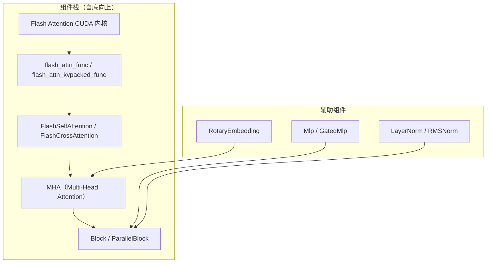
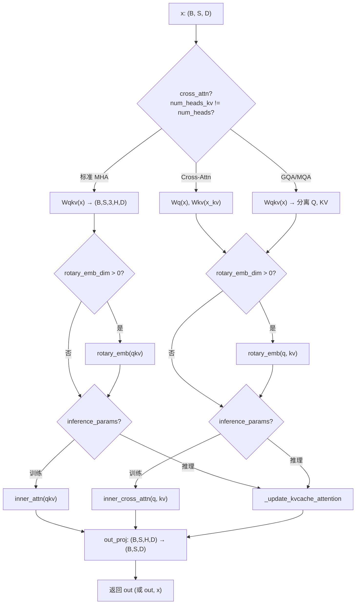
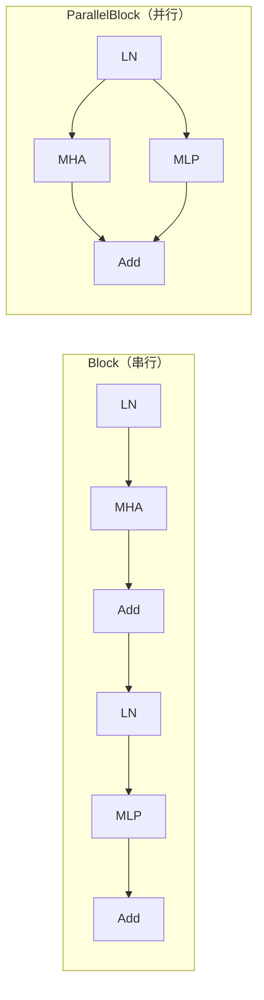

## 目录

- [1. 概述](#1-概述)
- [2. 内部 Attention 模块](#2-内部-attention-模块)
- [3. MHA 模块](#3-mha-模块)
- [4. RotaryEmbedding](#4-rotaryembedding)
- [5. Transformer Block](#5-transformer-block)
- [6. 并行化变体](#6-并行化变体)
- [7. 组装完整模型](#7-组装完整模型)

---

## 1. 概述

Flash Attention 不仅提供底层的 Attention 计算函数，还封装了一系列生产可用的 `nn.Module` 组件。这些模块在 `flash_attn/modules/` 和 `flash_attn/layers/` 目录下，形成从 Attention 计算到完整 Transformer 层的组件栈：



| 模块 | 文件路径 | 功能 |
|------|---------|------|
| `FlashSelfAttention` | `flash_attn/modules/mha.py` | Self-Attention 包装 |
| `FlashCrossAttention` | `flash_attn/modules/mha.py` | Cross-Attention 包装 |
| `MHA` | `flash_attn/modules/mha.py` | 完整多头注意力（含投影） |
| `ParallelMHA` | `flash_attn/modules/mha.py` | 张量并行版 MHA |
| `RotaryEmbedding` | `flash_attn/layers/rotary.py` | RoPE 位置编码 |
| `Block` | `flash_attn/modules/block.py` | 标准 Transformer 块 |
| `ParallelBlock` | `flash_attn/modules/block.py` | 并行 Attention+MLP 块 |
| `Mlp` | `flash_attn/modules/mlp.py` | 标准前馈网络 |

---

## 2. 内部 Attention 模块

### 2.1 FlashSelfAttention

`FlashSelfAttention`（`flash_attn/modules/mha.py:53-130`）是对 `flash_attn_qkvpacked_func` 和 `flash_attn_varlen_qkvpacked_func` 的 `nn.Module` 包装：

```python
class FlashSelfAttention(nn.Module):
    def __init__(
        self,
        causal=False,
        softmax_scale=None,
        attention_dropout=0.0,
        window_size=(-1, -1),
        alibi_slopes=None,
        deterministic=False,
    ):
        super().__init__()
        self.causal = causal
        self.softmax_scale = softmax_scale
        self.drop = nn.Dropout(attention_dropout)
        self.register_buffer("alibi_slopes", alibi_slopes, persistent=False)
        self.window_size = window_size
        self.deterministic = deterministic
```

**forward 签名**：

```python
def forward(self, qkv, causal=None, cu_seqlens=None, max_seqlen=None):
    # qkv: (B, S, 3, H, D) 或 (total, 3, H, D) (varlen 模式)
```

根据 `cu_seqlens` 是否为 `None` 自动路由到标准或 Varlen 版本：

```python
if unpadded:  # cu_seqlens is not None
    return flash_attn_varlen_qkvpacked_func(qkv, cu_seqlens, max_seqlen, ...)
else:
    return flash_attn_qkvpacked_func(qkv, ...)
```

**关键设计**：Dropout 概率在训练和评估模式下自动切换——`self.drop.p if self.training else 0.0`。

### 2.2 FlashCrossAttention

`FlashCrossAttention`（`flash_attn/modules/mha.py:133-227`）类似，但使用 KVPacked 格式：

```python
def forward(self, q, kv, causal=None, cu_seqlens=None, max_seqlen=None,
            cu_seqlens_k=None, max_seqlen_k=None):
    # q: (B, Sq, H, D)
    # kv: (B, Sk, 2, Hk, D)
```

Cross-Attention 支持 Q 和 K/V 有不同的序列长度，适用于 encoder-decoder 架构和推理时的 KV Cache 场景。

### 2.3 标准 Attention 参考实现

为了对比，Flash Attention 还提供了纯 PyTorch 的 `SelfAttention`（`flash_attn/modules/mha.py:230-279`）和 `CrossAttention`（`flash_attn/modules/mha.py:282-341`），使用 `torch.einsum` 实现标准的 $O(N^2)$ Attention。这些用作 `use_flash_attn=False` 时的回退实现：

```python
class SelfAttention(nn.Module):
    def forward(self, qkv, causal=None, key_padding_mask=None):
        q, k, v = qkv.unbind(dim=2)
        scores = torch.einsum("bthd,bshd->bhts", q, k * softmax_scale)
        # ... 手动 causal mask + softmax + dropout + output
        output = torch.einsum("bhts,bshd->bthd", attention_drop, v)
        return output
```

---

## 3. MHA 模块

### 3.1 构造函数

`MHA`（`flash_attn/modules/mha.py:373-481`）是完整的 Multi-Head Attention 模块，集成了线性投影、RoPE、Attention 计算和输出投影：

```python
class MHA(nn.Module):
    def __init__(
        self,
        embed_dim,              # 嵌入维度（等于 num_heads * head_dim）
        num_heads,              # Q 的头数
        num_heads_kv=None,      # K/V 头数（None 则等于 num_heads）
        cross_attn=False,       # 是否为 Cross-Attention
        qkv_proj_bias=True,     # QKV 投影偏置
        out_proj_bias=True,     # 输出投影偏置
        dropout=0.0,            # Attention Dropout
        softmax_scale=None,     # Softmax 缩放因子
        causal=False,           # 因果遮蔽
        layer_idx=None,         # 层索引（推理用）
        dwconv=False,           # 深度可分离卷积
        rotary_emb_dim=0,       # RoPE 维度（0=不启用）
        rotary_emb_base=10000.0,# RoPE 基础频率
        rotary_emb_scale_base=None, # XPos 缩放基
        rotary_emb_interleaved=False, # RoPE 交错模式
        use_alibi=False,        # ALiBi 位置偏置
        window_size=(-1, -1),   # 滑动窗口
        fused_bias_fc=False,    # 融合偏置
        use_flash_attn=False,   # 使用 Flash Attention
        return_residual=False,  # 返回残差
        checkpointing=False,    # 梯度 checkpointing
        device=None, dtype=None,
    ):
```

### 3.2 内部结构

MHA 的内部结构根据配置有两种模式：

**标准 MHA（`num_heads_kv == num_heads`）**：

```python
# 单个 Wqkv 投影矩阵
self.Wqkv = nn.Linear(embed_dim, qkv_dim, bias=qkv_proj_bias)
# qkv_dim = head_dim * (num_heads + 2 * num_heads_kv)
# 当 num_heads_kv == num_heads 时，qkv_dim = 3 * embed_dim
```

**GQA/MQA 或 Cross-Attention**：

```python
if cross_attn:
    self.Wq = nn.Linear(embed_dim, embed_dim, ...)       # Q 投影
    self.Wkv = nn.Linear(embed_dim, kv_dim, ...)         # KV 投影
else:
    # GQA: 使用单个 Wqkv，但 reshape 时分离 Q 和 KV
    self.Wqkv = nn.Linear(embed_dim, qkv_dim, ...)
```

### 3.3 前向传播路径

`MHA.forward()`（`flash_attn/modules/mha.py:573-704`）有多条执行路径，由配置决定：



### 3.4 推理快速路径

当 `inference_params.seqlen_offset > 0`（即自回归生成的非首次步骤）且使用 Flash Attention 时，MHA 提供了一条快速路径 `_apply_rotary_update_kvcache_attention()`（`flash_attn/modules/mha.py:502-540`），将三个操作融合到一次 `flash_attn_with_kvcache` 调用中：

1. **RoPE 应用**：对 Q 和 K 施加旋转位置编码
2. **KV Cache 更新**：将新的 K/V 写入缓存
3. **Attention 计算**：使用完整的 KV Cache 计算输出

```python
context = flash_attn_with_kvcache(
    q,
    kv_cache[:, :, 0],           # K cache
    kv_cache[:, :, 1],           # V cache
    kv[:, :, 0],                 # 新 K
    kv[:, :, 1],                 # 新 V
    rotary_cos=rotary_cos,       # RoPE cos
    rotary_sin=rotary_sin,       # RoPE sin
    cache_seqlens=cache_seqlens, # 当前缓存长度
    softmax_scale=...,
    causal=...,
    rotary_interleaved=...,
)
```

### 3.5 KV Cache 管理

`_update_kv_cache()`（`flash_attn/modules/mha.py:344-370`）负责在推理时管理 KV Cache：

```python
def _update_kv_cache(kv, inference_params, layer_idx):
    # 首次调用：预分配最大序列长度的 cache
    if layer_idx not in inference_params.key_value_memory_dict:
        kv_cache = torch.empty(
            inference_params.max_batch_size,
            inference_params.max_seqlen,
            2, num_heads, head_dim,
            dtype=kv.dtype, device=kv.device,
        )
        inference_params.key_value_memory_dict[layer_idx] = kv_cache

    # 将新 KV 写入对应位置
    kv_cache[batch_start:batch_end, sequence_start:sequence_end, ...] = kv

    # 返回截止到当前位置的完整 cache
    return kv_cache[batch_start:batch_end, :sequence_end, ...]
```

`allocate_inference_cache()`（`flash_attn/modules/mha.py:483-494`）提供提前分配 cache 的接口：

```python
def allocate_inference_cache(self, batch_size, max_seqlen, dtype=None):
    return torch.empty(
        batch_size, max_seqlen, 2,
        self.num_heads_kv, self.head_dim,
        dtype=dtype, device=self.out_proj.weight.device,
    )
```

---

## 4. RotaryEmbedding

### 4.1 基本原理

`RotaryEmbedding`（`flash_attn/layers/rotary.py:331-482`）实现了 RoPE（Rotary Position Embedding），其数学基础是将位置信息编码为旋转矩阵：

$$\text{RoPE}(x, m) = x \odot \cos(m\theta) + \text{rotate\_half}(x) \odot \sin(m\theta)$$

其中 $m$ 是位置索引，$\theta_i = 1/\text{base}^{2i/d}$ 是频率。

### 4.2 构造函数

```python
class RotaryEmbedding(torch.nn.Module):
    def __init__(
        self,
        dim: int,           # 旋转维度（通常等于 head_dim）
        base=10000.0,       # 频率基数
        interleaved=False,  # True: GPT-J 风格, False: GPT-NeoX 风格
        scale_base=None,    # XPos 缩放基数（None=不启用）
        device=None,
    ):
```

**两种旋转模式**：

| 模式 | `interleaved` | 旋转方式 | 使用模型 |
|------|--------------|---------|---------|
| GPT-NeoX | `False` | 前半 / 后半维度配对 | LLaMA, Mistral |
| GPT-J | `True` | 奇偶维度配对 | GPT-J, GPT-NeoX (早期) |

### 4.3 频率缓存

`RotaryEmbedding` 维护一个自增长的 cos/sin 缓存：

```python
def _update_cos_sin_cache(self, seqlen, device=None, dtype=None):
    if seqlen > self._seq_len_cached or ...:
        # inv_freq: (dim/2,)
        # t: (seqlen,)
        # freqs = outer(t, inv_freq): (seqlen, dim/2)
        t = torch.arange(seqlen, device=device, dtype=torch.float32)
        freqs = torch.outer(t, inv_freq)
        self._cos_cached = torch.cos(freqs).to(dtype)
        self._sin_cached = torch.sin(freqs).to(dtype)
```

**精度保证**：即使模型以 BF16 加载，频率计算始终在 FP32 下进行：

```python
# 使用 FP32 避免大值时的精度损失
t = torch.arange(seqlen, device=device, dtype=torch.float32)
if self.inv_freq.dtype != torch.float32:
    inv_freq = self._compute_inv_freq(device=device)
```

### 4.4 前向传播

`RotaryEmbedding.forward()` 支持两种调用模式：

**Self-Attention 模式**（仅传入 qkv）：

```python
# qkv: (B, S, 3, H, D) 或 (B, S, Hq+2*Hk, D)
rotary_emb(qkv)  # 原地应用到 Q 和 K
```

**Cross-Attention 模式**（传入 q 和 kv）：

```python
# q: (B, S, H, D), kv: (B, S, 2, Hk, D)
q, kv = rotary_emb(q, kv)  # 分别应用
```

### 4.5 自定义 Autograd Function

RoPE 的高效实现通过 Triton 内核完成，但包装在自定义 `torch.autograd.Function` 中以支持梯度：

```python
# flash_attn/layers/rotary.py:38-90
class ApplyRotaryEmb(torch.autograd.Function):
    @staticmethod
    def forward(ctx, x, cos, sin, interleaved, inplace, seqlen_offsets, ...):
        out = apply_rotary(x, cos, sin, ...)  # Triton 内核
        ctx.save_for_backward(cos, sin, ...)
        return out

    @staticmethod
    def backward(ctx, do):
        # 反向 = 共轭旋转（conjugate=True）
        dx = apply_rotary(do, cos, sin, ..., conjugate=True)
        return dx, None, None, ...
```

**反向传播的数学性质**：RoPE 的反向传播等价于用相反角度旋转（共轭），即 `conjugate=True`。这利用了旋转矩阵的正交性：$R^{-1} = R^T$。

### 4.6 QKV 联合旋转优化

当 Q 和 K 具有相同的 cos/sin（即没有 XPos），`apply_rotary_emb_qkv_` 将 Q 和 K 合并为一个张量一次性旋转：

```python
# flash_attn/layers/rotary.py:149-166
if cos_k is None and sin_k is None and qkv.is_contiguous():
    # 合并 Q 和 K 维度调用 1 个 kernel
    qk = qkv[:, :, :2].reshape(batch, seqlen, -1, headdim)
    qk = apply_rotary_fn(qk, cos, sin)  # 1 次 kernel launch
```

相比对 Q 和 K 分别调用，这节省了一次 kernel launch 开销。

---

## 5. Transformer Block

### 5.1 Block 模块

`Block`（`flash_attn/modules/block.py:21-256`）是完整的 Transformer 层，组合了 Attention（mixer）、MLP 和 LayerNorm：

```python
class Block(nn.Module):
    def __init__(
        self,
        dim,                      # 隐藏维度
        mixer_cls=None,           # Attention 类（默认 MHA）
        mlp_cls=None,             # MLP 类（默认 4x Mlp）
        norm_cls=nn.LayerNorm,    # 归一化层
        dropout_cls=nn.Dropout,   # Dropout 类
        prenorm=True,             # Pre-Norm vs Post-Norm
        resid_dropout1=0.0,       # Attention 后的残差 Dropout
        resid_dropout2=0.0,       # MLP 后的残差 Dropout
        drop_path1=0.0,           # Stochastic Depth (Attention)
        drop_path2=0.0,           # Stochastic Depth (MLP)
        fused_dropout_add_ln=False, # 融合 Dropout+Add+LN
        return_residual=False,
        residual_in_fp32=False,   # 残差保持 FP32
        sequence_parallel=False,
        mark_shared_params=False,
    ):
```

### 5.2 Pre-Norm 结构

Block 默认使用 Pre-Norm 结构，但与标准实现略有不同以支持融合操作：

**标准 Pre-Norm**：
```
LN → MHA → Dropout → Add → LN → MLP → Dropout → Add
```

**Flash Attention 的 Pre-Norm**：
```
Dropout → Add → LN → MHA → Dropout → Add → LN → MLP
```

这种重排使得 `Dropout → Add → LN` 可以融合为一个 Triton 内核（`layer_norm_fn`），显著减少内存访问。

```python
# flash_attn/modules/block.py:124-153
if self.prenorm:
    if not self.fused_dropout_add_ln:
        # 标准路径: 三个操作分开执行
        dropped = self.drop_path1(self.dropout1(hidden_states))
        residual = (dropped + residual) if residual is not None else dropped
        hidden_states = self.norm1(residual.to(dtype=self.norm1.weight.dtype))
    else:
        # 融合路径: Dropout + Add + LN 在一个 kernel 中
        hidden_states, residual = layer_norm_fn(
            hidden_states,
            self.norm1.weight, self.norm1.bias,
            residual=residual,
            eps=self.norm1.eps,
            dropout_p=self.dropout1.p if self.training else 0.0,
            rowscale=rowscale1,
            prenorm=True,
            residual_in_fp32=self.residual_in_fp32,
            is_rms_norm=isinstance(self.norm1, RMSNorm)
        )
```

### 5.3 前向传播流程

```python
# Block.forward 签名
def forward(self, hidden_states, residual=None, mixer_subset=None, mixer_kwargs=None):
    # 返回: (hidden_states, residual) if prenorm
    # 返回: hidden_states              if postnorm
```



```mermaid
graph TD
    subgraph prenorm["Pre-Norm 流程"]
        I1["hidden_states, residual"] --> DA1["Dropout + Add + LN"]
        DA1 --> MHA1["MHA（mixer）"]
        MHA1 --> DA2["Dropout + Add + LN"]
        DA2 --> MLP1["MLP"]
        MLP1 --> O1["hidden_states, residual"]
    end

    subgraph postnorm["Post-Norm 流程"]
        I2["hidden_states"] --> MHA2["MHA（mixer）"]
        MHA2 --> DA3["Dropout + Add + LN"]
        DA3 --> MLP2["MLP"]
        MLP2 --> DA4["Dropout + Add + LN"]
        DA4 --> O2["hidden_states"]
    end
```

### 5.4 残差 FP32 精度

`residual_in_fp32=True` 确保残差连接始终保持在 FP32 精度：

```python
if self.residual_in_fp32:
    residual = residual.to(torch.float32)
```

这在混合精度训练中很重要——虽然 Attention 和 MLP 使用 FP16/BF16 计算，但残差路径保持 FP32 可以提高训练稳定性，特别是在深层网络中。

### 5.5 Stochastic Depth

Block 支持 Stochastic Depth（随机深度），用于训练时以一定概率跳过整个子层：

```python
self.drop_path1 = StochasticDepth(drop_path1, mode="row")
self.drop_path2 = StochasticDepth(drop_path2, mode="row")
```

`mode="row"` 表示每个样本独立决定是否跳过，而非整个 batch。

---

## 6. 并行化变体

### 6.1 ParallelMHA

`ParallelMHA`（`flash_attn/modules/mha.py:707-`）是 `MHA` 的张量并行版本，用于多 GPU 训练：

```python
class ParallelMHA(nn.Module):
    def __init__(
        self,
        embed_dim, num_heads,
        process_group,           # 张量并行进程组
        num_heads_kv=None,
        sequence_parallel=True,  # 序列并行
        ...
    ):
```

**与 MHA 的关键区别**：

| 特性 | MHA | ParallelMHA |
|------|-----|-------------|
| QKV 投影 | `nn.Linear` | `ColumnParallelLinear` |
| 输出投影 | `nn.Linear` | `RowParallelLinear` |
| 头数 | 全量 | `num_heads / world_size` |
| ALiBi slopes | 全量 | 按 rank 切片 |

```python
# ParallelMHA 的头数按 rank 分配
self.num_heads_per_rank = get_dim_for_local_rank(
    self.num_heads, self.world_size, self.local_rank
)
self.num_heads_kv_per_rank = get_dim_for_local_rank(
    self.num_heads_kv, self.world_size, self.local_rank
)
```

`ColumnParallelLinear` 沿输出维度切分权重，每个 GPU 计算一部分头的 QKV；`RowParallelLinear` 沿输入维度切分权重，配合 all-reduce 聚合输出。

### 6.2 ParallelBlock

`ParallelBlock`（`flash_attn/modules/block.py:259-397`）实现了 GPT-J/PaLM 风格的**并行 Attention+MLP** 结构：

```python
class ParallelBlock(nn.Module):
    """Attention 和 MLP 并行计算，类似 GPT-J, GPT-NeoX, PaLM"""
```

**标准 Block vs ParallelBlock**：



ParallelBlock 中 Attention 和 MLP 共享同一个 LN 输出（或使用 `tied_norm=False` 时各自有独立的 LN），两路并行计算后的结果相加：

```python
def forward(self, hidden_states1, hidden_states2=None, residual=None, mixer_kwargs=None):
    # LN（可融合 Dropout+Add）
    hidden_states1 = self.norm1(residual)
    hidden_states2 = self.norm2(residual) if not self.tied_norm else hidden_states1

    # 并行计算
    hidden_states1 = self.mixer(hidden_states1, **mixer_kwargs)  # Attention
    hidden_states2 = self.mlp(hidden_states2)                     # MLP

    return hidden_states1, hidden_states2, residual
```

---

## 7. 组装完整模型

### 7.1 使用 Block 构建 Transformer

```python
import torch
import torch.nn as nn
from functools import partial
from flash_attn.modules.mha import MHA
from flash_attn.modules.mlp import Mlp
from flash_attn.modules.block import Block

# 配置参数
dim = 2048
num_heads = 32
num_layers = 24

# 定义组件工厂
mixer_cls = partial(
    MHA,
    num_heads=num_heads,
    causal=True,
    use_flash_attn=True,
    rotary_emb_dim=dim // num_heads,  # 64
    dropout=0.1,
)
mlp_cls = partial(Mlp, hidden_features=4 * dim)

# 构建 Transformer
layers = nn.ModuleList([
    Block(
        dim,
        mixer_cls=mixer_cls,
        mlp_cls=mlp_cls,
        prenorm=True,
        fused_dropout_add_ln=True,
        residual_in_fp32=True,
    )
    for _ in range(num_layers)
])

# 前向传播
x = torch.randn(2, 1024, dim, device="cuda", dtype=torch.bfloat16)
residual = None
for layer in layers:
    x, residual = layer(x, residual)
```

### 7.2 推理配置

```python
# 推理时分配 KV Cache
class InferenceParams:
    def __init__(self, max_batch_size, max_seqlen):
        self.max_batch_size = max_batch_size
        self.max_seqlen = max_seqlen
        self.seqlen_offset = 0
        self.key_value_memory_dict = {}
        self.lengths_per_sample = None

inference_params = InferenceParams(max_batch_size=4, max_seqlen=2048)

# 预分配每层的 KV Cache
for i, layer in enumerate(layers):
    layer.mixer.layer_idx = i
    layer.allocate_inference_cache(
        batch_size=4, max_seqlen=2048, dtype=torch.bfloat16
    )

# Prefill 阶段
x_prompt = torch.randn(4, 512, dim, device="cuda", dtype=torch.bfloat16)
residual = None
for layer in layers:
    x_prompt, residual = layer(
        x_prompt, residual,
        mixer_kwargs={"inference_params": inference_params}
    )
inference_params.seqlen_offset = 512

# Decode 阶段（自回归生成）
for step in range(100):
    x_new = torch.randn(4, 1, dim, device="cuda", dtype=torch.bfloat16)
    residual = None
    for layer in layers:
        x_new, residual = layer(
            x_new, residual,
            mixer_kwargs={"inference_params": inference_params}
        )
    inference_params.seqlen_offset += 1
```

### 7.3 GQA 配置

```python
# LLaMA-2 70B 风格: 64 头 Q, 8 头 KV (GQA ratio=8)
mixer_cls = partial(
    MHA,
    num_heads=64,
    num_heads_kv=8,      # GQA: 8 组，每组 8 个 Q 头
    causal=True,
    use_flash_attn=True,
    rotary_emb_dim=128,
)
```

### 7.4 组件兼容性矩阵

| 功能 | MHA | ParallelMHA | Block | ParallelBlock |
|------|-----|-------------|-------|---------------|
| Flash Attention | Y | Y | Y | Y |
| Rotary Embedding | Y | Y | Y | Y |
| GQA/MQA | Y | Y | Y | Y |
| ALiBi | Y | Y | Y | Y |
| Sliding Window | Y | Y | Y | Y |
| KV Cache | Y | Y | Y | Y |
| Cross-Attention | Y | - | Y | - |
| DWConv | Y | - | Y | - |
| Fused LN | - | - | Y | Y |
| Tensor Parallel | - | Y | - | Y |
| Stochastic Depth | - | - | Y | - |

---

## 导航

- 上一篇：[Autograd 集成与编译支持](02-autograd-integration.md)
- 下一篇：[前向调用链追踪](../05-code-walkthrough/01-forward-call-trace.md)
- [返回目录](../README.md)
