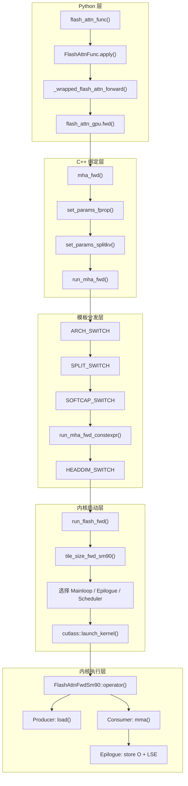
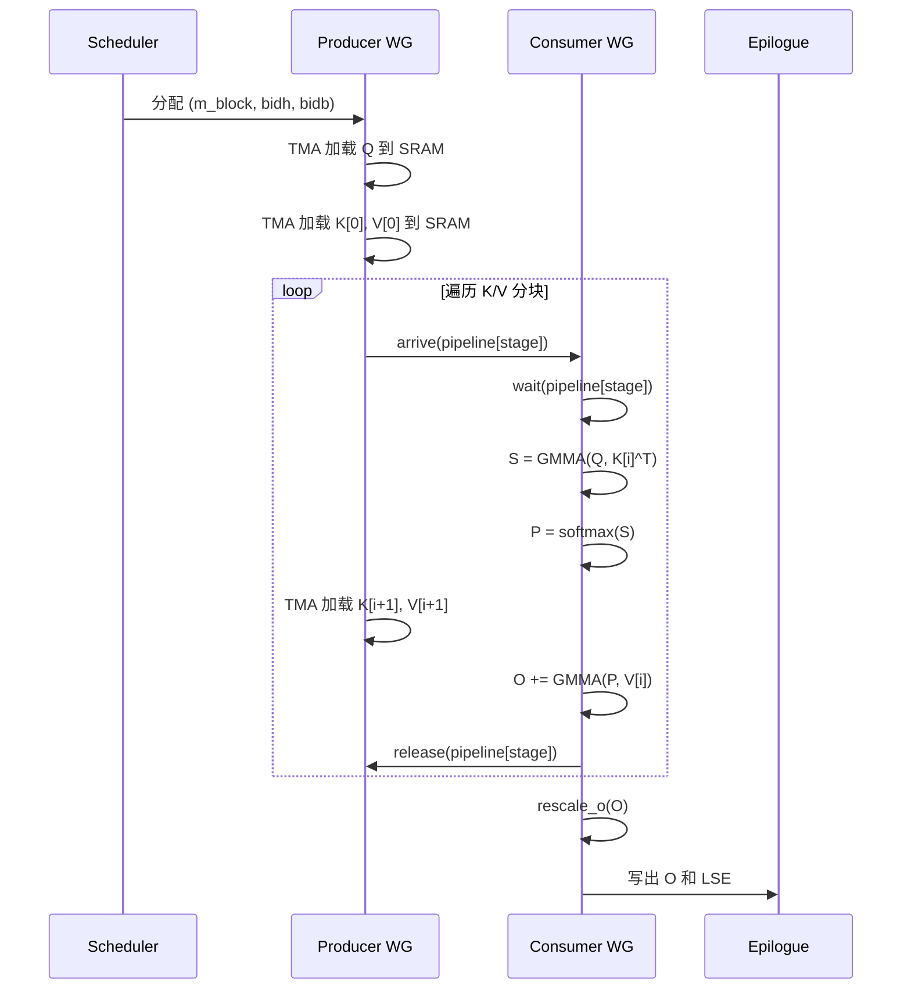
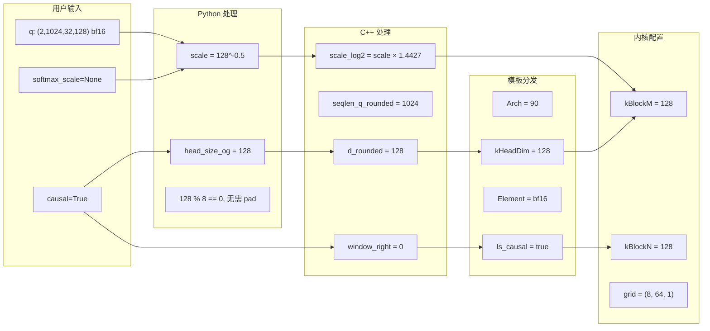

## 目录

- [1. 概述](#1-概述)
- [2. 调用链全景](#2-调用链全景)
- [3. Python 层](#3-python-层)
- [4. C++ 绑定层](#4-c-绑定层)
- [5. 模板分发层](#5-模板分发层)
- [6. 内核启动层](#6-内核启动层)
- [7. 内核执行层](#7-内核执行层)
- [8. 参数变换追踪](#8-参数变换追踪)

---

## 1. 概述

本文追踪一次 `flash_attn_func()` 调用从 Python 用户代码到 GPU 内核执行的完整路径，涉及 5 个层次、8 个文件。理解这条调用链对调试、性能分析和功能扩展至关重要。

以一个典型调用为例：

```python
import torch
from flash_attn import flash_attn_func

q = torch.randn(2, 1024, 32, 128, device="cuda", dtype=torch.bfloat16)
k = torch.randn(2, 1024, 32, 128, device="cuda", dtype=torch.bfloat16)
v = torch.randn(2, 1024, 32, 128, device="cuda", dtype=torch.bfloat16)

out = flash_attn_func(q, k, v, causal=True)
```

这个调用将经过以下层次：Python API → Autograd Function → Custom Op → C++ Binding → Template Dispatch → Kernel Launch → GPU 执行。

---

## 2. 调用链全景



**文件路径清单**：

| 层次 | 文件 | 关键函数 |
|------|------|---------|
| Python API | `flash_attn/flash_attn_interface.py` | `flash_attn_func()` |
| Autograd | `flash_attn/flash_attn_interface.py` | `FlashAttnFunc.forward()` |
| Custom Op | `flash_attn/flash_attn_interface.py` | `_flash_attn_forward()` |
| C++ Binding (SM80) | `csrc/flash_attn/flash_api.cpp` | `mha_fwd()` |
| C++ Binding (SM90) | `hopper/flash_api.cpp` | `mha_fwd()` |
| 模板分发 | `hopper/flash_api.cpp` | `run_mha_fwd()` |
| SWITCH 宏 | `hopper/static_switch.h` | `ARCH_SWITCH` 等 |
| 启动模板 | `hopper/flash_fwd_launch_template.h` | `run_flash_fwd()` |
| 前向内核 | `hopper/flash_fwd_kernel_sm90.h` | `FlashAttnFwdSm90` |
| 主循环 | `hopper/mainloop_fwd_sm90_tma_gmma_ws.hpp` | `mma()` |
| Epilogue | `hopper/epilogue_fwd.hpp` | `store()` |

---

## 3. Python 层

### 3.1 用户 API 入口

```python
# flash_attn/flash_attn_interface.py:1145-1219
def flash_attn_func(q, k, v, dropout_p=0.0, softmax_scale=None, causal=False,
                    window_size=(-1, -1), softcap=0.0, alibi_slopes=None,
                    deterministic=False, return_attn_probs=False):
    return FlashAttnFunc.apply(
        q, k, v, dropout_p, softmax_scale, causal,
        window_size, softcap, alibi_slopes, deterministic,
        return_attn_probs, torch.is_grad_enabled(),  # 传入梯度开关状态
    )
```

**操作**：将用户参数直接转发给 `FlashAttnFunc.apply()`，额外传入 `torch.is_grad_enabled()` 的结果。

### 3.2 Autograd Function

```python
# flash_attn/flash_attn_interface.py:817-867
class FlashAttnFunc(torch.autograd.Function):
    @staticmethod
    def forward(ctx, q, k, v, dropout_p, softmax_scale, causal,
                window_size, softcap, alibi_slopes, deterministic,
                return_softmax, is_grad_enabled):
        # 1. 判断是否需要梯度
        is_grad = is_grad_enabled and any(x.requires_grad for x in [q, k, v])

        # 2. 默认 softmax_scale
        if softmax_scale is None:
            softmax_scale = q.shape[-1] ** (-0.5)

        # 3. Head dimension padding 到 8 的倍数
        head_size_og = q.size(3)
        if head_size_og % 8 != 0:
            q = F.pad(q, [0, 8 - head_size_og % 8])
            k = F.pad(k, [0, 8 - head_size_og % 8])
            v = F.pad(v, [0, 8 - head_size_og % 8])

        # 4. 调用 CUDA 前向
        out_padded, softmax_lse, S_dmask, rng_state = \
            _wrapped_flash_attn_forward(q, k, v, dropout_p, softmax_scale, ...)

        # 5. 保存反向所需张量
        if is_grad:
            ctx.save_for_backward(q, k, v, out_padded, softmax_lse, rng_state)
            ctx.dropout_p = dropout_p
            # ... 保存其他标量

        # 6. 裁剪 padding
        out = out_padded[..., :head_size_og]
        return out
```

### 3.3 Custom Op 层

```python
# flash_attn/flash_attn_interface.py:76-106
@_torch_custom_op_wrapper("flash_attn::_flash_attn_forward", mutates_args=(), device_types="cuda")
def _flash_attn_forward(q, k, v, dropout_p, softmax_scale, causal,
                         window_size_left, window_size_right, softcap,
                         alibi_slopes, return_softmax):
    q, k, v = [maybe_contiguous(x) for x in (q, k, v)]
    out, softmax_lse, S_dmask, rng_state = flash_attn_gpu.fwd(
        q, k, v, None,        # out=None（由 C++ 层分配）
        alibi_slopes,
        dropout_p, softmax_scale, causal,
        window_size_left, window_size_right, softcap,
        return_softmax, None,  # generator=None
    )
    return out, softmax_lse, S_dmask, rng_state
```

**关键操作**：
- `maybe_contiguous()`：确保张量最后一个维度连续（stride[-1] == 1）
- `flash_attn_gpu` 是编译后的 C++ 扩展模块（`flash_attn_2_cuda`）

### 3.4 Python 到 C++ 的桥接

```python
# flash_attn/flash_attn_interface.py:11-15
USE_TRITON_ROCM = os.getenv("FLASH_ATTENTION_TRITON_AMD_ENABLE", "FALSE") == "TRUE"
if USE_TRITON_ROCM:
    from .flash_attn_triton_amd import flash_attn_2 as flash_attn_gpu
else:
    import flash_attn_2_cuda as flash_attn_gpu  # C++ 扩展
```

`flash_attn_2_cuda` 通过 PyBind11 注册：

```cpp
// csrc/flash_attn/flash_api.cpp:1478-1485
PYBIND11_MODULE(TORCH_EXTENSION_NAME, m) {
    m.def("fwd", &FLASH_NAMESPACE::mha_fwd, "Forward pass");
    m.def("varlen_fwd", &FLASH_NAMESPACE::mha_varlen_fwd, "Forward pass (variable length)");
    m.def("bwd", &FLASH_NAMESPACE::mha_bwd, "Backward pass");
    m.def("varlen_bwd", &FLASH_NAMESPACE::mha_varlen_bwd, "Backward pass (variable length)");
    m.def("fwd_kvcache", &FLASH_NAMESPACE::mha_fwd_kvcache, "Forward pass, with KV-cache");
}
```

---

## 4. C++ 绑定层

### 4.1 mha_fwd 入口

SM80 和 SM90 各有独立的 `mha_fwd()` 实现。以 SM80 版本为例（`csrc/flash_attn/flash_api.cpp:350-512`）：

```cpp
std::vector<at::Tensor> mha_fwd(
    at::Tensor &q,          // (B, S_q, H, D)
    at::Tensor &k,          // (B, S_k, Hk, D)
    at::Tensor &v,          // (B, S_k, Hk, D)
    c10::optional<at::Tensor> &out_,   // 预分配输出（可选）
    c10::optional<at::Tensor> &alibi_slopes_,
    const float p_dropout,
    const float softmax_scale,
    bool is_causal,
    int window_size_left, int window_size_right,
    const float softcap,
    const bool return_softmax,
    c10::optional<at::Generator> gen_
) {
```

### 4.2 参数验证

```cpp
// csrc/flash_attn/flash_api.cpp:366-418
// 设备检查
TORCH_CHECK(q.is_cuda(), "Input tensor must be on CUDA device");
// 数据类型检查
TORCH_CHECK(q.dtype() == torch::kFloat16 || q.dtype() == torch::kBFloat16);
// 形状提取
const int batch_size = sizes[0];
const int seqlen_q = sizes[1];
const int num_heads = sizes[2];
const int head_size = sizes[3];
// 维度约束
TORCH_CHECK(head_size <= 256);
TORCH_CHECK(head_size % 8 == 0, "head_size should be a multiple of 8");
```

### 4.3 维度对齐与输出分配

```cpp
// csrc/flash_attn/flash_api.cpp:434-450
// 向上取整到 32/64 的倍数
const int head_size_rounded = round_multiple(head_size, head_size <= 128 ? 32 : 64);
const int seqlen_q_rounded = round_multiple(seqlen_q, 128);
const int seqlen_k_rounded = round_multiple(seqlen_k, 128);

// 分配输出张量
at::Tensor out;
if (out_.has_value()) { out = out_.value(); }
else { out = torch::empty_like(q); }

// 分配 softmax_lse
auto softmax_lse = torch::empty({batch_size, num_heads, seqlen_q},
                                opts.dtype(at::kFloat));
```

### 4.4 Flash_fwd_params 结构体填充

`set_params_fprop()` 将所有参数打包到 `Flash_fwd_params` 结构体：

```cpp
// csrc/flash_attn/flash_api.cpp:26-159
void set_params_fprop(Flash_fwd_params &params, ...) {
    // 张量指针
    params.q_ptr = q.data_ptr();
    params.k_ptr = k.data_ptr();
    params.v_ptr = v.data_ptr();
    params.o_ptr = out.data_ptr();

    // 步长（以元素为单位）
    params.q_row_stride = q.stride(-3);
    params.q_head_stride = q.stride(-2);

    // 维度信息
    params.d = head_size;
    params.d_rounded = head_size_rounded;

    // Softmax 缩放与 Softcap
    params.scale_softmax = softmax_scale;
    params.scale_softmax_log2 = softmax_scale * M_LOG2E;  // log2(e) 优化

    // Dropout
    params.p_dropout = 1.f - p_dropout;  // 注意：存储的是保留概率
    params.rp_dropout = 1.f / (1.f - p_dropout);
    params.scale_softmax_rp_dropout = params.rp_dropout * params.scale_softmax;

    // 窗口与因果
    if (is_causal) { window_size_left = -1; window_size_right = 0; }
    params.window_size_left = window_size_left;
    params.window_size_right = window_size_right;
    params.is_causal = window_size_left < 0 && window_size_right == 0;
}
```

**关键参数变换**：

| Python 参数 | C++ params 字段 | 变换 |
|------------|----------------|------|
| `softmax_scale` | `scale_softmax_log2` | `× log2(e)`（用于 `exp2f` 优化） |
| `dropout_p` | `p_dropout` | `1 - dropout_p`（保留概率） |
| `dropout_p` | `rp_dropout` | `1 / (1 - dropout_p)`（缩放因子） |
| `head_size` | `d_rounded` | 向上取整到 32/64 的倍数 |
| `causal=True` | `window_size_right=0` | 因果转化为窗口参数 |

### 4.5 Split-KV 与 Dropout 设置

```cpp
// csrc/flash_attn/flash_api.cpp:474-493
// Split-KV 策略（长序列优化）
set_params_splitkv(params, batch_size, num_heads,
                   head_size, seqlen_k, seqlen_q,
                   head_size_rounded, /*dropout*/ p_dropout,
                   /*num_splits*/ 0, /*dprops*/ dprops, opts);

// Dropout RNG 状态
if (p_dropout > 0.0) {
    auto gen = gen_.has_value() ? gen_.value() : at::cuda::detail::getDefaultCUDAGenerator();
    auto philox_args = gen.philox_cuda_state(counter_offset);
    params.philox_args = philox_args;
}
```

### 4.6 内核启动

```cpp
// csrc/flash_attn/flash_api.cpp:499
if (seqlen_k > 0) {
    auto stream = at::cuda::getCurrentCUDAStream().stream();
    run_mha_fwd(params, stream);
}
```

`seqlen_k > 0` 检查确保空序列时不启动内核。

---

## 5. 模板分发层

### 5.1 SWITCH 宏体系

`hopper/static_switch.h` 定义了一系列宏，将运行时参数转换为编译时模板参数：

```cpp
// hopper/static_switch.h
#define ARCH_SWITCH(ARCH, ...) \
    if (ARCH == 90) { constexpr int Arch = 90; __VA_ARGS__; } \
    else if (ARCH == 86 || ARCH == 89) { constexpr int Arch = 86; __VA_ARGS__; } \
    else { constexpr int Arch = 80; __VA_ARGS__; }

#define BOOL_SWITCH(COND, CONST_NAME, ...) \
    if (COND) { constexpr bool CONST_NAME = true; __VA_ARGS__; } \
    else { constexpr bool CONST_NAME = false; __VA_ARGS__; }
```

### 5.2 分发树

`run_mha_fwd()` 通过嵌套宏构建分发树：

```cpp
// hopper/flash_api.cpp:1169
void run_mha_fwd(Flash_fwd_params &params, cudaStream_t stream) {
    ARCH_SWITCH(params.arch, Arch, [&] {                    // 层 1: GPU 架构
        SPLIT_SWITCH(params.num_splits > 1, Split, [&] {    // 层 2: Split-KV
            PAGEDKV_SWITCH(..., PagedKVNonTMA, [&] {        // 层 3: Paged KV
                PACKGQA_SWITCH(params.pack_gqa, PackGQA, [&] { // 层 4: GQA 打包
                    SOFTCAP_SWITCH(params.softcap > 0.f, Has_softcap, [&] { // 层 5
                        run_mha_fwd_constexpr<Arch, Split, PagedKVNonTMA,
                                              PackGQA, Has_softcap>(params, stream);
                    });
                });
            });
        });
    });
}
```

每个 SWITCH 宏都在运行时做一次 `if/else` 判断，然后以 `constexpr` 方式传递给模板参数，实现了**运行时分发 → 编译时特化**。

### 5.3 Head Dimension 分发

```cpp
// hopper/flash_api.cpp:255-386
template<int Arch, bool Split, bool PagedKVNonTMA, bool PackGQA, bool Has_softcap>
void run_mha_fwd_constexpr(Flash_fwd_params &params, cudaStream_t stream) {
    if (!params.is_bf16) {
        // FP16 路径
        if (params.d <= 64) {
            return run_mha_fwd_<Arch, cutlass::half_t, 64, 64, ...>(params, stream);
        } else if (params.d <= 96) {
            return run_mha_fwd_<Arch, cutlass::half_t, 96, 96, ...>(params, stream);
        } else if (params.d <= 128) {
            return run_mha_fwd_<Arch, cutlass::half_t, 128, 128, ...>(params, stream);
        } else if (params.d <= 192) {
            return run_mha_fwd_<Arch, cutlass::half_t, 192, 192, ...>(params, stream);
        } else {
            return run_mha_fwd_<Arch, cutlass::half_t, 256, 256, ...>(params, stream);
        }
    } else {
        // BF16 路径：类似结构
        ...
    }
}
```

### 5.4 模板实例化数量

分发树每增加一层，实例化数量翻倍：

| 分发层 | 选项数 | 累计实例化 |
|--------|-------|-----------|
| Arch | 3 (80, 86, 90) | 3 |
| Split | 2 | 6 |
| PagedKV | 2 | 12 |
| PackGQA | 2 | 24 |
| Softcap | 2 | 48 |
| dtype | 2 (fp16, bf16) | 96 |
| HeadDim | 5 (64, 96, 128, 192, 256) | 480 |

实际编译时通过条件编译减少实例化数量，但仍然有数百个内核变体。

---

## 6. 内核启动层

### 6.1 run_flash_fwd

`hopper/flash_fwd_launch_template.h:30-200` 是内核启动的核心：

```cpp
template<int Arch, int kHeadDim, int kHeadDimV, int ClusterM,
         typename Element, bool Is_causal, bool Is_local,
         bool Has_softcap, bool Varlen, bool AppendKV, bool PackGQA, bool Split>
void run_flash_fwd(Flash_fwd_params &params, cudaStream_t stream) {
    // 1. 计算 Tile 大小
    static constexpr auto kBlockMN_RS_IntraWGOverlap =
        tile_size_fwd_sm90(kHeadDim, kHeadDimV, Is_causal, Is_local, ...);
    static constexpr int kBlockM = std::get<0>(kBlockMN_RS_IntraWGOverlap);
    static constexpr int kBlockN = std::get<1>(kBlockMN_RS_IntraWGOverlap);

    // 2. 选择 Mainloop（SM90 vs SM80）
    using CollectiveMainloop = std::conditional_t<
        Arch >= 90,
        flash::CollectiveMainloopFwdSm90<kStages, ClusterShape, TileShape_MNK, ...>,
        flash::CollectiveMainloopFwdSm80<...>
    >;

    // 3. 选择 Scheduler
    using Scheduler = std::conditional_t<!UsePersistentScheduler,
        SchedulerSingleTile,
        SchedulerPersistent
    >;

    // 4. 组装 Kernel 类型
    using AttnKernel = FlashAttnFwdSm90<CollectiveMainloop, CollectiveEpilogue, Scheduler>;

    // 5. 配置 Grid 和 Block
    int num_blocks_m = ceil_div(params.seqlen_q * qhead_per_khead, kBlockM);
    dim3 grid(num_blocks_m, params.b * params.h_k, params.num_splits);

    // 6. 启动
    cutlass::launch_kernel<AttnKernel>(grid, block, smem_size, stream, args);
}
```

### 6.2 Grid 维度含义

```
grid.x = ceil(seqlen_q × qhead_per_khead / kBlockM)  // Q 的分块数
grid.y = batch_size × num_heads_k                      // batch × KV 头
grid.z = num_splits                                     // Split-KV 分片
```

**`qhead_per_khead`** 在 PackGQA 模式下大于 1，将 GQA 中共享同一 KV 头的多个 Q 头打包到同一个 thread block 中处理。

### 6.3 Scheduler 选择逻辑

```cpp
// 根据场景选择不同的 Tile Scheduler
using SchedulerPersistent = std::conditional_t<Varlen,
    VarlenDynamicPersistentTileScheduler<...>,     // 变长: 动态持久
    std::conditional_t<!Is_causal && !Is_local,
        StaticPersistentTileScheduler<Split>,        // 全局注意力: 静态持久
        DynamicPersistentTileScheduler<...>          // 因果/局部: 动态持久
    >
>;

// SM90 优先使用持久调度器，SM80 使用单次调度
static constexpr bool UsePersistentScheduler =
    Arch >= 90 ? !(Split && !Varlen) : (...);
```

---

## 7. 内核执行层

### 7.1 Kernel operator()

内核入口是 `FlashAttnFwdSm90::operator()`（`hopper/flash_fwd_kernel_sm90.h`），根据 Warp Group 角色执行不同路径：

```cpp
// hopper/flash_fwd_kernel_sm90.h
CUTLASS_DEVICE void operator()(Params const& params, char* smem_buf) {
    // Scheduler 获取工作项
    auto [m_block, bidh, bidb] = scheduler.get_initial_work(params, ...);

    // Producer Warp Group
    if (warp_group_idx == 0) {
        collective_mainloop.load(params, mainloop_pipeline, ...);
    }
    // Consumer Warp Groups
    else {
        collective_mainloop.mma(params, mainloop_pipeline, ...);
        collective_epilogue.store(params, ...);
    }
}
```

### 7.2 Producer 加载路径

Producer Warp Group（Warp 0-3）负责通过 TMA 将数据从 HBM 加载到 SRAM：

```
Q 加载（一次）→ K/V Pipeline 加载（循环）
```

### 7.3 Consumer 计算路径

Consumer Warp Groups（Warp 4-11）执行核心计算：

```
for each K/V block:
    S = GMMA(Q, K^T)         # QK^T
    P = online_softmax(S)     # 在线 Softmax
    O += GMMA(P, V)           # PV 累加
rescale_o(O, lse)             # 最终修正
```

### 7.4 执行时序



---

## 8. 参数变换追踪

以我们的示例调用为例，追踪关键参数在各层的变化：

### 8.1 形状参数

| 参数 | Python 层 | C++ 层 | 内核层 |
|------|----------|--------|--------|
| batch_size | 2 | `params.b = 2` | `bidb ∈ [0,1]` |
| seqlen_q | 1024 | `params.seqlen_q = 1024` | 循环计数 |
| num_heads | 32 | `params.h = 32` | `bidh ∈ [0,31]` |
| head_dim | 128 | `params.d = 128` | `kHeadDim = 128` |
| head_dim_rounded | - | `params.d_rounded = 128` | 编译时常量 |

### 8.2 计算参数

| 参数 | Python 层 | C++ 层 | 内核层 |
|------|----------|--------|--------|
| softmax_scale | `128^(-0.5) ≈ 0.0884` | `scale_softmax = 0.0884` | `softmax_scale` |
| - | - | `scale_softmax_log2 = 0.1276` | 用于 `exp2f` |
| causal | `True` | `window_size_right = 0` | `Is_causal = true` |
| dropout_p | `0.0` | `p_dropout = 1.0` | 跳过 Dropout |

### 8.3 Tile 参数（编译时确定）

| 参数 | 值 | 决定因素 |
|------|-----|---------|
| kBlockM | 128 | `tile_size_fwd_sm90(headdim=128, ...)` |
| kBlockN | 128 | 同上 |
| kStages | 2 | Pipeline 深度 |
| num_blocks_m | 8 | `ceil(1024 / 128)` |
| grid | (8, 64, 1) | `(num_blocks_m, B×Hk, splits)` |

### 8.4 完整参数流图



---

## 导航

- 上一篇：[模块与层](../04-python-api/03-modules-and-layers.md)
- 下一篇：[反向调用链追踪](02-backward-call-trace.md)
- [返回目录](../README.md)
