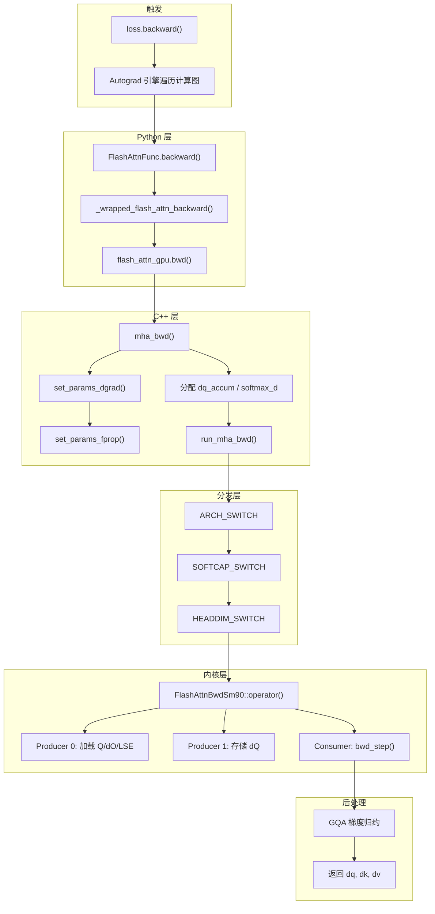
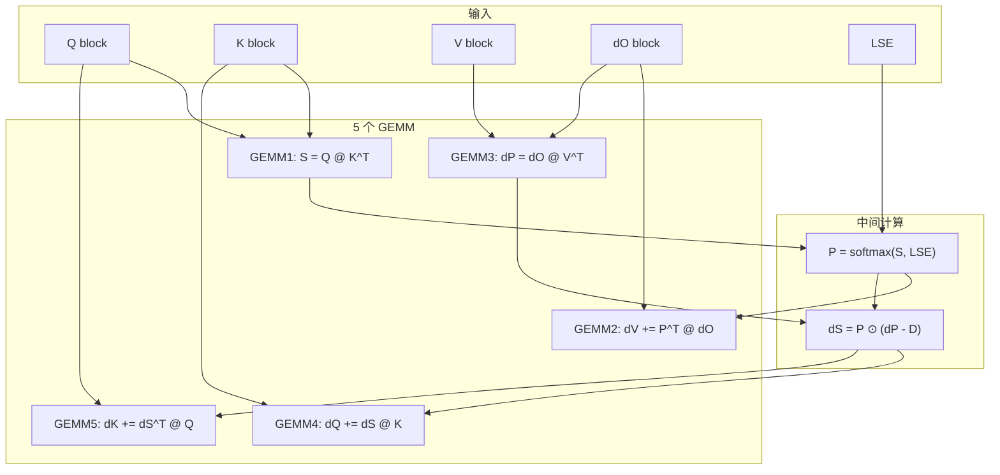

## 目录

- [1. 概述](#1-概述)
- [2. 反向调用链全景](#2-反向调用链全景)
- [3. PyTorch Autograd 触发](#3-pytorch-autograd-触发)
- [4. C++ 反向绑定层](#4-c-反向绑定层)
- [5. 反向模板分发](#5-反向模板分发)
- [6. 反向内核执行](#6-反向内核执行)
- [7. GQA 梯度归约](#7-gqa-梯度归约)
- [8. 前向 vs 反向对比](#8-前向-vs-反向对比)

---

## 1. 概述

反向传播由 PyTorch 的 Autograd 引擎自动触发。当用户调用 `loss.backward()` 时，梯度会沿计算图反向传播，最终到达 `FlashAttnFunc.backward()`，进而调用 CUDA 反向内核。

反向调用链的关键特点：
- **重计算 P 矩阵**：不从前向传播存储 $O(N^2)$ 的 attention 矩阵
- **保存的张量更多**：需要前向的 Q/K/V/O/LSE/rng_state
- **额外的参数结构体字段**：`dq_ptr`, `dk_ptr`, `dv_ptr`, `dq_accum_ptr`, `dsoftmax_sum`
- **GQA 梯度归约**：多个 Q 头的梯度需要归约到对应的 KV 头

---

## 2. 反向调用链全景



---

## 3. PyTorch Autograd 触发

### 3.1 FlashAttnFunc.backward

当 Autograd 引擎到达 Flash Attention 节点时，调用 `FlashAttnFunc.backward()`（`flash_attn/flash_attn_interface.py:869-900`）：

```python
@staticmethod
def backward(ctx, dout, *args):
    # 步骤 1: 恢复前向保存的张量
    q, k, v, out, softmax_lse, rng_state = ctx.saved_tensors
    # 注意：q, k, v 是 padding 后的版本

    # 步骤 2: 预分配梯度张量
    dq, dk, dv = torch.empty_like(q), torch.empty_like(k), torch.empty_like(v)

    # 步骤 3: dout padding
    head_size_og = dout.size(3)
    dout_padded = dout
    if head_size_og % 8 != 0:
        dout_padded = torch.nn.functional.pad(dout, [0, 8 - head_size_og % 8])

    # 步骤 4: 调用 CUDA 反向
    _wrapped_flash_attn_backward(
        dout_padded, q, k, v, out, softmax_lse,
        dq, dk, dv,                    # 原地写入
        ctx.dropout_p, ctx.softmax_scale,
        ctx.causal, ctx.window_size[0], ctx.window_size[1],
        ctx.softcap, ctx.alibi_slopes, ctx.deterministic,
        rng_state=rng_state,
    )

    # 步骤 5: 裁剪 padding
    dq = dq[..., :head_size_og]
    dk = dk[..., :head_size_og]
    dv = dv[..., :head_size_og]

    return dq, dk, dv, None, None, None, None, None, None, None, None, None
```

**与前向的关键区别**：
- 梯度张量 `dq, dk, dv` 在 Python 层预分配，以 `empty_like` 创建
- CUDA 反向内核直接原地写入这些缓冲区
- 返回 12 个值（对应 `forward()` 的 12 个参数），其中 9 个为 `None`

### 3.2 Custom Op 层

```python
# flash_attn/flash_attn_interface.py:241-290
@_torch_custom_op_wrapper(
    "flash_attn::_flash_attn_backward",
    mutates_args=("dq", "dk", "dv"),  # 声明原地修改
    device_types="cuda"
)
def _flash_attn_backward(
    dout, q, k, v, out, softmax_lse,
    dq, dk, dv,                       # 这些会被原地修改
    dropout_p, softmax_scale, causal,
    window_size_left, window_size_right, softcap,
    alibi_slopes, deterministic,
    rng_state=None,
):
    dout, q, k, v, out = [maybe_contiguous(x) for x in (dout, q, k, v, out)]
    dq, dk, dv, softmax_d = flash_attn_gpu.bwd(
        dout, q, k, v, out, softmax_lse,
        dq, dk, dv,
        alibi_slopes,
        dropout_p, softmax_scale, causal,
        window_size_left, window_size_right, softcap,
        deterministic, None, rng_state,
    )
    return softmax_d  # 返回行归一化因子（调试用）
```

`mutates_args=("dq", "dk", "dv")` 告知 `torch.compile` 这三个张量会被原地修改，编译器据此处理别名和内存规划。

---

## 4. C++ 反向绑定层

### 4.1 mha_bwd 入口

`csrc/flash_attn/flash_api.cpp:767-971`（SM80 版本）：

```cpp
std::vector<at::Tensor> mha_bwd(
    const at::Tensor &dout,   // (B, S_q, H, D)
    const at::Tensor &q,      // (B, S_q, H, D)
    const at::Tensor &k,      // (B, S_k, Hk, D)
    const at::Tensor &v,      // (B, S_k, Hk, D)
    const at::Tensor &out,    // (B, S_q, H, D)
    const at::Tensor &softmax_lse,  // (B, H, S_q)
    c10::optional<at::Tensor> &dq_,  // 预分配梯度（可选）
    c10::optional<at::Tensor> &dk_,
    c10::optional<at::Tensor> &dv_,
    c10::optional<at::Tensor> &alibi_slopes_,
    const float p_dropout,
    const float softmax_scale,
    const bool is_causal,
    int window_size_left, int window_size_right,
    const float softcap,
    const bool deterministic,
    c10::optional<at::Generator> gen_,
    c10::optional<at::Tensor> &rng_state,
) {
```

### 4.2 参数验证与分配

```cpp
// csrc/flash_attn/flash_api.cpp:849-904

// 梯度张量分配（如果 Python 层没有传入）
at::Tensor dq, dk, dv;
if (dq_.has_value()) { dq = dq_.value(); }
else { dq = torch::empty_like(q); }

// GQA 时 dk, dv 需要扩展维度
if (num_heads_k != num_heads) {
    dk = torch::empty({batch_size, seqlen_k, num_heads, head_size}, ...);
    dv = torch::empty({batch_size, seqlen_k, num_heads, head_size}, ...);
    // 后面会归约: (B, S, H, D) → (B, S, Hk, D)
}

// softmax_d: 反向中间结果
auto softmax_d = torch::empty(
    {batch_size, num_heads, seqlen_q_rounded},
    opts.dtype(at::kFloat)
);

// dq_accum: dQ 累加缓冲（FP32）
auto dq_accum = torch::empty(
    {batch_size, seqlen_q_rounded, num_heads, head_size_rounded},
    opts.dtype(at::kFloat)
);
```

### 4.3 set_params_dgrad

`set_params_dgrad()`（`csrc/flash_attn/flash_api.cpp:161-241`）首先调用 `set_params_fprop()` 设置前向参数，然后添加反向特有的字段：

```cpp
void set_params_dgrad(Flash_bwd_params &params, ...) {
    // 复用前向参数设置
    set_params_fprop(params, batch_size, seqlen_q, seqlen_k,
                     seqlen_q_rounded, seqlen_k_rounded,
                     num_heads, num_heads_k, head_size, head_size_rounded,
                     q, k, v, out, ...);

    // 反向特有指针
    params.do_ptr = dout.data_ptr();       // 上游梯度
    params.dq_ptr = dq.data_ptr();         // Q 梯度
    params.dk_ptr = dk.data_ptr();         // K 梯度
    params.dv_ptr = dv.data_ptr();         // V 梯度

    // 步长设置
    params.do_row_stride = dout.stride(-3);
    params.dq_row_stride = dq.stride(-3);
    params.dk_row_stride = dk.stride(-3);
    params.dv_row_stride = dv.stride(-3);

    // 累加缓冲
    params.dq_accum_ptr = dq_accum.data_ptr();
    params.dsoftmax_sum = softmax_d.data_ptr();  // Σ(dout · out) 行和

    // 确定性标志
    params.deterministic = deterministic;
}
```

**反向额外的参数**：

| 字段 | 类型 | 用途 |
|------|------|------|
| `do_ptr` | `void*` | 上游梯度 dOut |
| `dq_ptr` | `void*` | Q 梯度输出 |
| `dk_ptr` | `void*` | K 梯度输出 |
| `dv_ptr` | `void*` | V 梯度输出 |
| `dq_accum_ptr` | `void*` | dQ FP32 累加缓冲 |
| `dsoftmax_sum` | `void*` | $D_i = \sum_j dO_{ij} \cdot O_{ij}$ |
| `deterministic` | `bool` | 确定性模式 |

### 4.4 RNG 状态恢复

```cpp
// csrc/flash_attn/flash_api.cpp:936-951
if (rng_state.has_value()) {
    // 使用前向保存的 RNG 状态
    params.rng_state = reinterpret_cast<uint64_t*>(rng_state.value().data_ptr());
}
```

这确保反向传播时能重放与前向完全相同的 Dropout mask。

### 4.5 内核启动

```cpp
// csrc/flash_attn/flash_api.cpp:956
if (seqlen_q > 0) {
    auto stream = at::cuda::getCurrentCUDAStream().stream();
    run_mha_bwd(params, stream);
}
```

---

## 5. 反向模板分发

### 5.1 分发结构

反向的分发树比前向简单——只需 Arch 和 Softcap 两层：

```cpp
// hopper/flash_api.cpp:1246-1257
void run_mha_bwd(Flash_bwd_params &params, cudaStream_t stream) {
    ARCH_SWITCH(params.arch, Arch, [&] {
        SOFTCAP_SWITCH(params.softcap > 0.f, Has_softcap, [&] {
            run_mha_bwd_constexpr<Arch, Has_softcap>(params, stream);
        });
    });
}
```

### 5.2 Head Dimension 分发

```cpp
// hopper/flash_api.cpp:1206-1244
template<int Arch, bool Has_softcap>
void run_mha_bwd_constexpr(Flash_bwd_params &params, cudaStream_t stream) {
    if (!params.is_bf16) {
        if (params.d_rounded == 64)
            return run_mha_bwd_<Arch, cutlass::half_t, 64, Has_softcap>(...);
        if (params.d_rounded == 96)
            return run_mha_bwd_<Arch, cutlass::half_t, 96, Has_softcap>(...);
        if (params.d_rounded == 128)
            return run_mha_bwd_<Arch, cutlass::half_t, 128, Has_softcap>(...);
        // ... 192, 256
    } else {
        // BF16 路径
    }
}
```

**反向 vs 前向的分发差异**：

| 分发维度 | 前向 | 反向 |
|----------|------|------|
| Arch | Y | Y |
| Split | Y | - |
| PagedKV | Y | - |
| PackGQA | Y | - |
| Softcap | Y | Y |
| Varlen | Y | - |
| AppendKV | Y | - |
| dtype | Y | Y |
| HeadDim | Y | Y |

反向分发更简单的原因：反向不需要 Split-KV、Paged KV、GQA 打包等前向特有的特性。反向的循环结构（N-outer Q-inner）天然不需要这些优化。

---

## 6. 反向内核执行

### 6.1 反向内核结构

`FlashAttnBwdSm90`（`hopper/flash_bwd_kernel_sm90.h`）使用三组 Warp Specialization：

```cpp
CUTLASS_DEVICE void operator()(Params const& params, char* smem_buf) {
    if (warp_group_idx == 0) {
        // Producer 0: 加载 Q, dO, LSE
        collective_mainloop.load_Q_dO(params, ...);
    }
    else if (warp_group_idx == NumMmaWarpGroups) {
        // Producer 1: 通过 TMA 存储 dQ
        collective_mainloop.store_dQ(params, ...);
    }
    else {
        // Consumer: 计算 dQ, dK, dV
        collective_mainloop.mma(params, ...);  // 主循环
        collective_epilogue.store(params, ...); // 写出 dK, dV
    }
}
```

### 6.2 N-outer Q-inner 循环

反向采用与前向相反的循环顺序——外层遍历 K/V 块（N 维度），内层遍历 Q 块：

```
for each (n_block, bidh, bidb) from Scheduler:
    加载 K[n_block], V[n_block]  // 一次性加载
    初始化 dK_accum = 0, dV_accum = 0

    for m_block in Q_blocks:    // 内层遍历 Q
        加载 Q[m_block], dO[m_block], LSE[m_block]
        bwd_step():
            S = Q @ K^T           // 重计算 QK^T
            P = softmax(S, LSE)   // 使用保存的 LSE 重计算 P
            dV += P^T @ dO        // 累加 dV
            dP = dO @ V^T
            dS = P ⊙ (dP - D)    // D = rowsum(dO ⊙ O)
            dQ += dS @ K          // 累加 dQ（写回 HBM）
            dK += dS^T @ Q        // 累加 dK（寄存器）

    写出 dK[n_block], dV[n_block]  // 内层结束后写出
```

### 6.3 bwd_step 的 5 个 GEMM

每次 `bwd_step()` 包含 5 个矩阵乘法操作：



### 6.4 dQ 的存储策略

dQ 的累加涉及多个 N 块对同一 Q 块的写入，有两种策略：

**非确定性模式**（默认）：使用原子加法直接累加到全局内存
```cpp
// 每个 bwd_step 后通过原子操作写回 dQ
atomicAdd(dQ_global[m_block], dQ_local);
```

**确定性模式**（`deterministic=True`）：使用 TMA 存储到 FP32 累加缓冲区
```cpp
// Producer 1 通过 TMA 将 dQ 写到 dq_accum 缓冲区
// 后续通过 reduction kernel 归约
```

---

## 7. GQA 梯度归约

### 7.1 问题

在 GQA 中，`num_heads > num_heads_k`。前向时多个 Q 头共享一个 KV 头；反向时需要将这些 Q 头产生的 dK/dV 梯度归约到对应的 KV 头。

### 7.2 C++ 层归约

```cpp
// csrc/flash_attn/flash_api.cpp:965-968
if (num_heads_k != num_heads) {
    // dk_expanded: (B, S, H, D) → reshape → (B, S, Hk, H/Hk, D)
    at::sum_out(dk,
        at::reshape(dk_expanded, {batch_size, seqlen_k, num_heads_k,
                                   num_heads / num_heads_k, head_size}),
        {3}  // 在 group 维度求和
    );
    at::sum_out(dv,
        at::reshape(dv_expanded, {batch_size, seqlen_k, num_heads_k,
                                   num_heads / num_heads_k, head_size}),
        {3}
    );
}
```

内核计算时 dK/dV 按完整头数分配（`num_heads` 个头），每个 Q 头独立计算对应 KV 头的梯度贡献。计算完成后，C++ 层将同一 KV 头对应的所有 Q 头梯度求和。

### 7.3 确定性 GQA 归约

在 SM90 的 Hopper 路径中，当 `deterministic=True` 时，GQA 归约在内核内部完成，使用专门的 `dKV_swapAB` 优化确保原子操作的确定性：

```cpp
// 确定性模式下的梯度归约在 epilogue_bwd.hpp 中
// 通过控制 thread block 的执行顺序避免不确定性
```

---

## 8. 前向 vs 反向对比

### 8.1 调用链对比

| 阶段 | 前向 | 反向 |
|------|------|------|
| Python 入口 | `flash_attn_func()` | `loss.backward()` → `FlashAttnFunc.backward()` |
| Custom Op | `_flash_attn_forward` | `_flash_attn_backward` |
| C++ 函数 | `mha_fwd()` | `mha_bwd()` |
| 参数设置 | `set_params_fprop()` | `set_params_dgrad()` → `set_params_fprop()` |
| 分发层数 | 7 层 SWITCH | 2 层 SWITCH |
| 内核类 | `FlashAttnFwdSm90` | `FlashAttnBwdSm90` |
| Warp 分工 | 1 Producer + N Consumer | 2 Producer + N Consumer |
| 循环顺序 | Q-outer, K/V-inner | N-outer, Q-inner |

### 8.2 内存对比

| 资源 | 前向 | 反向 |
|------|------|------|
| 输入 | Q, K, V | dOut, Q, K, V, O, LSE, rng_state |
| 输出 | O, LSE, rng_state | dQ, dK, dV |
| 额外分配 | Split 累加器 | dq_accum (FP32), softmax_d |
| 峰值内存 | $O(B \cdot H \cdot S \cdot D)$ | $O(B \cdot H \cdot S \cdot D)$ + FP32 累加器 |

### 8.3 计算对比

| 指标 | 前向 | 反向 |
|------|------|------|
| GEMM 数/块 | 2 (QK, PV) | 5 (QK, PtdO, dOVt, dSK, dStQ) |
| 计算量 | $O(N^2 d)$ | $O(N^2 d) \times 2.5$ |
| Softmax | 在线计算 | 从 LSE 重计算 |
| 数据重用 | K/V 跨 Q 块重用 | Q/dO 跨 N 块重用 |

---

## 导航

- 上一篇：[前向调用链追踪](01-forward-call-trace.md)
- 下一篇：[调试指南](03-debug-guide.md)
- [返回目录](../README.md)
