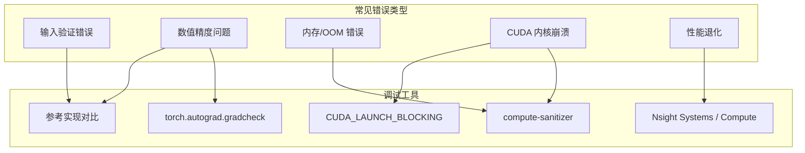

## 目录

- [1. 概述](#1-概述)
- [2. 常见错误与排查](#2-常见错误与排查)
- [3. 数值正确性验证](#3-数值正确性验证)
- [4. 性能调试](#4-性能调试)
- [5. CUDA 内核调试](#5-cuda-内核调试)
- [6. 调试工具与技巧](#6-调试工具与技巧)
- [7. 常见 FAQ](#7-常见-faq)

---

## 1. 概述

Flash Attention 的调试涉及 Python、C++ 和 CUDA 三个层次。由于其高性能实现大量使用了 TMA、GMMA 等硬件特性，传统的 `print` 调试难以直接应用。本文介绍系统化的调试方法和常见问题的排查流程。



---

## 2. 常见错误与排查

### 2.1 输入形状错误

**错误信息**：
```
RuntimeError: head_size should be a multiple of 8
```

**原因**：CUDA 内核要求 head dimension 是 8 的倍数。

**解决方案**：Flash Attention 的 Python API 会自动 padding，但直接调用底层接口时需手动处理：

```python
# 自动处理（推荐）
from flash_attn import flash_attn_func
out = flash_attn_func(q, k, v)  # 内部自动 padding

# 手动处理
head_dim = q.shape[-1]
if head_dim % 8 != 0:
    pad_size = 8 - head_dim % 8
    q = F.pad(q, [0, pad_size])
    k = F.pad(k, [0, pad_size])
    v = F.pad(v, [0, pad_size])
```

### 2.2 数据类型错误

**错误信息**：
```
RuntimeError: FlashAttention only support fp16 and bf16 data type
```

**原因**：Flash Attention 仅支持 FP16 和 BF16（SM90 额外支持 FP8）。

**解决方案**：
```python
# 转换数据类型
q = q.half()  # 或 q.bfloat16()
k = k.half()
v = v.half()
out = flash_attn_func(q, k, v)
```

### 2.3 Head Dimension 超限

**错误信息**：
```
RuntimeError: FlashAttention forward only supports head dimension at most 256
```

**解决方案**：需要拆分 head dimension 或使用其他 Attention 实现。

### 2.4 CUDA 设备不匹配

**错误信息**：
```
RuntimeError: Input tensor must be on CUDA device
```

**排查**：确认所有输入都在同一 CUDA 设备上：

```python
print(q.device, k.device, v.device)  # 应该都是 cuda:X
# 如果不一致：
q, k, v = q.to("cuda:0"), k.to("cuda:0"), v.to("cuda:0")
```

### 2.5 GQA 头数不整除

**错误信息**：
```
RuntimeError: num_heads must be divisible by num_heads_kv
```

**原因**：Q 的头数必须是 K/V 头数的整数倍。

```python
# 正确: 32 / 8 = 4
q = torch.randn(B, S, 32, D, ...)  # 32 个 Q 头
k = torch.randn(B, S, 8, D, ...)   # 8 个 KV 头

# 错误: 32 / 6 不整除
k = torch.randn(B, S, 6, D, ...)   # 会报错
```

### 2.6 非连续张量

**错误信息**：内核计算结果错误（不一定报错）。

**排查**：Flash Attention 要求最后一个维度连续（stride[-1] == 1）。`maybe_contiguous()` 通常会自动处理，但在一些边缘情况下需手动检查：

```python
# 检查连续性
print(q.stride())  # 最后一个值应该是 1
print(q.is_contiguous())

# 强制连续
q = q.contiguous()
```

---

## 3. 数值正确性验证

### 3.1 与参考实现对比

使用 PyTorch 标准 Attention 作为参考：

```python
import torch
import torch.nn.functional as F
from flash_attn import flash_attn_func

def reference_attention(q, k, v, causal=False, softmax_scale=None):
    """标准 Attention 参考实现"""
    if softmax_scale is None:
        softmax_scale = q.shape[-1] ** (-0.5)

    # (B, S, H, D) → (B, H, S, D)
    q = q.transpose(1, 2)
    k = k.transpose(1, 2)
    v = v.transpose(1, 2)

    scores = torch.matmul(q, k.transpose(-2, -1)) * softmax_scale

    if causal:
        seqlen_q, seqlen_k = scores.shape[-2], scores.shape[-1]
        mask = torch.triu(torch.ones(seqlen_q, seqlen_k, device=q.device), diagonal=seqlen_k - seqlen_q + 1)
        scores = scores.masked_fill(mask.bool(), float('-inf'))

    attn = torch.softmax(scores, dim=-1, dtype=torch.float32).to(q.dtype)
    out = torch.matmul(attn, v)
    return out.transpose(1, 2)  # (B, H, S, D) → (B, S, H, D)

# 对比测试
B, S, H, D = 2, 256, 32, 128
q = torch.randn(B, S, H, D, device="cuda", dtype=torch.float16)
k = torch.randn(B, S, H, D, device="cuda", dtype=torch.float16)
v = torch.randn(B, S, H, D, device="cuda", dtype=torch.float16)

out_flash = flash_attn_func(q, k, v, causal=True)
out_ref = reference_attention(q, k, v, causal=True)

# 数值容差
max_diff = (out_flash - out_ref).abs().max().item()
print(f"Max absolute difference: {max_diff}")
# FP16: 期望 < 1e-3
# BF16: 期望 < 5e-3
```

### 3.2 梯度验证

使用 `torch.autograd.gradcheck` 验证反向传播：

```python
from torch.autograd import gradcheck

# 使用较小的输入和 FP64 进行梯度检查
# 注意：gradcheck 需要 FP64，但 Flash Attention 只支持 FP16/BF16
# 因此需要用参考实现验证梯度

def check_grad(B=1, S=64, H=4, D=64):
    q = torch.randn(B, S, H, D, device="cuda", dtype=torch.float16, requires_grad=True)
    k = torch.randn(B, S, H, D, device="cuda", dtype=torch.float16, requires_grad=True)
    v = torch.randn(B, S, H, D, device="cuda", dtype=torch.float16, requires_grad=True)

    # Flash Attention 梯度
    out_flash = flash_attn_func(q, k, v, causal=True)
    loss_flash = out_flash.sum()
    loss_flash.backward()
    dq_flash, dk_flash, dv_flash = q.grad.clone(), k.grad.clone(), v.grad.clone()

    q.grad, k.grad, v.grad = None, None, None

    # 参考实现梯度
    out_ref = reference_attention(q, k, v, causal=True)
    loss_ref = out_ref.sum()
    loss_ref.backward()
    dq_ref, dk_ref, dv_ref = q.grad.clone(), k.grad.clone(), v.grad.clone()

    print(f"dQ max diff: {(dq_flash - dq_ref).abs().max().item():.6f}")
    print(f"dK max diff: {(dk_flash - dk_ref).abs().max().item():.6f}")
    print(f"dV max diff: {(dv_flash - dv_ref).abs().max().item():.6f}")

check_grad()
```

### 3.3 确定性验证

```python
# 验证确定性模式的可复现性
out1 = flash_attn_func(q, k, v, causal=True, deterministic=True)
out2 = flash_attn_func(q, k, v, causal=True, deterministic=True)
assert torch.equal(out1, out2), "Forward should be deterministic"

# 反向确定性
out1.sum().backward()
dq1 = q.grad.clone()
q.grad = None

out2 = flash_attn_func(q, k, v, causal=True, deterministic=True)
out2.sum().backward()
dq2 = q.grad.clone()
assert torch.equal(dq1, dq2), "Backward should be deterministic with deterministic=True"
```

### 3.4 数值容差参考

| 精度 | 前向 max diff | 反向 max diff | 说明 |
|------|-------------|-------------|------|
| FP16 | < 1e-3 | < 5e-3 | 正常范围 |
| BF16 | < 5e-3 | < 1e-2 | BF16 尾数位少 |
| FP8 | < 5e-2 | - | 仅前向 |

---

## 4. 性能调试

### 4.1 基准测试

```python
import torch
import time
from flash_attn import flash_attn_func

def benchmark(B, S, H, D, causal=True, warmup=10, repeat=100):
    q = torch.randn(B, S, H, D, device="cuda", dtype=torch.bfloat16)
    k = torch.randn(B, S, H, D, device="cuda", dtype=torch.bfloat16)
    v = torch.randn(B, S, H, D, device="cuda", dtype=torch.bfloat16)

    # Warmup
    for _ in range(warmup):
        flash_attn_func(q, k, v, causal=causal)
    torch.cuda.synchronize()

    # Benchmark
    start = time.perf_counter()
    for _ in range(repeat):
        flash_attn_func(q, k, v, causal=causal)
    torch.cuda.synchronize()
    elapsed = (time.perf_counter() - start) / repeat

    # 计算 TFLOPS
    flops = 4 * B * H * S * S * D  # 近似 FLOP 数
    if causal:
        flops //= 2
    tflops = flops / elapsed / 1e12
    print(f"B={B}, S={S}, H={H}, D={D}: {elapsed*1000:.2f} ms, {tflops:.1f} TFLOPS")

benchmark(2, 2048, 32, 128)
benchmark(2, 4096, 32, 128)
benchmark(2, 8192, 32, 128)
```

### 4.2 Nsight Systems Profiling

```bash
# 使用 Nsight Systems 进行性能分析
nsys profile --trace=cuda,nvtx -o flash_attn_profile python your_script.py

# 查看结果
nsys-ui flash_attn_profile.nsys-rep
```

关注以下指标：
- **内核时间**：Flash Attention 内核通常占总时间的大部分
- **内存传输**：HBM → SRAM 传输是否成为瓶颈
- **SM 利用率**：是否所有 SM 都在工作
- **内核启动延迟**：kernel launch overhead

### 4.3 Nsight Compute 深度分析

```bash
# 分析单个内核的详细性能指标
ncu --set full --kernel-name "flash_fwd" python your_script.py
```

关键指标：
- **Arithmetic Intensity**：计算与内存访问的比率
- **SM Occupancy**：Warp 占用率
- **Shared Memory Usage**：SRAM 使用量
- **Memory Throughput**：HBM 带宽利用率

### 4.4 Split-KV 性能影响

长序列时 `num_splits` 参数影响性能：

```python
# 自动分配（推荐）
out = flash_attn_func(q, k, v)

# flash_attn_with_kvcache 可手动控制
from flash_attn import flash_attn_with_kvcache
out = flash_attn_with_kvcache(q, k_cache, v_cache, num_splits=4)
```

---

## 5. CUDA 内核调试

### 5.1 同步错误检测

默认情况下 CUDA 内核异步执行，错误可能延迟报告。使用同步模式定位崩溃位置：

```bash
# 方法 1: 环境变量
CUDA_LAUNCH_BLOCKING=1 python your_script.py

# 方法 2: 代码中
import os
os.environ["CUDA_LAUNCH_BLOCKING"] = "1"
```

### 5.2 Compute Sanitizer

检测内存访问错误：

```bash
# 检查越界访问
compute-sanitizer --tool memcheck python your_script.py

# 检查竞争条件
compute-sanitizer --tool racecheck python your_script.py

# 检查同步错误
compute-sanitizer --tool synccheck python your_script.py
```

### 5.3 检查 CUDA 错误

```python
# 强制同步并检查 CUDA 错误
torch.cuda.synchronize()

# 或者使用更详细的检查
try:
    out = flash_attn_func(q, k, v)
    torch.cuda.synchronize()
except RuntimeError as e:
    print(f"CUDA error: {e}")
```

### 5.4 内核编译问题

如果安装时遇到编译错误：

```bash
# 检查 CUDA 版本兼容性
python -c "import torch; print(torch.version.cuda)"
nvcc --version

# 检查 GPU 计算能力
python -c "import torch; print(torch.cuda.get_device_capability())"

# SM90 (Hopper H100): 需要 CUDA >= 12.0
# SM80 (Ampere A100): 需要 CUDA >= 11.0
```

---

## 6. 调试工具与技巧

### 6.1 逐层调试

对于集成到模型中的 Flash Attention，可以逐层隔离问题：

```python
# 替换为标准实现对比
class DebugMHA(nn.Module):
    def __init__(self, use_flash=True, **kwargs):
        super().__init__()
        self.use_flash = use_flash
        # ... 初始化

    def forward(self, x):
        if self.use_flash:
            out = flash_attn_func(q, k, v, causal=True)
        else:
            out = reference_attention(q, k, v, causal=True)
        return out
```

### 6.2 张量形状检查

创建一个调试包装器验证输入输出形状：

```python
def debug_flash_attn(q, k, v, **kwargs):
    print(f"Q: shape={q.shape}, dtype={q.dtype}, device={q.device}")
    print(f"K: shape={k.shape}, dtype={k.dtype}, device={k.device}")
    print(f"V: shape={v.shape}, dtype={v.dtype}, device={v.device}")
    print(f"Q stride: {q.stride()}, contiguous: {q.is_contiguous()}")

    assert q.shape[-1] == k.shape[-1] == v.shape[-1], "Head dim mismatch"
    assert k.shape[1] == v.shape[1], "KV seqlen mismatch"
    assert k.shape[2] == v.shape[2], "KV heads mismatch"
    assert q.shape[2] % k.shape[2] == 0, "Q heads must be divisible by KV heads"

    out = flash_attn_func(q, k, v, **kwargs)
    print(f"Out: shape={out.shape}, has_nan={out.isnan().any().item()}")
    return out
```

### 6.3 NaN/Inf 检测

```python
def check_nan_inf(tensor, name="tensor"):
    if tensor.isnan().any():
        nan_count = tensor.isnan().sum().item()
        total = tensor.numel()
        print(f"WARNING: {name} has {nan_count}/{total} NaN values")
        # 定位 NaN 的位置
        nan_idx = torch.where(tensor.isnan())
        print(f"  First NaN at index: {[idx[0].item() for idx in nan_idx]}")
    if tensor.isinf().any():
        inf_count = tensor.isinf().sum().item()
        print(f"WARNING: {name} has {inf_count} Inf values")

# 使用
out = flash_attn_func(q, k, v, causal=True)
check_nan_inf(out, "flash_attn output")
check_nan_inf(q.grad, "dQ") if q.grad is not None else None
```

### 6.4 内存使用分析

```python
def memory_profile(func, *args, **kwargs):
    torch.cuda.reset_peak_memory_stats()
    torch.cuda.synchronize()

    mem_before = torch.cuda.memory_allocated() / 1e9
    result = func(*args, **kwargs)
    torch.cuda.synchronize()

    mem_after = torch.cuda.memory_allocated() / 1e9
    mem_peak = torch.cuda.max_memory_allocated() / 1e9

    print(f"Memory: before={mem_before:.2f}GB, after={mem_after:.2f}GB, peak={mem_peak:.2f}GB")
    print(f"Delta: {mem_after - mem_before:.2f}GB")
    return result

# 前向
out = memory_profile(flash_attn_func, q, k, v, causal=True)
# 反向
memory_profile(lambda: out.sum().backward())
```

---

## 7. 常见 FAQ

### Q1: Flash Attention 的前向是否确定性的？

**是的**。前向传播始终是确定性的。`deterministic` 参数仅影响反向传播——非确定性反向使用原子加法累加 dQ，执行顺序的差异可能导致浮点精度的微小变化。

### Q2: 为什么 BF16 的精度比 FP16 低？

BF16 有 8 位指数和 7 位尾数，而 FP16 有 5 位指数和 10 位尾数。BF16 的动态范围更大但精度更低。Flash Attention 内部的 Softmax 在 FP32 下计算以缓解这个问题。

### Q3: OOM 时如何估算内存？

```python
# Flash Attention 的内存占用（训练时）
B, S, H, D = batch_size, seqlen, num_heads, head_dim
bytes_per_elem = 2  # FP16/BF16

# 前向保存的张量
fwd_mem = bytes_per_elem * B * S * H * D * 4  # Q + K + V + O
fwd_mem += 4 * B * H * S  # LSE (FP32)
fwd_mem += 8 * 2  # rng_state (2 × int64)

# 反向额外内存
bwd_mem = bytes_per_elem * B * S * H * D * 3  # dQ + dK + dV
bwd_mem += 4 * B * S * H * D  # dq_accum (FP32)

total_gb = (fwd_mem + bwd_mem) / 1e9
print(f"Estimated memory: {total_gb:.2f} GB")
```

### Q4: 如何在 torch.compile 中使用？

```python
# PyTorch >= 2.4.0 自动支持
@torch.compile
def model_forward(q, k, v):
    return flash_attn_func(q, k, v, causal=True)

# 如果遇到编译错误，尝试：
@torch.compile(backend="inductor", mode="reduce-overhead")
def model_forward(q, k, v):
    return flash_attn_func(q, k, v, causal=True)
```

### Q5: Varlen 模式的 cu_seqlens 如何构建？

```python
# 假设 batch 中有 3 个序列，长度分别为 100, 200, 150
seqlens = [100, 200, 150]
cu_seqlens = torch.tensor([0] + list(torch.cumsum(torch.tensor(seqlens), 0)),
                          dtype=torch.int32, device="cuda")
# cu_seqlens = [0, 100, 300, 450]
max_seqlen = max(seqlens)  # 200
total = sum(seqlens)       # 450

# Q, K, V 形状: (total, nheads, headdim)
q = torch.randn(total, 32, 128, device="cuda", dtype=torch.float16)
```

### Q6: 如何检查安装了哪个版本？

```python
import flash_attn
print(f"Flash Attention version: {flash_attn.__version__}")

# 检查支持的 GPU 架构
import torch
major, minor = torch.cuda.get_device_capability()
print(f"GPU compute capability: sm{major}{minor}")
print(f"GPU name: {torch.cuda.get_device_name()}")
```

---

## 导航

- 上一篇：[反向调用链追踪](02-backward-call-trace.md)
- 下一篇：[因果遮蔽与 Masking](../06-advanced-features/01-causal-and-masking.md)
- [返回目录](../README.md)
