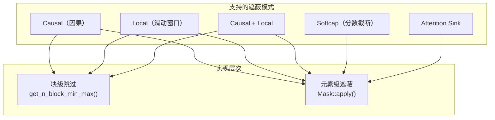
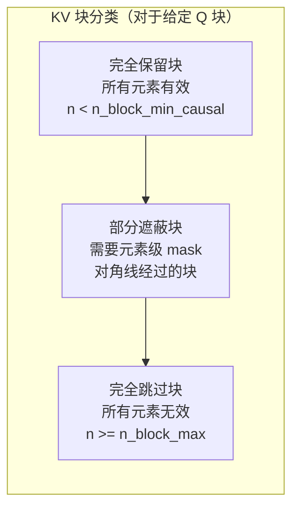
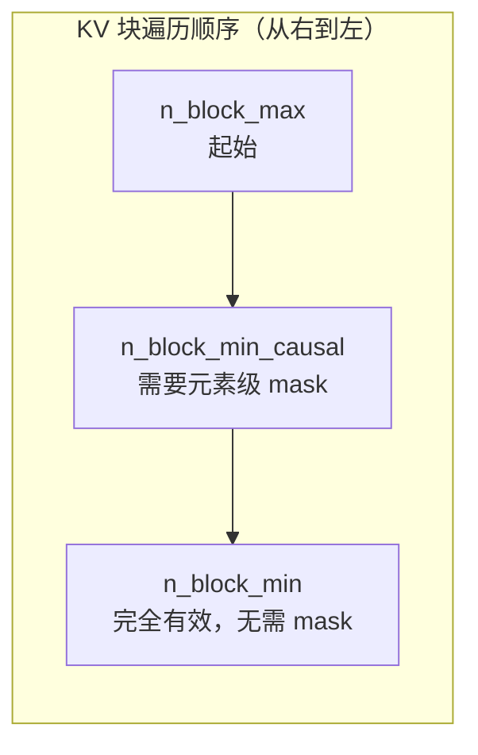

## 目录

- [1. 概述](#1-概述)
- [2. 块级跳过优化](#2-块级跳过优化)
- [3. 元素级遮蔽](#3-元素级遮蔽)
- [4. 滑动窗口注意力](#4-滑动窗口注意力)
- [5. Softcap 机制](#5-softcap-机制)
- [6. 遮蔽与主循环的交互](#6-遮蔽与主循环的交互)
- [7. Attention Sink](#7-attention-sink)

---

## 1. 概述

Flash Attention 支持多种 Attention Masking 模式，所有模式都经过精心优化以最大化 GPU 利用率。核心思想是将遮蔽分为两个层次：

| 层次 | 优化方式 | 代价 |
|------|---------|------|
| **块级跳过** | 整个 Tile 块不加载、不计算 | 零代价 |
| **元素级遮蔽** | 在 QK^T 结果上逐元素应用 mask | 有计算开销 |



**源文件**：
- 块级跳过：`hopper/block.h`
- 元素级遮蔽：`hopper/mask.h`
- Softcap：`hopper/utils.h`

---

## 2. 块级跳过优化

### 2.1 基本原理

对于因果或局部注意力，大量的 K/V 块完全落在 mask 之外，无需加载和计算。`get_n_block_min_max()`（`hopper/block.h:14-59`）计算每个 Q 块需要处理的 KV 块范围 `[n_block_min, n_block_max)`：

```
            K blocks →
Q blocks    [0]  [1]  [2]  [3]  [4]  [5]  [6]  [7]
  ↓
  [0]        ██   ░░   ░░   ░░   ░░   ░░   ░░   ░░
  [1]        ██   ██   ░░   ░░   ░░   ░░   ░░   ░░
  [2]        ██   ██   ██   ░░   ░░   ░░   ░░   ░░
  [3]        ██   ██   ██   ██   ░░   ░░   ░░   ░░
  [4]        ██   ██   ██   ██   ██   ░░   ░░   ░░
  [5]        ██   ██   ██   ██   ██   ██   ░░   ░░
  [6]        ██   ██   ██   ██   ██   ██   ██   ░░
  [7]        ██   ██   ██   ██   ██   ██   ██   ██

  ██ = 需要计算    ░░ = 块级跳过（完全不加载）
```

因果遮蔽下，对角线以上的所有块完全被跳过，约节省 50% 的计算。

### 2.2 因果遮蔽的块边界计算

```cpp
// hopper/block.h:24-34
if constexpr (Is_causal || Is_local) {
    // 计算 Q 块的最大行索引
    int m_idx_max = (m_block + 1) * kBlockM;
    if (PackGQA) {
        m_idx_max = qhead_per_khead_divmod.divide(m_idx_max - 1) + 1;
    }
    // 对齐到 KV 序列坐标系
    int const n_idx = m_idx_max + seqlen_k - seqlen_q;
    int n_idx_right = !Is_local ? n_idx : n_idx + window_size_right;
    // 上界：超过此范围的 KV 块完全在 mask 外
    n_block_max = std::min(n_block_max, cute::ceil_div(n_idx_right, kBlockN));
}
```

**关键公式**：因果遮蔽要求 $j \le i + (S_k - S_q)$，其中 $i$ 是 Q 位置，$j$ 是 K 位置。对角线偏移 $(S_k - S_q)$ 确保因果 mask 对齐到右下角——这是 Flash Attention 的设计选择，支持 prefix-filling 场景。

### 2.3 局部注意力的双侧边界

```cpp
// hopper/block.h:36-45
if constexpr (Is_local) {
    int m_idx_min = m_block * kBlockM;
    if (PackGQA) { m_idx_min = qhead_per_khead_divmod.divide(m_idx_min); }
    int const n_idx = m_idx_min + seqlen_k - seqlen_q;
    int n_idx_left = n_idx - window_size_left;
    n_block_min = std::max(int(0), n_idx_left / kBlockN);
}
```

局部注意力同时计算下界 `n_block_min`，窗口范围为 $[i - \text{window\_left}, i + \text{window\_right}]$。

### 2.4 因果遮蔽的块分类

对于因果遮蔽，KV 块可分为三类：



---

## 3. 元素级遮蔽

### 3.1 Mask 结构体

`Mask`（`hopper/mask.h:17-42`）负责在选中的块内进行元素级遮蔽：

```cpp
template <int kBlockM, int kBlockN, bool PackGQA, typename TiledMma, bool SwapAB=false>
struct Mask {
    int const thread_idx;
    int const seqlen_q, seqlen_k;
    int const window_size_left, window_size_right, sink_token_length;
    cutlass::FastDivmod const attention_chunk_divmod;
    cutlass::FastDivmod const qhead_per_khead_divmod;
};
```

### 3.2 因果遮蔽的元素级实现

```cpp
// hopper/mask.h:88-102
if constexpr (Causal_mask) {
    for (int m = 0; m < size<0>(tSrS_rowcol); ++m) {
        int const row_idx = get<Row>(tScS_rowcol(m, _0{})) + m_block * kBlockM;
        int const col_limit_right = row_idx + causal_row_offset;
        for (int n = 0; n < size<1>(tSrS_rowcol); ++n) {
            if (int(get<Col>(t0ScS_rowcol(_0{}, n))) >= col_limit_right) {
                tSrS_rowcol(m, n) = -INFINITY;  // 遮蔽为负无穷
            }
        }
    }
}
```

**算法**：对于 QK^T 矩阵中的每个元素 $(i, j)$，如果 $j \ge i + 1 + S_k - S_q - n\_block \cdot kBlockN$，则设为 $-\infty$。Softmax 后 $e^{-\infty} = 0$，该位置的贡献为零。

### 3.3 PackGQA 下的遮蔽

GQA 打包模式下，同一个 Tile 中包含多个 Q 头的数据。遮蔽需要从全局索引中反推实际的序列位置：

```cpp
// hopper/mask.h:79-86
if constexpr (PackGQA) {
    // idx = m_block * kBlockM + row → 分解为 (h_idx, m_idx)
    mma_m_idx = qhead_per_khead_divmod.divide(
        m_block * kBlockM + get<Row>(tScS_rowcol(...))
    );
    // 使用 __shfl_sync 广播到同组线程
}
```

---

## 4. 滑动窗口注意力

### 4.1 窗口参数

通过 `window_size=(left, right)` 参数配置：

| 参数值 | 含义 |
|--------|------|
| `(-1, -1)` | 全局注意力（无窗口限制） |
| `(-1, 0)` | 因果注意力（等价于 `causal=True`） |
| `(256, 0)` | 因果 + 256 token 滑动窗口 |
| `(128, 128)` | 双向 128 token 滑动窗口 |

### 4.2 双侧元素级遮蔽

```cpp
// hopper/mask.h:103-127
int const local_row_offset_right = causal_row_offset + window_size_right;
int const local_row_offset_left = causal_row_offset - 1 - window_size_left;

for (int m = 0; m < size<0>(tSrS_rowcol); ++m) {
    int const row_idx = get<Row>(...) + m_block * kBlockM;
    int col_limit_right = row_idx + local_row_offset_right;
    int col_limit_left = row_idx + local_row_offset_left;

    for (int n = 0; n < size<1>(tSrS_rowcol); ++n) {
        int const col_idx = get<Col>(t0ScS_rowcol(m, n));
        // 同时检查左右边界
        if (col_idx >= col_limit_right || col_idx < col_limit_left) {
            tSrS_rowcol(m, n) = -INFINITY;
        }
    }
}
```

### 4.3 滑动窗口的块级优化

```
Q 位置 i=512, window_size=(256, 0):
有效 K 范围: [256, 512]

K blocks:  [0..127] [128..255] [256..383] [384..511]
           跳过      跳过       部分有效    全部有效
           (块级)    (块级)     (元素级)
```

`n_block_min` 跳过窗口左侧之外的所有块，`n_block_max` 跳过窗口右侧之外的所有块。相比无优化的全序列扫描，滑动窗口的计算复杂度从 $O(N^2)$ 降至 $O(N \cdot W)$，其中 $W$ 是窗口大小。

---

## 5. Softcap 机制

### 5.1 作用

Softcap（分数截断）通过 `tanh` 限制 attention score 的幅度，防止极端分数主导 Softmax 输出。Gemma 2 等模型使用此技术：

$$S_{capped} = \text{softcap} \cdot \tanh\left(\frac{S}{\text{softcap}}\right)$$

### 5.2 实现

```cpp
// hopper/utils.h:635-641
template <typename Engine, typename Layout>
CUTLASS_DEVICE void apply_softcap(Tensor<Engine, Layout> &tensor, float const softcap) {
    #pragma unroll
    for (int i = 0; i < size(tensor); ++i) {
        tensor(i) = cutlass::fast_tanh(tensor(i) * softcap);
    }
}
```

注意：这里 `softcap` 参数实际传入的是 $1/\text{softcap}$（在 C++ 层预计算），乘以 score 后过 `tanh`，再在后续乘以 `softcap` 恢复尺度。

### 5.3 应用时序

Softcap 在 masking **之前**应用：

```
QK^T scores → apply_softcap() → apply_mask() → softmax → PV
```

这确保被遮蔽的位置不会影响 `tanh` 的计算。

### 5.4 FP8 下的 Softcap

FP8 模式下，QK^T 的分数已经被 descale 因子缩放，Softcap 阈值需要相应调整：

```cpp
float softcap_val = params.softcap_val;
if constexpr (Has_softcap && Is_FP8) {
    softcap_val *= q_descale * k_descale;
}
```

---

## 6. 遮蔽与主循环的交互

### 6.1 迭代分离

主循环将 KV 块的遍历分为两个阶段，以减少不必要的 mask 检查：

```cpp
// hopper/block.h:103-118
// 阶段 1: 需要遮蔽的块（对角线附近）
int n_block_min_causal_local_mask = get_n_block_min_causal_local_mask(...);

// 阶段 2: 完全有效的块（对角线以下）
int n_block_min_before_local_mask = get_n_block_min_before_local_mask(...);
```



**优势**：完全有效的块跳过了 mask 分支（`if constexpr` 在编译时消除），减少了分支开销和寄存器压力。

### 6.2 Split-KV 与遮蔽的交互

Split-KV 模式下，每个 split 只处理 KV 块的一个子范围：

```cpp
// hopper/block.h:47-56
if constexpr (Split) {
    int num_n_blocks_per_split = ceil_div(n_block_max - n_block_min, num_splits_actual);
    n_block_min = n_block_min + split_idx * num_n_blocks_per_split;
    n_block_max = std::min(n_block_min + num_n_blocks_per_split, n_block_max);
}
```

因果遮蔽与 Split-KV 兼容——先计算因果边界，再在有效范围内分 split。

---

## 7. Attention Sink

### 7.1 概念

Attention Sink（注意力沉积）是指保留序列开头若干 token 的注意力连接，即使它们在滑动窗口之外。这在流式推理和长上下文场景中很重要。

### 7.2 实现

```cpp
// hopper/mask.h:113-120
// Sink token 区域始终保留
if (col_idx >= col_limit_right ||
    (col_idx < col_limit_left && col_idx >= col_limit_sink)) {
    tSrS_rowcol(m, n) = -INFINITY;
}
// col_limit_sink 之前的位置不会被遮蔽
```

`sink_token_length` 参数定义了保留的 token 数。当 `col_idx < col_limit_sink` 时，即使超出滑动窗口左边界，也不会被遮蔽。

### 7.3 使用场景

```
序列: [CLS, t1, t2, ..., t_n]
窗口: 最近 256 个 token
Sink: 前 4 个 token

Q 位置 i=1000 的有效 K 范围:
[0, 1, 2, 3] ∪ [744, 745, ..., 1000]
  ↑ Sink           ↑ 滑动窗口
```

---

## 导航

- 上一篇：[调试指南](../05-code-walkthrough/03-debug-guide.md)
- 下一篇：[KV Cache 与推理优化](02-kv-cache-inference.md)
- [返回目录](../README.md)
