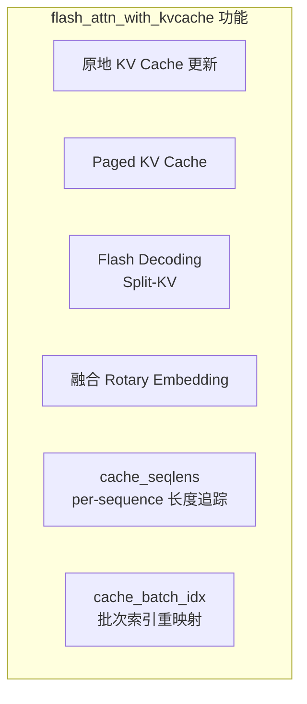
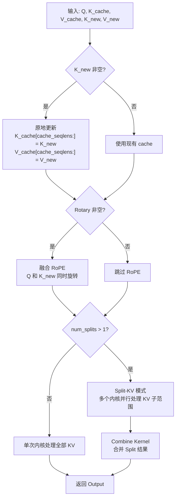
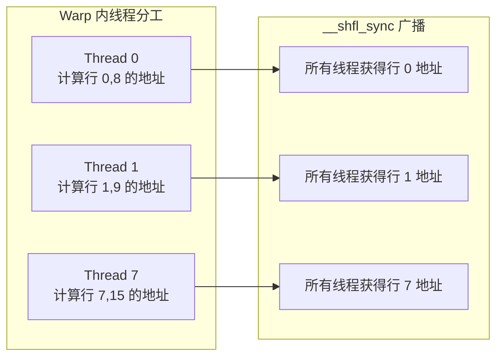
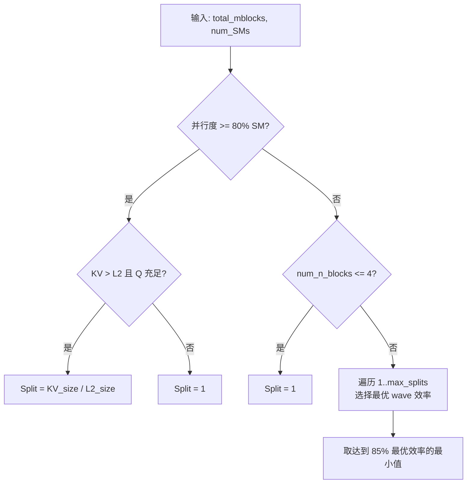

## 目录

- [1. 概述](#1-概述)
- [2. flash_attn_with_kvcache 工作流](#2-flash_attn_with_kvcache-工作流)
- [3. Paged KV Cache](#3-paged-kv-cache)
- [4. Flash Decoding（Split-KV）](#4-flash-decodingsplit-kv)
- [5. Combine Kernel](#5-combine-kernel)
- [6. 融合 Rotary Embedding](#6-融合-rotary-embedding)
- [7. 推理性能优化策略](#7-推理性能优化策略)

---

## 1. 概述

推理场景中，Flash Attention 面临的挑战与训练截然不同：

| 特征 | 训练 | 推理（Decode） |
|------|------|---------------|
| Q 序列长度 | 长（数千 token） | 短（通常 1 token） |
| 计算瓶颈 | 计算密集（GEMM） | 内存密集（KV Cache 读取） |
| KV 数据 | 每次从头计算 | 缓存并增量更新 |
| 批次大小 | 固定 | 动态（不同请求不同长度） |

`flash_attn_with_kvcache` 是 Flash Attention 为推理场景设计的专用 API，集成了 KV Cache 更新、Paged KV、融合 Rotary Embedding 和 Flash Decoding（Split-KV）等优化。



**源文件**：
- Python API：`flash_attn/flash_attn_interface.py:1474-1600`
- C++ 绑定：`hopper/flash_api.cpp`（`mha_fwd_kvcache`）
- Paged KV：`hopper/paged_kv.h`
- Split 启发式：`hopper/heuristics.h`
- Combine 内核：`hopper/flash_fwd_combine_kernel.h`

---

## 2. flash_attn_with_kvcache 工作流

### 2.1 API 签名

```python
def flash_attn_with_kvcache(
    q,                   # (batch, seqlen_q, nheads, headdim)
    k_cache,             # (batch_cache, seqlen_cache, nheads_k, headdim) 或 Paged
    v_cache,             # 同 k_cache
    k=None,              # (batch, seqlen_new, nheads_k, headdim) 新 token
    v=None,              # 同 k
    rotary_cos=None,     # (seqlen_ro, rotary_dim/2) RoPE cos
    rotary_sin=None,     # RoPE sin
    cache_seqlens=None,  # (batch,) 或 int，当前缓存长度
    cache_batch_idx=None,# (batch,) 批次到 cache 的索引映射
    cache_leftpad=None,  # (batch,) 左侧 padding 偏移
    block_table=None,    # (batch, max_num_blocks) Paged KV 页表
    softmax_scale=None,
    causal=False,
    window_size=(-1, -1),
    softcap=0.0,
    rotary_interleaved=True,
    alibi_slopes=None,
    num_splits=0,        # 0=自动，>0=手动指定
    return_softmax_lse=False,
):
```

### 2.2 执行流程



### 2.3 原地 KV Cache 更新

当传入 `k` 和 `v` 参数时，CUDA 内核在 Attention 计算的**同一个 kernel launch** 中完成 KV Cache 更新：

```
1. 将 K_new 写入 K_cache[cache_seqlens : cache_seqlens + seqlen_new]
2. 将 V_new 写入 V_cache[cache_seqlens : cache_seqlens + seqlen_new]
3. 使用更新后的完整 cache 计算 Attention
```

这避免了三次独立的内存操作（写 K、写 V、读 KV 做 Attention），减少了内核启动开销和 HBM 带宽消耗。

---

## 3. Paged KV Cache

### 3.1 动机

连续 KV Cache 的问题：

```
请求 A (seqlen=500): [=====...............]  (预分配 2048)
请求 B (seqlen=100): [=...................]  (预分配 2048)
请求 C (seqlen=1800): [==================..]  (预分配 2048)
浪费内存: (2048-500) + (2048-100) + (2048-1800) = 3596 tokens
```

Paged KV Cache 将每个序列的 KV 存储分散到固定大小的页面中，按需分配：

```
物理页面池:  [P0] [P1] [P2] [P3] [P4] [P5] [P6] ...
请求 A 页表: [P0, P1]        (2 页 × 256 = 512 token)
请求 B 页表: [P3]            (1 页 × 256 = 256 token)
请求 C 页表: [P2, P4, P5, P6, P7] (5 页 × 256 = 1280 token, 继续分配...)
```

### 3.2 block_table 参数

```python
# block_table: (batch, max_num_blocks), dtype=int32
# 每个条目是一个物理页面的索引
block_table = torch.tensor([
    [0, 1, -1, -1],  # 请求 A: 页面 0, 1
    [3, -1, -1, -1], # 请求 B: 页面 3
    [2, 4, 5, 6],    # 请求 C: 页面 2, 4, 5, 6
], dtype=torch.int32, device="cuda")

# k_cache/v_cache 形状变为 (num_blocks, page_block_size, nheads_k, headdim)
k_cache = torch.randn(8, 256, 8, 128, device="cuda", dtype=torch.float16)
v_cache = torch.randn(8, 256, 8, 128, device="cuda", dtype=torch.float16)
```

### 3.3 PagedKVManager

`PagedKVManager`（`hopper/paged_kv.h:17-92`）管理分页 KV Cache 的加载。核心挑战是从页表计算物理地址涉及 int64 除法运算，开销较大。

**优化策略**：线程组分工 + `__shfl_sync` 广播

```cpp
// hopper/paged_kv.h:133-153
void load_page_table(const int n_block) {
    for (int i = 0; i < kPageEntryPerThread; ++i) {
        int const row_idx = n_block * kBlockN + row;
        int page_idx, page_offset;
        // FastDivmod: 将 row_idx 分解为页号和页内偏移
        page_idx = page_size_divmod.divmod(page_offset, row_idx + leftpad_k);
        int const page = mPageTable[page_idx];  // 查页表
        tPrPageOffset[i] = {page, page_offset};
    }
}
```

**地址计算流程**：
1. 每个线程计算自己负责的若干行的页面地址
2. 使用 `cutlass::FastDivmod` 避免昂贵的整数除法
3. 通过 `__shfl_sync` 将计算结果广播给同 warp 的其他线程



### 3.4 页面大小要求

`page_block_size` 必须是 256 的倍数，以满足 TMA 和 GMMA 的对齐要求。常见取值为 256。

---

## 4. Flash Decoding（Split-KV）

### 4.1 问题

自回归 Decode 阶段，Q 只有 1 个 token（`seqlen_q=1`），而 KV Cache 可能有数千 token。此时 Attention 是一个严重的内存瓶颈操作：

```
Q: (batch, 1, heads, dim)     → 极小
KV: (batch, seq_len_k, heads, dim) → 可能很大

并行度 = batch × heads × ceil(1/kBlockM) = batch × heads
如果 batch × heads < SM 数量 → GPU 利用率低下
```

### 4.2 Split-KV 方案

Flash Decoding 将 KV Cache 沿序列维度分成多个 split，每个 split 独立计算部分结果：

```
KV Cache: [====================================]
Split 0:  [=========]
Split 1:            [=========]
Split 2:                      [=========]
Split 3:                                [=======]

每个 split 独立计算:
- O_partial_i: 部分输出
- LSE_partial_i: 部分 log-sum-exp

最后合并: O_final = combine(O_partial_0, ..., O_partial_3)
```

### 4.3 num_splits_heuristic

`hopper/heuristics.h:25-59` 实现了智能的 split 数量决策：

```cpp
int num_splits_heuristic(int total_mblocks, int num_SMs, int num_n_blocks,
                         int num_m_blocks, int size_one_kv_head,
                         bool is_causal_or_local, int max_splits) {
    // 策略 1: 如果已有足够并行度，不拆分
    if (total_mblocks >= 0.8f * num_SMs) {
        // 例外：KV 超出 L2 Cache 且有足够 Q token
        int const size_l2 = 50 * 1024 * 1024;  // 假设 50MB L2
        if (size_one_kv_head > size_l2 && num_m_blocks >= num_SMs * 2) {
            return min((size_one_kv_head + size_l2 - 1) / size_l2, max_splits);
        }
        return 1;
    }

    // 策略 2: KV 块太少，拆分无意义
    if (num_n_blocks <= 4) { return 1; }

    // 策略 3: 寻找最佳 SM 利用率
    max_splits = min({max_splits, num_SMs, num_n_blocks});
    float max_efficiency = 0.f;
    for (int s = 1; s <= max_splits; s++) {
        float n_waves = float(total_mblocks * s) / num_SMs;
        float eff = n_waves / ceil(n_waves);  // wave 效率
        max_efficiency = max(max_efficiency, eff);
    }

    // 选择达到最佳效率 85% 的最小 split 数
    for (int s = 1; s <= max_splits; s++) {
        if (efficiency[s-1] >= 0.85 * max_efficiency) return s;
    }
    return 1;
}
```

**决策逻辑**：



---

## 5. Combine Kernel

### 5.1 作用

当 `num_splits > 1` 时，Flash Decoding 产生多组部分结果。Combine Kernel（`hopper/flash_fwd_combine_kernel.h`）使用 Online Softmax 技巧将它们合并为最终结果。

### 5.2 合并算法

每个 split $s$ 产生部分输出 $O_s$ 和部分 LSE（$L_s$）。合并步骤：

**步骤 1：计算全局 LSE**
$$L_{max} = \max_s L_s$$
$$L_{final} = \log\left(\sum_s e^{L_s - L_{max}}\right) + L_{max}$$

**步骤 2：计算权重**
$$w_s = \frac{e^{L_s - L_{max}}}{\sum_s e^{L_s - L_{max}}}$$

**步骤 3：加权合并输出**
$$O_{final} = \sum_s w_s \cdot O_s$$

```cpp
// hopper/flash_fwd_combine_kernel.h:345-381
// 数值稳定的 online-softmax 聚合
float lse_max = max_across_splits(ts2rrLSE);
float lse_sum = 0.f;
for (int s = 0; s < num_splits; ++s) {
    float scale = exp(ts2rrLSE(s) - lse_max);
    lse_sum += scale;
    ts2rrLSE(s) = scale;  // 复用存储权重
}
float inv_sum = 1.0f / lse_sum;
for (int s = 0; s < num_splits; ++s) {
    ts2rrLSE(s) *= inv_sum;  // 归一化权重
}
```

### 5.3 与 Online Softmax 的关系

这与 Flash Attention 主循环中的 Online Softmax 是同一数学原理——将全局 Softmax 分解为局部计算和后续修正。区别在于主循环在寄存器中修正，而 Split-KV 的修正需要通过一个独立的 Combine Kernel 完成，因为各 split 运行在不同的 thread block 上。

---

## 6. 融合 Rotary Embedding

### 6.1 融合动机

推理时 RoPE 需要对每个新 token 的 Q 和 K 施加旋转。如果独立执行，需要额外的 kernel launch 和内存读写。Flash Attention 将 RoPE 融合到 KV Cache 更新流程中：

```
传统流程:
Q → RoPE Kernel → Q_rotated → Attention Kernel
K → RoPE Kernel → K_rotated → Write to Cache → Attention Kernel

融合流程:
Q, K, rotary_cos, rotary_sin → flash_attn_with_kvcache
  (内核内部: 旋转 Q 和 K → 写 K 到 cache → 计算 Attention)
```

### 6.2 使用方式

```python
from flash_attn import flash_attn_with_kvcache

# 预计算 RoPE cos/sin
rotary_dim = 128
freqs = 1.0 / (10000 ** (torch.arange(0, rotary_dim, 2).float() / rotary_dim))
t = torch.arange(max_seqlen)
freqs = torch.outer(t, freqs)
rotary_cos = torch.cos(freqs).to(device="cuda", dtype=torch.float32)
rotary_sin = torch.sin(freqs).to(device="cuda", dtype=torch.float32)

# 推理时传入
out = flash_attn_with_kvcache(
    q, k_cache, v_cache,
    k=k_new, v=v_new,
    rotary_cos=rotary_cos,
    rotary_sin=rotary_sin,
    cache_seqlens=cache_seqlens,
    causal=True,
    rotary_interleaved=False,  # GPT-NeoX 风格
)
```

### 6.3 位置索引

RoPE 的旋转角度取决于 token 在序列中的位置：
- **K**：在 `cache_seqlens` 位置开始旋转（新 token 紧接已缓存的 token）
- **Q**：因果模式下与 K 相同位置；全局注意力模式下所有 Q token 都使用 `cache_seqlens` 位置

---

## 7. 推理性能优化策略

### 7.1 Prefill vs Decode 选择

| 阶段 | Q 长度 | 推荐 API | Split-KV |
|------|--------|---------|----------|
| Prefill | 长（prompt） | `flash_attn_func` | 通常不需要 |
| Decode | 短（1 token） | `flash_attn_with_kvcache` | 通常需要 |
| 长 Prefill | 很长（>8K） | `flash_attn_with_kvcache` | 可能需要 |

### 7.2 Batch 大小与 Split 的平衡

```python
# 大 batch（如 batch=256, heads=32）: 不需要 split
# 并行度 = 256 × 32 = 8192 >> num_SMs

# 小 batch（如 batch=1, heads=32）: 需要 split
# 并行度 = 1 × 32 = 32 < num_SMs (H100 有 132 个 SM)
# num_splits ≈ 132 / 32 ≈ 4
```

### 7.3 Paged KV 的开销

Paged KV Cache 有轻微的性能开销（~5-10%）来自地址计算和非连续内存访问。建议：
- 高吞吐场景（大 batch serving）：使用 Paged KV 以最大化内存利用
- 低延迟场景（小 batch）：使用连续 KV Cache 以最小化延迟

### 7.4 cache_batch_idx 的用途

当请求被动态调度（如连续 batching）时，逻辑 batch 索引可能与 KV Cache 中的物理位置不对应：

```python
# 5 个活跃请求，物理 cache 可容纳 8 个
# 请求 0 → cache 位置 2
# 请求 1 → cache 位置 5
# 请求 2 → cache 位置 0
cache_batch_idx = torch.tensor([2, 5, 0], dtype=torch.int32, device="cuda")
```

---

## 导航

- 上一篇：[因果遮蔽与 Masking](01-causal-and-masking.md)
- 下一篇：[GQA 与 MQA](03-gqa-mqa.md)
- [返回目录](../README.md)
