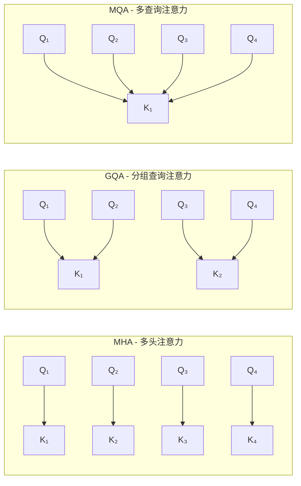
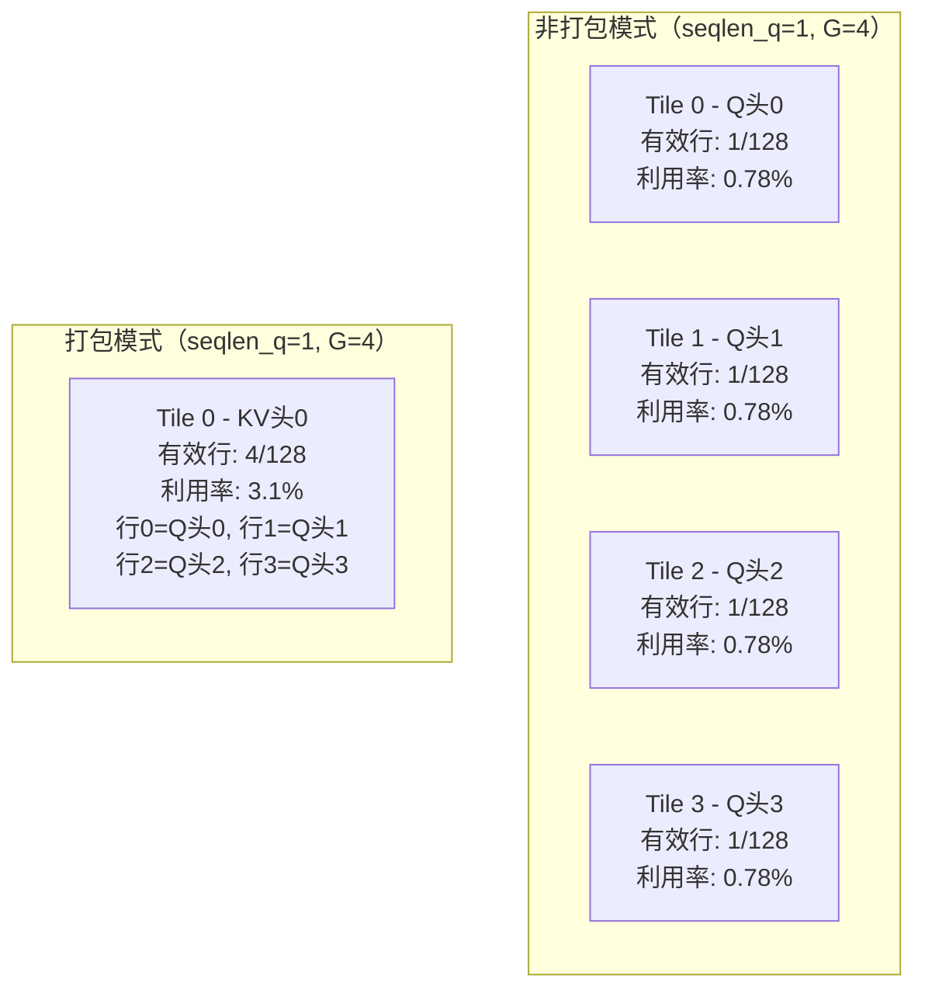
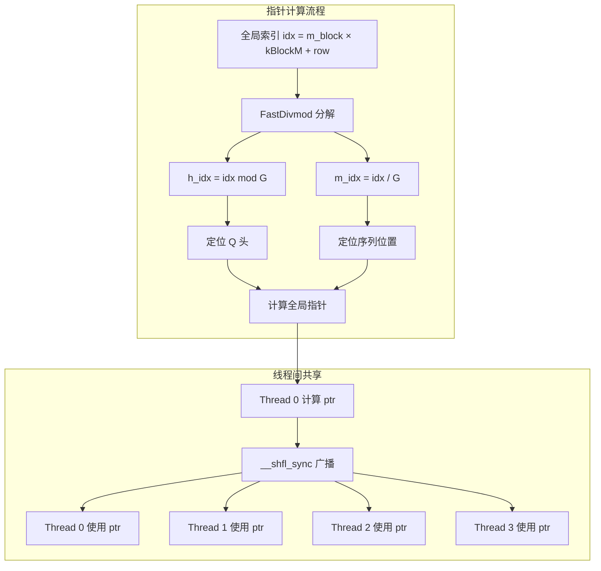
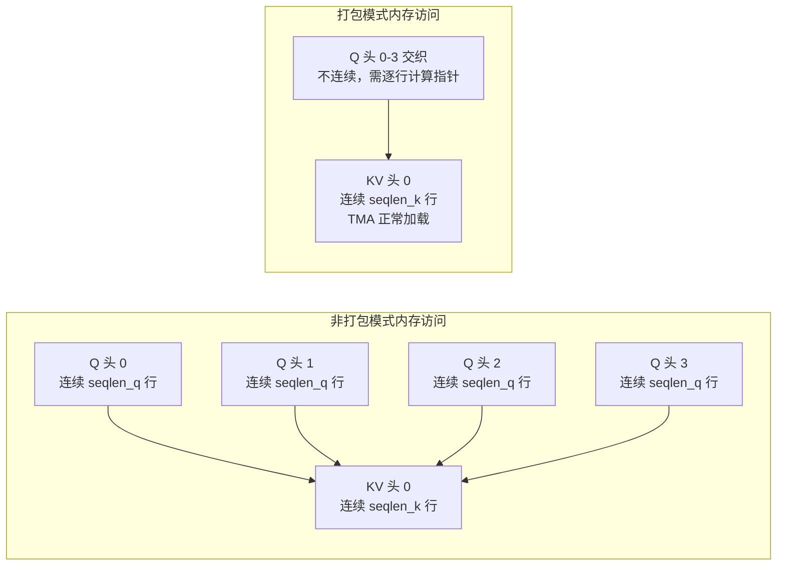
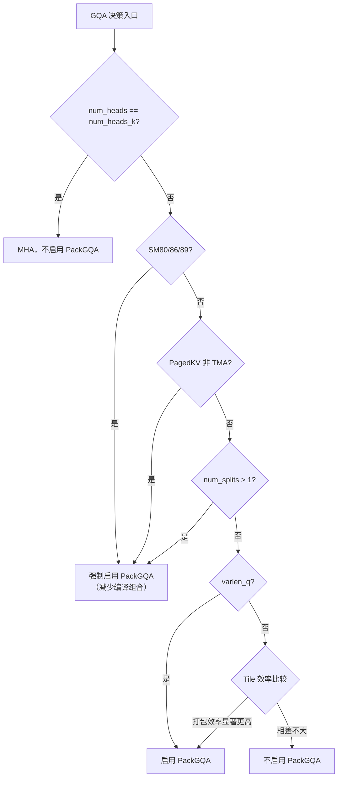

## 目录

- [1. 概述](#1-概述)
- [2. 注意力头组织方式](#2-注意力头组织方式)
- [3. PackGQA 优化](#3-packgqa-优化)
- [4. PackGQA 的内存访问](#4-packgqa-的内存访问)
- [5. PackGQA 与其他特性的交互](#5-packgqa-与其他特性的交互)
- [6. 反向传播中的 GQA 处理](#6-反向传播中的-gqa-处理)
- [7. 启用策略与性能分析](#7-启用策略与性能分析)

---

## 1. 概述

### 1.1 MHA / GQA / MQA 的区别

多头注意力（Multi-Head Attention, MHA）是 Transformer 的标准设计，Q、K、V 拥有相同数量的头。但在推理场景中，KV Cache 的内存占用与头数成正比，成为瓶颈。为此，研究者提出了两种变体：

| 模式 | Q 头数 | KV 头数 | 头数比 | 代表模型 |
|------|--------|---------|--------|---------|
| **MHA** | $H$ | $H$ | 1:1 | GPT-2, LLaMA-1 |
| **GQA** | $H$ | $H_k$ ($H_k > 1$) | $G$:1 | LLaMA-2/3, Mistral |
| **MQA** | $H$ | 1 | $H$:1 | Falcon, PaLM |

其中 $G = H / H_k$ 称为 **group size**（头组大小），每 $G$ 个 Q 头共享一组 K/V 头。



### 1.2 Flash Attention 的实现策略

Flash Attention 对 GQA/MQA 提供两种实现路径：

1. **非打包模式（Non-PackGQA）**：每个 Thread Block 处理一个 Q 头，通过 `bidh / G` 索引到对应的 KV 头。简单但可能浪费 GPU 资源。
2. **打包模式（PackGQA）**：将同一 KV 头组下的多个 Q 头打包到同一个 Tile 中，显著提升 GPU 利用率。

**源文件**：
- 打包管理器：`hopper/pack_gqa.h`
- 启用决策：`hopper/heuristics.h`
- 内核集成：`hopper/flash_fwd_kernel_sm90.h`、`hopper/mainloop_fwd_sm90_tma_gmma_ws.hpp`
- C++ 层控制：`hopper/flash_api.cpp`

---

## 2. 注意力头组织方式

### 2.1 非打包模式的工作方式

在非打包模式下，Grid 维度按 Q 头数分配：

```
Grid: (num_m_blocks, num_heads_q, batch_size)
```

每个 Thread Block 处理一个 Q 头的一个 M 块，通过除法映射到 KV 头：

```cpp
// hopper/flash_fwd_kernel_sm90.h:411
int const bidh_kv = !PackGQA ? params.mainloop.qhead_per_khead_divmod.divide(bidh) : bidh;
```

这种方式的问题在于：当 `seqlen_q` 较小时（如推理阶段 `seqlen_q=1`），每个 Q 头只有一个 M 块，Tile 的大部分行是空的，导致计算利用率低。

### 2.2 打包模式的核心思想

PackGQA 将同一 KV 头组下的多个 Q 头沿 M 维度堆叠到同一个 Tile 中：

```
非打包模式：每个 Tile 的 M 维度 = seqlen_q 的一个块
打包模式：每个 Tile 的 M 维度 = seqlen_q × G 的一个块（G = qhead_per_khead）
```



Grid 维度相应改变：

```cpp
// hopper/flash_fwd_launch_template.h:147-151
int qhead_per_khead = !PackGQA ? 1 : cutlass::ceil_div(params.h, params.h_k);
int num_blocks_m = cutlass::ceil_div(params.seqlen_q * qhead_per_khead, get<0>(TileShape_MNK{}));
// Grid: (num_blocks_m, num_heads_kv, batch_size)  // 注意用 KV 头数
```

### 2.3 Tile 内的数据排布

在打包模式下，Tile 的 M 维度中交织了不同 Q 头的数据。全局索引 `idx` 需要分解为 Q 头偏移 `h_idx` 和序列位置 `m_idx`：

$$\text{idx} = m\_block \times kBlockM + row$$
$$m\_idx = \lfloor \text{idx} / G \rfloor, \quad h\_idx = \text{idx} \mod G$$

这里 $G$ = `qhead_per_khead`。Flash Attention 使用 `cutlass::FastDivmod` 高效计算这个整数除法和取模运算。

```
Tile M 维度索引 (G=4, seqlen_q=8):
idx:    0  1  2  3  4  5  6  7  8  9 10 11 ...
h_idx:  0  1  2  3  0  1  2  3  0  1  2  3 ...
m_idx:  0  0  0  0  1  1  1  1  2  2  2  2 ...

即：行 0-3 是 seqlen_q 位置 0 的 4 个 Q 头
    行 4-7 是 seqlen_q 位置 1 的 4 个 Q 头
    ...
```

---

## 3. PackGQA 优化

### 3.1 PackGQAManager 结构体

`PackGQAManager`（`hopper/pack_gqa.h:17-253`）是 PackGQA 的核心实现，提供四个关键操作：

| 方法 | 功能 | 调用时机 |
|------|------|---------|
| `compute_ptr()` | 计算 Q/O 张量的行指针 | load_Q / store_O / store_LSE |
| `load_Q()` | 从 GMEM 加载打包 Q 到 SMEM | 内核开始 |
| `store_O()` | 将 SMEM 结果写回打包 O | Epilogue |
| `store_LSE()` | 存储 LSE（log-sum-exp）值 | Epilogue |

### 3.2 指针计算与线程协作

PackGQA 的关键挑战是：Tile 中的每一行属于不同的 Q 头，有不同的基地址。计算每一行的全局内存指针开销较大（包含一次整数除法和一次取模），因此 Flash Attention 使用 **线程间指针共享** 优化：

```cpp
// hopper/pack_gqa.h:55-73
template <int NumThreadsPerRow, typename Engine, typename Layout, typename TensorC>
static auto compute_ptr(Tensor<Engine, Layout> &tensor, TensorC const &tRows,
                        cutlass::FastDivmod const &qhead_per_khead_divmod,
                        int const thread_idx, int const m_block) {
    Tensor tPrPtr = make_tensor<TensorType const*>(Shape<Int<NumPtrPerThread>>{});
    for (int i = 0; i < NumPtrPerThread; ++i) {
        int const row = i * NumThreads + get<0>(tRows(thread_idx % NumThreadsPerRow));
        int const idx = m_block * kBlockM + row;
        int m_idx, h_idx;
        m_idx = qhead_per_khead_divmod.divmod(h_idx, idx);  // 一次操作同时得到商和余数
        tPrPtr[i] = &tensor(make_coord(make_coord(h_idx, m_idx)));
    }
    return tPrPtr;
}
```

**优化策略**：同一行的数据由多个线程加载（`kGmemThreadsPerRow` 个线程负责一行）。只需其中一个线程计算指针，然后通过 `__shfl_sync` 广播到同行的其他线程：

```cpp
// hopper/pack_gqa.h:106-109
for (int m = 0; m < size<1>(tQsQ); ++m) {
    // 通过 __shfl_sync 获取指针，避免重复计算 divmod
    Element const* q_ptr = reinterpret_cast<Element const*>(
        __shfl_sync(0xffffffff,
                    reinterpret_cast<uint64_t>(tPrQPtr(m / kGmemThreadsPerRow)),
                    m % kGmemThreadsPerRow, kGmemThreadsPerRow));
    // ... 使用 q_ptr 加载数据
}
```



### 3.3 Q 加载流程

`load_Q`（`hopper/pack_gqa.h:76-122`）使用 CpAsync 而非 TMA 加载 Q 数据。这是因为 TMA 假设数据在内存中是连续的，而打包后的 Q 数据不满足这个条件——每一行来自不同 Q 头的不同地址。

```cpp
// hopper/pack_gqa.h:84-121
static void load_Q(TensormQ const &mQ,  // ((qhead_per_khead, seqlen_q), headdim)
                   TensorsQ &sQ,        // (kBlockM, kHeadDim)
                   ...) {
    // 使用 CpAsync 替代 TMA
    GmemTiledCopyQCpAsync gmem_tiled_copy_Q_cp_async;

    // 计算每行的指针
    Tensor tPrQPtr = compute_ptr(mQ_0, tQcQ_row, qhead_per_khead_divmod, ...);

    for (int m = 0; m < size<1>(tQsQ); ++m) {
        int idx = m_block * kBlockM + get<0>(tQcQ(_0{}, m, _0{}));
        // 获取共享指针
        Element const* q_ptr = /* __shfl_sync 获取 */;
        if (idx < seqlen_q * qhead_per_khead) {
            // 从 q_ptr 加载一行到 SMEM
            Tensor mQ_cur = make_tensor(make_gmem_ptr(q_ptr), Shape<Int<kHeadDim>>{});
            for (int k = 0; k < size<2>(tQsQ); ++k) {
                cute::copy(gmem_tiled_copy_Q_cp_async.with(tQpQ(k)),
                           mQ_cur_copy(_, ki), tQsQ(_, m, k));
            }
        }
    }
}
```

### 3.4 缓存行对齐优化

`PackGQAManager` 的内存布局设计确保每行加载对齐到缓存行（128 字节）：

```cpp
// hopper/pack_gqa.h:26-29
static constexpr int kBytePerRow = kHeadDim * sizeof(Element);
// 选择 128/64/32 字节中能整除 kBytePerRow 的最大值
static constexpr int kBlockKGmem = (kBytePerRow % 128 == 0 ? 128
                                  : (kBytePerRow % 64 == 0 ? 64 : 32)) / sizeof(Element);
static constexpr int kGmemThreadsPerRow = kBlockKGmem / kGmemElemsPerLoad;
```

同时要求同一行的线程在同一个 Warp 内，以确保 `__shfl_sync` 能正常工作：

```cpp
static_assert(cutlass::NumThreadsPerWarp % kGmemThreadsPerRow == 0,
              "kGmemThreadsPerRow must divide NumThreadsPerWarp");
```

### 3.5 O 和 LSE 的存储

输出 O 和 LSE 的存储同样需要处理打包后的索引映射：

```cpp
// hopper/pack_gqa.h:159-198  store_O
static void store_O(TensormO &mO, TensorrO const &tOrO,
                    cutlass::FastDivmod const &qhead_per_khead_divmod, ...) {
    // 与 load_Q 类似的指针计算和 __shfl_sync 广播
    Tensor tPrOPtr = compute_ptr(mO_0, tOcO_row, qhead_per_khead_divmod, ...);
    for (int m = 0; m < size<1>(tOrO); ++m) {
        Element* o_ptr = /* __shfl_sync 获取 */;
        if (idx < seqlen_o * qhead_per_khead) {
            // 写回到正确的 O 位置
            cute::copy(gmem_tiled_copy_O, tOrO(_, m, k), mO_cur_copy(_, ki));
        }
    }
}
```

`store_LSE`（`hopper/pack_gqa.h:124-157`）使用 MMA 的线程映射来写 LSE 标量值，同样复用 `compute_ptr` 和 `__shfl_sync` 机制。

---

## 4. PackGQA 的内存访问

### 4.1 Q 张量的内存布局

PackGQA 改变了 Q 张量在逻辑上的视图。原始 Q 张量形状为 `(batch, seqlen_q, num_heads, headdim)`，在 PackGQA 下被重新解释为：

```
mQ: ((qhead_per_khead, seqlen_q), headdim)
```

即 `(G, seqlen_q)` 的二维序列索引。Q 头维度被折叠到序列维度中，形成"虚拟序列长度"= `seqlen_q × G`。

### 4.2 K/V 张量不变

K 和 V 张量的加载不受 PackGQA 影响。它们仍然按 KV 头索引，使用 TMA 正常加载。这是 PackGQA 的一个重要优势：K/V 在同一 KV 头组内共享，不需要复制。

```
K/V: (batch, seqlen_k, num_heads_k, headdim)  // 不变
```

### 4.3 内存访问模式对比



非打包模式下，Q 的加载是连续的，可以使用 TMA；打包模式下 Q 不连续，必须使用 CpAsync 逐行加载。但这个代价通常被更高的 SM 利用率所弥补。

---

## 5. PackGQA 与其他特性的交互

### 5.1 与因果遮蔽的交互

PackGQA 模式下，同一个 Tile 中的不同行属于不同的 Q 头，但它们共享相同的 KV 序列。因果遮蔽需要根据每行的**实际序列位置**（而非 Tile 内的行索引）来判断：

```cpp
// hopper/mask.h:79-86
if constexpr (PackGQA) {
    // 从全局索引中反推实际的序列位置
    mma_m_idx = qhead_per_khead_divmod.divide(
        m_block * kBlockM + get<Row>(tScS_rowcol(...))
    );
    // 使用 __shfl_sync 广播到同组线程
}
```

由于 PackGQA 的排布是 `(h0_s0, h1_s0, h2_s0, h3_s0, h0_s1, h1_s1, ...)`，同一序列位置的 4 个 Q 头在相邻行中，它们的因果 mask 相同。而不同序列位置有不同的因果边界。

### 5.2 与块级跳过的交互

`get_n_block_min_max()`（`hopper/block.h`）计算 KV 块范围时，需要考虑 PackGQA 下的实际序列位置：

```cpp
// hopper/block.h:24-34
if constexpr (Is_causal || Is_local) {
    int m_idx_max = (m_block + 1) * kBlockM;
    if (PackGQA) {
        // 从打包索引计算实际的最大序列位置
        m_idx_max = qhead_per_khead_divmod.divide(m_idx_max - 1) + 1;
    }
    int const n_idx = m_idx_max + seqlen_k - seqlen_q;
    n_block_max = std::min(n_block_max, cute::ceil_div(n_idx_right, kBlockN));
}
```

### 5.3 与 Paged KV 的交互

当同时启用 PackGQA 和 Paged KV Cache 时，Q 加载和 KV 加载各自使用独立的 `__shfl_sync` 机制：

- Q 加载：PackGQAManager 中的指针共享（用于处理不连续的 Q 头地址）
- KV 加载：PagedKVManager 中的指针共享（用于处理页表间接寻址）

两者不冲突，因为 Q 和 KV 的加载在不同的代码路径中执行。

### 5.4 与 Rotary Embedding 的交互

当 `AppendKV` 模式下在内核中进行 Rotary Embedding 时，PackGQA 需要为每行确定正确的旋转位置：

```cpp
// hopper/mainloop_fwd_sm90_tma_gmma_ws.hpp:1105-1119
int const qhead_per_khead = !PackGQA ? 1 : params.qhead_per_khead_divmod.divisor;
if (params.is_rotary_interleaved) {
    auto [tRrCos, tRrSin] = cute::conditional_return<!PackGQA>(
        rotary.template load_cos_sin<true>(m_block),
        rotary.template load_cos_sin_packgqa<true>(m_block, params.qhead_per_khead_divmod)
    );
    // ...
    rotary.apply_Q_interleaved(sQ_pi, tRrCos, tRrSin, m_block, qhead_per_khead);
}
```

PackGQA 下使用专门的 `load_cos_sin_packgqa` 变体，因为每行的序列位置不同，cos/sin 值也不同。

---

## 6. 反向传播中的 GQA 处理

### 6.1 反向传播不使用 PackGQA

反向传播采用 N-outer Q-inner 的循环结构（与前向的 Q-outer N-inner 相反），每个 Thread Block 遍历 Q 的所有块来计算一个 KV 块的梯度。这种结构天然适合 GQA——同一个 KV 头组下的所有 Q 头都会被遍历。

```cpp
// hopper/flash_bwd_launch_template.h:99
// 反向使用 SingleTileScheduler，PackGQA 固定为 false
flash::SingleTileScheduler<Varlen, false /*Split*/, false /*PackGQA*/, kBlockN>
```

### 6.2 梯度归约

反向传播需要将多个 Q 头的梯度贡献累加到对应的 KV 头。Flash Attention 使用 `at::sum_out` 进行高效归约：

```python
# flash_attn/flash_attn_interface.py 中的反向传播
# dK 原始形状: (batch, seqlen_k, num_heads_q, headdim)
# 需要归约到:   (batch, seqlen_k, num_heads_k, headdim)
if num_heads_q != num_heads_k:
    dK = dK.reshape(batch, seqlen_k, num_heads_k, num_heads_q // num_heads_k, headdim)
    dK = dK.sum(dim=3)  # 沿 Q 头组维度求和
    # dV 同理
```

这个归约在 C++ 层通过 `at::sum_out` 实现，避免了额外的内存分配：

```cpp
// 内核输出 dK 形状为 (batch, seqlen_k, num_heads_q, headdim)
// 如果 num_heads_q > num_heads_k，需要归约
// reshape 为 (batch, seqlen_k, num_heads_k, G, headdim)
// 对 G 维度求和
```

### 6.3 前向 vs 反向的 GQA 策略对比

| 特性 | 前向 | 反向 |
|------|------|------|
| 循环结构 | Q-outer N-inner | N-outer Q-inner |
| PackGQA | 可选（启发式决策） | 不使用 |
| Q 头处理 | 打包到同一 Tile | 按 Q 头遍历 |
| KV 头映射 | Grid 用 KV 头数 | Grid 用 Q 头数，除法映射 |
| 梯度归约 | 不需要 | `at::sum_out` 沿 Q 头组求和 |

---

## 7. 启用策略与性能分析

### 7.1 `should_pack_gqa` 启发式

Flash Attention 不总是启用 PackGQA，而是根据启发式规则决定：

```cpp
// hopper/heuristics.h:9-17
inline bool should_pack_gqa(bool varlen_q, int seqlen_q, int qhead_per_khead, int blockM) {
    // 如果是变长序列，始终启用 PackGQA
    if (varlen_q) return true;

    // 比较两种模式的 Tile 利用率
    float nopack_gqa_efficiency = float(seqlen_q) / float(round_up(seqlen_q, blockM));
    float pack_gqa_efficiency = float(seqlen_q * qhead_per_khead)
                               / float(round_up(seqlen_q * qhead_per_khead, blockM));

    // 只有当打包模式效率显著更高时才启用（90% 阈值）
    return nopack_gqa_efficiency < 0.9 * pack_gqa_efficiency;
}
```

**核心指标**：Tile 利用率 = 有效行数 / Tile 总行数。只有当 PackGQA 的利用率显著优于非打包模式时（超过 0.9 倍）才启用。

### 7.2 利用率分析示例

假设 `kBlockM = 128`：

| seqlen_q | G | 非打包效率 | 打包效率 | 是否启用 |
|----------|---|----------|---------|---------|
| 128 | 4 | 128/128 = 100% | 512/512 = 100% | 否（100% < 90% 的意思是不满足） |
| 1 | 8 | 1/128 = 0.78% | 8/128 = 6.25% | 是 |
| 64 | 4 | 64/128 = 50% | 256/256 = 100% | 是 |
| 100 | 2 | 100/128 = 78% | 200/256 = 78% | 否 |
| 32 | 8 | 32/128 = 25% | 256/256 = 100% | 是 |

### 7.3 强制启用的场景

某些场景下 PackGQA 被强制启用，以减少编译时的模板实例化组合数：

```cpp
// hopper/flash_api.cpp:426-439
inline bool get_pack_gqa(Flash_fwd_params const& params) {
    // SM8x、非TMA PagedKV、Split 模式下强制启用
    if (params.arch < 90 || (params.page_table && !params.pagedkv_tma) || params.num_splits > 1) {
        return true;
    }
    // MHA (num_heads == num_heads_k) 不需要 PackGQA
    if (params.h == params.h_k) { return false; }
    // 其他情况使用启发式决策
    return should_pack_gqa(...);
}
```



### 7.4 用户手动控制

Python API 提供 `pack_gqa` 参数供用户手动控制：

```python
from flash_attn import flash_attn_func

# 自动决策（默认）
out = flash_attn_func(q, k, v, causal=True)

# 手动启用 PackGQA
out = flash_attn_func(q, k, v, causal=True, pack_gqa=True)

# 手动禁用 PackGQA
out = flash_attn_func(q, k, v, causal=True, pack_gqa=False)
```

如果编译时指定了 `FLASH_ATTENTION_DISABLE_PACKGQA=TRUE`，则 PackGQA 功能会在二进制中被完全移除，减小库的体积。

### 7.5 编译模板组合

PackGQA 是一个编译时模板参数，会增加二进制大小。Flash Attention 的模板实例化组合为：

```
ARCH × DTYPE × HEAD_DIM × SPLIT × PAGEDKV × SOFTCAP × PACKGQA
```

每增加一个布尔参数，组合数翻倍。这也是某些场景下强制启用 PackGQA 的原因——减少 `PACKGQA=false` 的实例化，降低编译时间和二进制体积。

### 7.6 性能对比

PackGQA 的优势场景：

| 场景 | 非打包 | 打包 | 加速比 |
|------|--------|------|--------|
| 推理解码 (seqlen_q=1, G=8) | SM 利用率极低 | 8× 更多行 | 显著 |
| 短序列训练 (seqlen_q=64, G=4) | 50% Tile 利用率 | 100% | ~1.5-2× |
| 长序列训练 (seqlen_q=2048, G=4) | ~100% | ~100% | ~1.0× |

**经验法则**：当 `seqlen_q` 远小于 `kBlockM` 且 `G > 1` 时，PackGQA 收益最大。当 `seqlen_q` 已经是 `kBlockM` 的倍数时，两种模式性能相近。

---

## 导航

- 上一篇：[KV Cache 与推理优化](02-kv-cache-inference.md)
- 下一篇：[FP8 支持](04-fp8-support.md)
- [返回目录](../README.md)
