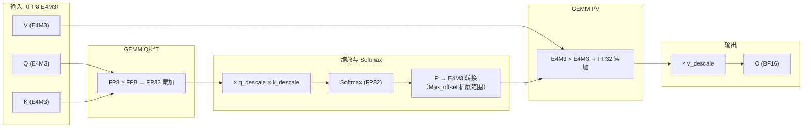
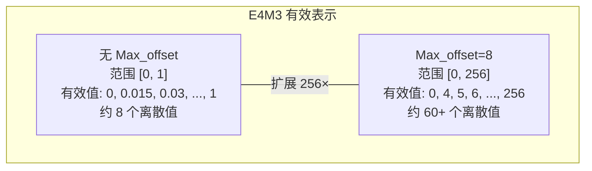
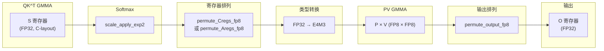

## 目录

- [1. 概述](#1-概述)
- [2. FP8 数据格式](#2-fp8-数据格式)
- [3. FP8 数据流](#3-fp8-数据流)
- [4. Max_offset 范围扩展技巧](#4-max_offset-范围扩展技巧)
- [5. Per-Head Descale 缩放](#5-per-head-descale-缩放)
- [6. V 矩阵转置](#6-v-矩阵转置)
- [7. 寄存器排列（Register Permutation）](#7-寄存器排列register-permutation)
- [8. FP8 的限制与使用指南](#8-fp8-的限制与使用指南)

---

## 1. 概述

### 1.1 为什么需要 FP8

随着大语言模型规模增长，推理的 Memory Bandwidth 成为主要瓶颈。FP8（8-bit 浮点）相比 FP16/BF16 将数据量减半，理论上可以实现：

- **2× 内存带宽节省**：KV Cache 大小减半，推理时可以支持更长序列或更大批量
- **2× 理论 FLOPS**：Hopper 架构的 FP8 Tensor Core 吞吐量是 FP16 的两倍
- **更大的 Tile 尺寸**：SMEM 中可以放下更多数据，减少 GMEM 加载次数

Flash Attention v2.8.3 支持 Hopper（SM90）上的 E4M3 格式 FP8，仅限前向传播。

### 1.2 支持范围

| 特性 | 支持情况 |
|------|---------|
| 数据类型 | `torch.float8_e4m3fn` (E4M3) |
| GPU 架构 | SM90 (H100/H200) |
| 前向传播 | 支持 |
| 反向传播 | 不支持 |
| 输出类型 | BF16（非 FP8） |
| Head Dim | 64, 96, 128, 192, 256 |
| Softcap | 支持（需调整阈值） |
| Paged KV | 支持 |
| GQA/MQA | 支持 |

**源文件**：
- 主循环 FP8 路径：`hopper/mainloop_fwd_sm90_tma_gmma_ws.hpp`
- Softmax FP8 优化：`hopper/softmax.h`
- 参数与 Descale：`hopper/flash.h`、`hopper/flash_api.cpp`
- 寄存器排列：`hopper/utils.h`
- V 转置：`hopper/mainloop_fwd_sm90_tma_gmma_ws.hpp:177-199`

---

## 2. FP8 数据格式

### 2.1 E4M3 格式

Flash Attention 使用 E4M3（4 位指数，3 位尾数）格式，这是推理中最常用的 FP8 变体：

| 格式 | 符号位 | 指数位 | 尾数位 | 范围 | 精度 |
|------|--------|--------|--------|------|------|
| FP16 | 1 | 5 | 10 | $\pm 65504$ | ~3.3 位十进制 |
| BF16 | 1 | 8 | 7 | $\pm 3.4 \times 10^{38}$ | ~2.4 位 |
| **E4M3** | 1 | 4 | 3 | $\pm 448$ | ~1.6 位 |
| E5M2 | 1 | 5 | 2 | $\pm 57344$ | ~1.0 位 |

E4M3 的动态范围较小（最大值 448），因此需要 **per-tensor 或 per-head 的缩放因子**（descale）来有效利用表示范围。

### 2.2 类型检测

Flash Attention 在编译时和运行时分别检测 FP8 类型：

```cpp
// 编译时类型检测 (hopper/mainloop_fwd_sm90_tma_gmma_ws.hpp:44)
static constexpr bool Is_FP8 = cute::is_same_v<Element, cutlass::float_e4m3_t>
                             || cute::is_same_v<Element, cutlass::float_e5m2_t>;

// 运行时类型检测 (hopper/flash_api.cpp:555)
params.is_e4m3 = qkv_dtype == at::ScalarType::Float8_e4m3fn;
```

---

## 3. FP8 数据流

### 3.1 整体数据流

FP8 Flash Attention 的数据流与 FP16/BF16 有显著不同。输入以 FP8 格式加载和计算，但中间结果保持 FP32 精度，最终输出为 BF16：



### 3.2 关键设计决策

**为什么 Softmax 后的 P 矩阵也用 FP8？**

在 FP16/BF16 模式下，P 矩阵（Softmax 输出）在寄存器中以 FP32 计算，转为 FP16/BF16 后参与 PV 的 GMMA。但 FP8 的 Tensor Core 要求两个操作数都是 FP8，因此 P 也必须转换为 E4M3。

这带来了一个挑战：Softmax 的输出范围是 $[0, 1]$，而 E4M3 的精度在这个范围内很低（只有 8 个离散值：0, 0.015625, 0.03125, ...）。Flash Attention 使用 `Max_offset` 技巧来解决这个问题（见第 4 节）。

### 3.3 GMMA 布局差异

FP8 改变了 GMMA 对 V 矩阵布局的要求：

```cpp
// hopper/mainloop_fwd_sm90_tma_gmma_ws.hpp:55,65
static constexpr bool Transpose_V = Is_FP8 && !V_colmajor;

// FP16/BF16: V 的 GMMA Major 可以是 MN（行主序）
// FP8: V 的 GMMA Major 必须是 K（列主序）
static constexpr cute::GMMA::Major MmaMajorV = !Is_FP8 && !V_colmajor
    ? GMMA::Major::MN    // FP16/BF16 行主序
    : GMMA::Major::K;    // FP8 列主序
```

同时，FP8 要求 PV 的 GEMM 使用寄存器-共享内存（RS）模式而非共享内存-共享内存（SS）模式：

```cpp
// hopper/mainloop_fwd_sm90_tma_gmma_ws.hpp:83
static_assert(!(!MmaPV_is_RS && Is_FP8), "MmaPV must be RS if FP8");
```

---

## 4. Max_offset 范围扩展技巧

### 4.1 问题背景

Softmax 的输出 $P_{ij} = \text{softmax}(S)_{ij} \in [0, 1]$。将 $P$ 转为 E4M3 时，$[0, 1]$ 范围内的精度极其有限，大量信息丢失。

### 4.2 解决方案

Flash Attention 引入 `Max_offset=8` 模板参数，在 `scale_apply_exp2` 中将 `max` 值减去 8，等价于将 $e^{x - max}$ 变为 $e^{x - max + 8} = e^{x-max} \cdot e^8 = e^{x-max} \cdot 2^{8/\ln 2}$（实际使用 `exp2f`，即 $2^{x-max+8}$）。

这将 Softmax 的输出范围从 $[0, 1]$ 扩展到 $[0, 256]$，有效利用了 E4M3 更多的表示范围：

```cpp
// hopper/softmax.h:64-88
template <bool Scale_max=true, bool Check_inf=true, int Max_offset=0, ...>
void scale_apply_exp2(Tensor &tensor, Tensor const &max, const float scale) {
    // 减去 max_offset，相当于给 exp2 的结果乘以 2^Max_offset
    static constexpr float max_offset = float(Max_offset);
    for (int mi = 0; mi < size<0>(tensor); ++mi) {
        const float max_scaled = Check_inf
            ? (max(mi) == -INFINITY ? 0.f : max(mi) * scale - max_offset)
            : max(mi) * scale - max_offset;
        for (int ni = 0; ni < size<1>(tensor); ++ni) {
            tensor(mi, ni) = exp2f(tensor(mi, ni) * scale - max_scaled);
            // 结果在 [0, 2^Max_offset] = [0, 256] 范围内
        }
    }
}
```

### 4.3 精度恢复

在计算 LSE（log-sum-exp）时，需要除以 $2^{Max\_offset}$ 来恢复正确的 `row_sum`：

```cpp
// hopper/softmax.h:146-149
if constexpr (Max_offset != 0) {
    static constexpr float sum_scale = 1.f / float(1 << Max_offset);
    sum *= sum_scale;  // 除以 256 恢复正确的 sum
}
```

### 4.4 数值示例

```
原始 Softmax 输出（FP32）:  [0.7, 0.2, 0.05, 0.03, 0.01, 0.01, ...]
                             sum = 1.0

E4M3（无 Max_offset）:      [0.75, 0.1875, 0.0625, 0.03125, 0, 0, ...]
                             大量小值被截断为 0

E4M3（Max_offset=8）:        × 256 → [179.2, 51.2, 12.8, 7.68, 2.56, 2.56, ...]
                             E4M3 表示:  [176, 48, 12, 8, 2.5, 2.5, ...]
                             小值保留了更多精度
```



---

## 5. Per-Head Descale 缩放

### 5.1 Descale 参数

FP8 量化需要缩放因子来映射全精度值到 FP8 范围。Flash Attention 支持 **per-head** 的 descale 因子，分别应用于 Q、K、V：

```cpp
// hopper/flash.h:53-62
float * __restrict__ q_descale_ptr;
float * __restrict__ k_descale_ptr;
float * __restrict__ v_descale_ptr;
index_t q_descale_batch_stride;
index_t q_descale_head_stride;
index_t k_descale_batch_stride;
index_t k_descale_head_stride;
index_t v_descale_batch_stride;
index_t v_descale_head_stride;
```

Descale 的形状为 `(batch_size, num_heads_k)`，即每个 batch 中每个 KV 头有一个缩放因子。

### 5.2 Descale 的应用位置

Q 和 K 的 descale 隐含在 Softmax 的分数缩放中（无需额外操作），因为 $QK^T$ 的每个元素已经包含了 Q 和 K 的缩放。但当有 Softcap 时，需要显式调整阈值：

```cpp
// hopper/mainloop_fwd_sm90_tma_gmma_ws.hpp:1067-1072
float softcap_val = params.softcap_val;
if constexpr (Has_softcap && Is_FP8) {
    float const q_descale = params.ptr_q_descale == nullptr ? 1.0f
        : params.ptr_q_descale[bidb * get<0>(params.stride_q_descale)
                             + bidh_kv * get<1>(params.stride_q_descale)];
    float const k_descale = params.ptr_k_descale == nullptr ? 1.0f
        : params.ptr_k_descale[bidb * get<0>(params.stride_k_descale)
                             + bidh_kv * get<1>(params.stride_k_descale)];
    softcap_val *= q_descale * k_descale;
}
```

V 的 descale 应用在最终归一化阶段：

```cpp
// hopper/mainloop_fwd_sm90_tma_gmma_ws.hpp:1241-1242
float const v_descale = !Is_FP8 || params.ptr_v_descale == nullptr ? 1.0f
    : params.ptr_v_descale[bidb * get<0>(params.stride_v_descale)
                         + bidh_kv * get<1>(params.stride_v_descale)];
cute::copy(softmax.finalize(v_descale), scores_scale);
```

`softmax.finalize(v_descale)` 将 `v_descale` 乘入最终的输出缩放因子中，与 Softmax 归一化合并，避免额外的乘法操作。

### 5.3 数学推导

FP8 量化关系：$Q_{fp8} = Q_{real} / s_q$，$K_{fp8} = K_{real} / s_k$，$V_{fp8} = V_{real} / s_v$

其中 $s_q, s_k, s_v$ 是量化缩放因子（scale），$1/s$ 即 descale。

$$S = Q_{fp8} \cdot K_{fp8}^T = \frac{Q_{real}}{s_q} \cdot \frac{K_{real}^T}{s_k} = \frac{Q_{real} K_{real}^T}{s_q \cdot s_k}$$

$$O = \text{softmax}(S \cdot s_q \cdot s_k \cdot \text{scale}) \cdot V_{fp8} \cdot s_v$$

注意 `softmax_scale` 已经在 C++ 层乘入了 `scale_softmax_log2`，而 Q/K 的 descale 在 FP8 下通过 Softcap 调整间接处理。V 的 descale 在最终输出时统一应用。

---

## 6. V 矩阵转置

### 6.1 转置需求

FP8 的 GMMA 指令要求 B 操作数（即 PV 中的 V）以列主序（K-major）排列。但通常 V 在内存中是行主序（MN-major）。因此 FP8 需要在 SMEM 中对 V 进行转置：

```cpp
// hopper/mainloop_fwd_sm90_tma_gmma_ws.hpp:55
static constexpr bool Transpose_V = Is_FP8 && !V_colmajor;
```

如果用户提供了列主序的 V（`V_colmajor=true`），则无需转置。

### 6.2 LDSM.T + STSM 转置实现

转置使用 LDSM.T（Load Shared Memory with Transpose）和 STSM（Store Shared Memory）指令组合：

```cpp
// hopper/mainloop_fwd_sm90_tma_gmma_ws.hpp:177-198
// 使用 LDSM.T 和 STSM 转置 V（FP8 行主序场景）
static_assert(!Transpose_V || (kHeadDimV % 32 == 0 && kBlockN % 32 == 0));

// 转置块大小取决于 kHeadDimV
// kHeadDimV 是 64 的倍数: 64×32 块
// 否则: 32×64 块
using S2RTiledCopyVt = decltype(make_tiled_copy(
    Copy_Atom<SM75_U16x8_LDSM_T, Element>{},  // LDSM.T: 加载并转置
    Layout<LDSM_thread_shape, LDSM_thread_stride>{},
    Layout<LDSM_value_shape, LDSM_value_stride>{}));
```

这个转置在 Pipeline 的 Producer 线程中执行，与 Consumer 的计算重叠。

### 6.3 V_colmajor 选项

用户可以预先将 V 存储为列主序，跳过内核中的转置开销：

```python
# 使用列主序 V 避免内核转置（理论上更快，但需要用户自行处理）
# v_colmajor = v.transpose(-1, -2).contiguous().transpose(-1, -2)
```

当 `V_colmajor=true` 时，多个 FP8 特有的代码路径被跳过，包括寄存器排列。

---

## 7. 寄存器排列（Register Permutation）

### 7.1 为什么需要寄存器排列

FP8 GMMA 和 FP16/BF16 GMMA 的输出寄存器布局不同。当 Softmax 的 FP32 输出需要作为下一个 GMMA（PV）的 FP8 输入时，寄存器中的元素需要重新排列以匹配 FP8 GMMA 的输入布局。

Flash Attention 提供三个排列函数（`hopper/utils.h`）：

| 函数 | 用途 | 调用时机 |
|------|------|---------|
| `permute_Cregs_fp8` | QK GMMA 输出 → PV RS 输入 | Softmax 后，V 行主序 |
| `permute_Aregs_fp8` | Softmax 输出 → PV RS 输入 | Softmax 后，V 列主序 |
| `permute_output_fp8` | PV GMMA 输出 → O 存储格式 | Epilogue 前，V 行主序 |

### 7.2 permute_Cregs_fp8

```cpp
// hopper/utils.h:552-570
CUTLASS_DEVICE void permute_Cregs_fp8(Fragment &frag) {
    // frag 形状: ((2, 2, N/8), MMA_M, MMA_N), 每个元素 32 位
    // 对 V 行主序：重排 C 寄存器使其匹配 FP8 MMA 的 A 操作数布局
    // 交换特定位置的寄存器值
}
```

### 7.3 数据流中的排列位置



### 7.4 代码中的调用

在主循环的 `fwd_step` 中，排列操作穿插在 Softmax 和 GEMM 之间：

```cpp
// hopper/mainloop_fwd_sm90_tma_gmma_ws.hpp:1155-1161
softmax.template online_softmax<true, true>(tSrS);

// 排列：C-layout → A-layout（V 行主序时）
if constexpr (Is_FP8 && !V_colmajor) { flash::permute_Cregs_fp8(tSrS); }

// 转换 FP32 → E4M3
Tensor tOrP = make_tensor_like<Element>(tOrP_acc);
convert_type_out(tOrP_acc, tOrP);

// 排列：A-layout 调整（V 列主序时）
if constexpr (Is_FP8 && V_colmajor) { flash::permute_Aregs_fp8(tOrP); }

// ... PV GEMM ...

// 输出排列
if constexpr (Is_FP8 && !V_colmajor) { flash::permute_output_fp8(tOrO); }
```

---

## 8. FP8 的限制与使用指南

### 8.1 当前限制

| 限制 | 说明 |
|------|------|
| 仅前向 | 反向传播不支持 FP8，梯度计算需要更高精度 |
| 仅 SM90 | Hopper 的 FP8 Tensor Core 是硬件前提 |
| 输出为 BF16 | `O` 始终以 BF16 输出，不支持 FP8 输出 |
| 需要 Descale | 量化和反量化需要用户提供缩放因子 |
| 编译开关 | 可通过 `FLASH_ATTENTION_DISABLE_FP8` 编译时禁用 |

### 8.2 Python API 使用示例

```python
import torch
from flash_attn import flash_attn_func

batch, seqlen, nheads, headdim = 2, 1024, 32, 128
nheads_k = 8  # GQA

# 创建 FP8 输入
q = torch.randn(batch, seqlen, nheads, headdim, device='cuda').to(torch.float8_e4m3fn)
k = torch.randn(batch, seqlen, nheads_k, headdim, device='cuda').to(torch.float8_e4m3fn)
v = torch.randn(batch, seqlen, nheads_k, headdim, device='cuda').to(torch.float8_e4m3fn)

# Per-head descale 因子（形状: batch × num_heads_k）
q_descale = torch.ones(batch, nheads_k, device='cuda', dtype=torch.float32)
k_descale = torch.ones(batch, nheads_k, device='cuda', dtype=torch.float32)
v_descale = torch.ones(batch, nheads_k, device='cuda', dtype=torch.float32)

# 调用 Flash Attention
out = flash_attn_func(
    q, k, v,
    causal=True,
    q_descale=q_descale,
    k_descale=k_descale,
    v_descale=v_descale,
)
# out.dtype == torch.bfloat16
```

### 8.3 参数验证

C++ 层对 FP8 输入进行严格验证：

```cpp
// hopper/flash_api.cpp:548-549
TORCH_CHECK(qkv_dtype == at::ScalarType::Half
          || qkv_dtype == at::ScalarType::BFloat16
          || qkv_dtype == at::ScalarType::Float8_e4m3fn,
          "FlashAttention only supports fp16, bf16, and fp8_e4m3 data type");

// FP8 的对齐要求更严格（16 vs 8）
int const alignment = q_type == torch::kFloat8_e4m3fn ? 16 : 8;

// FP8 输出固定为 BF16
auto out_type = q_type == at::ScalarType::Float8_e4m3fn
    ? at::ScalarType::BFloat16 : q_type;
```

### 8.4 编译与二进制大小

FP8 是一个独立的编译模板参数，会增加二进制大小。可以通过环境变量禁用：

```bash
# 禁用 FP8 编译（减小二进制大小）
FLASH_ATTENTION_DISABLE_FP8=TRUE pip install flash-attn

# 对应的编译宏
#ifdef FLASHATTENTION_DISABLE_FP8
TORCH_CHECK(false, "This flash attention build does not support FP8.");
#endif
```

### 8.5 Tile 尺寸影响

FP8 影响 Tile 尺寸的选择。由于 FP8 元素只有 1 字节（vs FP16 的 2 字节），`element_size=1` 允许更大的 Tile 在 SMEM 中放下更多数据：

```cpp
// hopper/flash_api.cpp:436,450
auto kBlockMN = tile_size_fwd_sm90(params.d_rounded, params.dv_rounded,
    params.is_causal, params.is_local,
    params.is_e4m3 ? 1 : 2 /*element_size*/,  // FP8: 1 字节
    false /*v_colmajor*/, ...);
```

### 8.6 性能最佳实践

1. **Descale 因子**：如果不需要 per-head 缩放，不传 descale 参数（默认为 1.0），避免额外的内存加载
2. **Head Dimension**：FP8 在 `headdim=128` 时性能最优，与 GMMA 指令的原生尺寸匹配
3. **与 Split-KV 结合**：FP8 推理场景（小 seqlen_q）通常搭配 Split-KV 使用，两者可以同时启用
4. **V 列主序**：如果可以提前准备列主序的 V，可以跳过内核中的转置开销
5. **避免 Softcap**：FP8 下 Softcap 需要额外加载 Q/K descale 并调整阈值，有少量性能开销

---

## 导航

- 上一篇：[GQA 与 MQA 实现](03-gqa-mqa.md)
- 下一篇：[基础用法](../07-usage-tutorial/01-basic-usage.md)
- [返回目录](../README.md)
