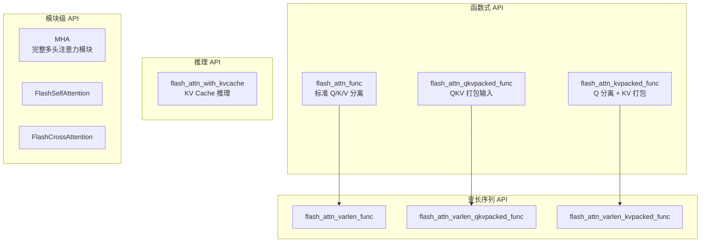
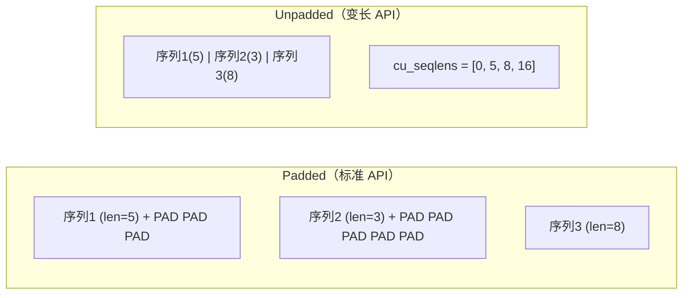

## 目录

- [1. 安装与环境准备](#1-安装与环境准备)
- [2. 核心 API 概览](#2-核心-api-概览)
- [3. 基础 Self-Attention](#3-基础-self-attention)
- [4. 因果注意力](#4-因果注意力)
- [5. 滑动窗口注意力](#5-滑动窗口注意力)
- [6. GQA / MQA](#6-gqa--mqa)
- [7. 变长序列处理](#7-变长序列处理)
- [8. 常见问题与注意事项](#8-常见问题与注意事项)

---

## 1. 安装与环境准备

### 1.1 硬件要求

| 组件 | 最低要求 | 推荐配置 |
|------|---------|---------|
| GPU | NVIDIA Ampere (A100) | NVIDIA Hopper (H100/H200) |
| CUDA | 12.0+ | 12.3+ (Hopper/FA3) |
| 内存 | 32GB RAM | 96GB+ RAM（编译需要） |
| PyTorch | 2.2+ | 2.4+（torch.compile 支持） |

Flash Attention 同时支持 AMD ROCm 平台（MI200x/MI300x）。

### 1.2 安装方式

**方式一：PyPI 安装（推荐）**

```bash
pip install flash-attn --no-build-isolation
```

**方式二：从源码编译**

```bash
git clone https://github.com/Dao-AILab/flash-attention.git
cd flash-attention
python setup.py install
```

如果编译时内存不足，限制并行任务数：

```bash
MAX_JOBS=4 pip install flash-attn --no-build-isolation
```

**方式三：安装 Flash Attention 3（Hopper 专用）**

```bash
cd flash-attention/hopper
python setup.py install
```

### 1.3 环境变量

```bash
# 指定目标 GPU 架构（减少编译时间）
FLASH_ATTN_CUDA_ARCHS="80;90" pip install flash-attn --no-build-isolation

# 跳过 CUDA 编译（仅使用 Python 层）
FLASH_ATTENTION_SKIP_CUDA_BUILD=TRUE pip install flash-attn

# 禁用特定功能以减小二进制体积
FLASH_ATTENTION_DISABLE_FP8=TRUE
FLASH_ATTENTION_DISABLE_PACKGQA=TRUE
FLASH_ATTENTION_DISABLE_SPLIT=TRUE
```

### 1.4 验证安装

```python
import flash_attn
print(flash_attn.__version__)

import torch
from flash_attn import flash_attn_func

q = torch.randn(1, 128, 8, 64, device='cuda', dtype=torch.float16)
k = torch.randn(1, 128, 8, 64, device='cuda', dtype=torch.float16)
v = torch.randn(1, 128, 8, 64, device='cuda', dtype=torch.float16)
out = flash_attn_func(q, k, v)
print(f"输出形状: {out.shape}")  # torch.Size([1, 128, 8, 64])
```

---

## 2. 核心 API 概览

Flash Attention 提供 7 个核心函数和若干高级模块：



### 2.1 API 选择指南

| 场景 | 推荐 API | 理由 |
|------|---------|------|
| 标准自注意力 | `flash_attn_func` | 最通用 |
| QKV 已打包（如 BERT） | `flash_attn_qkvpacked_func` | 反向传播更快 |
| 交叉注意力 | `flash_attn_kvpacked_func` 或 `flash_attn_func` | KV 打包反向更快 |
| 动态 batch（不同长度） | `flash_attn_varlen_*` | 去除 padding，节省计算 |
| 推理解码 | `flash_attn_with_kvcache` | 内置 KV Cache 管理 |
| 完整 Transformer 层 | `MHA` 模块 | 集成投影、rotary 等 |

### 2.2 张量形状约定

Flash Attention 的所有函数遵循统一的张量形状约定：

```python
# 标准 API
q: (batch_size, seqlen_q, num_heads, head_dim)
k: (batch_size, seqlen_k, num_heads_k, head_dim)
v: (batch_size, seqlen_k, num_heads_k, head_dim)
out: (batch_size, seqlen_q, num_heads, head_dim)

# 打包 API
qkv: (batch_size, seqlen, 3, num_heads, head_dim)
kv:  (batch_size, seqlen, 2, num_heads_k, head_dim)

# 变长 API
q: (total_q, num_heads, head_dim)         # total_q = sum(seqlens_q)
k: (total_k, num_heads_k, head_dim)       # total_k = sum(seqlens_k)
cu_seqlens_q: (batch_size + 1,)           # int32, 累积序列长度
```

> **注意**：Flash Attention 使用 `(batch, seqlen, heads, headdim)` 布局，与 PyTorch 的 `nn.MultiheadAttention` 默认布局 `(seqlen, batch, embed_dim)` 不同。

---

## 3. 基础 Self-Attention

### 3.1 最简示例

```python
import torch
from flash_attn import flash_attn_func

# 参数
batch_size = 4
seqlen = 512
num_heads = 8
head_dim = 64

# 创建输入
q = torch.randn(batch_size, seqlen, num_heads, head_dim,
                device='cuda', dtype=torch.bfloat16)
k = torch.randn(batch_size, seqlen, num_heads, head_dim,
                device='cuda', dtype=torch.bfloat16)
v = torch.randn(batch_size, seqlen, num_heads, head_dim,
                device='cuda', dtype=torch.bfloat16)

# 前向传播
out = flash_attn_func(q, k, v)
# out.shape: (4, 512, 8, 64)
```

### 3.2 自定义 Softmax Scale

默认使用 $1/\sqrt{d}$，可以手动指定：

```python
out = flash_attn_func(q, k, v, softmax_scale=0.1)
```

### 3.3 QKV 打包输入

当 Q、K、V 来自同一个线性投影（如标准 Self-Attention），可以使用打包格式：

```python
from flash_attn import flash_attn_qkvpacked_func

# QKV 打包
qkv = torch.randn(batch_size, seqlen, 3, num_heads, head_dim,
                  device='cuda', dtype=torch.bfloat16)

out = flash_attn_qkvpacked_func(qkv)
```

打包格式在反向传播时更高效，因为梯度可以直接写入连续内存。

### 3.4 KV 打包输入（交叉注意力）

```python
from flash_attn import flash_attn_kvpacked_func

q = torch.randn(batch_size, seqlen_q, num_heads, head_dim,
               device='cuda', dtype=torch.bfloat16)
kv = torch.randn(batch_size, seqlen_k, 2, num_heads, head_dim,
                device='cuda', dtype=torch.bfloat16)

out = flash_attn_kvpacked_func(q, kv)
```

### 3.5 训练中的 Dropout

```python
# 训练模式
out = flash_attn_func(q, k, v, dropout_p=0.1)

# 推理模式（务必设为 0）
out = flash_attn_func(q, k, v, dropout_p=0.0)
```

---

## 4. 因果注意力

### 4.1 标准因果遮蔽

语言模型的自回归生成需要因果遮蔽，确保位置 $i$ 只能看到位置 $\le i$ 的 token：

```python
out = flash_attn_func(q, k, v, causal=True)
```

### 4.2 因果对齐方式

Flash Attention 的因果遮蔽对齐到注意力矩阵的**右下角**。当 `seqlen_q != seqlen_k` 时：

```
seqlen_q=2, seqlen_k=5:
  K: [0] [1] [2] [3] [4]
Q:
[0]  1   1   1   1   0     ← Q[0] 看到 K[0..3]
[1]  1   1   1   1   1     ← Q[1] 看到所有 K
```

这种设计支持 Prefix-Filling 场景：前缀部分（K 比 Q 多的部分）对所有 Q 位置可见。

### 4.3 等效的 window_size 写法

```python
# 以下两种写法等价
out1 = flash_attn_func(q, k, v, causal=True)
out2 = flash_attn_func(q, k, v, window_size=(-1, 0))
```

`window_size=(-1, 0)` 表示左侧无限制、右侧为 0（不看未来），这就是因果注意力。

---

## 5. 滑动窗口注意力

### 5.1 基本用法

滑动窗口限制注意力范围到附近的 token，降低长序列的计算复杂度：

```python
# 因果 + 左侧 256 token 窗口
out = flash_attn_func(q, k, v, window_size=(256, 0))

# 双向 128 token 窗口
out = flash_attn_func(q, k, v, window_size=(128, 128))

# 全局注意力（默认）
out = flash_attn_func(q, k, v, window_size=(-1, -1))
```

### 5.2 window_size 参数说明

| 参数值 | 含义 | 适用场景 |
|--------|------|---------|
| `(-1, -1)` | 全局注意力 | 短序列、BERT |
| `(-1, 0)` | 因果注意力 | 标准 LLM |
| `(256, 0)` | 因果 + 滑动窗口 | Mistral、长序列 LLM |
| `(128, 128)` | 双向滑动窗口 | 音频、时序分析 |

### 5.3 Attention Sink

配合 `sink_token_length` 保留序列开头的 token（Attention Sink），适用于流式推理：

```python
# 滑动窗口 + Attention Sink（前 4 个 token 始终可见）
# 注意：此功能在 flash_attn_with_kvcache 中通过参数控制
```

---

## 6. GQA / MQA

### 6.1 分组查询注意力（GQA）

只需让 K/V 的头数少于 Q 的头数，Flash Attention 自动处理：

```python
num_heads_q = 32    # Q 头数
num_heads_kv = 8    # KV 头数（每 4 个 Q 头共享 1 个 KV 头）

q = torch.randn(batch_size, seqlen, num_heads_q, head_dim,
               device='cuda', dtype=torch.bfloat16)
k = torch.randn(batch_size, seqlen, num_heads_kv, head_dim,
               device='cuda', dtype=torch.bfloat16)
v = torch.randn(batch_size, seqlen, num_heads_kv, head_dim,
               device='cuda', dtype=torch.bfloat16)

# 自动检测并使用 GQA
out = flash_attn_func(q, k, v, causal=True)
```

**要求**：`num_heads_q` 必须是 `num_heads_kv` 的整数倍。

### 6.2 多查询注意力（MQA）

MQA 是 GQA 的特例，KV 只有 1 个头：

```python
q = torch.randn(batch_size, seqlen, 32, head_dim,
               device='cuda', dtype=torch.bfloat16)
k = torch.randn(batch_size, seqlen, 1, head_dim,    # 单 KV 头
               device='cuda', dtype=torch.bfloat16)
v = torch.randn(batch_size, seqlen, 1, head_dim,
               device='cuda', dtype=torch.bfloat16)

out = flash_attn_func(q, k, v, causal=True)
```

### 6.3 PackGQA 控制

对于推理场景，可以手动控制 PackGQA 优化：

```python
# 自动决策（默认）
out = flash_attn_func(q, k, v, causal=True)

# 手动启用（推理短序列时推荐）
out = flash_attn_func(q, k, v, causal=True, pack_gqa=True)
```

> 详见 [GQA 与 MQA 实现](../06-advanced-features/03-gqa-mqa.md)

---

## 7. 变长序列处理

### 7.1 为什么需要变长 API

标准 API 要求同一 batch 内所有序列等长。当序列长度差异大时，padding 浪费计算。变长 API 将所有序列拼接为一个连续张量，彻底消除 padding：



### 7.2 基础用法

```python
from flash_attn import flash_attn_varlen_func

# 三个序列，长度分别为 100, 200, 150
seqlens = [100, 200, 150]
total = sum(seqlens)  # 450

# 拼接后的张量
q = torch.randn(total, num_heads, head_dim, device='cuda', dtype=torch.bfloat16)
k = torch.randn(total, num_heads, head_dim, device='cuda', dtype=torch.bfloat16)
v = torch.randn(total, num_heads, head_dim, device='cuda', dtype=torch.bfloat16)

# 累积序列长度（int32）
cu_seqlens_q = torch.tensor([0, 100, 300, 450], dtype=torch.int32, device='cuda')
cu_seqlens_k = cu_seqlens_q  # 自注意力时 Q/K 相同

out = flash_attn_varlen_func(
    q, k, v,
    cu_seqlens_q, cu_seqlens_k,
    max_seqlen_q=200,  # batch 中最长的序列长度
    max_seqlen_k=200,
    causal=True
)
# out.shape: (450, num_heads, head_dim)
```

### 7.3 使用 unpad_input 工具

Flash Attention 提供了 `unpad_input` / `pad_input` 工具函数：

```python
from flash_attn.bert_padding import unpad_input, pad_input

# 从 padded 张量转换
# x: (batch_size, max_seqlen, hidden_dim)
# attention_mask: (batch_size, max_seqlen), bool, True 表示有效
x_unpad, indices, cu_seqlens, max_seqlen, _ = unpad_input(x, attention_mask)
# x_unpad: (total_valid_tokens, hidden_dim)

# ... 执行变长注意力 ...

# 转回 padded 格式
x_padded = pad_input(x_unpad, indices, batch_size, max_seqlen)
```

### 7.4 变长交叉注意力

Q 和 K/V 可以有不同的序列长度：

```python
# Encoder-Decoder 交叉注意力
cu_seqlens_q = torch.tensor([0, 10, 25, 40], dtype=torch.int32, device='cuda')  # 解码器
cu_seqlens_k = torch.tensor([0, 100, 300, 450], dtype=torch.int32, device='cuda')  # 编码器

out = flash_attn_varlen_func(
    q, k, v,
    cu_seqlens_q, cu_seqlens_k,
    max_seqlen_q=15,
    max_seqlen_k=200
)
```

---

## 8. 常见问题与注意事项

### 8.1 数据类型

Flash Attention 支持以下数据类型：

| 数据类型 | 前向 | 反向 | 备注 |
|---------|------|------|------|
| `torch.float16` | 支持 | 支持 | 通用 |
| `torch.bfloat16` | 支持 | 支持 | 推荐用于训练 |
| `torch.float8_e4m3fn` | 支持 | 不支持 | 仅推理，仅 SM90 |

### 8.2 Head Dimension 限制

- 支持的 Head Dimension：最大 256
- Flash Attention 内部会自动将 head_dim 向上对齐到 8 的倍数
- 常见的 head_dim 值：64, 80, 96, 128, 160, 192, 256

### 8.3 内存连续性

所有输入张量必须在最后一个维度上连续。如果遇到错误，使用 `.contiguous()`：

```python
q = q.contiguous()
k = k.contiguous()
v = v.contiguous()
```

### 8.4 确定性模式

```python
# 确定性反向传播（较慢但可复现）
out = flash_attn_func(q, k, v, deterministic=True)
```

### 8.5 Softcap

Gemma 2 等模型使用 Softcap 限制注意力分数：

```python
out = flash_attn_func(q, k, v, softcap=50.0)
```

Softcap 在 masking 之前应用：$S_{capped} = \text{softcap} \cdot \tanh(S / \text{softcap})$。

### 8.6 返回注意力概率（调试用）

```python
out, softmax_lse, S_dmask = flash_attn_func(
    q, k, v,
    return_attn_probs=True
)
# softmax_lse: (batch, num_heads, seqlen_q) - log-sum-exp 值
# S_dmask: (batch, num_heads, seqlen_q, seqlen_k) - dropout mask
```

> **注意**：`return_attn_probs=True` 仅用于调试和测试，不应在生产环境使用，因为它会显著增加内存消耗。

---

## 导航

- 上一篇：[FP8 支持](../06-advanced-features/04-fp8-support.md)
- 下一篇：[训练集成](02-training-integration.md)
- [返回目录](../README.md)
