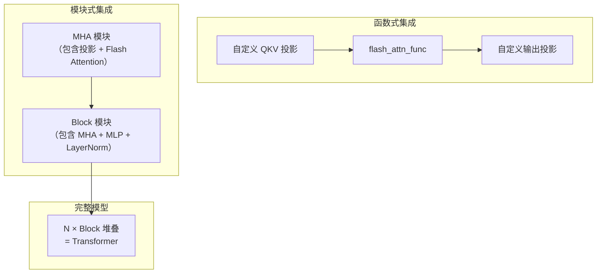

## 目录

- [1. 概述](#1-概述)
- [2. MHA 模块集成](#2-mha-模块集成)
- [3. Transformer Block 组装](#3-transformer-block-组装)
- [4. Rotary Embedding 集成](#4-rotary-embedding-集成)
- [5. 混合精度与梯度检查点](#5-混合精度与梯度检查点)
- [6. 分布式训练](#6-分布式训练)
- [7. torch.compile 集成](#7-torchcompile-集成)
- [8. 训练最佳实践](#8-训练最佳实践)

---

## 1. 概述

Flash Attention 在训练中的集成方式主要有两种：

1. **函数式集成**：直接调用 `flash_attn_func` 等函数，灵活但需要自行管理投影层和残差连接
2. **模块式集成**：使用 `MHA`、`Block` 等预构建模块，开箱即用



---

## 2. MHA 模块集成

### 2.1 基础 Self-Attention

```python
from flash_attn.modules.mha import MHA

# 创建 MHA 模块
mha = MHA(
    embed_dim=768,       # 总嵌入维度
    num_heads=12,        # 注意力头数（head_dim = 768/12 = 64）
    dropout=0.1,         # 注意力 dropout
    use_flash_attn=True, # 启用 Flash Attention
    causal=False,        # 非因果（BERT 风格）
    device='cuda',
    dtype=torch.bfloat16,
)

# 前向传播
x = torch.randn(batch_size, seqlen, 768, device='cuda', dtype=torch.bfloat16)
out = mha(x)  # (batch_size, seqlen, 768)
```

### 2.2 因果语言模型

```python
mha = MHA(
    embed_dim=1024,
    num_heads=16,
    causal=True,           # 因果遮蔽
    use_flash_attn=True,
    dropout=0.0,           # 现代 LLM 通常不用 dropout
)
```

### 2.3 GQA 配置

```python
mha = MHA(
    embed_dim=4096,
    num_heads=32,
    num_heads_kv=8,        # GQA: 每 4 个 Q 头共享 1 个 KV 头
    causal=True,
    use_flash_attn=True,
)
```

MHA 模块内部自动创建不同维度的投影层：Q 投影输出 `num_heads × head_dim`，KV 投影输出 `num_heads_kv × head_dim`。

### 2.4 交叉注意力

```python
mha = MHA(
    embed_dim=768,
    num_heads=12,
    cross_attn=True,       # 启用交叉注意力
    use_flash_attn=True,
)

# encoder_output 作为 KV 源
out = mha(decoder_input, x_kv=encoder_output)
```

### 2.5 使用 Padding Mask

```python
# key_padding_mask: (batch_size, seqlen), bool, True 表示保留
key_padding_mask = torch.ones(batch_size, seqlen, dtype=torch.bool, device='cuda')
key_padding_mask[:, 100:] = False  # 后面是 padding

out = mha(x, key_padding_mask=key_padding_mask)
```

MHA 模块内部调用 `unpad_input` 将 padded 输入转为变长格式，利用 `flash_attn_varlen_func` 跳过 padding 计算，然后用 `pad_input` 恢复原始形状。

### 2.6 返回残差

```python
mha = MHA(
    embed_dim=768,
    num_heads=12,
    return_residual=True,   # 返回残差用于后续 Add+LN
    use_flash_attn=True,
)

out, residual = mha(x)
# out: 注意力输出
# residual: 输入 x（用于残差连接）
```

---

## 3. Transformer Block 组装

### 3.1 Pre-Norm Block

```python
from flash_attn.modules.block import Block
from flash_attn.modules.mha import MHA
from flash_attn.modules.mlp import Mlp
from functools import partial

# 定义组件工厂函数
mixer_cls = partial(
    MHA,
    num_heads=12,
    causal=True,
    use_flash_attn=True,
)

mlp_cls = partial(
    Mlp,
    hidden_features=3072,  # 4× embed_dim
    activation=torch.nn.GELU(),
)

# 创建 Transformer Block
block = Block(
    dim=768,
    mixer_cls=mixer_cls,
    mlp_cls=mlp_cls,
    prenorm=True,           # Pre-LayerNorm（推荐）
    resid_dropout1=0.1,     # 注意力后 dropout
    resid_dropout2=0.1,     # MLP 后 dropout
    fused_dropout_add_ln=True,  # 融合 Dropout+Add+LN（使用 Triton 内核）
    residual_in_fp32=True,      # FP32 残差（数值稳定性）
).cuda().to(torch.bfloat16)

# 前向传播
hidden_states = torch.randn(batch_size, seqlen, 768, device='cuda', dtype=torch.bfloat16)
hidden_states, residual = block(hidden_states)
```

### 3.2 Parallel Block（GPT-J 风格）

Parallel Block 并行执行 Attention 和 MLP，减少串行延迟：

```python
from flash_attn.modules.block import ParallelBlock

parallel_block = ParallelBlock(
    dim=768,
    mixer_cls=mixer_cls,
    mlp_cls=mlp_cls,
    fused_dropout_add_ln=True,
    residual_in_fp32=True,
)
```

### 3.3 堆叠完整 Transformer

```python
import torch.nn as nn

class FlashTransformer(nn.Module):
    def __init__(self, num_layers, dim, num_heads, mlp_ratio=4):
        super().__init__()
        mixer_cls = partial(MHA, num_heads=num_heads, causal=True, use_flash_attn=True)
        mlp_cls = partial(Mlp, hidden_features=dim * mlp_ratio)

        self.layers = nn.ModuleList([
            Block(
                dim=dim,
                mixer_cls=mixer_cls,
                mlp_cls=mlp_cls,
                prenorm=True,
                fused_dropout_add_ln=True,
                residual_in_fp32=True,
            )
            for _ in range(num_layers)
        ])
        self.norm = nn.LayerNorm(dim)

    def forward(self, x):
        residual = None
        for layer in self.layers:
            x, residual = layer(x, residual)
        # 最后一层的归一化
        x = self.norm(residual + x) if residual is not None else self.norm(x)
        return x

model = FlashTransformer(
    num_layers=12,
    dim=768,
    num_heads=12,
).cuda().to(torch.bfloat16)
```

### 3.4 Stochastic Depth

```python
block = Block(
    dim=768,
    mixer_cls=mixer_cls,
    mlp_cls=mlp_cls,
    drop_path1=0.1,    # 注意力层 10% 概率跳过
    drop_path2=0.1,    # MLP 层 10% 概率跳过
    prenorm=True,
)
```

---

## 4. Rotary Embedding 集成

### 4.1 在 MHA 中使用

```python
mha = MHA(
    embed_dim=1024,
    num_heads=16,
    rotary_emb_dim=64,          # Rotary 嵌入维度（通常等于 head_dim）
    rotary_emb_base=10000.0,    # 基础频率
    rotary_emb_interleaved=False,  # GPT-NeoX 风格（False）或 GPT-J 风格（True）
    causal=True,
    use_flash_attn=True,
)
```

### 4.2 独立使用 RotaryEmbedding

```python
from flash_attn.layers.rotary import RotaryEmbedding

rotary = RotaryEmbedding(
    dim=64,             # 嵌入维度（必须为偶数）
    base=10000.0,       # 基础频率
    interleaved=False,  # GPT-NeoX 风格
)

# 应用到 QKV 打包张量
qkv = torch.randn(batch_size, seqlen, 3, num_heads, head_dim,
                  device='cuda', dtype=torch.bfloat16)
qkv = rotary(qkv)  # 原地修改 Q 和 K

# 应用到分离的 Q + KV
q = torch.randn(batch_size, seqlen, num_heads, head_dim, device='cuda', dtype=torch.bfloat16)
kv = torch.randn(batch_size, seqlen, 2, num_heads, head_dim, device='cuda', dtype=torch.bfloat16)
q, kv = rotary(q, kv=kv)
```

### 4.3 推理时的位置偏移

```python
# 自回归生成时，新 token 的 Rotary 位置从 cache_seqlen 开始
qkv = rotary(qkv, seqlen_offset=cache_seqlen)
```

### 4.4 xPos 扩展

```python
rotary = RotaryEmbedding(
    dim=64,
    scale_base=512,    # 启用 xPos（位置缩放）
)
```

---

## 5. 混合精度与梯度检查点

### 5.1 混合精度训练

Flash Attention 原生支持 BF16/FP16，与 PyTorch AMP 无缝配合：

```python
from torch.cuda.amp import autocast

# 方式一：直接使用 BF16 输入
q = q.to(torch.bfloat16)
out = flash_attn_func(q, k, v)

# 方式二：使用 AMP autocast
with autocast(dtype=torch.bfloat16):
    out = model(x)
```

### 5.2 FP32 残差连接

Block 模块支持 `residual_in_fp32=True`，在混合精度训练中保持残差路径的数值精度：

```python
block = Block(
    dim=768,
    mixer_cls=mixer_cls,
    mlp_cls=mlp_cls,
    residual_in_fp32=True,  # 残差连接使用 FP32
)
```

### 5.3 梯度检查点

通过 `checkpointing=True` 对 MHA 启用梯度检查点，以内存换计算：

```python
mha = MHA(
    embed_dim=768,
    num_heads=12,
    checkpointing=True,   # 前向不保存中间结果，反向时重计算
    use_flash_attn=True,
)
```

也可以使用 PyTorch 原生的检查点机制：

```python
from torch.utils.checkpoint import checkpoint

def custom_forward(x):
    return flash_attn_func(q, k, v, causal=True)

out = checkpoint(custom_forward, x, use_reentrant=False)
```

> **注意**：Flash Attention 本身已经不存储完整的注意力矩阵（$O(N^2)$），所以梯度检查点的收益主要来自不存储 Q、K、V 投影的中间结果。

---

## 6. 分布式训练

### 6.1 Tensor Parallel

Flash Attention 提供 `ParallelMHA` 模块，支持列并行（Column Parallel）和行并行（Row Parallel）：

```python
from flash_attn.modules.mha import ParallelMHA

# 需要 Megatron-LM 的并行线性层
mha = ParallelMHA(
    embed_dim=4096,
    num_heads=32,
    process_group=tp_group,    # Tensor Parallel 进程组
    causal=True,
    use_flash_attn=True,
)
```

`ParallelMHA` 将 Q/K/V 投影分布到不同的 GPU 上（ColumnParallelLinear），输出投影使用 RowParallelLinear 进行归约。

### 6.2 Sequence Parallel

Block 模块支持 Sequence Parallel：

```python
block = Block(
    dim=4096,
    mixer_cls=mixer_cls,
    mlp_cls=mlp_cls,
    sequence_parallel=True,    # 序列并行
    fused_dropout_add_ln=True,
)
```

### 6.3 与 FSDP / DeepSpeed 兼容

Flash Attention 与 PyTorch FSDP 和 DeepSpeed ZeRO 完全兼容。只需确保：

1. Flash Attention 的参数被正确包裹
2. BF16 混合精度配置一致
3. 梯度检查点策略与 Flash Attention 的重计算不冲突

```python
from torch.distributed.fsdp import FullyShardedDataParallel as FSDP

model = FlashTransformer(num_layers=24, dim=1024, num_heads=16)
model = FSDP(model, mixed_precision=MixedPrecision(
    param_dtype=torch.bfloat16,
    reduce_dtype=torch.float32,
))
```

---

## 7. torch.compile 集成

### 7.1 基本用法

Flash Attention 通过 `torch.library.custom_op` 和 `register_fake` 支持 `torch.compile`：

```python
model = FlashTransformer(num_layers=12, dim=768, num_heads=12).cuda()

# 编译模型
compiled_model = torch.compile(model, mode='reduce-overhead')

# 正常使用
out = compiled_model(x)
```

### 7.2 工作原理

Flash Attention 的 autograd 函数使用 `@torch.library.custom_op` 注册，并通过 `register_fake` 提供形状推断：

```python
# flash_attn/flash_attn_interface.py（简化）
@torch.library.custom_op("flash_attn::_flash_attn_forward", mutates_args=())
def _flash_attn_forward(q, k, v, ...) -> Tuple[Tensor, Tensor, Tensor]:
    # 实际 CUDA 调用
    ...

@_flash_attn_forward.register_fake
def _flash_attn_forward_fake(q, k, v, ...) -> Tuple[Tensor, Tensor, Tensor]:
    # 返回正确形状的空张量，不执行计算
    return torch.empty_like(q), torch.empty(...), torch.empty(...)
```

这使得 `torch.compile` 的 tracing 能正确推断 Flash Attention 的输出形状，而不需要实际执行 CUDA 内核。

### 7.3 限制

- `return_attn_probs=True` 不支持 compile（会打断 graph）
- 某些动态形状场景可能需要 `torch._dynamo.config.capture_scalar_outputs = True`

---

## 8. 训练最佳实践

### 8.1 数据类型选择

| 场景 | 推荐数据类型 | 理由 |
|------|-------------|------|
| 预训练 | BF16 | 动态范围大，不易溢出 |
| 微调 | BF16 | 与预训练一致 |
| 短序列 (< 512) | FP16 或 BF16 | 差异不大 |
| 长序列 (> 8K) | BF16 | FP16 可能精度不足 |

### 8.2 Dropout 配置

现代大语言模型（GPT-3、LLaMA 等）通常 **不使用** Attention Dropout：

```python
mha = MHA(
    embed_dim=4096,
    num_heads=32,
    dropout=0.0,           # 不使用 dropout
    use_flash_attn=True,
)
```

如果使用 dropout，确保在推理时设置为 0：

```python
model.eval()
# 或手动设置
for module in model.modules():
    if isinstance(module, MHA):
        module.inner_attn.drop.p = 0.0
```

### 8.3 融合操作

启用融合操作可以减少内核启动开销和内存带宽消耗：

```python
block = Block(
    dim=768,
    mixer_cls=mixer_cls,
    mlp_cls=mlp_cls,
    fused_dropout_add_ln=True,    # 融合 Dropout + Add + LayerNorm
    residual_in_fp32=True,        # FP32 残差路径
)
```

`fused_dropout_add_ln` 使用 Triton 内核将三个操作融合为一次 pass，减少了 2 次内存读写。

### 8.4 内存优化清单

| 优化 | 效果 | 配置 |
|------|------|------|
| Flash Attention | 去除 $O(N^2)$ 注意力矩阵 | `use_flash_attn=True` |
| BF16 混合精度 | 参数和激活值减半 | `dtype=torch.bfloat16` |
| 梯度检查点 | 激活值内存换计算 | `checkpointing=True` |
| 融合操作 | 减少中间缓冲区 | `fused_dropout_add_ln=True` |
| 变长处理 | 消除 padding 浪费 | `flash_attn_varlen_func` |
| GQA | KV 投影参数减少 | `num_heads_kv < num_heads` |

### 8.5 常见训练问题排查

**损失 NaN/Inf**：
1. 检查 `softmax_scale` 是否合理（默认 $1/\sqrt{d}$）
2. 确认输入张量没有 NaN
3. 尝试 `residual_in_fp32=True`
4. 降低学习率

**速度不如预期**：
1. 确认 `use_flash_attn=True` 生效
2. 检查输入是否连续（`.contiguous()`）
3. 确认 head_dim 是 8 的倍数
4. 短序列时 Flash Attention 优势不明显

---

## 导航

- 上一篇：[基础用法](01-basic-usage.md)
- 下一篇：[推理优化](03-inference-optimization.md)
- [返回目录](../README.md)
