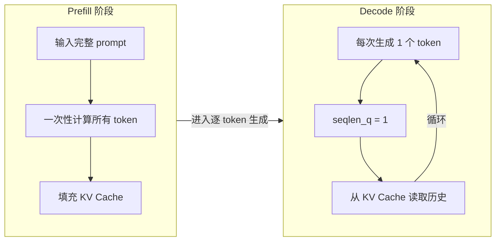
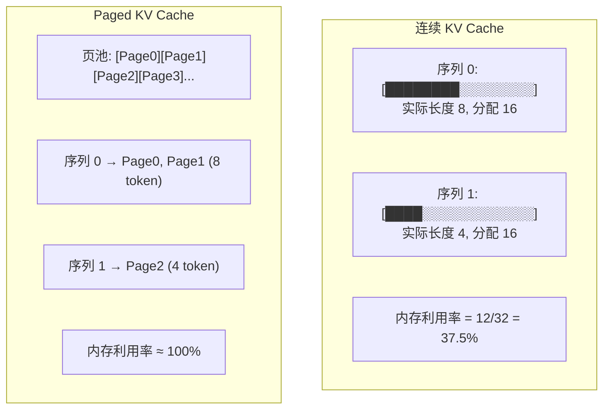
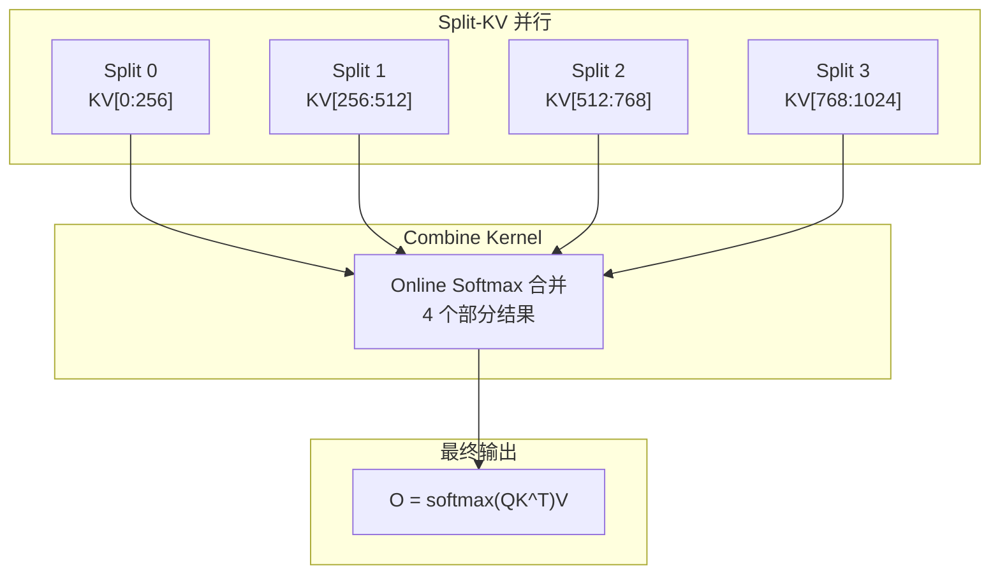

## 目录

- [1. 概述](#1-概述)
- [2. KV Cache 基础](#2-kv-cache-基础)
- [3. flash_attn_with_kvcache 详解](#3-flash_attn_with_kvcache-详解)
- [4. Paged KV Cache](#4-paged-kv-cache)
- [5. 自回归生成实现](#5-自回归生成实现)
- [6. Flash Decoding（Split-KV）](#6-flash-decodingsplit-kv)
- [7. FP8 推理](#7-fp8-推理)
- [8. 性能优化策略](#8-性能优化策略)

---

## 1. 概述

推理阶段的注意力计算与训练有显著不同。自回归生成分为两个阶段：



| 阶段 | seqlen_q | seqlen_k | 特点 | 瓶颈 |
|------|----------|----------|------|------|
| Prefill | 长（数百~数千） | 等于 seqlen_q | 计算密集 | Compute Bound |
| Decode | 1 | 递增（cache 长度） | 带宽密集 | Memory Bound |

Flash Attention 针对两个阶段提供不同的优化策略。

---

## 2. KV Cache 基础

### 2.1 什么是 KV Cache

自回归模型每生成一个 token，需要与之前所有 token 计算注意力。KV Cache 将之前计算的 K、V 缓存在 GPU 内存中，避免重复计算：

```python
# 不使用 KV Cache：每步重新计算所有 K、V
# 步骤 1: Q=[t1], K=[t1], V=[t1]           → 1×1 注意力
# 步骤 2: Q=[t1,t2], K=[t1,t2], V=[t1,t2]  → 2×2 注意力
# 步骤 3: Q=[t1,t2,t3], K=[...], V=[...]   → 3×3 注意力
# 总计算: 1+4+9 = O(N³)

# 使用 KV Cache：只计算新 token，复用历史
# 步骤 1: Q=[t1], K=cache[t1], V=cache[t1]          → 1×1
# 步骤 2: Q=[t2], K=cache[t1,t2], V=cache[t1,t2]    → 1×2
# 步骤 3: Q=[t3], K=cache[t1,t2,t3], V=cache[...]   → 1×3
# 总计算: 1+2+3 = O(N²)
```

### 2.2 预分配 Cache

使用 MHA 模块时，可以预分配 KV Cache：

```python
from flash_attn.modules.mha import MHA

mha = MHA(
    embed_dim=1024,
    num_heads=16,
    num_heads_kv=4,        # GQA
    layer_idx=0,           # 必须指定 layer_idx
    causal=True,
    use_flash_attn=True,
)

# 预分配 KV Cache
kv_cache = mha.allocate_inference_cache(
    batch_size=32,
    max_seqlen=2048,
    dtype=torch.float16,
)
# kv_cache 形状: (batch_size, max_seqlen, 2, num_heads_kv, head_dim)
```

---

## 3. flash_attn_with_kvcache 详解

### 3.1 基本用法

`flash_attn_with_kvcache` 是推理的核心 API，支持 KV Cache 的原地更新和注意力计算：

```python
from flash_attn import flash_attn_with_kvcache

batch_size = 4
max_seqlen_k = 2048
num_heads = 32
num_heads_kv = 8
head_dim = 128

# 预分配 KV Cache
k_cache = torch.zeros(batch_size, max_seqlen_k, num_heads_kv, head_dim,
                      device='cuda', dtype=torch.float16)
v_cache = torch.zeros(batch_size, max_seqlen_k, num_heads_kv, head_dim,
                      device='cuda', dtype=torch.float16)

# 当前序列长度（每个 batch 元素的已缓存长度）
cache_seqlens = torch.zeros(batch_size, dtype=torch.int32, device='cuda')
```

### 3.2 Prefill 阶段

```python
# Prefill: 处理完整 prompt
prompt_len = 512
q = torch.randn(batch_size, prompt_len, num_heads, head_dim,
               device='cuda', dtype=torch.float16)
k = torch.randn(batch_size, prompt_len, num_heads_kv, head_dim,
               device='cuda', dtype=torch.float16)
v = torch.randn(batch_size, prompt_len, num_heads_kv, head_dim,
               device='cuda', dtype=torch.float16)

out = flash_attn_with_kvcache(
    q,
    k_cache, v_cache,
    k=k, v=v,               # 新的 K/V 会被写入 cache
    cache_seqlens=cache_seqlens,  # 告诉内核当前 cache 长度
    causal=True,
)
# cache_seqlens 不会自动更新，需要手动更新
cache_seqlens += prompt_len
```

### 3.3 Decode 阶段

```python
# Decode: 每次生成一个 token
q_new = torch.randn(batch_size, 1, num_heads, head_dim,
                    device='cuda', dtype=torch.float16)
k_new = torch.randn(batch_size, 1, num_heads_kv, head_dim,
                    device='cuda', dtype=torch.float16)
v_new = torch.randn(batch_size, 1, num_heads_kv, head_dim,
                    device='cuda', dtype=torch.float16)

out = flash_attn_with_kvcache(
    q_new,
    k_cache, v_cache,
    k=k_new, v=v_new,
    cache_seqlens=cache_seqlens,
    causal=True,
)
cache_seqlens += 1
```

### 3.4 融合 Rotary Embedding

`flash_attn_with_kvcache` 支持在内核中直接应用 Rotary Embedding，避免额外的内存读写：

```python
from flash_attn.layers.rotary import RotaryEmbedding

rotary = RotaryEmbedding(dim=head_dim // 2)

# 获取 cos/sin 缓存
cos = rotary._cos_cached
sin = rotary._sin_cached

out = flash_attn_with_kvcache(
    q_new,
    k_cache, v_cache,
    k=k_new, v=v_new,
    rotary_cos=cos,
    rotary_sin=sin,
    cache_seqlens=cache_seqlens,
    rotary_interleaved=False,   # GPT-NeoX 风格
    causal=True,
)
```

融合 Rotary 的好处：
- 减少一次 Q 和 K 的全局内存读写
- 在写入 Cache 前完成旋转，Cache 中存储的是旋转后的 K/V

### 3.5 获取 Softmax LSE

```python
out, softmax_lse = flash_attn_with_kvcache(
    q_new, k_cache, v_cache,
    k=k_new, v=v_new,
    cache_seqlens=cache_seqlens,
    return_softmax_lse=True,
)
# softmax_lse: (batch_size, num_heads, seqlen_q)
```

---

## 4. Paged KV Cache

### 4.1 为什么需要 Paged KV Cache

连续 KV Cache 要求为每个序列预分配最大长度的内存。当 batch 中序列长度差异大时，造成大量浪费。Paged KV Cache（灵感来自操作系统的虚拟内存）将 Cache 分成固定大小的页，按需分配：



### 4.2 使用方式

```python
page_size = 256  # 每页的 token 数
max_num_pages = 1000  # 页池大小

# 创建页池（所有序列共享）
k_cache_paged = torch.zeros(max_num_pages, page_size, num_heads_kv, head_dim,
                           device='cuda', dtype=torch.float16)
v_cache_paged = torch.zeros(max_num_pages, page_size, num_heads_kv, head_dim,
                           device='cuda', dtype=torch.float16)

# 页表：每个序列映射到哪些页
max_blocks_per_seq = 16  # 每个序列最多使用的页数
block_table = torch.zeros(batch_size, max_blocks_per_seq, dtype=torch.int32, device='cuda')

# 分配页给序列
block_table[0] = torch.tensor([0, 1, 2, -1, ...])  # 序列 0 使用页 0, 1, 2
block_table[1] = torch.tensor([3, 4, -1, -1, ...])  # 序列 1 使用页 3, 4

out = flash_attn_with_kvcache(
    q, k_cache_paged, v_cache_paged,
    k=k_new, v=v_new,
    cache_seqlens=cache_seqlens,
    block_table=block_table,
    causal=True,
)
```

### 4.3 与 vLLM 集成

Paged KV Cache 的设计与 vLLM 的 PagedAttention 兼容。页大小（`page_block_size`）需要匹配。Flash Attention 内部使用 `PagedKVManager` 处理页表查找和间接寻址。

---

## 5. 自回归生成实现

### 5.1 完整生成循环

```python
import torch
from flash_attn import flash_attn_with_kvcache

def generate(model, prompt_ids, max_new_tokens, temperature=1.0):
    """简化的自回归生成循环"""
    batch_size = prompt_ids.shape[0]
    device = prompt_ids.device

    # 预分配 KV Cache（每一层）
    num_layers = len(model.layers)
    max_seqlen = prompt_ids.shape[1] + max_new_tokens
    kv_caches = [
        (
            torch.zeros(batch_size, max_seqlen, num_heads_kv, head_dim,
                       device=device, dtype=torch.float16),
            torch.zeros(batch_size, max_seqlen, num_heads_kv, head_dim,
                       device=device, dtype=torch.float16),
        )
        for _ in range(num_layers)
    ]
    cache_seqlens = torch.zeros(batch_size, dtype=torch.int32, device=device)

    # === Prefill 阶段 ===
    prompt_embeds = model.embed(prompt_ids)
    hidden = prompt_embeds
    for layer_idx, layer in enumerate(model.layers):
        q, k, v = layer.qkv_proj(hidden)
        k_cache, v_cache = kv_caches[layer_idx]
        attn_out = flash_attn_with_kvcache(
            q, k_cache, v_cache,
            k=k, v=v,
            cache_seqlens=cache_seqlens,
            causal=True,
        )
        hidden = layer.ffn(layer.norm(attn_out + hidden))

    cache_seqlens += prompt_ids.shape[1]
    logits = model.lm_head(hidden[:, -1:, :])
    next_token = torch.argmax(logits / temperature, dim=-1)
    generated = [next_token]

    # === Decode 阶段 ===
    for step in range(max_new_tokens - 1):
        hidden = model.embed(next_token)
        for layer_idx, layer in enumerate(model.layers):
            q, k, v = layer.qkv_proj(hidden)
            k_cache, v_cache = kv_caches[layer_idx]
            attn_out = flash_attn_with_kvcache(
                q, k_cache, v_cache,
                k=k, v=v,
                cache_seqlens=cache_seqlens,
                causal=True,
            )
            hidden = layer.ffn(layer.norm(attn_out + hidden))

        cache_seqlens += 1
        logits = model.lm_head(hidden)
        next_token = torch.argmax(logits / temperature, dim=-1)
        generated.append(next_token)

    return torch.cat(generated, dim=1)
```

### 5.2 使用 cache_batch_idx

当 batch 中某些序列已完成生成时，可以使用 `cache_batch_idx` 跳过它们：

```python
# 只处理 batch 中的部分序列
active_indices = torch.tensor([0, 2, 5], dtype=torch.int32, device='cuda')

out = flash_attn_with_kvcache(
    q_active,              # 只包含活跃序列的 Q
    k_cache, v_cache,      # 完整 cache
    k=k_new, v=v_new,
    cache_seqlens=cache_seqlens,
    cache_batch_idx=active_indices,  # 映射到 cache 中的位置
    causal=True,
)
```

### 5.3 Left Padding 支持

```python
# 当 cache 的有效数据不从位置 0 开始时
cache_leftpad = torch.tensor([0, 100, 50, 0], dtype=torch.int32, device='cuda')

out = flash_attn_with_kvcache(
    q, k_cache, v_cache,
    cache_seqlens=cache_seqlens,
    cache_leftpad=cache_leftpad,  # 跳过每个序列开头的空白
    causal=True,
)
```

---

## 6. Flash Decoding（Split-KV）

### 6.1 原理

Decode 阶段（seqlen_q=1）的计算量小，单个 Thread Block 无法充分利用 GPU。Flash Decoding 将 KV 序列分成多个 split，每个 split 由独立的 Thread Block 并行处理，然后合并结果：



### 6.2 使用方式

```python
# 自动决策 split 数（推荐）
out = flash_attn_with_kvcache(
    q, k_cache, v_cache,
    cache_seqlens=cache_seqlens,
    num_splits=0,       # 0 = 自动，基于启发式决策
    causal=True,
)

# 手动指定 split 数
out = flash_attn_with_kvcache(
    q, k_cache, v_cache,
    cache_seqlens=cache_seqlens,
    num_splits=4,       # 4 个 split
    causal=True,
)

# 禁用 split（不推荐，除非确认单 block 已饱和）
out = flash_attn_with_kvcache(
    q, k_cache, v_cache,
    cache_seqlens=cache_seqlens,
    num_splits=1,
    causal=True,
)
```

### 6.3 自动决策逻辑

Flash Attention 的 `num_splits_heuristic`（`hopper/heuristics.h`）考虑：

1. **SM 占用率**：如果 batch × heads 已经接近 SM 数量的 80%，不 split
2. **L2 Cache**：如果单个 KV head 的数据超过 L2 缓存（~50MB），进行 split
3. **最优效率**：找到使 SM 利用率最高的 split 数
4. **最小 split**：在效率达到最优的 85% 以上时，选择最小的 split 数

---

## 7. FP8 推理

### 7.1 基本用法

```python
# FP8 推理（仅限 H100/H200）
q_fp8 = q.to(torch.float8_e4m3fn)
k_fp8 = k.to(torch.float8_e4m3fn)
v_fp8 = v.to(torch.float8_e4m3fn)

# Per-head 缩放因子
q_descale = torch.ones(batch_size, num_heads_kv, device='cuda', dtype=torch.float32)
k_descale = torch.ones(batch_size, num_heads_kv, device='cuda', dtype=torch.float32)
v_descale = torch.ones(batch_size, num_heads_kv, device='cuda', dtype=torch.float32)

out = flash_attn_func(
    q_fp8, k_fp8, v_fp8,
    causal=True,
    q_descale=q_descale,
    k_descale=k_descale,
    v_descale=v_descale,
)
# out.dtype == torch.bfloat16（FP8 输出固定为 BF16）
```

### 7.2 FP8 KV Cache

FP8 KV Cache 可以将缓存大小减半，适合长序列推理：

```python
k_cache_fp8 = torch.zeros(batch_size, max_seqlen, num_heads_kv, head_dim,
                          device='cuda', dtype=torch.float8_e4m3fn)
v_cache_fp8 = torch.zeros(batch_size, max_seqlen, num_heads_kv, head_dim,
                          device='cuda', dtype=torch.float8_e4m3fn)
```

> 详见 [FP8 支持](../06-advanced-features/04-fp8-support.md)

---

## 8. 性能优化策略

### 8.1 Prefill vs Decode 优化

| 策略 | Prefill | Decode |
|------|---------|--------|
| Split-KV | 通常不需要 | 推荐 |
| PackGQA | 取决于序列长度 | 推荐 |
| FP8 | 可选（减少带宽） | 推荐（带宽瓶颈） |
| Paged KV | 可选 | 推荐（长序列） |

### 8.2 批量大小与 Split 平衡

Decode 阶段的关键是平衡 batch 大小和 split 数：

```
总 Thread Blocks = batch_size × num_heads_kv × num_splits

目标：总 Blocks ≈ GPU SM 数量 × 2~4

例如 H100 (132 SMs):
  batch=1, heads=8:  8 blocks → 需要 ~16 splits
  batch=32, heads=8: 256 blocks → num_splits=1 即可
  batch=4, heads=32: 128 blocks → num_splits=1~2
```

### 8.3 内存带宽优化

Decode 阶段是 memory-bound，优化重点在减少内存访问：

1. **GQA/MQA**：减少 KV Cache 的读取量
2. **FP8 KV Cache**：数据量减半
3. **Paged KV Cache**：避免无效内存分配
4. **融合 Rotary**：减少一次 Q/K 的读写
5. **PackGQA**：减少内核启动数

### 8.4 延迟优化清单

```python
# 1. 使用 flash_attn_with_kvcache（避免 Python 开销）
out = flash_attn_with_kvcache(q, k_cache, v_cache, ...)

# 2. 使用 CUDA Graph 消除 CPU 开销
with torch.cuda.graph(graph):
    out = flash_attn_with_kvcache(q, k_cache, v_cache, ...)

# 3. 预热 CUDA 内核（避免首次调用延迟）
for _ in range(3):
    _ = flash_attn_with_kvcache(q_dummy, k_cache, v_cache, ...)
torch.cuda.synchronize()
```

---

## 导航

- 上一篇：[训练集成](02-training-integration.md)
- 下一篇：[性能测试](04-benchmarking.md)
- [返回目录](../README.md)
