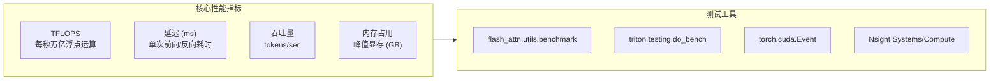
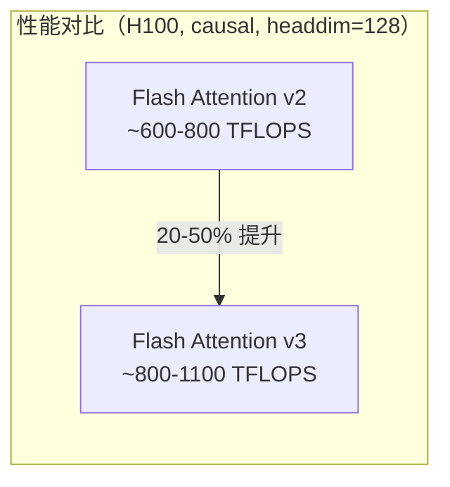
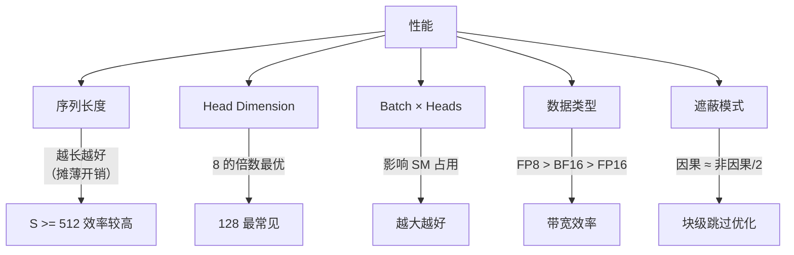

## 目录

- [1. 概述](#1-概述)
- [2. FLOPS 计算方法](#2-flops-计算方法)
- [3. 基础 Benchmark](#3-基础-benchmark)
- [4. 使用 benchmark_attn.py](#4-使用-benchmark_attnpy)
- [5. 自定义 Benchmark](#5-自定义-benchmark)
- [6. 性能分析工具](#6-性能分析工具)
- [7. 性能参考数据](#7-性能参考数据)
- [8. 性能调优指南](#8-性能调优指南)

---

## 1. 概述

性能测试是验证 Flash Attention 集成效果的关键步骤。本章介绍如何正确测量 Flash Attention 的吞吐量、延迟，以及如何与其他实现进行对比。



---

## 2. FLOPS 计算方法

### 2.1 注意力计算的 FLOPS

Flash Attention 的计算量由两个 GEMM 决定：

$$\text{FLOPs} = 2 \times B \times H \times S_q \times \bar{S}_k \times (d + d_v)$$

其中：
- $B$ = batch size
- $H$ = num_heads
- $S_q$ = query 序列长度
- $\bar{S}_k$ = 有效的 key 序列长度（考虑因果和窗口遮蔽后的平均值）
- $d$ = head_dim（QK 的维度）
- $d_v$ = head_dim_v（V 的维度，通常等于 $d$）
- 乘以 2 是因为矩阵乘法中每个元素需要一次乘法和一次加法

### 2.2 因果遮蔽的有效序列长度

因果遮蔽下，注意力矩阵是下三角，平均有效长度为：

$$\bar{S}_k = \frac{\max(0, S_k - S_q) + S_k}{2}$$

当 $S_q = S_k$ 时，$\bar{S}_k = S_k / 2$，即因果注意力的计算量约为全注意力的一半。

### 2.3 FLOPS 计算函数

```python
def flops(batch, nheads, seqlen_q, seqlen_k, headdim, headdim_v=None,
          causal=False, window_size=(-1, -1)):
    """计算注意力操作的浮点运算次数"""
    if headdim_v is None:
        headdim_v = headdim
    if causal:
        # 因果：下三角平均
        avg_seqlen = (max(0, seqlen_k - seqlen_q) + seqlen_k) / 2
    else:
        if window_size == (-1, -1):
            avg_seqlen = seqlen_k
        else:
            # 滑动窗口：计算每行的有效范围
            import torch
            row_idx = torch.arange(seqlen_q)
            col_left = torch.maximum(
                row_idx + seqlen_k - seqlen_q - window_size[0],
                torch.tensor(0)
            )
            col_right = torch.minimum(
                row_idx + seqlen_k - seqlen_q + window_size[1],
                torch.tensor(seqlen_k - 1)
            )
            avg_seqlen = (col_right - col_left + 1).float().mean().item()
    return batch * nheads * 2 * seqlen_q * avg_seqlen * (headdim + headdim_v)
```

### 2.4 TFLOPS 计算

```python
# 时间（秒）→ TFLOPS
tflops = flops_count / (time_seconds * 1e12)

# 示例：batch=8, heads=32, seqlen=2048, headdim=128, causal
f = flops(8, 32, 2048, 2048, 128, causal=True)
# f = 8 × 32 × 2 × 2048 × 1024 × 256 = 274,877,906,944
# 如果耗时 0.5ms: TFLOPS = 274.9e9 / (0.5e-3 × 1e12) = 549.8 TFLOPS
```

---

## 3. 基础 Benchmark

### 3.1 使用 benchmark 工具函数

Flash Attention 提供了便捷的 benchmark 工具：

```python
from flash_attn.utils.benchmark import (
    benchmark_forward,
    benchmark_backward,
    benchmark_combined,
    benchmark_all,
)
from flash_attn import flash_attn_func
import torch

# 创建测试数据
batch, seqlen, nheads, headdim = 8, 2048, 32, 128
q = torch.randn(batch, seqlen, nheads, headdim, device='cuda', dtype=torch.bfloat16)
k = torch.randn(batch, seqlen, nheads, headdim, device='cuda', dtype=torch.bfloat16)
v = torch.randn(batch, seqlen, nheads, headdim, device='cuda', dtype=torch.bfloat16)

# 前向 benchmark
out, time_fwd = benchmark_forward(
    flash_attn_func, q, k, v,
    causal=True,
    repeats=30,
    verbose=True,
    desc='Flash Attention Forward'
)
# 输出: Flash Attention Forward: 0.45 ms

# 反向 benchmark
_, time_bwd = benchmark_backward(
    flash_attn_func, q, k, v,
    causal=True,
    repeats=30,
    verbose=True,
    desc='Flash Attention Backward'
)

# 前向 + 反向
_, time_combined = benchmark_combined(
    flash_attn_func, q, k, v,
    causal=True,
    repeats=30,
    verbose=True,
    desc='Flash Attention Fwd+Bwd'
)
```

### 3.2 使用 Triton do_bench

更底层的计时工具，精确控制 warmup 和重复次数：

```python
from triton.testing import do_bench

# 返回毫秒级时间
time_ms = do_bench(
    lambda: flash_attn_func(q, k, v, causal=True),
    warmup=3,     # 预热次数
    rep=30,       # 测量次数
)
print(f"前向延迟: {time_ms:.3f} ms")

# 计算 TFLOPS
f = flops(batch, nheads, seqlen, seqlen, headdim, causal=True)
tflops = f / (time_ms * 1e-3 * 1e12)
print(f"吞吐量: {tflops:.1f} TFLOPS")
```

### 3.3 使用 CUDA Events（手动计时）

```python
# 最基础的 CUDA 计时
start = torch.cuda.Event(enable_timing=True)
end = torch.cuda.Event(enable_timing=True)

# Warmup
for _ in range(5):
    _ = flash_attn_func(q, k, v, causal=True)
torch.cuda.synchronize()

# 测量
start.record()
for _ in range(100):
    _ = flash_attn_func(q, k, v, causal=True)
end.record()
torch.cuda.synchronize()

avg_ms = start.elapsed_time(end) / 100
print(f"平均延迟: {avg_ms:.3f} ms")
```

---

## 4. 使用 benchmark_attn.py

### 4.1 基本运行

Flash Attention 仓库提供了完整的 benchmark 脚本：

```bash
cd hopper
python benchmark_attn.py
```

### 4.2 脚本结构

`hopper/benchmark_attn.py` 对比多个实现的性能：

| 实现 | 说明 |
|------|------|
| Flash2 | Flash Attention v2（通过 `flash_attn.flash_attn_interface`） |
| Flash3 | Flash Attention v3（通过 `flash_attn_interface`，Hopper 优化） |
| cuDNN | NVIDIA cuDNN SDPA |
| Triton | Triton Fused Attention |

### 4.3 测试参数配置

```python
# hopper/benchmark_attn.py（关键参数）
repeats = 30                    # 每次测试重复 30 次
dropout_p = 0.0                 # 通常测试无 dropout
dtype = torch.bfloat16          # 数据类型

# 遍历的参数空间
for headdim in [64, 128, 256]:
    for batch_size, seqlen in [(8, 2048), (4, 4096), (2, 8192)]:
        for causal in [False, True]:
            # 运行 benchmark
            ...
```

### 4.4 结果输出格式

```
### headdim = 128, causal = True, seqlen = 2048 ###
Fav2:  0.452 ms    → 610.2 TFLOPS
Fav3:  0.318 ms    → 867.3 TFLOPS
cuDNN: 0.425 ms    → 649.1 TFLOPS
```

---

## 5. 自定义 Benchmark

### 5.1 训练场景测试

```python
import torch
from flash_attn import flash_attn_func
from flash_attn.utils.benchmark import benchmark_forward, benchmark_backward

def benchmark_training(batch, seqlen, nheads, headdim, causal=True, dtype=torch.bfloat16):
    """测量训练场景的完整性能"""
    q = torch.randn(batch, seqlen, nheads, headdim, device='cuda',
                   dtype=dtype, requires_grad=True)
    k = torch.randn(batch, seqlen, nheads, headdim, device='cuda',
                   dtype=dtype, requires_grad=True)
    v = torch.randn(batch, seqlen, nheads, headdim, device='cuda',
                   dtype=dtype, requires_grad=True)

    f = flops(batch, nheads, seqlen, seqlen, headdim, causal=causal)

    # 前向
    _, time_fwd = benchmark_forward(flash_attn_func, q, k, v, causal=causal,
                                    repeats=30, verbose=False)

    # 反向
    _, time_bwd = benchmark_backward(flash_attn_func, q, k, v, causal=causal,
                                     repeats=30, verbose=False)

    fwd_tflops = f / (time_fwd.mean * 1e12)
    bwd_tflops = f * 2.5 / (time_bwd.mean * 1e12)  # 反向约 2.5× 前向计算量

    print(f"Config: B={batch}, S={seqlen}, H={nheads}, D={headdim}, causal={causal}")
    print(f"  前向: {time_fwd.mean*1e3:.3f} ms  ({fwd_tflops:.1f} TFLOPS)")
    print(f"  反向: {time_bwd.mean*1e3:.3f} ms  ({bwd_tflops:.1f} TFLOPS)")
    print(f"  总计: {(time_fwd.mean + time_bwd.mean)*1e3:.3f} ms")

# 运行测试
configs = [
    (8, 2048, 32, 128),   # 标准 7B 模型配置
    (4, 4096, 32, 128),   # 长序列
    (2, 8192, 32, 128),   # 超长序列
    (16, 1024, 16, 64),   # 小模型大 batch
]

for batch, seqlen, nheads, headdim in configs:
    benchmark_training(batch, seqlen, nheads, headdim)
    print()
```

### 5.2 推理延迟测试

```python
from flash_attn import flash_attn_with_kvcache
from triton.testing import do_bench

def benchmark_decode(batch, seqlen_k, nheads, nheads_kv, headdim,
                     num_splits=0, dtype=torch.float16):
    """测量 decode 阶段的推理延迟"""
    q = torch.randn(batch, 1, nheads, headdim, device='cuda', dtype=dtype)
    k_cache = torch.randn(batch, seqlen_k, nheads_kv, headdim, device='cuda', dtype=dtype)
    v_cache = torch.randn(batch, seqlen_k, nheads_kv, headdim, device='cuda', dtype=dtype)
    cache_seqlens = torch.full((batch,), seqlen_k, dtype=torch.int32, device='cuda')

    time_ms = do_bench(
        lambda: flash_attn_with_kvcache(
            q, k_cache, v_cache,
            cache_seqlens=cache_seqlens,
            num_splits=num_splits,
            causal=True,
        ),
        warmup=5, rep=50,
    )

    # Decode 的带宽利用率
    kv_bytes = batch * seqlen_k * nheads_kv * headdim * 2 * dtype.itemsize  # K + V
    bandwidth_gb = kv_bytes / (time_ms * 1e-3) / 1e9

    print(f"Decode: B={batch}, S_k={seqlen_k}, H_q={nheads}, H_kv={nheads_kv}, D={headdim}")
    print(f"  延迟: {time_ms:.3f} ms")
    print(f"  KV 带宽: {bandwidth_gb:.1f} GB/s")
    print(f"  num_splits: {num_splits}")

# GQA decode 测试
benchmark_decode(batch=1, seqlen_k=4096, nheads=32, nheads_kv=8, headdim=128)
benchmark_decode(batch=32, seqlen_k=4096, nheads=32, nheads_kv=8, headdim=128)
benchmark_decode(batch=1, seqlen_k=32768, nheads=32, nheads_kv=8, headdim=128)
```

### 5.3 内存占用测试

```python
def benchmark_memory(batch, seqlen, nheads, headdim, causal=True):
    """测量峰值显存占用"""
    torch.cuda.reset_peak_memory_stats()
    torch.cuda.empty_cache()

    q = torch.randn(batch, seqlen, nheads, headdim, device='cuda',
                   dtype=torch.bfloat16, requires_grad=True)
    k = torch.randn_like(q)
    v = torch.randn_like(q)

    mem_before = torch.cuda.max_memory_allocated() / 1e9

    out = flash_attn_func(q, k, v, causal=causal)
    out.sum().backward()

    mem_after = torch.cuda.max_memory_allocated() / 1e9

    # 对比标准注意力的理论内存
    # 标准注意力需要存储完整的 N×N 注意力矩阵
    attn_matrix_gb = batch * nheads * seqlen * seqlen * 2 / 1e9  # FP16

    print(f"Config: B={batch}, S={seqlen}, H={nheads}, D={headdim}")
    print(f"  Flash Attention 峰值显存: {mem_after:.2f} GB")
    print(f"  标准注意力矩阵大小: {attn_matrix_gb:.2f} GB")
    print(f"  节省: {attn_matrix_gb / (mem_after - mem_before + 0.01):.1f}×")

benchmark_memory(4, 4096, 32, 128)
benchmark_memory(2, 16384, 32, 128)
```

---

## 6. 性能分析工具

### 6.1 Nsight Systems

```python
# 使用 PyTorch Profiler 收集 Nsight Systems 数据
from flash_attn.utils.benchmark import pytorch_profiler

pytorch_profiler(flash_attn_func, q, k, v, causal=True, backward=True)
# 生成 .json 文件，可在 Nsight Systems 中打开
```

命令行方式：

```bash
nsys profile --trace=cuda,cudnn,nvtx python my_benchmark.py
nsys-ui report.qdrep  # 可视化
```

### 6.2 Nsight Compute

针对单个 CUDA 内核的详细分析：

```bash
# 分析 Flash Attention 前向内核
ncu --set full \
    --target-processes all \
    --launch-count 1 \
    python my_benchmark.py
```

关注的指标：
- **Compute (SM) Throughput**：计算单元利用率
- **Memory Throughput**：内存带宽利用率
- **Achieved Occupancy**：SM 占用率
- **Warp Stall Reasons**：Warp 停顿原因

### 6.3 PyTorch Profiler

```python
with torch.profiler.profile(
    activities=[
        torch.profiler.ProfilerActivity.CPU,
        torch.profiler.ProfilerActivity.CUDA,
    ],
    record_shapes=True,
    with_stack=True,
) as prof:
    for _ in range(10):
        out = flash_attn_func(q, k, v, causal=True)
        torch.cuda.synchronize()

print(prof.key_averages().table(sort_by="cuda_time_total", row_limit=10))
```

---

## 7. 性能参考数据

### 7.1 H100 SXM 参考吞吐量

以下数据基于 H100 SXM 80GB，BF16，`headdim=128`：

| 场景 | 配置 | 前向 TFLOPS | 前向+反向 TFLOPS |
|------|------|------------|----------------|
| 训练 | B=8, S=2048, H=32, causal | ~800-900 | ~600-700 |
| 训练 | B=4, S=4096, H=32, causal | ~850-950 | ~650-750 |
| 训练 | B=2, S=8192, H=32, causal | ~900-1000 | ~700-800 |
| 训练 | B=8, S=2048, H=32, non-causal | ~900-1000 | ~700-800 |

> **注意**：实际性能取决于具体硬件配置、CUDA 版本、driver 版本和散热条件。以上为近似参考值。

### 7.2 Flash Attention v2 vs v3

Flash Attention v3 针对 Hopper 架构优化，相比 v2 通常有 20-50% 的性能提升：



### 7.3 与标准注意力对比

| 序列长度 | 标准注意力 | Flash Attention | 加速比 |
|---------|-----------|----------------|--------|
| 512 | ~2 ms | ~0.3 ms | ~6.7× |
| 2048 | ~30 ms | ~0.8 ms | ~37.5× |
| 8192 | ~500 ms | ~5 ms | ~100× |
| 32768 | OOM | ~60 ms | - |

---

## 8. 性能调优指南

### 8.1 影响性能的关键因素



### 8.2 序列长度

Flash Attention 在长序列上优势更明显。短序列（< 256）时，内核启动开销占比较高，优势不明显。

### 8.3 Head Dimension

- **最优**：64, 128（匹配 GMMA 指令宽度）
- **良好**：96, 192, 256（内部对齐处理）
- **次优**：非 8 倍数（需要 padding，浪费计算）

### 8.4 Batch 与 Heads

增加 batch size 或 heads 可以提高 SM 利用率。当 `batch × heads < SM 数量` 时，GPU 未被充分利用。此时可以：

1. 增大 batch size
2. 使用 Split-KV（推理场景）
3. 使用 PackGQA（GQA 场景）

### 8.5 Decode 场景优化

Decode 场景（seqlen_q=1）的优化重点：

1. **Split-KV**：`num_splits=0`（自动决策）
2. **PackGQA**：`pack_gqa=True`（GQA 时）
3. **FP8 KV Cache**：减少带宽需求
4. **Paged KV Cache**：提高内存利用率
5. **CUDA Graph**：消除 CPU 开销

```python
# Decode 优化完整示例
out = flash_attn_with_kvcache(
    q,                       # (batch, 1, nheads, headdim)
    k_cache, v_cache,
    cache_seqlens=cache_seqlens,
    causal=True,
    num_splits=0,            # 自动 Split-KV
    # pack_gqa=True,         # GQA 时启用
)
```

---

## 导航

- 上一篇：[推理优化](03-inference-optimization.md)
- 下一篇：[术语表](../08-appendix/01-glossary.md)
- [返回目录](../README.md)
