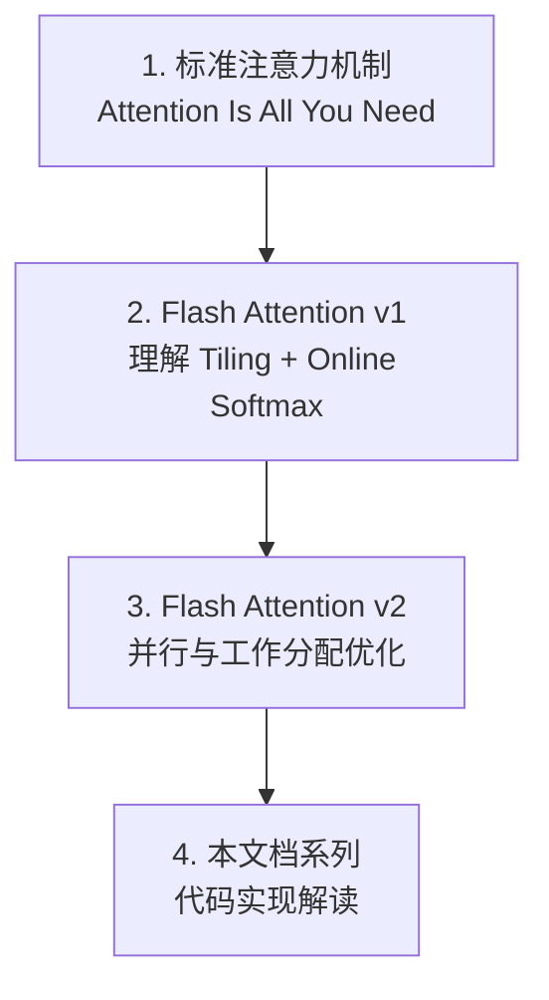
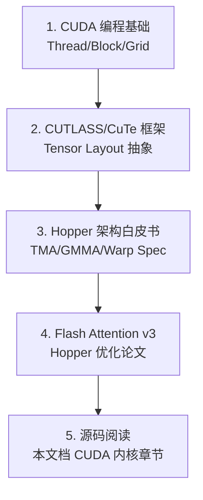

## 目录

- [1. 核心论文](#1-核心论文)
- [2. 前置知识论文](#2-前置知识论文)
- [3. 相关优化论文](#3-相关优化论文)
- [4. 应用论文](#4-应用论文)
- [5. 推荐阅读路线](#5-推荐阅读路线)

---

## 1. 核心论文

### 1.1 FlashAttention: Fast and Memory-Efficient Exact Attention with IO-Awareness

**作者**：Tri Dao, Daniel Y. Fu, Stefano Ermon, Atri Rudra, Christopher Ré
**会议**：NeurIPS 2022
**链接**：https://arxiv.org/abs/2205.14135

**核心贡献**：
- 提出 IO-Aware 的注意力算法，将内存复杂度从 $O(N^2)$ 降至 $O(N)$
- 引入 Tiling + Online Softmax 的融合计算方案
- 提供完整的 CUDA 实现和 IO 复杂度分析

**重点章节**：
| 章节 | 内容 | 对应代码 |
|------|------|---------|
| §2 | 标准注意力的 IO 瓶颈分析 | - |
| §3.1 | Tiling 策略与 Online Softmax | `hopper/softmax.h` |
| §3.2 | 反向传播的重计算策略 | `hopper/flash_bwd_kernel_sm90.h` |
| §3.3 | IO 复杂度证明 | - |
| §4 | 扩展（块稀疏注意力） | - |

**阅读建议**：重点理解 Algorithm 1（前向）和 Algorithm 2（反向），以及 Theorem 1 的 IO 复杂度证明。这是整个 Flash Attention 系列的理论基础。

---

### 1.2 FlashAttention-2: Faster Attention with Better Parallelism and Work Partitioning

**作者**：Tri Dao
**会议**：ICLR 2024
**链接**：https://arxiv.org/abs/2307.08691

**核心贡献**：
- 优化并行策略：将 Softmax rescale 从 $O(d)$ 降至 $O(1)$
- 改进工作分配：前向用 Q-outer 循环，反向用 KV-outer 循环
- 支持 GQA/MQA
- 实际性能提升约 2×

**重点章节**：
| 章节 | 内容 | 对应代码 |
|------|------|---------|
| §3.1 | 减少非矩阵乘法 FLOPs | `hopper/softmax.h` |
| §3.2 | 前向传递并行化（Q-outer 循环） | `hopper/mainloop_fwd_sm90_tma_gmma_ws.hpp` |
| §3.3 | 反向传递并行化（KV-outer 循环） | `hopper/mainloop_bwd_sm90_tma_gmma_ws.hpp` |
| §4 | 工作分区：Warp 间与 Warp 内 | - |

**阅读建议**：对比 FA1 和 FA2 的 Algorithm，理解 rescale 优化。FA2 的实现更接近当前代码库。

---

### 1.3 FlashAttention-3: Fast and Accurate Attention with Asynchrony and Low-precision

**作者**：Jay Shah, Ganesh Bikshandi, Ying Zhang, Vijay Thakkar, Pradeep Ramani, Tri Dao
**会议**：NeurIPS 2024
**链接**：https://arxiv.org/abs/2407.08691

**核心贡献**：
- 利用 Hopper 架构特性：TMA、GMMA、Warp Specialization
- 异步 Pipeline：Producer-Consumer 分离
- FP8 支持及 Max_offset 精度优化
- IntraWGOverlap：GEMM 间重叠执行

**重点章节**：
| 章节 | 内容 | 对应代码 |
|------|------|---------|
| §3.1 | Warp Specialization（Producer-Consumer） | `hopper/flash_fwd_kernel_sm90.h` |
| §3.2 | 异步 GMMA Pipeline | `hopper/mainloop_fwd_sm90_tma_gmma_ws.hpp` |
| §3.3 | FP8 低精度支持 | `hopper/softmax.h`（Max_offset） |
| §3.4 | IntraWGOverlap 优化 | `hopper/mainloop_fwd_sm90_tma_gmma_ws.hpp` |
| §4 | 性能评估与消融实验 | - |

**阅读建议**：这是当前代码库（v2.8.3）的主要实现论文。理解 Producer-Consumer 模型是理解 SM90 内核的关键。

---

## 2. 前置知识论文

### 2.1 Online Softmax

**论文**：Online normalizer calculation for softmax
**作者**：Maxim Milakov, Natalia Gimelshein
**链接**：https://arxiv.org/abs/1805.02867

**与 Flash Attention 的关系**：Flash Attention 的 Online Softmax 直接基于此工作。论文提出了在单次遍历中同时计算 max 和 sum 的算法，是 Tiling 策略的数学基础。

**核心公式**：

$$m_j = \max(m_{j-1}, x_j), \quad d_j = d_{j-1} \cdot e^{m_{j-1} - m_j} + e^{x_j - m_j}$$

> 详见 [Online Softmax 深度解析](../02-core-algorithm/01-online-softmax.md)

### 2.2 Self-Attention Does Not Need $O(n^2)$ Memory

**论文**：Self-attention Does Not Need $O(n^2)$ Memory
**作者**：Markus N. Rabe, Charles Staats
**链接**：https://arxiv.org/abs/2112.05682

**贡献**：在数学上证明了注意力可以用 $O(\log n)$ 辅助内存计算。Flash Attention 的实现直接受此启发，将内存复杂度降至 $O(N)$。

### 2.3 NVIDIA Hopper 架构

**文档**：NVIDIA H100 Tensor Core GPU Architecture Whitepaper
**链接**：NVIDIA 官方文档

**关键概念**：
- Thread Block Cluster
- Tensor Memory Accelerator (TMA)
- Warp Group MMA (GMMA)
- 异步 Pipeline

---

## 3. 相关优化论文

### 3.1 Flash-Decoding

**论文**：Flash-Decoding for long-context inference
**作者**：Tri Dao et al.
**链接**：https://crfm.stanford.edu/2023/10/12/flashdecoding.html

**核心思想**：将 KV 序列在 sequence 维度上分 split 并行计算，通过额外的 Combine Kernel 合并结果。解决 Decode 阶段（seqlen_q=1）GPU 利用率低的问题。

**对应代码**：
- 启发式决策：`hopper/heuristics.h`（`num_splits_heuristic`）
- 合并内核：`hopper/flash_fwd_combine_kernel.h`

### 3.2 GQA (Grouped-Query Attention)

**论文**：GQA: Training Generalized Multi-Query Transformer Models from Multi-Head Checkpoints
**作者**：Joshua Ainslie et al.
**会议**：EMNLP 2023
**链接**：https://arxiv.org/abs/2305.13245

**与 Flash Attention 的关系**：Flash Attention 原生支持 GQA，通过 PackGQA 优化（`hopper/pack_gqa.h`）进一步提升 GQA 推理性能。

### 3.3 Paged Attention

**论文**：Efficient Memory Management for Large Language Model Serving with PagedAttention
**作者**：Woosuk Kwon et al.
**会议**：SOSP 2023
**链接**：https://arxiv.org/abs/2309.06180

**核心贡献**：将操作系统的虚拟内存概念引入 KV Cache 管理。Flash Attention 通过 `PagedKVManager`（`hopper/paged_kv.h`）支持 Paged KV Cache。

### 3.4 Rotary Position Embedding (RoPE)

**论文**：RoFormer: Enhanced Transformer with Rotary Position Embedding
**作者**：Jianlin Su et al.
**链接**：https://arxiv.org/abs/2104.09864

**与 Flash Attention 的关系**：Flash Attention 内置 Rotary Embedding 支持（`flash_attn/layers/rotary.py`），并在 `flash_attn_with_kvcache` 中支持融合应用。

### 3.5 Sliding Window Attention

**论文**：Longformer: The Long-Document Transformer
**作者**：Iz Beltagy, Matthew E. Peters, Arman Cohan
**链接**：https://arxiv.org/abs/2004.05150

**与 Flash Attention 的关系**：Flash Attention 通过 `window_size` 参数支持滑动窗口，结合块级跳过优化实现 $O(NW)$ 复杂度。Mistral 等模型使用此特性。

### 3.6 Softcapping

**论文**：Gemma 2: Improving Open Language Models at a Practical Size
**作者**：Google
**链接**：https://arxiv.org/abs/2408.00118

**与 Flash Attention 的关系**：Flash Attention 通过 `softcap` 参数支持 $\text{softcap} \cdot \tanh(S/\text{softcap})$ 分数截断。

---

## 4. 应用论文

### 4.1 使用 Flash Attention 的模型

以下模型在其实现中使用了 Flash Attention：

| 模型 | 使用的特性 | 论文 |
|------|----------|------|
| LLaMA-2/3 | GQA + Flash Attention | Meta, 2023/2024 |
| Mistral 7B | 滑动窗口 + GQA | Mistral AI, 2023 |
| Gemma 2 | Softcap + 交替窗口/全局 | Google, 2024 |
| Falcon | MQA + Flash Attention | TII, 2023 |
| MPT | ALiBi + Flash Attention | MosaicML, 2023 |
| GPT-NeoX | Rotary + Flash Attention | EleutherAI, 2023 |

### 4.2 推理框架集成

| 框架 | 集成方式 |
|------|---------|
| vLLM | Paged Attention + Flash Attention kernel |
| TensorRT-LLM | 内置 Flash Attention |
| text-generation-inference | Flash Attention backend |
| SGLang | Flash Attention + RadixAttention |

---

## 5. 推荐阅读路线

### 5.1 入门路线

适合刚接触 Flash Attention 的读者：

1. **Attention Is All You Need**（Vaswani et al., 2017）— 理解基础注意力机制
2. **Online Softmax**（Milakov & Gimelshein, 2018）— 理解在线归一化
3. **Flash Attention v1** — 核心算法
4. **Flash Attention v2** — 工程优化
5. 本文档系列 — 代码级理解

### 5.2 进阶路线

适合需要修改或扩展 Flash Attention 的开发者：

1. **CUDA C Programming Guide** — 基础并行编程
2. **CUTLASS 文档** — 理解 Layout、TiledCopy、TiledMma
3. **H100 Architecture Whitepaper** — 硬件特性
4. **Flash Attention v3 论文** — Hopper 优化策略
5. 本文档 [GPU 编程基础](../03-cuda-kernel/01-gpu-programming-basics.md) 和 [SM90 内核架构](../03-cuda-kernel/02-kernel-architecture-sm90.md)

### 5.3 推理优化路线

适合关注推理性能的工程师：

1. **Flash-Decoding** — Split-KV 策略
2. **GQA 论文** — 减少 KV Cache
3. **Paged Attention** — 内存管理
4. **FP8 量化相关文献** — 低精度推理
5. 本文档 [推理优化](../07-usage-tutorial/03-inference-optimization.md) 和 [KV Cache](../06-advanced-features/02-kv-cache-inference.md)

### 5.4 论文与代码对照表

| 论文中的概念 | 代码位置 | 本文档章节 |
|-------------|---------|-----------|
| Algorithm 1 (前向) | `hopper/mainloop_fwd_sm90_tma_gmma_ws.hpp` | [前向传递](../02-core-algorithm/03-forward-pass.md) |
| Algorithm 2 (反向) | `hopper/mainloop_bwd_sm90_tma_gmma_ws.hpp` | [反向传递](../02-core-algorithm/04-backward-pass.md) |
| Tiling 策略 | `hopper/tile_size.h` | [分块策略](../02-core-algorithm/02-tiling-strategy.md) |
| Online Softmax | `hopper/softmax.h` | [在线 Softmax](../02-core-algorithm/01-online-softmax.md) |
| Warp Specialization | `hopper/flash_fwd_kernel_sm90.h` | [SM90 内核架构](../03-cuda-kernel/02-kernel-architecture-sm90.md) |
| FP8 Max_offset | `hopper/softmax.h:67-69` | [FP8 支持](../06-advanced-features/04-fp8-support.md) |
| Flash-Decoding | `hopper/heuristics.h` | [KV Cache 推理](../06-advanced-features/02-kv-cache-inference.md) |

---

## 导航

- 上一篇：[术语表](01-glossary.md)
- 下一篇：[常见问题](03-faq.md)
- [返回目录](../README.md)
